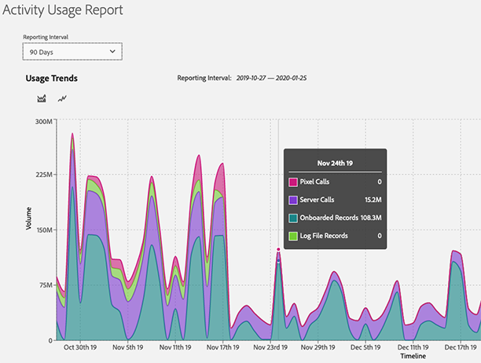

# [!UICONTROL Activity Usage Reporting] {#activity-usage-reporting}

## Überblick {#overview}

Die [!UICONTROL Activity Usage Report] hilft Ihnen bei der Ansicht und Verfolgung der Nutzung Ihrer Aktivität in Ihrer Audience Manager-Instanz und gibt Ihnen eine klare Vorstellung davon, wie die Nutzung Ihrer Aktivität mit Ihrer vertraglichen Verpflichtung vergleichbar ist.

Darüber hinaus können Sie die [!UICONTROL Activity Usage Report] , wann immer Sie möchten, für die Aufbewahrung von Datensätzen und benutzerspezifische Analyse herunterladen.

## Zu beachten {#considerations}

Der [!UICONTROL Activity Usage Report] ist für alle Audience Manager mit [Administratorrechten](edit-account-settings.md)verfügbar.

>[!IMPORTANT]
>
>Der [!UICONTROL Activity Usage Report] zeigt die Nutzungsstatistik der Aktivität Ihrer Audience Manager-Instanz an. Wenden Sie sich bei Fragen zur Rechnungsstellung im Zusammenhang mit Ihrer Aktivität an Ihren Adobe-Kundenbetreuer.

## Nutzungsszenarios {#use-cases}

Es gibt zwei wichtige Anwendungsfälle des [!UICONTROL Activity Usage Report]:

* **Verfolgung der tatsächlichen Nutzung der Instanznutzung im Vergleich zu Ihrer Aktivität-Nutzungszusage**: Die meisten Kunden haben eine monatliche geschätzte Aktivität pro Instanz, die dann zu einer jährlichen Aktivität in allen Fällen kumuliert wird. Dieser Bericht ist zwar kein Rechnungsbericht, kann aber hilfreiche Anleitungen dazu bieten, ob Sie die zugesagte Aktivität überschreiten.
* **Überprüfung auf Änderungen** der Implementierung: Wenn Sie Ihre Implementierung kürzlich aktualisiert haben, z. B. die Einrichtung der [!DNL Adobe Analytics] serverseitigen Weiterleitung oder die Änderung der [!DNL Adobe Target] Serveraufrufeinstellungen, hilft Ihnen dieser Bericht bei der Überprüfung, ob das Volumen der neuen Aktivität mit dem erwarteten Volumen der Aktivität übereinstimmt.

## Wenn die [!UICONTROL Activity Usage Report] {#using}

Melden Sie sich zum Anzeigen des [!UICONTROL Activity Usage Report]Audience Managers bei Ihrem Konto an und gehen Sie zu **[!UICONTROL Administration]** > **[!UICONTROL Usage]**.

Wählen Sie dann mit dem **[!UICONTROL Reporting Interval]** Filter das Zeitintervall aus, für das der Bericht generiert werden soll. Sie können zwischen 30, 60, 90 Tagen oder einem benutzerdefinierten Datumsbereich wählen.

Sobald Ihr Bericht geladen wurde, können Sie eine Aufschlüsselung Ihrer Daten [!UICONTROL Activities] für den ausgewählten Zeitraum sehen.

[!UICONTROL Activities] definieren Sie die Aggregat-Gesamtsumme aller Onsite- und Offsite-Interaktionen mit Audience Manager, aufgeteilt in die folgenden Kategorien:

* **[!UICONTROL Server Calls]**: Alle Datenerfassungs- oder -abruf-Ereignisse, die von Websites, Servern, E-Mail, mobilen Anwendungen oder anderen Systemen an Audience Manager gesendet werden.
* **[!UICONTROL Pixel Calls](früher bekannt als[!UICONTROL Impression Server Calls])**: Daten, die aus Anzeigen (z. B. Impressionsvolumen von einer Targeting-Plattform) oder E-Mail-Impressionsaufrufen an Audience Manager gesammelt wurden. Diese erfordern das Vorhandensein des`d_event`Parameters in der Abfrage-Zeichenfolge.
* **[!UICONTROL On-Boarded Records]**: Eindeutige Datensätze, die von Ihrem eigenen CRM-System (Customer Relationship Management System) oder anderen Offlinedatendateien wie Call-Center-Aufzeichnungen, Geräte-IDs und benutzerdefinierte Datenfeeds von externen Datenanbietern erfasst werden.
* **[!UICONTROL Log File Records]**: Eindeutige Datensätze aus Protokolldateien, die von einer Targeting-Plattform in Audience Manager aufgenommen wurden.

>[!NOTE]
>
>Ein eindeutiger Datensatz definiert jeden einzelnen Datensatz in einer Datei, die von Adobe im Auftrag eines Audience Manager gespeichert wird.

Außerdem können Sie die [!UICONTROL Activity Usage Trends] Diagrammtypen verwenden, um zwischen zwei Diagrammtypen zu wechseln.

Sie können den Cursor auch über ein bestimmtes Datum in der Zeitleiste bewegen, um die detaillierte Verwendung für dieses Datum anzuzeigen.

## Exportieren [!UICONTROL Activity Usage Reports] {#export}

Um einen besseren Überblick über die Nutzungsstufe Ihrer Audience Manager-Aktivität zu erhalten, können Sie die Datei [!UICONTROL Activity Usage Report] auf Grundlage der Datensatztypen exportieren, die Sie einbeziehen möchten.

Die Berichte **[!UICONTROL Onboarded Records Breakdown]** und **[!UICONTROL Onsite Server Calls Breakdown]** Berichte bieten den granulärsten Einblick in die für diese Aktivitäten verfügbaren Quelldaten. Das Volumen, das diesen Aufschlüsselungen zugeordnet wird, hängt von Ihrer Implementierung ab.

### [!UICONTROL Onboarded Records Breakdown] {#onboarded-breakdown}

Dieser Bericht enthält nicht an Bord befindliche Datensätze, die nach Datenquelle aufgeschlüsselt sind.

### [!UICONTROL Onsite Server Calls Breakdown] {#onsite-breakdown}

Dieser Bericht enthält eine Aufschlüsselung der Server-Aufrufe aus drei Quellen: [!UICONTROL Analytics], [!UICONTROL Target]und [!UICONTROL Other].

* **[!UICONTROL Analytics]**: Hierbei handelt es sich um abrechnungsfähige Serveraufrufe, die von allen [!UICONTROL Adobe Analytics] Instanzen an Audience Manager weitergeleitet werden, einschließlich der serverseitigen Weiterleitung. Sekundär Serveraufrufe oder Duplikat-Server-Aufrufe (wie bei serverseitiger Weiterleitung aus mehreren Report Suites) sind keine abrechnungsfähigen Aktivitäten, daher werden sie nicht in diese Aufschlüsselung einbezogen.
* **[!UICONTROL Target]**: Dies sind serverseitige Aufrufe von [!UICONTROL Adobe Target] zu Audience Manager, um Audience Manager-Segmentdaten im Rahmen einer Server-zu-Server-Integration abzurufen.
* **[!UICONTROL Other]**: Umfasst Aufrufe von anderen Websites oder Systemen (Partner-Sites, direkte Server-Aufrufe usw.), mobilen Browser-/App-Aufrufe über die [!DNL SDK], [!DNL DIL]Ereignis- und [!DNL DCS] Anrufe. Umfasst auch Aufrufe von [!DNL Target] Cookies, die als Cookie-Integration (nicht als Server-zu-Server) eingerichtet wurden.
