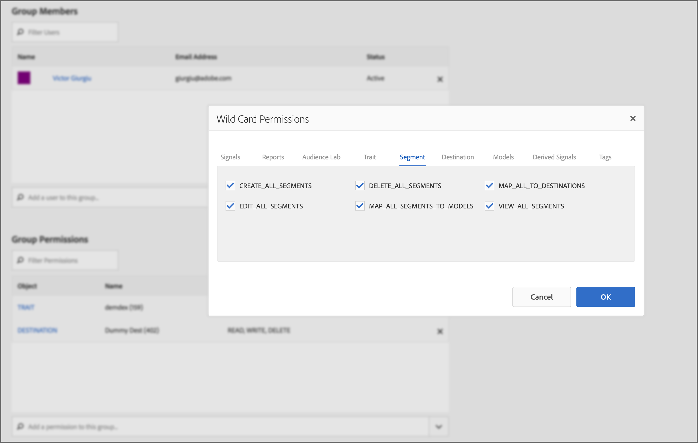
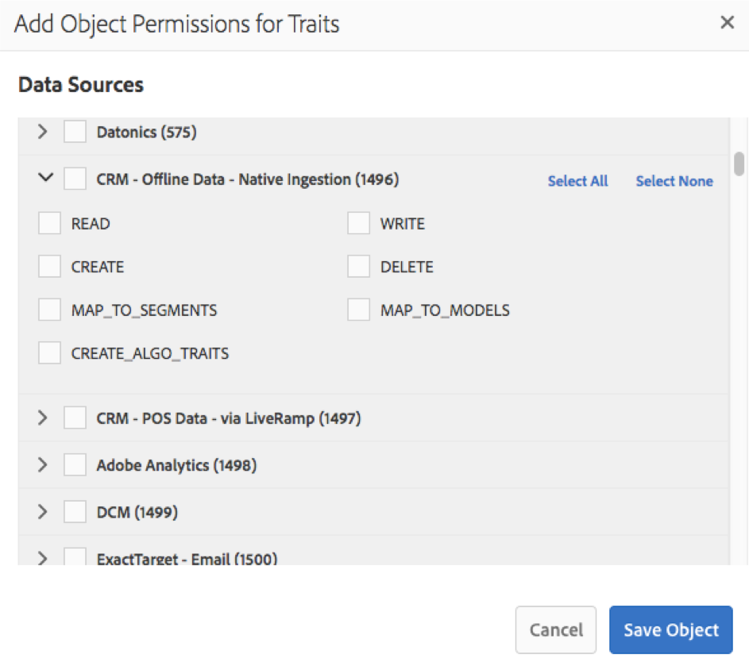

# [!UICONTROL Administration] (RBAC-Steuerelemente) {#administration}

>[!IMPORTANT]
>
> Die Benutzerkontoverwaltung wechselt zur [Admin Console](https://helpx.adobe.com/de/enterprise/using/admin-console.html). Um die Benutzermigration zu starten, müssen alle Audience Manager unverzüglich die in diesem Artikel beschriebenen erforderlichen Maßnahmen ergreifen: [Benutzermigration von Audience Managern zu Admin Console](admin-console-migration.md).
> 
> Nachdem alle Kunden migriert wurden, werden die Benutzerverwaltungsabschnitte dieses Dokuments entfernt.

Mit den Optionen im Menü [!UICONTROL Administration] können Sie Audience Manager-Benutzer erstellen und sie Gruppen zuweisen. Sie können auch Einschränkungen anzeigen (Eigenschaften, Segmente, Ziele und Modelle).

Unternehmenskunden, die [!DNL Audience Manager] verwenden, benötigen eine Datenverwaltungsplattform für alle ihre Daten, müssen jedoch in der Lage sein, die Sichtbarkeit der verschiedenen Datenelemente für bestimmte Geschäftseinheiten zu steuern. Sie können dies mit Gruppenberechtigungen erreichen, die auch als [!UICONTROL Role-Based Access Control] ([!UICONTROL RBAC]) bezeichnet werden.

[!DNL Audience Manager] verwendet Gruppen zum Zuweisen von Berechtigungen. Berechtigungen werden nicht auf Benutzerebene zugewiesen. Gruppenberechtigungen sind an Objekte gebunden ([!UICONTROL traits], Segmente usw.) und für Aktionen, die Sie für diese Objekte ausführen können (Bearbeiten, Ansicht usw.). Diese Steuerelemente sind auch über die Audience Manager-REST-APIs verfügbar. Siehe API-Methoden [Benutzerverwaltung](/help/using/api/rest-api-main/aam-api-user-group-permission/aam-api-user.md), [Gruppenverwaltung](/help/using/api/rest-api-main/aam-api-user-group-permission/aam-api-group.md) und [Berechtigungsverwaltung](/help/using/api/rest-api-main/aam-api-user-group-permission/aam-api-permissions.md).

## Benutzer erstellen {#create-users}

<!-- t_create_users.xml -->

>[!IMPORTANT]
>
> Die Benutzerkontoverwaltung wechselt zur [Admin Console](https://helpx.adobe.com/enterprise/using/admin-console.html). Um die Benutzermigration zu starten, müssen alle Audience Manager unverzüglich die in diesem Artikel beschriebenen erforderlichen Maßnahmen ergreifen: [Benutzermigration von Audience Managern zu Admin Console](admin-console-migration.md).
> 
> Nachdem alle Kunden migriert wurden, wird der Abschnitt zur Benutzerverwaltung dieses Dokuments entfernt.

Erstellen Sie Benutzer in [!DNL Audience Manager] und geben Sie Benutzerdetails an, melden Sie sich an und weisen Sie Benutzer Gruppen zu.

1. Klicken **[!UICONTROL Administration]** > **[!UICONTROL Users]**.
1. Klicken Sie auf  , um die Seite [!UICONTROL Create New User] anzuzeigen.
1. Füllen Sie unter **[!UICONTROL User Details]** die Felder aus:
   * **[!UICONTROL Username]:** Geben Sie einen eindeutigen Benutzernamen für Audience Manager an.
   * **[!UICONTROL First Name]:** Geben Sie den Vornamen des Benutzers an.
   * **[!UICONTROL Last Name]:** Geben Sie den Nachnamen des Benutzers an.
   * **[!UICONTROL Email Address]:** Geben Sie die E-Mail-Adresse des Benutzers an. [!DNL Audience Manager] sendet keine regelmäßige Benachrichtigung an Benutzer. [!DNL Audience Manager] -Administratoren haben Zugriff auf die E-Mail-Adressen von Benutzern und können Benutzer bei Bedarf manuell per E-Mail versenden. Wenn ein Benutzer beispielsweise sein Kennwort vergisst, wird die in diesem Feld angegebene E-Mail-Adresse verwendet, um ein temporäres Kennwort und Anweisungen zum Zurücksetzen des Kennworts zu senden.
   * **[!UICONTROL Phone Number]:** Geben Sie die Telefonnummer des Benutzers an.
   * **[!UICONTROL Is Admin]:** Geben Sie an, ob dieser Benutzer ein  [!DNL Audience Manager] Administrator ist. Administratoren können Benutzer verwalten (erstellen, bearbeiten usw.) und Gruppen (erstellen, Berechtigungen zuweisen usw.). Benutzer ohne Administratorrechte können nur ihre eigenen Benutzerprofile steuern, einschließlich der Bearbeitung ihrer E-Mail-Adressen und des Zurücksetzens ihrer eigenen Passwörter. Weitere Informationen finden Sie unter [Bearbeiten Ihrer Kontoeinstellungen](../../features/administration/edit-account-settings.md).
1. Wählen Sie unter **[!UICONTROL Login]** den gewünschten Status aus:
   * **[!UICONTROL Active]:**  Aktive Benutzer können auf die Berechtigungen zugreifen  [!DNL Audience Manager] und die ihnen von der Gruppenmitgliedschaft gewährt werden.
   * **[!UICONTROL Deactivated]:**  Deaktivierte Benutzer können nicht zugreifen  [!DNL Audience Manager] und haben keine Berechtigungen. Wenn Sie Benutzer deaktivieren, bleiben ihre Benutzerinformationen in [!DNL Audience Manager] und Sie können sie bei Bedarf einfach reaktivieren. Wenn Sie Benutzer entfernen, müssen Sie sie neu erstellen, wenn sie [!DNL Audience Manager] in Zukunft erneut verwenden müssen.
   * **[!UICONTROL Expired]:** Das Kennwort eines Benutzers ist älter als 90 Tage.
   * **[!UICONTROL Pending]:** Der Benutzer hat ein temporäres Kennwort, entweder als nachdem das Kennwort zurückgesetzt wurde oder als brandneues Konto, und hat noch kein permanentes Kennwort festgelegt.
   * **[!UICONTROL Locked Out]:** 5 falsche Anmeldeversuche werden einen Benutzer sperren.
1. Wählen Sie unter **[!UICONTROL Assigned Groups]** aus der Dropdownliste die gewünschten Gruppen aus, denen Sie diesen Benutzer zuweisen möchten.
Weitere Informationen zu Gruppen und Berechtigungen finden Sie unter [Erstellen einer Gruppe](../../features/administration/administration-overview.md#create-group).
1. Klicken **[!UICONTROL Save]**.

## Erstellen Sie eine [!UICONTROL Group] {#create-group}

>[!IMPORTANT]
>
> Die Benutzerkontoverwaltung wechselt zur [Admin Console](https://helpx.adobe.com/enterprise/using/admin-console.html). Um die Benutzermigration zu starten, empfehlen wir allen Audience Manager, unverzüglich die in diesem Artikel beschriebenen erforderlichen Maßnahmen zu ergreifen: [Benutzermigration von Audience Managern zu Admin Console](admin-console-migration.md).
> 
> Nachdem alle Kunden migriert wurden, wird dieser Abschnitt entfernt.

Eine *group* ist eine Sammlung von Benutzern, die Zugriffsrechte für [!UICONTROL destination]-, [!UICONTROL segment]- und [!UICONTROL trait]-Objekte haben. Sie können Gruppen auf einzelne Objekte beschränken oder ihnen einen breiten Zugriff auf Kombinationen verschiedener Objekte gewähren.

<!-- t_create_groups.xml -->

So erstellen Sie eine Gruppe:

1. Klicken **[!UICONTROL Administration]** > **[!UICONTROL Groups]**.
2. Klicken Sie auf  , um die Seite [!UICONTROL Group Settings] zu öffnen.
3. Mit [!UICONTROL Group Details]:
   * Benennen Sie die Gruppe.
   * Geben Sie eine kurze Gruppenbeschreibung ein.
4. Klicken Sie in [!UICONTROL Group Members] in den **[!UICONTROL Add Users]**-Optionen auf einen Benutzer, um ihn zur Gruppe hinzuzufügen.
5. Wählen Sie in [!UICONTROL Group Permissions] eine [Eigenschaft](../../features/traits/trait-details-page.md), [Segment](../../features/segments/segments-purpose.md) oder [Ziel](../../features/destinations/destinations.md) aus **[!UICONTROL Add Object]**.
Dadurch wird ein Berechtigungsfenster für das ausgewählte Objekt geöffnet.
6. Aktivieren Sie das Kontrollkästchen für die Berechtigungen, die Gruppenmitglieder erhalten sollen.
7. *(Optional)* Weisen Sie der Gruppe  [Wildcard-](../../features/administration/administration-overview.md#wild-card-permissions) Berechtigungen zu.
8. Klicken **[!UICONTROL Save Group]**.

## Grundlagen zu [!UICONTROL Wild Card Permissions] {#wild-card-permissions}

>[!IMPORTANT]
>
> Die Benutzerkontoverwaltung wechselt zur [Admin Console](https://helpx.adobe.com/enterprise/using/admin-console.html). Um die Benutzermigration zu starten, empfehlen wir allen Audience Manager, unverzüglich die in diesem Artikel beschriebenen erforderlichen Maßnahmen zu ergreifen: [Benutzermigration von Audience Managern zu Admin Console](admin-console-migration.md).
> 
> Nachdem alle Kunden migriert wurden, wird dieser Abschnitt entfernt.

Vereinfachen Sie die Verwaltung von Gruppenrechten mit [!UICONTROL Wild Card Permissions].

<!-- c_wildcard_permissions.xml -->

[!UICONTROL Wild Card Permissions] ermöglicht den Gruppenmitgliedern automatischen Zugriff auf jede Datenquelle, die mit einer  [!UICONTROL segment],  [!UICONTROL destination] oder  [!UICONTROL trait]verknüpft ist. Im Vergleich dazu können Sie mit regulären Berechtigungen nur einem dieser Objekte bestimmte [!UICONTROL data sources] zuweisen. Wenn Sie neue [!UICONTROL data sources] hinzufügen, erhalten Gruppenmitglieder keinen Zugriff auf diese neuen Quellen.

Sie müssen die Gruppenberechtigungen öffnen und diese neuen [!UICONTROL data sources] der Gruppe zuweisen. [!UICONTROL Wild Card Permissions] vermeiden Sie diesen manuellen  [!UICONTROL data source] Aktualisierungsprozess. Gruppen mit [!UICONTROL Wild Card Permissions] erhalten Zugriff auf neue [!UICONTROL data sources] ohne explizite Autorisierung.

Nachstehend finden Sie eine Beschreibung dessen, was jeder [!UICONTROL wildcard permission] bedeutet:

**[!UICONTROL Trait]**

* `MAP_ALL_TRAITS_TO_MODELS` - Benutzer können  [!UICONTROL traits] als Grundlinie für  [!UICONTROL models]auswählen.
* `EDIT_ALL_TRAITS` - Benutzer können alle  [!UICONTROL traits] eingerichteten Elemente innerhalb ihres Unternehmenskontos bearbeiten.
* `VIEW_ALL_TRAITS` - Benutzer können alle  [!UICONTROL traits] eingerichteten Elemente in ihrem Unternehmenskonto anzeigen.
* `DELETE_ALL_TRAITS` - Benutzer können alle  [!UICONTROL traits] eingerichteten Elemente in ihrem Unternehmenskonto löschen.
* `CREATE_ALL_ALGO_TRAITS` - Benutzer können  [!UICONTROL algorithmic traits]erstellen.
* `MAP_ALL_TO_SEGMENTS` - Benutzer können beliebige der  [!UICONTROL traits] Mitglieder ihres Unternehmens zu  [!UICONTROL segments]hinzufügen.
* `CREATE_ALL_TRAITS` - Benutzer können  [!UICONTROL traits]erstellen.

**[!UICONTROL Reports]**

* `PTRREPORTS` - Dies  [!UICONTROL wildcard permission] bezieht sich auf veraltete Funktionen und wird in Kürze aus der Audience Manager-Benutzeroberfläche entfernt.

**[!UICONTROL Models]**

* `VIEW_MODELS` - Benutzer haben die Berechtigung zum Anzeigen, die zu ihrem Unternehmen  [!UICONTROL models] gehören.

**[!UICONTROL Derived Signals]**

* `VIEW_DERIVED_SIGNALS` - Benutzer können alle  [!UICONTROL derived signals] Mitglieder ihres Unternehmens anzeigen.
* `CREATE_DERIVED_SIGNALS` - Benutzer können  [!UICONTROL derived signals]erstellen.
* `EDIT_DERIVED_SIGNALS` - Benutzer können alle  [!UICONTROL derived signals] ihrer Firma zugehörigen Elemente bearbeiten.
* `DELETE_DERIVED_SIGNALS` - Benutzer können die  [!UICONTROL derived signals] ihrer Firma zugehörigen Elemente löschen.

**[!UICONTROL Destination]**

* `EDIT_ALL_DESTINATIONS` - Benutzer können alle in ihrem Unternehmenskonto  [!UICONTROL destinations] eingerichteten Elemente bearbeiten.
* `CREATE_DESTINATIONS` - Benutzer können  [!UICONTROL destinations]erstellen.
* `VIEW_ALL_DESTINATIONS` - Benutzer können alle  [!UICONTROL destinations] eingerichteten Elemente in ihrem Unternehmenskonto anzeigen.
* `DELETE_ALL_DESTINATIONS` - Benutzer können alle in ihrem Unternehmenskonto  [!UICONTROL destinations] eingerichteten Elemente löschen.

**[!UICONTROL Tags]**

* `VIEW_TAGS` - Benutzer können alles (Anzeigen, Erstellen, Bearbeiten, Löschen) auf ihrer  [!UICONTROL Tag Containers]Website tun.

**[!UICONTROL Audience Lab]**

* `MANAGE_SEGMENT_TEST_GROUPS` - Benutzer können alles (Anzeigen, Erstellen, Bearbeiten, Löschen) für ihre  [!UICONTROL Audience Lab] Testgruppen tun.

**[!UICONTROL Segment]**

* `CREATE_ALL_SEGMENTS` - Benutzer können Segmente erstellen.
* `DELETE_ALL_SEGMENTS` - Benutzer können alle in ihrem Unternehmenskonto eingerichteten Segmente löschen.
* `MAP_ALL_TO_DESTINATIONS` - Benutzer können beliebige Segmente, die zu ihrem Unternehmen gehören, Zielen zuordnen.
* `EDIT_ALL_SEGMENTS` - Benutzer können alle in ihrem Unternehmenskonto eingerichteten Segmente bearbeiten.
* `MAP_ALL_SEGMENTS_TO_MODELS` - Benutzer können Segmente als Grundlage für Modelle auswählen.
* `VIEW_ALL_SEGMENTS` - Benutzer können alle in ihrem Unternehmenskonto eingerichteten Segmente anzeigen.

**[!UICONTROL Signals]**

* `VIEW_ALL_SIGNALS` - Benutzer können alle in  [Data Explorer](/help/using/features/data-explorer/data-explorer-overview.md) erfassten Signale anzeigen.

## Nutzungsszenarios {#use-cases}

### Überwachen des Benutzerzugriffs {#monitoring-user-access}

[!UICONTROL Role-Based Access Control] können Ihnen dabei helfen, den Anmeldestatus von Benutzern zu überwachen. So erhalten Sie ein klares Bild davon, wer auf Ihre Audience Manager-Instanz zugreifen kann.

Je nach Ihren Geschäftsanforderungen können Sie Benutzerkonten bei Bedarf aktivieren und deaktivieren.

### Sicherstellen des Zugriffsschutzes für vertrauliche [!UICONTROL Data Sources] {#protect-sensitive-data-sources}

Sie können [!UICONTROL Role-Based Access Control] auf [!UICONTROL trait]-, Segment- und [!UICONTROL destination]-Ebene für jede Benutzergruppe konfigurieren.

Mit dieser Funktion können Sie verwalten, wie Ihre Benutzer bestimmte Datensätze anzeigen, erstellen, lesen, schreiben und bearbeiten, und sogar Benutzer daran hindern, auf Datensätze zuzugreifen, die ihnen nicht zur Verfügung stehen sollten.

