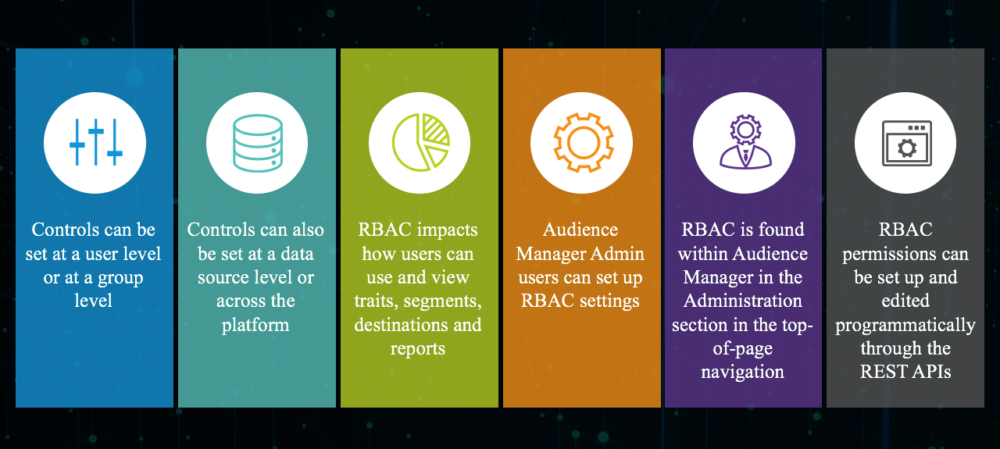
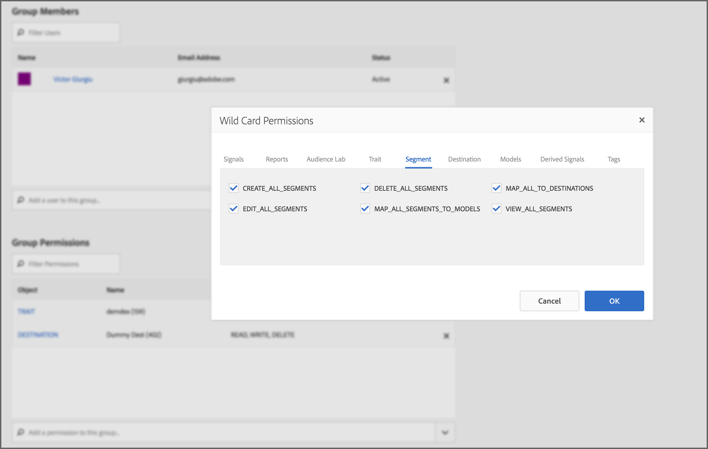
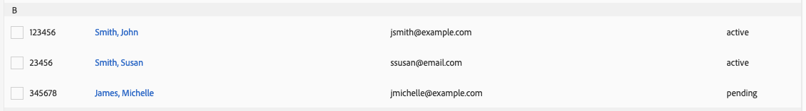
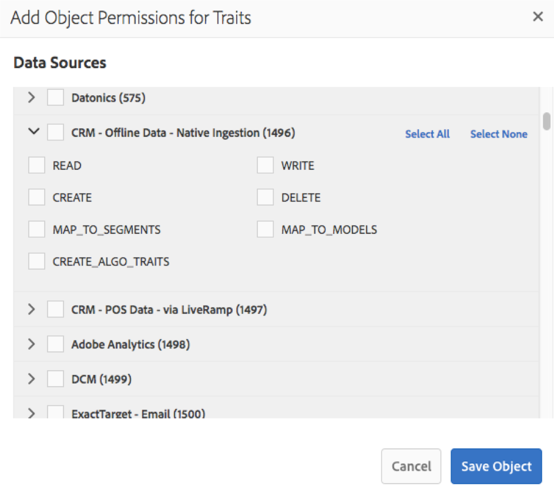

# [!UICONTROL Administration] (RBAC-Steuerung) {#administration}

>[!IMPORTANT]
>
> Die Benutzerkontenverwaltung wechselt zur [Admin Console](https://helpx.adobe.com/de/enterprise/using/admin-console.html). Um mit der Benutzermigration zu beginnen, müssen alle Audience Manager-Kunden sofort die in diesem Artikel beschriebenen Maßnahmen ergreifen: [Benutzermigration von Audience Manager nach Admin Console](admin-console-migration.md).
> 
> Nachdem alle Kunden migriert haben, werden die Abschnitte zur Benutzerverwaltung in diesem Dokument entfernt.

>[!IMPORTANT]
>
> Bevor Sie [!DNL RBAC] verwenden können, muss diese Funktion von Adobe für Ihr Unternehmen aktiviert werden. Wenden Sie sich an Ihr Konto-Team, um [!DNL RBAC] Aktivierung anzufordern, oder wenden Sie sich an die Kundenunterstützung.

Mit den Optionen im Menü [!UICONTROL Administration] können Sie Audience Manager-Benutzer erstellen und sie Gruppen zuweisen. Sie können auch Einschränkungen anzeigen (Eigenschaften, Segmente, Ziele und Modelle).

Unternehmenskunden, die [!DNL Audience Manager] verwenden, benötigen eine einzige Datenverwaltungsplattform für alle ihre Daten, müssen aber in der Lage sein, die Sichtbarkeit der verschiedenen Datenelemente für bestimmte Geschäftsbereiche zu steuern. Sie können dies mithilfe von Gruppenberechtigungen erreichen, die auch als [!UICONTROL Role-Based Access Control] ([!UICONTROL RBAC]) bezeichnet werden.

[!DNL Audience Manager] verwendet Gruppen, um Berechtigungen zuzuweisen. Berechtigungen werden nicht auf Benutzerebene zugewiesen. Gruppenberechtigungen sind an Objekte ([!UICONTROL traits], Segmente usw.) und an Aktionen gebunden, die Sie für diese Objekte ausführen können (Bearbeiten, Anzeigen usw.). Diese Steuerelemente sind auch über die Audience Manager-REST-APIs verfügbar. Siehe [Benutzerverwaltung](/help/using/api/rest-api-main/aam-api-user-group-permission/aam-api-user.md), [Gruppenverwaltung](/help/using/api/rest-api-main/aam-api-user-group-permission/aam-api-group.md) und [Berechtigungsverwaltung](/help/using/api/rest-api-main/aam-api-user-group-permission/aam-api-permissions.md) API-Methoden.

## Benutzer erstellen {#create-users}

<!-- t_create_users.xml -->

>[!IMPORTANT]
>
> Die Benutzerkontenverwaltung wechselt zur [Admin Console](https://helpx.adobe.com/de/enterprise/using/admin-console.html). Um mit der Benutzermigration zu beginnen, müssen alle Audience Manager-Kunden sofort die in diesem Artikel beschriebenen Maßnahmen ergreifen: [Benutzermigration von Audience Manager nach Admin Console](admin-console-migration.md).
> 
> Nachdem alle Kunden migriert haben, wird der Abschnitt „Benutzerverwaltung“ dieses Dokuments entfernt.
> 
Erstellen Sie Benutzer in [!DNL Audience Manager] und geben Sie Benutzerdetails, Anmeldestatus an und weisen Sie Benutzer Gruppen zu.

1. Klicken Sie auf **[!UICONTROL Administration]** > **[!UICONTROL Users]**.
1. Klicken Sie auf  , um die Seite [!UICONTROL Create New User] anzuzeigen.
1. Füllen Sie unter **[!UICONTROL User Details]** die folgenden Felder aus:
   * **[!UICONTROL Username]:** Geben Sie einen eindeutigen Benutzernamen für Audience Manager an.
   * **[!UICONTROL First Name]:** Geben Sie den Vornamen des Benutzers an.
   * **[!UICONTROL Last Name]:** Geben Sie den Nachnamen des Benutzers an.
   * **[!UICONTROL Email Address]:** Geben Sie die E-Mail-Adresse des Benutzers an. [!DNL Audience Manager] sendet keine regelmäßigen Benachrichtigungen an Benutzer. [!DNL Audience Manager] Administratoren haben Zugriff auf die E-Mail-Adressen der Benutzer und können bei Bedarf E-Mails an Benutzer senden. Wenn ein Benutzer beispielsweise sein Kennwort vergessen hat, wird die in diesem Feld angegebene E-Mail-Adresse verwendet, um ein temporäres Kennwort und Anweisungen zum Zurücksetzen des Kennworts zu senden.
   * **[!UICONTROL Phone Number]:** Geben Sie die Telefonnummer des Benutzers an.
   * **[!UICONTROL Is Admin]:** Geben Sie an, ob dieser Benutzer ein [!DNL Audience Manager] ist. Admin-Benutzer können Benutzer (erstellen, bearbeiten usw.) und Gruppen (erstellen, Berechtigungen zuweisen usw.) verwalten. Benutzer ohne Administratorrechte können nur ihre eigenen Benutzerprofile steuern, einschließlich der Bearbeitung ihrer E-Mail-Adressen und des Zurücksetzens ihrer eigenen Passwörter. Weitere Informationen finden Sie unter [Bearbeiten Ihrer Kontoeinstellungen](../../features/administration/edit-account-settings.md).
1. Wählen Sie unter **[!UICONTROL Login]** den gewünschten Status aus:
   * **[!UICONTROL Active]:** Aktive Benutzer können auf [!DNL Audience Manager] zugreifen und erhalten die von der Gruppenmitgliedschaft gewährten Berechtigungen.
   * **[!UICONTROL Deactivated]:** Deaktivierte Benutzende können nicht auf [!DNL Audience Manager] zugreifen und haben keine Berechtigungen. Wenn Sie Benutzer deaktivieren, bleiben deren Benutzerinformationen in [!DNL Audience Manager] und Sie können sie bei Bedarf einfach reaktivieren. Wenn Sie Benutzer entfernen, müssen Sie sie neu erstellen, falls sie [!DNL Audience Manager] in Zukunft erneut verwenden müssen.
   * **[!UICONTROL Expired]:** Das Kennwort eines Benutzers ist älter als 90 Tage.
   * **[!UICONTROL Pending]:** Der Benutzer verfügt über ein temporäres Kennwort, entweder wie nach dem Zurücksetzen des Kennworts oder als ein brandneues Konto, aber er hat noch kein dauerhaftes Kennwort festgelegt.
   * **[!UICONTROL Locked Out]:** 5 falsche Anmeldeversuche sperren einen Benutzer.
1. Wählen Sie unter **[!UICONTROL Assigned Groups]** aus der Dropdown-Liste die gewünschten Gruppen aus, denen Sie diesen Benutzer zuweisen möchten.
Weitere Informationen zu Gruppen und Berechtigungen finden Sie unter [Erstellen einer Gruppe](../../features/administration/administration-overview.md#create-group).
1. Klicken Sie auf **[!UICONTROL Save]**.

## Erstellen eines [!UICONTROL Group] {#create-group}

>[!IMPORTANT]
>
> Die Benutzerkontenverwaltung wechselt zur [Admin Console](https://helpx.adobe.com/de/enterprise/using/admin-console.html). Um mit der Benutzermigration zu beginnen, empfehlen wir allen Audience Manager-Kunden, sofort die in diesem Artikel beschriebenen erforderlichen Maßnahmen zu ergreifen: [Benutzermigration von Audience Manager nach Admin Console](admin-console-migration.md).
> 
> Nachdem alle Kunden migriert haben, wird dieser Abschnitt entfernt.

Eine *Gruppe* ist eine Sammlung von Benutzern, die Zugriffsrechte auf [!UICONTROL destination]-, [!UICONTROL segment]- und [!UICONTROL trait] teilen. Sie können Gruppen auf einzelne Objekte beschränken oder ihnen breiten Zugriff auf Kombinationen verschiedener Objekte gewähren.

<!-- t_create_groups.xml -->

Erstellen einer Gruppe:

1. Klicken Sie auf **[!UICONTROL Administration]** > **[!UICONTROL Groups]**.
2. Klicken Sie auf  , um die [!UICONTROL Group Settings] zu öffnen.
3. In [!UICONTROL Group Details]:
   * Benennen Sie die Gruppe.
   * Geben Sie eine kurze Gruppenbeschreibung an.
4. Klicken Sie [!UICONTROL Group Members] in **[!UICONTROL Add Users]** Optionen auf einen Benutzer, um ihn der Gruppe hinzuzufügen.
5. Wählen Sie in [!UICONTROL Group Permissions] ein [Merkmal](../../features/traits/trait-details-page.md), [Segment](../../features/segments/segments-purpose.md) oder [Ziel](../../features/destinations/destinations.md) aus **[!UICONTROL Add Object]**.
Dadurch wird ein Berechtigungsfenster für das ausgewählte Objekt geöffnet.
6. Aktivieren Sie das Kontrollkästchen für die Berechtigungen, die Gruppenmitglieder haben sollen.
7. *(Optional)* Weisen Sie der [ „Platzhalterberechtigungen](../../features/administration/administration-overview.md#wild-card-permissions) zu.
8. Klicken Sie auf **[!UICONTROL Save Group]**.

## Grundlagen zu [!UICONTROL Wild Card Permissions] {#wild-card-permissions}

>[!IMPORTANT]
>
> Die Benutzerkontenverwaltung wechselt zur [Admin Console](https://helpx.adobe.com/de/enterprise/using/admin-console.html). Um mit der Benutzermigration zu beginnen, empfehlen wir allen Audience Manager-Kunden, sofort die in diesem Artikel beschriebenen erforderlichen Maßnahmen zu ergreifen: [Benutzermigration von Audience Manager nach Admin Console](admin-console-migration.md).
> 
> Nachdem alle Kunden migriert haben, wird dieser Abschnitt entfernt.

Vereinfachen Sie die Verwaltung von Gruppenrechten mit [!UICONTROL Wild Card Permissions].

<!-- c_wildcard_permissions.xml -->

[!UICONTROL Wild Card Permissions] gewähren Gruppenmitgliedern automatischen Zugriff auf jede Datenquelle, die einer [!UICONTROL segment], einem [!UICONTROL destination] oder einer [!UICONTROL trait] zugeordnet ist. Im Vergleich dazu können Sie mit regulären Berechtigungen nur bestimmte [!UICONTROL data sources] einem dieser Objekte zuweisen. Und wenn Sie neue [!UICONTROL data sources] hinzufügen, erhalten die Gruppenmitglieder keinen Zugriff auf diese neuen Quellen.

Sie müssen die Gruppenberechtigungen öffnen und diese neuen [!UICONTROL data sources] der Gruppe zuweisen. [!UICONTROL Wild Card Permissions] können Sie diesen manuellen [!UICONTROL data source]-Aktualisierungsprozess vermeiden. Gruppen mit [!UICONTROL Wild Card Permissions] erhalten ohne explizite Autorisierung Zugriff auf neue [!UICONTROL data sources].

Nachfolgend finden Sie eine Beschreibung der einzelnen [!UICONTROL wildcard permission]:

**[!UICONTROL Trait]**

* `MAP_ALL_TRAITS_TO_MODELS` - Benutzer können [!UICONTROL traits] als Grundlinie für die [!UICONTROL models] auswählen.
* `EDIT_ALL_TRAITS` : Benutzer können alle [!UICONTROL traits] bearbeiten, die in ihrem Unternehmenskonto eingerichtet wurden.
* `VIEW_ALL_TRAITS` : Benutzer können alle [!UICONTROL traits] anzeigen, die in ihrem Unternehmenskonto eingerichtet wurden.
* `DELETE_ALL_TRAITS` - Benutzer können alle [!UICONTROL traits] löschen, die in ihrem Unternehmenskonto eingerichtet wurden.
* `CREATE_ALL_ALGO_TRAITS` - Benutzer können [!UICONTROL algorithmic traits] erstellen.
* `MAP_ALL_TO_SEGMENTS` - Benutzer können jede der [!UICONTROL traits] ihrer Firma zu [!UICONTROL segments] hinzufügen.
* `CREATE_ALL_TRAITS` - Benutzer können [!UICONTROL traits] erstellen.

**[!UICONTROL Models]**

* `VIEW_MODELS` - Benutzer sind berechtigt, [!UICONTROL models] anzuzeigen, die zu ihrer Firma gehören.

**[!UICONTROL Derived Signals]**

* `VIEW_DERIVED_SIGNALS` - Benutzer können alle [!UICONTROL derived signals] ihres Unternehmens anzeigen.
* `CREATE_DERIVED_SIGNALS` - Benutzer können [!UICONTROL derived signals] erstellen.
* `EDIT_DERIVED_SIGNALS` : Benutzer können alle [!UICONTROL derived signals] bearbeiten, die zu ihrer Firma gehören.
* `DELETE_DERIVED_SIGNALS` - Benutzer können alle [!UICONTROL derived signals] löschen, die zu ihrer Firma gehören.

**[!UICONTROL Destination]**

* `EDIT_ALL_DESTINATIONS` : Benutzer können alle [!UICONTROL destinations] bearbeiten, die in ihrem Unternehmenskonto eingerichtet wurden.
* `CREATE_DESTINATIONS` - Benutzer können [!UICONTROL destinations] erstellen.
* `VIEW_ALL_DESTINATIONS` : Benutzer können alle [!UICONTROL destinations] anzeigen, die in ihrem Unternehmenskonto eingerichtet wurden.
* `DELETE_ALL_DESTINATIONS` - Benutzer können alle [!UICONTROL destinations] löschen, die in ihrem Unternehmenskonto eingerichtet wurden.

**[!UICONTROL Tags]**

* `VIEW_TAGS` : Benutzer können in ihrem [!UICONTROL Tag Containers] alles tun (anzeigen, erstellen, bearbeiten, löschen).

**[!UICONTROL Audience Lab]**

* `MANAGE_SEGMENT_TEST_GROUPS` - Benutzer können in ihren [!UICONTROL Audience Lab] Testgruppen alles tun (anzeigen, erstellen, bearbeiten, löschen).

**[!UICONTROL Segment]**

* `CREATE_ALL_SEGMENTS` - Benutzer können Segmente erstellen.
* `DELETE_ALL_SEGMENTS` - Benutzer können alle Segmente löschen, die in ihrem Unternehmenskonto eingerichtet wurden.
* `MAP_ALL_TO_DESTINATIONS` - Benutzerinnen und Benutzer können jedes der Segmente, die zu ihrer Firma gehören, Zielen zuordnen.
* `EDIT_ALL_SEGMENTS` - Benutzer können alle Segmente bearbeiten, die in ihrem Unternehmenskonto eingerichtet wurden.
* `MAP_ALL_SEGMENTS_TO_MODELS` : Benutzer können Segmente als Grundlage für Modelle auswählen.
* `VIEW_ALL_SEGMENTS` : Benutzer können alle Segmente anzeigen, die in ihrem Unternehmenskonto eingerichtet wurden.

**[!UICONTROL Signals]**

* `VIEW_ALL_SIGNALS` - Benutzer können alle in [Data Explorer erfassten Signale ](/help/using/features/data-explorer/data-explorer-overview.md).

## Nutzungsszenarios {#use-cases}

### Überwachen des Benutzerzugriffs {#monitoring-user-access}

[!UICONTROL Role-Based Access Control] können Ihnen dabei helfen, den Benutzeranmeldestatus zu überwachen und Ihnen ein klares Bild davon zu vermitteln, wer auf Ihre Audience Manager-Instanz zugreifen kann.

Je nach Ihren Geschäftsanforderungen können Sie Benutzerkonten bei Bedarf aktivieren und deaktivieren.

### Sicherstellen des Zugriffsschutzes für sensible [!UICONTROL Data Sources] {#protect-sensitive-data-sources}

Sie können [!UICONTROL Role-Based Access Control] für jede Benutzergruppe auf [!UICONTROL trait]-, Segment- und [!UICONTROL destination] konfigurieren.

Mit dieser Funktion können Sie verwalten, wie Benutzende bestimmte Datensätze anzeigen, erstellen, lesen, schreiben und bearbeiten, und sogar den Zugriff von Benutzenden auf Datensätze einschränken, die ihnen nicht zur Verfügung stehen sollten.

