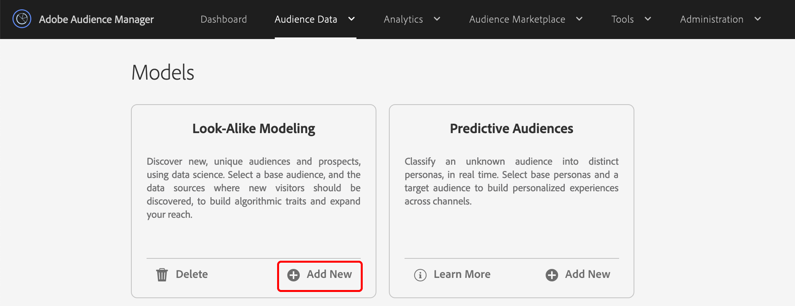

# Erstellen eines Look-alike-Modells {#create-an-algorithmic-model}

Beschreibt die erforderlichen und optionalen Schritte zum Erstellen eines [!UICONTROL Look-Alike Model].

## Modellaufbauabschnitt

[!UICONTROL Model Builder] besteht aus den  [!UICONTROL Basic Information] Abschnitten und  [!UICONTROL Configuration] . Um ein Modell zu erstellen, füllen Sie die erforderlichen Felder in diesen beiden Abschnitten aus. Speichern Sie Ihr Modell, um den Algorithmus zu starten. [!DNL Audience Manager] sendet Ihnen eine automatische Benachrichtigung, nachdem die erste Datenausführung abgeschlossen ist. Nachdem Sie die E-Mail erhalten haben, können Sie [Trait Builder](../../features/traits/about-trait-builder.md) aufrufen und algorithmische Eigenschaften erstellen.

>[!NOTE]
>
>* Der Modellierungsprozess wird nur einmal ausgeführt, wenn Sie ein Modell erstellen und keine Eigenschaften damit erstellen.
>* Erstellen Sie Modelle aus Datenquellen, die eine aussagekräftige Menge an Informationen enthalten. Modelle mit unzureichenden Daten werden ausgeführt, aber sie geben keine Ergebnisse zurück.
>* *Erstellen Sie* keine Modelle mit anderen algorithmischen Eigenschaften oder Segmenten.
>* Die automatisierte E-Mail-Benachrichtigung wird nur einmal gesendet (nach der ersten Datenausführung).

## Modell erstellen

Gehen Sie wie folgt vor, um einen [!UICONTROL Look-Alike Model] zu erstellen:

1. Gehen Sie zu **[!UICONTROL Audience Data]** > **[!UICONTROL Models]** und klicken Sie im Abschnitt [!UICONTROL Look-Alike Modeling] auf **[!UICONTROL Add New]** .
   
1. Im Abschnitt [Grundlegende Informationen](../../features/algorithmic-models/create-model.md#basic-information)
   * Benennen Sie das Modell.
   * *(Optional)* Geben Sie eine kurze Beschreibung des Modells ein.
   * Legen Sie den Status für das Modell auf **[!UICONTROL Active]** oder **[!UICONTROL Inactive]** fest. Inaktive Modelle werden nicht ausgeführt und erzeugen keine Daten.
      
1. Im Abschnitt [Konfiguration](../../features/algorithmic-models/create-model.md#configuration) :
   * Klicken Sie auf **[!UICONTROL Browse All Traits]** oder **[!UICONTROL Browse All Segments]** , um eine Eigenschaft oder ein Segment auszuwählen, für die Sie ein Modell erstellen möchten. Suchen Sie nach Eigenschaften nach Name, ID, Beschreibung oder Datenquelle. Klicken Sie auf einen Ordner, während Sie suchen, um die Ergebnisse auf diesen Ordner und dessen Unterordner zu beschränken. Sie können Eigenschaften auch nach Eigenschaftstyp ([!UICONTROL Folder Trait], [!UICONTROL Rule-based], [!UICONTROL Onboarded] und [!UICONTROL Algorithmic]) oder Populationstyp ([Geräte-ID](../../reference/ids-in-aam.md) und [Geräteübergreifende ID](../../reference/ids-in-aam.md)) filtern.
      
   * Wählen Sie einen Rückblickzeitraum von 30, 60 oder 90 Tagen aus. Dadurch wird ein Zeitraum für das Modell festgelegt.
   * Der Algorithmus [!UICONTROL TraitWeight] ist standardmäßig ausgewählt.
   * Wählen Sie eine Datenquelle aus der Liste [!UICONTROL Available Data] aus.
   * Klicken Sie abschließend auf **[!UICONTROL Save]** .
      

Sehen Sie sich das Video unten an, um sich ausführlich anzusehen, wie geräteübergreifende Metriken funktionieren.

>[!VIDEO](https://experienceleague.adobe.com/docs/audience-manager-learn/tutorials/build-and-manage-audiences/profile-merge/understanding-cross-device-metrics-in-audience-manager.html)

## Grundlegende Informationen für algorithmische Modelle {#basic-information}

<!-- r_model_basic.xml -->

In [!UICONTROL Model Builder] können Sie mit den Einstellungen [!UICONTROL Basic Information] neue Modelle erstellen oder vorhandene bearbeiten. Um ein neues Modell zu erstellen, geben Sie einen Namen an und wechseln Sie zu den Einstellungen [!UICONTROL Configuration]. Das Beschreibungsfeld ist optional.

| Feld | Beschreibung |
|---|---|
| **[!UICONTROL Name]** | Geben Sie Ihrem Modell einen kurzen logischen Namen, der die Funktion oder den Zweck beschreibt. Vermeiden Sie Abkürzungen, Sonderzeichen und Akzentzeichen. |
| **[!UICONTROL Description]** | Ein Feld für zusätzliche beschreibende Informationen zum Modell. |
| **[!UICONTROL Status]** | Aktiviert oder deaktiviert das Modell (standardmäßig aktiv). |

## Konfiguration {#configuration}

In [!UICONTROL Model Builder] können Sie im Abschnitt [!UICONTROL Configuration] Eigenschaften oder Segmente zum Modell hinzufügen. Wählen Sie in diesem Abschnitt eine Grundlinie für Eigenschaften oder Segmente, einen Rückblickzeitraum und Daten aus Ihren Erstanbieter- und Drittanbieter-Datenquellen aus.

<!-- r_model_configuration.xml -->

### Voraussetzungen

Füllen Sie zuerst die erforderlichen Felder im Abschnitt [!UICONTROL Basic Information] aus.

<table id="table_7A6BE5E5498D4776A30323B743954150"> 
 <thead> 
  <tr> 
   <th colname="col1" class="entry"> Feld </th> 
   <th colname="col2" class="entry"> Beschreibung </th> 
  </tr> 
 </thead>
 <tbody> 
  <tr> 
   <td colname="col1"> 
<b>Auswählen einer Grundlinieneigenschaft oder eines Segments (1)</b> 
 </td> 
   <td colname="col2"> 
Klicken Sie auf die Eigenschaften- oder Segmentschaltfläche , um eine Liste aller Eigenschaften oder Segmente anzuzeigen. Ihr ausgewähltes Segment oder Ihre Eigenschaft wird zur Grundlinie, die die Systemalgorithmen für die Modellierung verwenden. 
 
 
<b>Hinweis</b>: Wählen Sie eine integrierte Eigenschaft, eine regelbasierte Eigenschaft oder ein Segment als Grundlinie aus. Andernfalls werden Ihre Modelle nicht ausgeführt. 
 
 </td> 
  </tr> 
  <tr> 
   <td colname="col1"> 
<b>Rückblickzeitraum auswählen (2)</b> 
 </td> 
   <td colname="col2"> 
Legt einen Zeitraum für das Modell fest. Basierend auf Ihrer Auswahl umfasst und bewertet der Algorithmus Daten aus den letzten 30, 60 oder 90 Tagen. 
 </td> 
  </tr> 
  <tr> 
   <td colname="col1"> 
<b>Algorithmus auswählen (3)</b> 
 </td> 
   <td colname="col2"> 
Derzeit funktioniert Model Builder nur mit unserem proprietären  Trait Weight-Algorithmus.  Audience  Manager kann in nachfolgenden Versionen weitere algorithmische Funktionen hinzufügen. 
 </td>
  </tr>
  <tr> 
   <td colname="col1"> 
<b>Modelldaten aus Datenquelle auswählen (4)</b> 
 </td> 
   <td colname="col2"> 
Ermöglicht die Auswahl der Erstanbieter- und Drittanbieter-Datenquellen, die Sie im Modell verwenden möchten. 
 </td>
  </tr> 
  <tr> 
   <td colname="col1"> 
<b>Ausnahmen (5)</b> 
 </td> 
   <td colname="col2"> 
Sie können Eigenschaften aus den Datenquellen ausschließen, die Sie für die Modellierung ausgewählt haben. Verwenden Sie die Liste  Ausschlüsse und lesen Sie <a href="../../features/algorithmic-models/trait-exclusion-algo-models.md"> Algorithmische Modelle: Eigenschaftenausschluss</a> , um mehr zu erfahren. 
 </td>
  </tr> 
 </tbody>
</table>

Sehen Sie sich das folgende Video an, um zu erfahren, wie Sie ein Erstanbieter-Look-alike-Modell erstellen, sodass Sie mehr Ihrer eigenen Besucher finden können, die wie Ihre Konverter aussehen.

>[!VIDEO](https://video.tv.adobe.com/v/23504/)

>[!MORELIKETHIS]
>
>* [Grundlegendes zu TraitWeight](../../features/algorithmic-models/understanding-models.md#understanding-traitweight)

