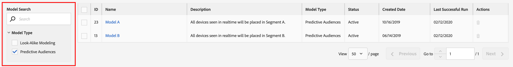
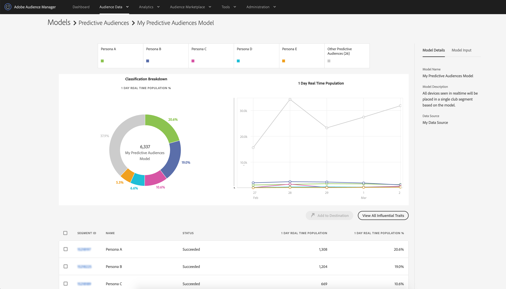
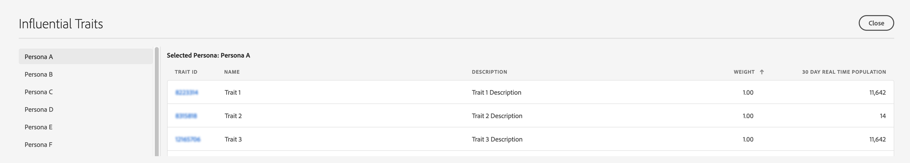

# Predictive Audiences-Berichte

Nachdem Sie ein [!UICONTROL Predictive Audiences] Modell gespeichert haben, beginnt Audience Manager mit dessen Training. Innerhalb weniger Stunden beginnt das berechnete Modell mit der Analyse der Zielgruppen auf den [Datenerfassungsservern](https://experienceleague.adobe.com/docs/audience-manager/user-guide/reference/system-components/components-data-collection.html#dcs-pcs). Die Berichterstattung erfolgt am folgenden Tag.

Um die Ergebnisse Ihrer [!UICONTROL Predictive Audiences] Klassifizierung anzuzeigen, navigieren Sie zu **[!UICONTROL Audience Data]** > **[!UICONTROL Models]** und klicken Sie auf Ihr Modell in der Liste.

Verwenden Sie die Filteroptionen auf der linken Seite, um nach dem Modellnamen zu suchen oder die Ergebnisse nach Modelltyp zu filtern.

Die Tabelle Modelle enthält die folgenden Informationen:

* **[!UICONTROL ID]**: Mit der Modell-ID wird jedes Modell in Ihrem Audience Manager-Konto eindeutig identifiziert.
* **[!UICONTROL Name]**: der Name, den Sie im Schritt zur Modellerstellung angegeben haben;
* **[!UICONTROL Description]**: die Beschreibung, die Sie im Schritt zur Modellerstellung angegeben haben;
* **[!UICONTROL Model Type]**: Typ jedes Modells ([!UICONTROL Look-Alike Modeling] oder [!UICONTROL Predictive Audiences]);
* **[!UICONTROL Status]**: Der Status jedes Modells:
   * **[!UICONTROL Pending]**: Das Modell wird initialisiert und wird in Kürze Ergebnisse produzieren.
   * **[!UICONTROL Active]**: Das Modell wird erfolgreich ausgeführt und erzeugt Ergebnisse.
   * **[!UICONTROL Warning]**: Das Modell konnte aufgrund unzureichender Daten keine Ergebnisse liefern (d. h. niedrige Grundgesamtheit, Benutzerprofile sind nicht umfangreich).
   * **[!UICONTROL Error]**: Das Modell konnte nicht ausgeführt werden. Wenden Sie sich an Ihren Adobe-Support-Mitarbeiter.

## Modellübersichtsbericht{#model-report}

Nachdem Sie ein Modell ausgewählt haben, wird dessen Berichtseite geladen. Oben auf der Seite sehen Sie die fünf größten Prognosesegmente, die auf der Echtzeit-Erkennung eines Tages basieren und nach denen das Modell Ihre Zielgruppe klassifiziert hat. Die Kategorie &quot;**[!UICONTROL Other]**&quot; umfasst den Rest der Personas, die nicht zu den fünf größten Prognosesegmenten gehörten.

Audience Manager zeigt sowohl ein farbcodiertes Ringdiagramm als auch ein Zeitleistendiagramm für Ihre [!UICONTROL Predictive Audiences] an.

Wenn Sie oben auf der Seite auf die Registerkarten „Personas“ klicken, werden diese zum Diagramm und Diagramm hinzugefügt oder daraus entfernt.

Das Ringdiagramm zeigt Ihnen eine personabasierte Aufschlüsselung Ihrer Zielgruppe, während das Diagramm den 1-tägigen Trend der Echtzeitpopulation Ihrer prädiktiven Segmente in den letzten 6 Tagen zeigt.

Wenn der Modellstatus [!UICONTROL Pending], [!UICONTROL Warning] oder [!UICONTROL Error] ist, wird der Modellstatus anstelle der Diagramme angezeigt.

Die Berichtstabelle zeigt für jedes [!UICONTROL Predictive Audiences] die folgenden Informationen an.

1. **[!UICONTROL SEGMENT ID]**: die Segment-ID des automatisch erstellten Segments, das mit jeder Rolle verknüpft ist;
1. **[!UICONTROL NAME]**: der Personenname;
1. **[!UICONTROL STATUS]**: Der Status des [!UICONTROL Predictive Audiences]:
   * **[!UICONTROL Succeeded]**: Benutzende werden in dieses Segment klassifiziert;
   * **[!UICONTROL Pending]**: Das Segment wird noch initialisiert.
   * **[!UICONTROL Insufficient Training Data]**: Benutzende werden aufgrund unzureichender Daten nicht in dieses Segment klassifiziert. Die Grundgesamtheit ist zu niedrig und bietet nicht genügend Daten, um daraus zu lernen.
1. **[!UICONTROL 1 DAY REAL TIME POPULATION]**: Die Anzahl der Segmentrealisierungen für jede Rolle in den letzten 24 Stunden.
1. **[!UICONTROL 1 DAY REAL TIME POPULATION %]**: Der Prozentsatz der Segmentrealisierungen für jede Rolle in den letzten 24 Stunden im Verhältnis zur gesamten Modellpopulation.

## Einflussreiche Eigenschaften{#influential-traits}

[!UICONTROL Influential Traits] sind Eigenschaften, die der [!UICONTROL Predictive Audiences] Algorithmus als stärkste Prädiktoren für die Bestimmung der persönlichen Klassifizierung eines Besuchers entdeckt hat.

Ihr Vorzeichen gibt an, ob das Vorhandensein der Eigenschaft die Wahrscheinlichkeit der Zugehörigkeit des Benutzers zur ausgewählten Rolle erhöht (+) oder verringert (-).

Um die einflussreichen Eigenschaften für alle Ihre Personas anzuzeigen, klicken Sie auf [!UICONTROL View All Influential Traits].

Im [!UICONTROL Influential Traits] Fenster werden für jede Rolle des ausgewählten Modells die folgenden Informationen angezeigt:

1. **[!UICONTROL TRAIT ID]**: die Eigenschafts-ID jedes einflussreichen Merkmals für die ausgewählte Rolle;
1. **[!UICONTROL NAME]**: Name jedes einflussreichen Merkmals für die ausgewählte Rolle;
1. **[!UICONTROL DESCRIPTION]**: Beschreibung jeder einflussreichen Eigenschaft für die ausgewählte Rolle;
1. **[!UICONTROL WEIGHT]**: Das Gewicht jeder einflussreichen Eigenschaft für die ausgewählte Rolle. [!UICONTROL Influential Traits] werden standardmäßig nach Gewicht in absteigender Reihenfolge sortiert.  Der Wert der Gewichte gibt ihre Vorhersagekraft an. Das Vorzeichen gibt an, ob das Vorhandensein der Eigenschaft die Wahrscheinlichkeit, zu einer Rolle zu gehören, erhöht (+) oder verringert (-).
1. **[!UICONTROL 30 DAY REAL TIME POPULATION]**: Die Anzahl der Realisierungen eindeutiger Eigenschaften für jede einflussreiche Eigenschaft für die ausgewählte Rolle in den letzten 30 Tagen.
