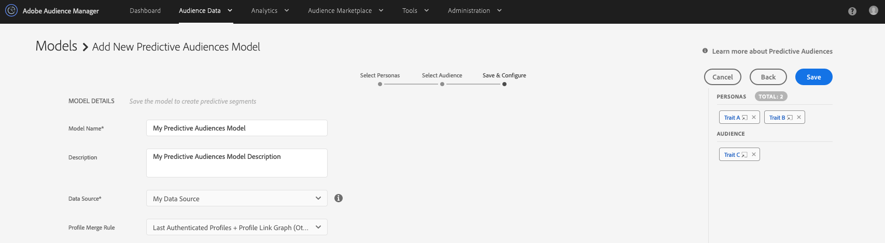

# Erste Schritte mit prädiktiven Zielgruppen {#predictive-audiences-getting-started}

>[!IMPORTANT]
>Dieser Artikel enthält eine Produktdokumentation, die Sie durch die Einrichtung und Verwendung dieser Funktion führen soll. Nichts in diesem Dokument ist eine Rechtsberatung. Wenden Sie sich an Ihren Rechtsbeistand, um Rechtsberatung zu erhalten.

## Erstellen eines prädiktiven Zielgruppenmodells {#create-predictive-audiences}

Bevor Sie ein [!UICONTROL Predictive Audiences] erstellen, müssen Sie entscheiden, welcher Erstanbieter-Datenquelle Sie Ihre [!UICONTROL Predictive Audiences] und Segmente zuweisen möchten. Sie können eine vorhandene First-Party-Datenquelle verwenden oder eine neue erstellen. Weitere Informationen [ Erstellen einer neuen First-Party](https://experienceleague.adobe.com/docs/audience-manager/user-guide/features/data-sources/manage-datasources.html?lang=de)Datenquelle finden Sie unter „Verwalten von Datenquellen“.

Sobald Sie wissen, welche Datenquelle Sie verwenden werden, führen Sie die folgenden Schritte aus.

1. Navigieren Sie zu **[!UICONTROL Audience Data]** > **[!UICONTROL Models]**.
1. Klicken Sie im Abschnitt [!UICONTROL Predictive Audiences] auf **[!UICONTROL Add New]**.

   

1. Definieren Sie anschließend die Personas, nach denen Sie Ihre Audience klassifizieren möchten. Dazu können Sie entweder Eigenschaften oder Segmente auswählen, aus denen Personas erstellt werden sollen. Verwenden Sie die Registerkarten [!UICONTROL Traits] und [!UICONTROL Segments] in der oberen linken Ecke des Bildschirms, um zwischen Ihrer Eigenschaft und dem Segmentkatalog zu wechseln. Nachdem Sie die Eigenschaften oder Segmente identifiziert haben, die Sie als Personas verwenden möchten, klicken Sie auf das entsprechende **[!UICONTROL Add]** in der Spalte [!UICONTROL Action] .
   
   >[!NOTE]
   >Sie müssen für Ihre Grundlinien-Personas mindestens zwei Eigenschaften oder zwei Segmente auswählen. Sie können keine Kombination aus Eigenschaften und Segmenten verwenden.
1. Klicken Sie auf **[!UICONTROL Next]** , nachdem Sie Ihre Rollen definiert haben.
1. Wählen Sie als Nächstes die Erstanbieter-Zielgruppe aus, die Sie klassifizieren möchten, indem Sie eine Erstanbieter-Eigenschaft oder ein Segment für diese Zielgruppe auswählen. Verwenden Sie die Registerkarten [!UICONTROL Traits] und [!UICONTROL Segments] in der oberen linken Ecke des Bildschirms, um zwischen Ihren Eigenschaften und dem Segmentkatalog zu wechseln. Wählen Sie die First-Party-Eigenschaft oder das Segment aus, das Sie als Zielgruppe verwenden möchten, um es bzw. es dem Modell hinzuzufügen.
   
1. Klicken Sie nach der Auswahl Ihrer Audience auf **[!UICONTROL Next]** .
1. Füllen Sie die Modelldetails aus:
   * **[!UICONTROL Model Name]**: Geben Sie einen beschreibenden Namen für das Modell ein, damit Sie es später identifizieren können. Die Namen der vom Modell generierten Segmente beginnen mit dem Namen des Modells.
   * **[!UICONTROL Description]**: Geben Sie eine Beschreibung des Modells ein, die Ihnen bei der Identifizierung des Anwendungsfalls hilft.
   * **[!UICONTROL Data Source]**: Wählen Sie die Erstanbieter-Datenquelle aus, der die [!UICONTROL Predictive Audiences] Segmente dieses Modells zugewiesen werden sollen.
   * **[!UICONTROL Profile Merge Rule]**: Wählen Sie die [!UICONTROL Profile Merge Rule] aus, die für alle von diesem Modell erstellten [!UICONTROL segments] zugewiesen werden soll. Wenn es sich bei der ausgewählten Zielgruppe um eine [!UICONTROL segment] handelt, empfehlen wir, dieselbe [!UICONTROL Profile Merge Rule] der Zielgruppe auszuwählen.
     
1. Klicken Sie auf **[!UICONTROL Save]**.

## Klonen und Bearbeiten prädiktiver Zielgruppenmodelle {#clone-predictive-audiences}

Audience Manager unterstützt nicht die Bearbeitung vorhandener [!UICONTROL Predictive Audiences]. Um die Konfiguration eines Modells zu ändern, können Sie einen Klon eines vorhandenen Modells erstellen und bearbeiten. Gehen Sie wie folgt vor:

1. Navigieren Sie zu **[!UICONTROL Audience Data]** > **[!UICONTROL Models]**.
2. Klicken Sie auf den Namen des [!UICONTROL Predictive Audiences], das Sie klonen möchten.
3. Klicken Sie auf die Schaltfläche **[!UICONTROL Clone]** oben links im Bildschirm.
   
4. Nachdem Sie das Modell geklont haben, gelangen Sie zur [!DNL Save & Configure] des geklonten Modells. Auf dieser Seite können Sie die [!UICONTROL data source] und die zugewiesene [!UICONTROL Profile Merge Rule] des Modells ändern. Um die Rollen und die Zielgruppe des geklonten Modells zu bearbeiten, verwenden Sie die Schaltflächen [!UICONTROL Back] und [!UICONTROL Next] , um zwischen den drei Registerkarten zu navigieren, oder klicken Sie auf die drei Registerkartennamen

   

5. Wenn Sie mit der Bearbeitung eines Modells fertig sind, klicken Sie auf **[!UICONTROL Save]**.

## Löschen prädiktiver Zielgruppen {#delete-predictive-audiences}

Um ein [!UICONTROL Predictive Audiences] Modell zu löschen, gehen Sie zu **[!UICONTROL Audience Data]** > **[!UICONTROL Models]**, suchen Sie das Modell, das Sie löschen möchten, und klicken Sie auf das Symbol **[!UICONTROL Delete]** .
