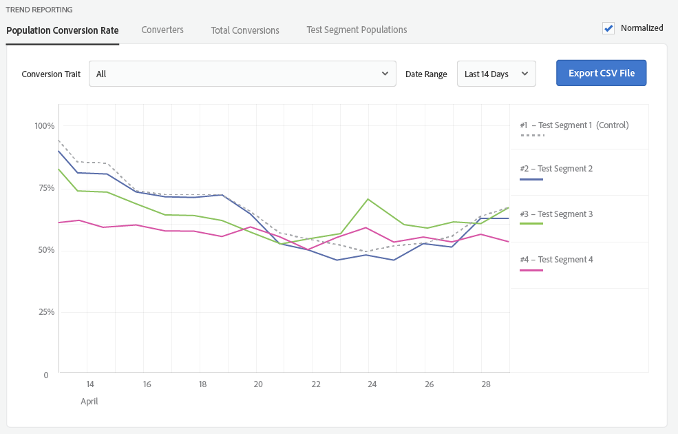

# Testgruppenberichte {#test-group-reporting}

Der Abschnitt zur Testgruppenberichterstattung gibt Informationen zu Testgruppenkonversionen zurück, sodass die Testsegmentwirksamkeit einfach verglichen werden kann. Zur Datenvisualisierung stehen zahlreiche Filter und Dimensionen zur Verfügung.

[!UICONTROL Audience Lab] gibt detaillierte Berichtsinformationen für die von Ihnen erstellten Testsegmente zurück und ermöglicht es Ihnen, die Berichtsdaten als [!DNL CSV] -Dateien zu speichern. Sie können zwischen **[!UICONTROL Aggregate Reporting]** und **[!UICONTROL Trend Reporting]** wählen.

**[!UICONTROL Aggregate Reporting]** gibt die absoluten Zahlen für Ihre Testsegmente zurück. **[!UICONTROL Trend Reporting]** gibt ein Diagramm des Trends *über einen bestimmten Zeitraum zurück*. Mit vier Registerkarten können Sie die Berichte anpassen:

<table id="table_446384AE9A36408A9C570CB7DB72C3D6"> 
 <thead> 
  <tr> 
   <th colname="col1" class="entry"> Parameter </th> 
   <th colname="col2" class="entry"> Beschreibung </th> 
  </tr> 
 </thead>
 <tbody> 
  <tr> 
   <td colname="col1"> 
 <b> Bevölkerungskonversionsrate</b> 
 </td> 
   <td colname="col2"> 
Gibt den Prozentsatz der Geräte zurück, die zu einem bestimmten Testsegment gehören und konvertiert wurden. 
 </td> 
  </tr> 
  <tr> 
   <td colname="col1"> 
 <b> Konverter</b> 
 </td> 
   <td colname="col2"> 
Gibt die Anzahl der Geräte zurück, die die in den Testgruppen ausgewählten Konversionseigenschaften gezeigt haben. <a href="https://helpx.adobe.com/audience-manager/kt/using/creating-conversion-traits-feature-video-use.html" format="https" scope="external"> Sehen Sie sich dieses Video</a> an, um zu erfahren, wie Sie Konversionseigenschaften erstellen. 
 </td> 
  </tr> 
  <tr> 
   <td colname="col1"> 
 <b> Gesamtkonversionen</b> 
 </td> 
   <td colname="col2"> 
Gibt die Anzahl der Konversionen zurück, die von den Testsegmenten generiert wurden. 
 </td> 
  </tr> 
  <tr> 
   <td colname="col1"> 
 <b> Testsegmentpopulationen</b> 
 </td> 
   <td colname="col2"> 
Gibt die Anzahl der Geräte zurück, die zu den Testsegmenten gehören. Zwischen <b> Gesamtpopulation</b> oder <b> Echtzeitpopulation</b> wechseln. Der Unterschied wird in den <a href="../../faq/faq-reporting.md"> FAQ zu Berichten</a> erläutert. 
 </td>
  </tr>
 </tbody>
</table>

Sie können eine bestimmte Konversionseigenschaft auswählen, für die der Bericht generiert werden soll, oder Sie können alle kombinierten Eigenschaften auswählen. Sie können einen Datumsbereich definieren, für den die Informationen zurückgegeben werden sollen, und den Bericht als [!DNL CSV] -Datei exportieren.

>[!NOTE]
>
>* Die Berichterstellung für eine Testgruppe wird am Tag nach dem Startdatum ausgefüllt.
>* Eine Konversion wird für ein Gerät erst nach dem Startdatum eines Tests und nach dem Hinzufügen des Geräts zu einem Testsegment gezählt. Wenn eine Konversion für dieses Gerät stattfindet, bevor ihm eine Testgruppe zugewiesen wird, wird die Konversion nicht gezählt.

Ein zurückgegebenes **[!UICONTROL Aggregate Reporting]** Diagramm könnte wie folgt aussehen:

Ein zurückgegebenes **[!UICONTROL Trend Reporting]** -Diagramm könnte wie das unten stehende aussehen. Wählen Sie im Kontrollkästchen **[!UICONTROL Normalized]** aus, wenn Sie die absoluten Zahlen ignorieren und sich einfach auf die Trends der Testsegmente konzentrieren möchten.

