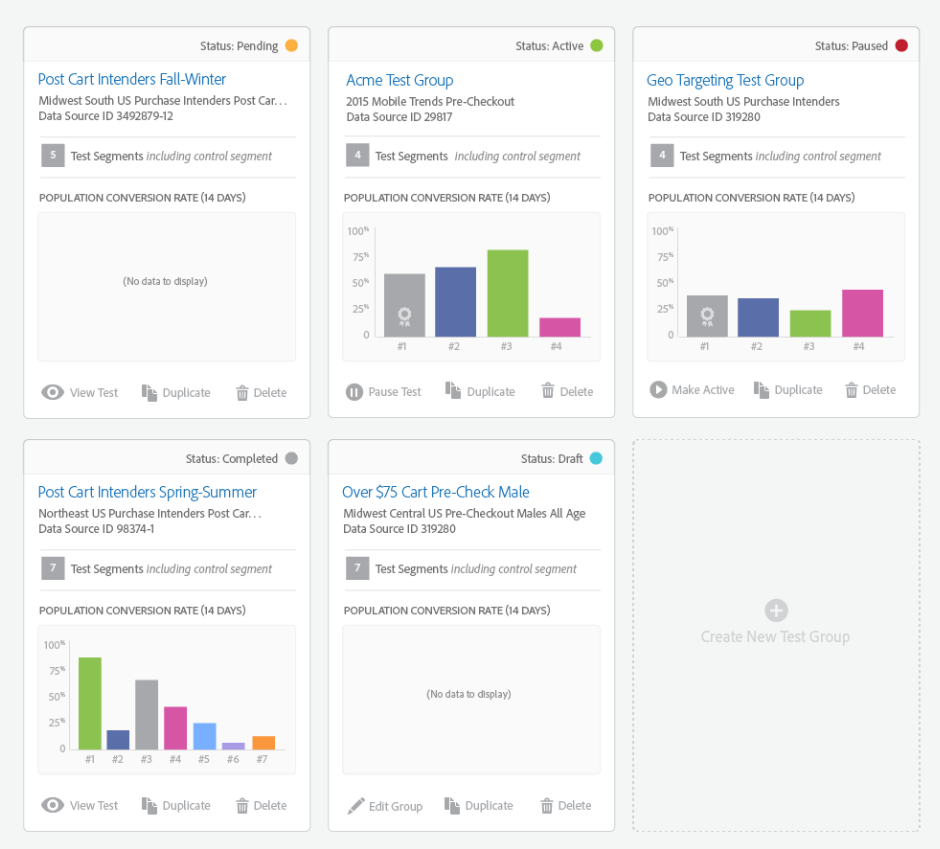

# [!UICONTROL Audience Lab] {#audience-lab}

Erstellen Sie sich gegenseitig ausschließende Testsegmente, [!UICONTROL Segment Test Groups] die Effektivität verschiedener Ziele zu vergleichen und zu messen. Sie können eine Kontrollgruppe zur Seite legen und Ihr Segment in Prozentsätze eines Ganzen aufteilen, um die Wirksamkeit zu testen.

## Überblick {#audience-lab-overview}

[!UICONTROL Audience Lab] verwendet [Profil-Link](../../features/profile-merge-rules/merge-rules-overview.md) für geräteübergreifende Tests. Dadurch wird sichergestellt, dass Benutzende für dasselbe Testsegment qualifiziert sind und geräteübergreifend dieselbe Behandlung erhalten. Die Testsegmente in Testgruppen übernehmen die [Profilzusammenführungsregel](../../features/profile-merge-rules/merge-rules-dashboard.md) die dem Basissegment zugewiesen wurde.

In der [!UICONTROL Audience Lab] Standardansicht wird für jede Testgruppe eine Karte angezeigt. Klicken Sie auf eine Karte, um auf die **[!UICONTROL Test Group]** zuzugreifen. Diese Ansicht enthält die folgenden Informationen:

* **[Informationen zu Testgruppen](../../features/audience-lab/audience-lab-information-view.md)**
* **[Testgruppenberichte](../../features/audience-lab/audience-lab-reporting-view.md)**

Sie können (**zu 10 Testgruppen** jeweils mit (**zu 15 Testsegmenten** erstellen.

## Testgruppen suchen und filtern {#search-and-filter}

Sobald Sie mit der Erstellung mehrerer Testgruppen mit mehreren Testsegmenten beginnen, kann es einfacher sein, das Suchfeld zu verwenden, um eine bestimmte Testgruppe zu finden. Sie können nach einer Testgruppe suchen, indem Sie:

* Name der Prüfgruppe;
* Der Name eines der Testsegmente in Ihrer Testgruppe;
* Die Beschreibung der Testgruppe.

Sie können Ihre Testgruppen auch nach Status filtern. Alle verfügbaren Status werden im Abschnitt [Status](../../features/audience-lab/audience-lab.md#status) unten beschrieben.

## [!UICONTROL Status] {#status}

Der Status einer Testgruppe kann aktiv, geplant, angehalten, Entwurf oder abgeschlossen sein. Weitere Informationen zu den einzelnen Kriterien finden Sie in der folgenden Tabelle:

<table id="table_7A0388BA02E045AC971C06A22DAC2C63"> 
 <thead> 
  <tr> 
   <th colname="col1" class="entry"> Status </th> 
   <th colname="col2" class="entry"> Beschreibung </th> 
  </tr> 
 </thead>
 <tbody> 
  <tr> 
   <td colname="col1"> 
 Aktive <b> </b> 
 </td> 
   <td colname="col2"> 
Eine <i>aktive</i> Testgruppe bedeutet, dass derzeit Daten an Ziele gesendet werden. Drücken Sie <b> Pause Test </b> auf der Karte <b> Test Group </b> , um das Senden von Daten an Ziele auszusetzen. 
 </td> 
  </tr> 
  <tr> 
   <td colname="col1"> 
 <b> geplanter </b> 
 </td> 
   <td colname="col2"> 
Eine <i>geplante</i> Testgruppe ist noch nicht aktiv, kann jedoch nicht mehr bearbeitet werden. Sie wird zu dem Startdatum aktiv, das Sie im Assistenten <b>Testgruppen erstellen</b> ausgewählt haben. 
 </td> 
  </tr> 
  <tr> 
   <td colname="col1"> 
 <b> angehalten </b> 
 </td> 
   <td colname="col2"> 
Eine <i>angehaltene</i> Testgruppe sendet derzeit keine Daten an Ziele. Drücken Sie <b> Auf der Karte </b> Testgruppe <b> die Option Aktive </b> festlegen , um den Versand der Eigenschaften fortzusetzen. 
 </td> 
  </tr> 
  <tr> 
   <td colname="col1"> 
 <b> </b> 
 </td> 
   <td colname="col2"> 
Eine <i>Entwurf</i> Testgruppe ist noch nicht aktiv und kann noch bearbeitet werden. Es sendet noch keine Daten an die zugeordneten Ziele. 
 </td> 
  </tr> 
  <tr> 
   <td colname="col1"> 
 <b> abgeschlossen </b> 
 </td> 
   <td colname="col2"> 
Eine <i>abgeschlossene</i> Testgruppe hat das Enddatum erreicht, das Sie im <b> "</b> Testgruppen erstellen“ ausgewählt haben, und hat den Versand von Berichtsdaten beendet. 
 </td>
  </tr>
 </tbody>
</table>

## [!UICONTROL Actions] {#actions}

<table id="table_481A411E2D2F4FE891595D00E775CF60"> 
 <thead> 
  <tr> 
   <th colname="col1" class="entry"> Aktionen </th> 
   <th colname="col2" class="entry"> Beschreibung </th>
  </tr>
 </thead>
 <tbody> 
  <tr> 
   <td colname="col1"> 
 <b> bearbeiten </b> 
 </td>
   <td colname="col2"> 
Nur <b> für </b>-Testgruppen verfügbar. Ermöglicht es Ihnen, den Assistenten <b> Erstellen einer neuen Testgruppe </b> fortsetzen. 
 </td>
  </tr>
  <tr> 
   <td colname="col1"> 
 <b> Pause </b> 
 </td>
   <td colname="col2"> 
Verfügbar für aktive Testgruppen. Ermöglicht das Pausieren des Versands der Testsegmente an Ziele. 
 </td>
  </tr>
  <tr> 
   <td colname="col1"> 
 <b> Make Active </b> 
 </td>
   <td colname="col2"> 
Verfügbar für pausierte Testgruppen. Ermöglicht es Ihnen, das Senden der Testsegmente an Ziele fortzusetzen. 
 </td>
  </tr>
  <tr> 
   <td colname="col1"> 
 <b> View </b> 
 </td>
   <td colname="col2"> 
Verfügbar für abgeschlossene Testgruppen. Ermöglicht die Anzeige der Reporting-Informationen, die der Test generiert hat. 
 </td>
  </tr>
  <tr> 
   <td colname="col1"> 
 <b> doppelter </b> 
 </td>
   <td colname="col2"> 
Ermöglicht die Erstellung einer neuen Testgruppe mit derselben Konfiguration wie die zu duplizierende. 
 </td>
  </tr>
  <tr> 
   <td colname="col1"> 
 <b> </b> 
 </td>
   <td colname="col2"> 
Ermöglicht das Löschen einer Testgruppe. Die Zuordnung der Testsegmente zu den Zielen wird aufgehoben, und das Baseline-Segment sowie die mit der Testgruppe verknüpften Konversionseigenschaften sind vollständig bearbeitbar. Ein Warnhinweis fordert Sie dazu auf, die CSV-Datei herunterzuladen, wenn Sie eine Testgruppe löschen, um die Berichte bei Bedarf zu speichern. 
 </td>
  </tr>
 </tbody>
</table>
