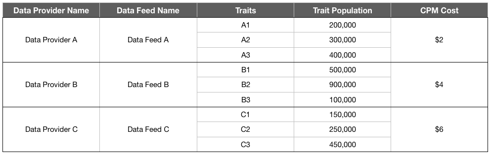
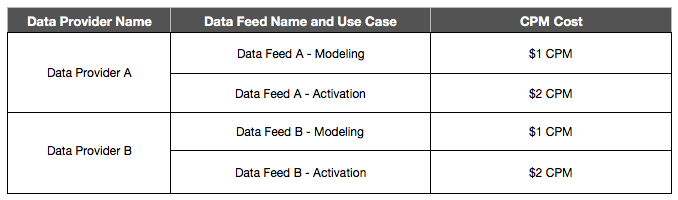

# Abrechnung für Daten-Feed-Käufer {#billing-for-data-feed-buyers}

Die Käufer von Audience Marketplace-Daten erklären sich damit einverstanden, alle Anzeigenimpressionen zu melden, die anhand der im Datenfeed enthaltenen Eigenschaften bereitgestellt werden, und zwar zu einem Preis pro Tausend Anzeigenimpressionen ([!DNL CPM]). [!DNL CPM] Die Nutzung erfolgt am 5. Tag jedes Kalendermonats und beinhaltet Daten für den Vormonat. Pauschalabonnenten müssen die Nutzung nicht melden.

  

## Bericht zur CPM-Nutzung {#report-cpm-usage}

<!-- t_marketplace_report_cpm_usage.xml -->

[!UICONTROL Audience Marketplace] Datenkäufer stimmen zu, alle Anzeigenimpressionen zu melden, die mit den im Datenfeed enthaltenen Eigenschaften bereitgestellt werden, und zwar zu einem Preis pro Tausend Anzeigenimpressionen ([!DNL CPM]). [!DNL CPM] Die Nutzung erfolgt am 5. Tag jedes Kalendermonats und beinhaltet Daten für den vorherigen Monat. Pauschalabonnenten müssen die Nutzung nicht melden.

[!UICONTROL Audience Marketplace] angebot zwei Möglichkeiten zur [!DNL CPM] Nutzungsberichterstellung:

* **Berichte** auf Segmentebene: dies ist die empfohlene Berichte- [!DNL CPM] Methode. Wenn Sie eine [!DNL CPM] Nutzung auf Segmentebene melden, wird der Berichte auf Datenfeed-Ebene automatisch mit den entsprechenden Nutzungsbeträgen ausgefüllt, basierend auf den unter [Kostenzuordnung für CPM-Datenfeeds](#cost-attribution)beschriebenen Algorithmen.
* **Berichte** auf Datenfeed-Ebene: Diese Methode erfordert, dass Sie die [!DNL CPM] Nutzung für jeden Datenfeed individuell melden, basierend auf den unter [Kostenzuordnung für CPM-Datenfeeds](#cost-attribution)beschriebenen Algorithmen. Diese Methode ist jedoch umständlicher und fehleranfälliger als Berichte auf Segmentebene.

  

## CPM-Nutzung auf Segmentebene melden {#segment-level-report}

Auf der [!UICONTROL Segment Usage] Registerkarte können Sie die Nutzung auf Segmentebene melden, während Sie die Segmente anzeigen, die nach den Zielen gruppiert sind, denen sie zugeordnet sind.

Nach der [!DNL CPM] Nutzung durch Berichte auf Segmentebene weist [!UICONTROL Audience Marketplace] die entsprechenden Datenfeeds anhand der [Kostenzuordnung für CPM-Datenfeeds](#cost-attribution)automatisch die richtige Nutzung zu.

So melden Sie die [!DNL CPM] Nutzung auf Segmentebene:

1. Geh zu **[!UICONTROL Audience Marketplace > Payables]**.
1. Wählen Sie die **[!UICONTROL Segment Usage]** Registerkarte.
1. Füllen Sie die Nutzung für Ihre Segmente aus. Sie können das [!UICONTROL Search] Feld verwenden, um die Segmente zu filtern, wenn Sie nur für einige davon Berichte zur Nutzung erstellen müssen.
1. Klicken **[!UICONTROL Edit Segments Usage]**.
1. Geben Sie den [!DNL CPM] Nutzungsbetrag in die [!UICONTROL Usage] Spalte ein.
1. Klicken Sie auf **[!UICONTROL Save]** , wenn Sie fertig sind, und überprüfen Sie das Bestätigungsdialogfeld.

   

1. Klicken **[!UICONTROL Confirm]**.

Sehen Sie sich auch unsere Videodemonstration an, wie Sie die Nutzung auf Segmentebene in Berichten darstellen können:

>[!VIDEO](https://video.tv.adobe.com/v/25522/)

 

## CPM-Nutzung auf Datenfeed-Ebene melden {#feed-level-report}

Der Berichte auf Datenfeed-Ebene ist aufwändiger und fehleranfälliger, da Sie die [!DNL CPM] Nutzung für jeden Datenfeed einzeln berechnen müssen. Es wird empfohlen, die CPM-Nutzung stattdessen auf Segmentebene [zu melden](#segment-level-report) .

So melden Sie die [!DNL CPM] Nutzung auf Segmentebene:

1. Geh zu **[!UICONTROL Audience Marketplace > Payables]**.
2. Wählen Sie die **[!UICONTROL Feed Usage]** Registerkarte.
3. Verwenden Sie das [!UICONTROL Search] Kästchen, um die Datenfeeds zu filtern und die Datenfeeds zu identifizieren, für die Sie die Verwendung in Berichten melden müssen.
4. Klicken **[!UICONTROL Edit Feeds Usage]**.
5. Berechnen Sie die [!DNL CPM] Nutzung für jeden Datenfeed auf Grundlage der [Kostenzuordnung für CPM-Datenfeeds](#cost-attribution)und geben Sie ihn in die [!UICONTROL Usage] Spalte ein.
6. Klicken Sie auf **[!UICONTROL Save]** , wenn Sie fertig sind, und überprüfen Sie das Bestätigungsdialogfeld.

   

7. Klicken **[!UICONTROL Confirm]**.

  

## Bulk-Berichte

Um Fehler und Verwaltungsaufwand bei der [!DNL CPM] Nutzung des Berichte zu reduzieren, können Sie mit der Option &quot;Massenspeicher&quot;eine [!DNL CSV] Datei herunterladen, die die Datenfeeds und -segmente enthält, die Nutzung ausfüllen und wieder hochladen [!DNL Audience Manager]. Sie können Massen-Berichte verwenden, um sowohl die Feed- als auch die Segmentnutzung zu melden.

So aktualisieren Sie die [!DNL CPM] Verwendung als Massenspeicher:

1. Geh zu **[!UICONTROL Audience Marketplace > Payables]**.
1. Wählen Sie je nach Berichte, den Sie aktualisieren möchten, die Registerkarte **[!UICONTROL Feed Usage]** oder **[!UICONTROL Segment Usage]** .
1. Klicken Sie auf **[!UICONTROL Edit Feeds Usage]** oder **[!UICONTROL Edit Segments Usage]**.
1. Klicken Sie auf **[!UICONTROL download the current usage]** , um sicherzustellen, dass Sie eine gültige CSV-Datei verwenden.
1. Öffnen Sie die Datei auf Ihrem Computer und füllen Sie den Nutzungsbericht aus.
1. Klicken Sie auf **[!UICONTROL Choose a CSV file]** , um den aktualisierten Nutzungsbericht hochzuladen.

   

1. [!DNL Audience Manager] validiert die Datei, sobald Sie sie hochladen, und fordert Sie auf, etwaige Fehler in der Datei festzustellen.

  

### Validierungsfehler bei Massenservern für Berichte

| Fehlermeldung | Beschreibung | Fehlerbehebung |
| ------------- | -------------| -----|
| Ungültige Eingabe | [!DNL Audience Manager] hat eine Änderung im [!DNL CSV] Schema erkannt, z. B. fehlende Spalten oder Änderungen an Spaltentiteln. | Ändern Sie die Tabellenstruktur nicht. |
| nicht gefunden | Beispielsweise [!UICONTROL Segment Level Reporting]konnte [!DNL Audience Manager] die Kombination [!UICONTROL Segment ID] und [!UICONTROL Destination ID] nicht identifiziert werden. Beispielsweise [!UICONTROL Feed Level Reporting]konnte [!DNL Audience Manager] die Kombination [!UICONTROL Data Provider Name], [!UICONTROL Feed Name]und [!UICONTROL Use Case] nicht identifiziert werden. | Überprüfen Sie [!UICONTROL Segment Level Reporting]die Gültigkeit der Kombination [!UICONTROL Segment ID] und [!UICONTROL Destination ID] . Überprüfen Sie [!UICONTROL Feed Level Reporting]zum Beispiel die Gültigkeit der [!UICONTROL Data Provider Name], [!UICONTROL Feed Name]und [!UICONTROL Use Case] Kombination. |
| Duplikat Records gefunden | [!DNL Audience Manager] erkannte Duplikat-Datensätze mit unterschiedlichen Impressionswerten. | Überprüfen Sie den Bericht und stellen Sie sicher, dass Sie keine unterschiedlichen Nutzungswerte für denselben Datenfeed oder dasselbe Segment melden. |
| Nicht unterstützte Werte | [!DNL Audience Manager] nicht numerische Werte in der [!DNL Audience Manager] Spalte erkannt. | Überprüfen Sie den Bericht und stellen Sie sicher, dass Sie nur numerische Werte in die [!DNL Audience Manager] Spalte eingeben. |
| Kopfzeilen für fehlende obligatorische Felder | [!DNL Audience Manager] Fehlende Tabellenüberschriften für erforderliche Felder wurden erkannt. Die erforderlichen Felder [!UICONTROL Segment Level Reporting]sind beispielsweise: [!UICONTROL Segment ID], [!UICONTROL Destination ID]. Die erforderlichen Felder [!UICONTROL Feed Level Reporting]sind beispielsweise: [!UICONTROL Data Provider Name], [!UICONTROL Data Feed Name],  [!UICONTROL Use Case] | Überprüfen Sie den Bericht und stellen Sie sicher, dass die Tabellenüberschriften nicht manipuliert wurden. |

>[!NOTE]
>Das Entfernen von Zeilen aus dem [!DNL CSV] Nutzungsbericht hat keine Auswirkungen auf den vorhandenen Nutzungsbericht. [!DNL Audience Manager] verarbeitet nur die im Bericht enthaltenen Felder.

  

## [!DNL CPM] Best Practices für Berichte

<table id="table_E68FA2130D1C495FAB8982DFB6A31FD9"> 
 <thead> 
  <tr> 
   <th colname="col1" class="entry"> Empfehlungen </th> 
   <th colname="col2" class="entry"> Beschreibung </th> 
  </tr>
 </thead>
 <tbody> 
  <tr> 
   <td colname="col1"> 
<b>Gesamtanzahl der Impressionen immer melden</b> 
 </td> 
   <td colname="col2"> 
Bei CPM-Impressionssummen: 

   
 Geben Sie die Gesamtanzahl der Impressionen ohne Dezimalstellen an. Audience Manager berechnet den CPM automatisch auf Basis der von Ihnen angegebenen Gesamtanzahl.

Wenn Sie 1.234.567 Impressionen melden müssen, melden Sie sie genau so. Sie müssen die Gesamtanzahl der Impressionen nicht durch 1.000 dividieren, um den CPM zu berechnen.

Eigenschaften, die zur Optimierung Ihres Web- oder App-Inhalts (Inhaltsoptimierung) mithilfe von Tools wie Adobe Target oder einem Analytics-Ziel verwendet werden, tragen nicht zu den Nutzungs-Gesamtzahlen für CPM-Pläne bei. Datenanbieter erhalten in der Regel einen Ausgleich für die Inhaltsoptimierung, indem sie Pauschalentgelte verwenden.

Weitere Informationen finden Sie unter <a href="#cost-attribution">Kostenzuordnung für CPM-Datenfeeds</a> . 
 </td>
  </tr>
  <tr> 
   <td colname="col1"> 
<b>An Monatsintervall des Berichte festhalten</b> 
 </td> 
   <td colname="col2"> 
Das Berichtssystem wird nach dem 5. jedes Monats geschlossen. Wenn Sie die CPM-Nutzung bis dahin nicht melden, müssen Sie diesen Betrag dem Bericht für den folgenden Monat hinzufügen. Angenommen, Sie verwenden im Oktober 1000 Impressionen, versäumen den Termin für den Oktober-Berichte und verwenden im November 1000 Impressionen. In diesem Fall melden Sie die Summe von Oktober und November (2000) im Dezember, zwischen dem 1. und dem 5.

<b>Tipp</b>: Sie sollten immer versuchen, die CPM-Nutzung für den Vormonat zwischen dem 1. und dem 5. Tag des darauffolgenden Monats zu melden.

Sie können die CPM-Nutzung bis zum 5. des neuen Kalendermonats melden, dies wird jedoch nicht empfohlen. Die Verwendung von Berichte CPM vor dem 5. eines jeden Monats gibt dem Audience Manager Zeit, die Daten zu überprüfen und zu verarbeiten.
 </td>
  </tr> 
 </tbody> 
</table>

  

## Kostenzuordnung für CPM-Datenfeeds {#cost-attribution}

In müssen [!UICONTROL Audience Marketplace] Sie die Impressionsbeträge jeden Monat für jedes Ihrer Segmente selbst melden. Es wird empfohlen, Berichte auf Segmentebene [!DNL CPM] zu verwenden, damit die Kostenzuordnung automatisch erfolgt.

<!-- marketplace_cpm_billing.xml -->

### Rechnungsübersicht {#billing-summary}

Sie müssen Datenfeed-Impressionsbeträge zwischen dem 1. und dem 5. Tag jedes Kalendermonats übermitteln. [!DNL CPM] Um dies korrekt zu tun, empfehlen wir Ihnen, die CPM-Nutzung auf Segmentebene [zu melden](#segment-level-report).

>[!TIP]
>Wenn Sie die [!DNL CPM] Nutzung auf Segmentebene melden, wird der Berichte auf Datenfeed-Ebene automatisch mit den entsprechenden Nutzungsmengen ausgefüllt.

Falls erforderlich, müssen Sie [!UICONTROL Report CPM Usage at Data Feed Level]alle Impressionen, die im vorausgegangenen Kalendermonat für jeden Feed bereitgestellt wurden, einzeln kompilieren und sie gemäß der in diesem Artikel beschriebenen Rechnungszuweisung melden.

Führen Sie nach dem Bericht [!DNL CPM] der Nummer für den vorherigen Kalendermonat [!DNL Adobe] folgende Schritte aus:

* Erstellen Sie eine Rechnung und eine Rechnung, die Sie auf der Grundlage der [!DNL CPM] Rate für jeden abonnierten Datenfeed erstellen.
* Gebühren für Datenanbieter (Verkäufer) werden auf der Grundlage Ihrer gemeldeten [!DNL CPM] Nutzung geschuldet.

>[!IMPORTANT]
>
>Als Käufer müssen alle gemeldeten Impressionssummen wahr und genau sein. Wenn Sie die Summen für Impressionen nicht bis zum 5. Tag jedes Monats melden, müssen Sie die Summen für den nicht gemeldeten Monat im folgenden Monat einschließen.

  

## Zuweisen von Impressionen auf Feed-Ebene auf Grundlage von Eigenschaftenqualifizierungsregeln {#assign-impressions}

Im [!UICONTROL Activation] Anwendungsfall können Sie Eigenschaften im entsprechenden Datenfeed verwenden, um Segmente im [Segmentaufbau](../../../features/segments/segment-builder.md) zu erstellen und diese Segmente einem Ziel zuzuordnen. Die booleschen Operatoren [!UICONTROL AND], [!UICONTROL OR]und [!UICONTROL NOT] können Sie die Bedingungen für die Eigenschaften- und Segmentqualifizierung festlegen.

Wenn Sie CPM-Nutzung auf Datenfeed-Ebene [melden](#feed-level-report), müssen Sie Impressionen proportional für jeden Datenfeed zuweisen, entsprechend den in den Eigenschaftsqualifizierungsregeln verwendeten [!DNL Boolean] Operatoren. In der folgenden Tabelle wird die korrekte Zuordnung von Impressionen nach booleschen Regeln oder Eigenschaften Liste.

>[!TIP]
>
> [Bericht zur CPM-Nutzung auf Segmentebene](#segment-level-report) , damit der Berichte auf Datenfeed-Ebene automatisch vom Audience Manager ausgeführt wird.

<table id="table_BF00FE6740D2459DAFA62F2478492586"> 
 <thead> 
  <tr> 
   <th colname="col1" class="entry"> Regelqualifizierungslogik oder -typ </th> 
   <th colname="col2" class="entry"> Rechnungsverteilung </th> 
  </tr> 
 </thead>
 <tbody> 
  <tr> 
   <td colname="col1"> 
 UND 
 </td> 
   <td colname="col2"> 
Wenden Sie in einem regelbasierten Segment, das eine boolesche  UND -Bedingung verwendet, 100 % der bereitgestellten Impressionssummen auf alle Provider-Eigenschaften an. 
 </td> 
  </tr> 
  <tr> 
   <td colname="col1"> 
 ODER 
 </td> 
   <td colname="col2"> 
Wenden Sie die gewichtete Zuordnung der gelieferten Impressionssummen auf alle Provider-Eigenschaften in einem regelbasierten Segment an, das eine boolesche OR-Bedingung verwendet. Die gewichtete Zuordnung wird nach folgender Formel berechnet:

<code>(Trait Population / Segment Population) * Number of Impressions * Cost of CPM</code>
 </td> 
  </tr>
  <tr> 
   <td colname="col1"> 
 NICHT 
 </td> 
   <td colname="col2"> 
Wenden Sie 100 % der gelieferten Impressionssummen auf alle Provider-Eigenschaften in einem regelbasierten Segment an, das eine boolesche  NOT -Bedingung verwendet. 
 </td> 
  </tr> 
  <tr> 
   <td colname="col1"> 
Algorithmische Segmente 
 </td> 
   <td colname="col2"> 
Wenden Sie 100 % der gelieferten Impressionssummen auf alle Provider-Feeds in einem Segment an, das algorithmische Eigenschaften enthält. 
 </td> 
  </tr>
 </tbody>
</table>

  

## Beispiele für Rechnungsstellung {#billing-examples}

Die folgenden Beispiele sollen veranschaulichen, wie die [!DNL CPM] Nutzungszuordnung auf Datenfeed-Ebene erfolgt.

>[!IMPORTANT]
>Es wird empfohlen, die CPM-Nutzung stattdessen auf Segmentebene zu [melden](#segment-level-report) , damit dieser Prozess automatisch durchgeführt wird.

Betrachten wir das folgende Szenario:

  

### Fall 1: Segmente mit UND Qualifikationsregeln

Dieses Segment enthält 3 Eigenschaften von separaten Datenanbietern. Da die Segmentqualifizierung auf einer [!UICONTROL AND] Bedingung basiert, müssen Besucher die Eigenschaften aller drei Feeds realisieren, um sich für das Segment qualifizieren zu können.

Bei einer [!UICONTROL AND] Bedingung müssen Sie allen drei Datenanbietern 100 % der im Laufe des Monats erhaltenen Impressionen zuweisen. Im [!UICONTROL Audience Marketplace > Payables] Abschnitt werden jedem Anbieter 1.000.000 Impressionen gutgeschrieben.

Dieses Beispiel gilt für Segmente, die [!DNL Boolean] [!UICONTROL NOT] Operatoren verwenden, oder für Segmente, die algorithmische Eigenschaften enthalten.

  

### Fall 2: Segmente mit ODER-Qualifikationsregeln

Dieses Segment enthält 3 Eigenschaften von separaten Datenanbietern. Da die Segmentqualifizierung auf einer [!UICONTROL OR] Bedingung basiert, müssen Besucher mindestens eine der drei Eigenschaften implementieren, um sich für das Segment qualifizieren zu können.

Wir können nicht feststellen, welche Eigenschaft für eine Impression verantwortlich ist, da die Qualifizierung auf einer [!UICONTROL OR] Bedingung basiert. Infolgedessen werden jedem Anbieter im [!UICONTROL Audience Marketplace > Payables] Abschnitt eine gewichtete Zuordnung der Gesamtimpressionen gutgeschrieben, basierend auf der Eigenschaftspopulation.

  

### Fall 3: Segmente mit Anwendungsfällen für Modellierung und Aktivierung

In diesem Beispiel wird die Zuordnung anhand von zwei Data Feed-Anwendungsfällen - Modellierung und Aktivierung - beschrieben. Im Beispiel betrachten wir zwei Datenanbieter mit den folgenden Informationen:

In der weiter unten stehenden Tabelle enthält Segment X zwei Eigenschaften, T1 und T2, mit der Segmentregel T1 ODER T2, wobei:

* T1 ist eine Eigenschaft von Data Feed A;
* T2 ist eine algorithmische Eigenschaft, die nach Eigenschaften von Drittanbietern aus Data Feed A und Data Feed B modelliert wurde.

Das Segment wird einem Ziel zugeordnet, und in einem Monat werden 1.000.000 Impressionen für dieses Segment mithilfe des Berichte auf [Segmentebene](#segment-level-report)eingegeben.

Von diesen 1.000.000 Impressionen:

* T1 macht 40 % der Segmentpopulation aus, was 400.000 Impressionen für Feed A bedeutet.
* T2 macht 60 % der Segmentpopulation aus, was 600.000 Impressionen für Feed A und Feed B bedeutet.

Auf Datenfeed-Ebene werden die Impressionen wie folgt zugeordnet:

* Data Feed A erhält 600.000 Impressionen von der Eigenschaft T2 (die anhand von Eigenschaften aus Data Feed A und Data Feed B modelliert wird, sodass beide die Impressionen erhalten) und 400.000 Impressionen von der Eigenschaft T1 (eine Eigenschaft von Data Feed A), insgesamt 1.000.000 Impressionen.
* Data Feed B erhält 600.000 Impressionen von der Eigenschaft T2 (siehe Erklärung oben) und 0 Impressionen von der Eigenschaft T1.

Die Aufschlüsselung auf einen Blick nach Datenfeed und Anwendungsfall lautet wie folgt:

  

## Rechnungsstellung und Impressionszuordnung für einfache Feeds {#billing-flat-fee}

Ein Datenfeed mit einer Pauschale berechnet Ihnen monatlich einen festen Betrag, unabhängig davon, wann das Abonnement Beginn oder wie viele Impressionen Sie verwenden. Die Gebühren werden nicht anteilig für die teilweise Monatsnutzung oder für Intervalle berechnet. Wie bei der CPM-Abrechnung erstellt die Adobe eine Rechnung und rechnet Sie zum monatlichen Pauschalpreis für Ihre abonnierten Daten-Feeds ab.

Nehmen wir beispielsweise an, Sie haben beschlossen, in der Mitte des Monats bestimmte Eigenschaften in einem Feed zu aktivieren. Sie werden weiterhin zum vollen Monatspreis in Rechnung gestellt, unabhängig davon, wann Sie das Abonnement gestartet oder bestimmte Eigenschaften aktiviert haben.