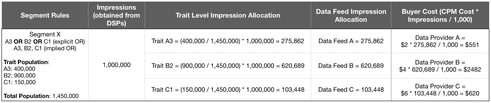

# Abrechnung für Käufer von Daten-Feeds {#billing-for-data-feed-buyers}

Audience Marketplace-Datenerwerber stimmen zu, alle Anzeigenimpressionen zu melden, die mit Eigenschaften bereitgestellt werden, die im Daten-Feed enthalten sind, und zwar zu einem Preis auf der Grundlage der Kosten pro 1000 Anzeigenimpressionen ([!DNL CPM]). [!DNL CPM] Nutzung ist am 5. Tag jedes Kalendermonats fällig und umfasst Daten für den Vormonat. Abonnentinnen und Abonnenten von Pauschalgebühren müssen keine Nutzung melden.

 

## So melden Sie die Nutzung von CPM {#report-cpm-usage}

<!-- t_marketplace_report_cpm_usage.xml -->

[!UICONTROL Audience Marketplace] Datenerwerber sind damit einverstanden, alle Anzeigenimpressionen zu melden, die mit Eigenschaften bereitgestellt werden, die im Daten-Feed enthalten sind und auf der Grundlage der Kosten pro 1000 Anzeigenimpressionen ([!DNL CPM]) berechnet werden. [!DNL CPM] Nutzung ist am 5. Tag jedes Kalendermonats fällig und umfasst Daten für den Vormonat. Abonnentinnen und Abonnenten von Pauschalgebühren müssen keine Nutzung melden.

[!UICONTROL Audience Marketplace] bietet zwei Möglichkeiten, [!DNL CPM] zu melden:

* **Reporting auf Segmentebene**: Dies ist die empfohlene Berichtsmethode für die [!DNL CPM]. Wenn Sie [!DNL CPM] Nutzung auf Segmentebene melden, wird der Reporting-Abschnitt auf Daten-Feed-Ebene automatisch mit den entsprechenden Nutzungsbeträgen ausgefüllt, basierend auf den unter [Kostenzuordnung für CPM-Daten-Feeds](#cost-attribution) beschriebenen Algorithmen.
* **Reporting auf Daten-Feed-**: Bei dieser Methode müssen Sie die [!DNL CPM] Nutzung für jeden Daten-Feed individuell melden, basierend auf den unter &quot;[ für CPM-Daten-Feeds“ beschriebenen Algorithmen](#cost-attribution). Diese Methode ist jedoch mühsamer und anfälliger für Fehler als das Reporting auf Segmentebene.

 

## Berichte zur CPM-Nutzung auf Segmentebene {#segment-level-report}

Auf der Registerkarte [!UICONTROL Segment Usage] können Sie die Nutzung auf Segmentebene melden und dabei die Segmente anzeigen, die nach den Zielen gruppiert sind, denen sie zugeordnet sind.

Nach der Meldung [!DNL CPM] Nutzung auf Segmentebene weist [!UICONTROL Audience Marketplace] den entsprechenden Daten-Feeds automatisch die richtige Nutzung zu, basierend auf der [Kostenzuordnung für CPM-Daten-Feeds](#cost-attribution).

So melden Sie [!DNL CPM] auf Segmentebene:

1. Gehe zu **[!UICONTROL Audience Marketplace > Payables]**.
1. Wählen Sie die Registerkarte **[!UICONTROL Segment Usage]** aus.
1. Geben Sie die Nutzung für Ihre Segmente ein. Sie können das [!UICONTROL Search] verwenden, um die Segmente zu filtern, wenn Sie nur die Nutzung für einige von ihnen im Bericht angeben müssen.
1. Klicken Sie auf **[!UICONTROL Edit Segments Usage]**.
1. Geben Sie in der Spalte [!DNL CPM] den [!UICONTROL Usage] Nutzungsbetrag ein.
1. Klicken Sie abschließend auf **[!UICONTROL Save]** und überprüfen Sie das Bestätigungsdialogfeld.

   

1. Klicken Sie auf **[!UICONTROL Confirm]**.

Sehen Sie sich auch unser Video an, um zu demonstrieren, wie Sie die Nutzung auf Segmentebene melden können:

>[!VIDEO](https://video.tv.adobe.com/v/25522/)

 

## Melden der CPM-Nutzung auf Daten-Feed-Ebene {#feed-level-report}

Das Reporting auf Daten-Feed-Ebene ist mühsamer und anfälliger für Fehler, da Sie [!DNL CPM] Nutzung für jeden Daten-Feed einzeln berechnen müssen. Es wird empfohlen[ stattdessen die Nutzung von CPM auf Segmentebene ](#segment-level-report) melden.

So melden Sie [!DNL CPM] auf Segmentebene:

1. Gehe zu **[!UICONTROL Audience Marketplace > Payables]**.
2. Wählen Sie die Registerkarte **[!UICONTROL Feed Usage]** aus.
3. Verwenden Sie das [!UICONTROL Search], um die Daten-Feeds zu filtern und die Feeds zu identifizieren, für die Sie Berichte erstellen müssen.
4. Klicken Sie auf **[!UICONTROL Edit Feeds Usage]**.
5. Berechnen Sie die [!DNL CPM] für jeden Daten-Feed auf der Grundlage [Kostenzuordnung für CPM-Daten-Feeds](#cost-attribution) und geben Sie sie in die Spalte [!UICONTROL Usage] ein.
6. Klicken Sie abschließend auf **[!UICONTROL Save]** und überprüfen Sie das Bestätigungsdialogfeld.

   

7. Klicken Sie auf **[!UICONTROL Confirm]**.

 

## Massenberichterstattung

Um Fehler und Mehraufwand beim Reporting [!DNL CPM] die Nutzung zu reduzieren, können Sie die Option Bulk Reporting verwenden, um eine [!DNL CSV] Datei mit den Daten-Feeds und Segmenten herunterzuladen, die Nutzung auszufüllen und sie wieder in [!DNL Audience Manager] hochzuladen. Sie können Massenberichte verwenden, um sowohl die Feed- als auch die Segmentnutzung zu melden.

So aktualisieren Sie [!DNL CPM] Massenverwendung:

1. Gehe zu **[!UICONTROL Audience Marketplace > Payables]**.
1. Wählen Sie die Registerkarte **[!UICONTROL Feed Usage]** oder **[!UICONTROL Segment Usage]** aus, je nach dem Typ der Berichterstellung, die Sie aktualisieren möchten.
1. Klicken Sie auf **[!UICONTROL Edit Feeds Usage]** oder **[!UICONTROL Edit Segments Usage]**.
1. Klicken Sie auf **[!UICONTROL download the current usage]** , um sicherzustellen, dass Sie eine gültige CSV-Datei verwenden.
1. Öffnen Sie die Datei auf Ihrem Computer und füllen Sie den Verwendungsbericht aus.
1. Klicken Sie auf **[!UICONTROL Choose a CSV file]** , um den aktualisierten Verwendungsbericht hochzuladen.

   

1. [!DNL Audience Manager] validiert die Datei, sobald Sie sie hochladen, und fordert Sie auf, wenn Fehler in der Datei erkannt werden.

 

### Validierungsfehler bei Massenberichten

| Fehlermeldung | Beschreibung | Fehlerbehebung |
| ------------- | -------------| -----|
| Ungültige Eingabe | [!DNL Audience Manager] hat eine Änderung im [!DNL CSV]-Schema erkannt, z. B. fehlende Spalten oder Änderungen an Spaltentiteln. | Ändern Sie nicht die Tabellenstruktur. |
| nicht gefunden | [!UICONTROL Segment Level Reporting] konnte [!DNL Audience Manager] die Kombination aus [!UICONTROL Segment ID] und [!UICONTROL Destination ID] nicht identifizieren. [!UICONTROL Feed Level Reporting] konnten [!DNL Audience Manager] die Kombination aus [!UICONTROL Data Provider Name], [!UICONTROL Feed Name] und [!UICONTROL Use Case] nicht identifizieren. | Überprüfen Sie [!UICONTROL Segment Level Reporting] die Gültigkeit der Kombination [!UICONTROL Segment ID] und [!UICONTROL Destination ID] . Überprüfen Sie [!UICONTROL Feed Level Reporting] die Gültigkeit der Kombination aus [!UICONTROL Data Provider Name], [!UICONTROL Feed Name] und [!UICONTROL Use Case] . |
| Doppelte Einträge gefunden | [!DNL Audience Manager] entdeckte doppelte Einträge mit unterschiedlichen Impressionswerten. | Überprüfen Sie den Bericht und stellen Sie sicher, dass Sie keine unterschiedlichen Nutzungswerte für denselben Daten-Feed oder dasselbe Segment angeben. |
| Werte werden nicht unterstützt | [!DNL Audience Manager] erkannte nicht numerische Werte in der [!DNL Audience Manager]. | Überprüfen Sie den Bericht und stellen Sie sicher, dass Sie nur numerische Werte in die [!DNL Audience Manager] Spalte eingeben. |
| Kopfzeilen für Pflichtfelder fehlen | [!DNL Audience Manager] hat fehlende Tabellenüberschriften für Pflichtfelder erkannt. [!UICONTROL Segment Level Reporting] sind die Pflichtfelder: [!UICONTROL Segment ID], [!UICONTROL Destination ID]. [!UICONTROL Feed Level Reporting] sind die Pflichtfelder: [!UICONTROL Data Provider Name], [!UICONTROL Data Feed Name], [!UICONTROL Use Case] | Überprüfen Sie den Bericht und stellen Sie sicher, dass die Tabellenkopfzeilen nicht manipuliert wurden. |

>[!NOTE]
>Das Entfernen von Zeilen aus dem [!DNL CSV] hat keine Auswirkungen auf den vorhandenen Verwendungsbericht. [!DNL Audience Manager] verarbeitet nur die im Bericht enthaltenen Felder.

 

## Best Practices für [!DNL CPM]-Berichte

<table id="table_E68FA2130D1C495FAB8982DFB6A31FD9"> 
 <thead> 
  <tr> 
   <th colname="col1" class="entry"> Empfehlungen </th> 
   <th colname="col2" class="entry"> Beschreibung </th> 
  </tr>
 </thead>
 <tbody> 
  <tr> 
   <td colname="col1"> 
<b>Immer die Gesamtzahl der Impressionen melden</b> 
 </td> 
   <td colname="col2"> 
Für CPM-Impressionssummen: 

   
 Die Gesamtzahl der Impressionen ohne Verwendung von Dezimalstellen angeben. Audience Manager berechnet die CPM automatisch anhand der Gesamtzahl der gemeldeten Vorgänge.

Wenn Sie 1.234.567 Impressionen melden müssen, melden Sie es genau so. Um die CPM zu berechnen, müssen Sie die Gesamtzahl der Impressionen nicht durch 1.000 teilen.

Eigenschaften, die zur Optimierung Ihres Web- oder App-Inhalts (Inhaltsoptimierung) mithilfe von Tools wie Adobe Target oder einem Analytics-Ziel verwendet werden, tragen nicht zu den Nutzungssummen für CPM-Pläne bei. Datenanbieter werden für die Inhaltsoptimierung in der Regel durch Pauschalgebührenpläne entschädigt.

Weitere <a href="#cost-attribution"> finden Sie unter „Kostenzuordnung für CPM</a>Daten-Feeds“. 
 </td>
  </tr>
  <tr> 
   <td colname="col1"> 
<b>Halten Sie sich an das monatliche Berichtsintervall</b> 
 </td> 
   <td colname="col2"> 
Das Berichtssystem schließt nach dem 5. jedes Monats. Wenn Sie bis dahin keine Nutzung von CPM melden können, müssen Sie diesen Betrag für den folgenden Monat zum Bericht hinzufügen. Angenommen, Sie verwenden 1.000 Impressionen im Oktober, verpassen die Berichtsfrist im Oktober und verwenden 1.000 Impressionen im November. In diesem Fall melden Sie die Gesamtwerte für Oktober und November (2000) im Dezember zwischen dem 1. und 5.

<b>Tipp</b>: Sie sollten immer versuchen, die CPM-Nutzung für den Vormonat zwischen dem 1. und 5. Tag des folgenden Monats zu melden.

Sie können die Nutzung von CPM bis zum 5. des neuen Kalendermonats melden. Dies wird jedoch nicht empfohlen. Wenn Sie die Nutzung von CPM vor dem 5. jedes Monats melden, hat Audience Manager Zeit, die Daten zu überprüfen und zu verarbeiten.
 </td>
  </tr> 
 </tbody> 
</table>

 

## Kostenzuordnung für CPM-Daten-Feeds {#cost-attribution}

In [!UICONTROL Audience Marketplace] müssen Sie die Impressionsbeträge für jedes Ihrer Segmente monatlich selbst melden. Es wird empfohlen, die [!DNL CPM] auf Segmentebene zu melden, damit die Kostenzuordnung automatisch erfolgt.

<!-- marketplace_cpm_billing.xml -->

### Rechnungszusammenfassung {#billing-summary}

Sie müssen [!DNL CPM] Daten-Feed-Impressionsbeträge zwischen dem 1. und 5. Tag jedes Kalendermonats übermitteln. Um dies korrekt zu tun, empfehlen wir Ihnen [CPM-Nutzung auf Segmentebene melden](#segment-level-report).

>[!TIP]
>Wenn Sie [!DNL CPM] Nutzung auf Segmentebene melden, wird der Reporting-Abschnitt auf Daten-Feed-Ebene automatisch mit den entsprechenden Nutzungsbeträgen ausgefüllt.

Wenn Sie [!UICONTROL Report CPM Usage at Data Feed Level] müssen, müssen Sie alle im vorherigen Kalendermonat für jeden Feed zugestellten Impressionen individuell zusammenstellen und entsprechend der in diesem Artikel beschriebenen Abrechnungszuordnung melden.

Nachdem Sie [!DNL CPM] Nummer für den vorherigen Kalendermonat gemeldet haben, führen [!DNL Adobe] folgende Schritte aus:

* Erstellen Sie eine Rechnung und eine Rechnung basierend auf dem [!DNL CPM] für jeden abonnierten Daten-Feed.
* Bezahlen Sie die fälligen Gebühren von Datenanbietern (Verkäufern) basierend auf Ihrer gemeldeten [!DNL CPM].

>[!IMPORTANT]
>
>Als Käufer müssen alle gemeldeten Impressionssummen wahr und korrekt sein. Wenn Sie die Impressionssummen nicht bis zum 5. Tag jedes Monats melden, müssen Sie die Gesamtsummen für den nicht gemeldeten Monat im folgenden Monat einbeziehen.

 

## Zuweisen von Impressionen auf Feed-Ebene basierend auf Regeln zur Eigenschaftenqualifizierung {#assign-impressions}

Im [!UICONTROL Activation] Anwendungsfall können Sie Eigenschaften im entsprechenden Daten-Feed verwenden, um Segmente in [Segment Builder“ zu erstellen ](../../../features/segments/segment-builder.md) diese Segmente einem Ziel zuzuordnen. Mit den booleschen Operatoren [!UICONTROL AND], [!UICONTROL OR] und [!UICONTROL NOT] können Sie die Bedingungen für die Qualifizierung von Eigenschaften und Segmenten festlegen.

Wenn Sie [Nutzung von CPM auf Daten-Feed-Ebene melden](#feed-level-report) müssen Sie Impressionen proportional für jeden Daten-Feed zuweisen, je nach den [!DNL Boolean], die in den Regeln zur Eigenschaftenqualifizierung verwendet werden. In der folgenden Tabelle ist aufgeführt, wie Impressionen ordnungsgemäß nach booleschen Regeln oder Eigenschaftstypen zugewiesen werden.

>[!TIP]
>[Meldung der CPM-Nutzung auf Segmentebene](#segment-level-report), damit die Berichterstellung auf Daten-Feed-Ebene automatisch von Audience Manager durchgeführt wird.

<table id="table_BF00FE6740D2459DAFA62F2478492586"> 
 <thead> 
  <tr> 
   <th colname="col1" class="entry"> Regelqualifizierungslogik oder -typ </th> 
   <th colname="col2" class="entry"> Rechnungsverteilung </th> 
  </tr> 
 </thead>
 <tbody> 
  <tr> 
   <td colname="col1"> 
 UND 
 </td> 
   <td colname="col2"> 
Wenden Sie 100 % der bereitgestellten Impressionssummen auf alle Provider-Eigenschaften in einem regelbasierten Segment an, das eine boolesche UNDBedingung . 
 </td> 
  </tr> 
  <tr> 
   <td colname="col1"> 
 ODER 
 </td> 
   <td colname="col2"> 
Wenden Sie die gewichtete Zuordnung der bereitgestellten Impressionssummen auf alle Provider-Eigenschaften in einem regelbasierten Segment an, das eine boolesche OR-Bedingung verwendet. Die gewichtete Zuordnung wird anhand der folgenden Formel berechnet:

<code>(Trait Population / Segment Population) * Number of Impressions * Cost of CPM</code>
 </td> 
  </tr>
  <tr> 
   <td colname="col1"> 
 NICHT 
 </td> 
   <td colname="col2"> 
Wenden Sie 100 % der bereitgestellten Impressionssummen auf alle Provider-Eigenschaften in einem regelbasierten Segment an, das eine boolesche  NOT-Bedingung verwendet. 
 </td> 
  </tr> 
  <tr> 
   <td colname="col1"> 
Algorithmische Segmente 
 </td> 
   <td colname="col2"> 
Wenden Sie 100 % der bereitgestellten Impressionssummen auf alle Provider-Feeds in einem Segment mit algorithmischen Eigenschaften an. 
 </td> 
  </tr>
 </tbody>
</table>

 

## Abrechnungsbeispiele {#billing-examples}

Die folgenden Beispiele sollen veranschaulichen, wie [!DNL CPM] Nutzungszuweisung auf Daten-Feed-Ebene erfolgt.

>[!IMPORTANT]
>Es wird empfohlen[ stattdessen die Nutzung von CPM auf Segmentebene ](#segment-level-report) melden, damit dieser Vorgang automatisch durchgeführt wird.

Betrachten wir das folgende Szenario:

 

### Fall 1: Segmente mit UND-Qualifizierungsregeln

Dieses Segment enthält drei Eigenschaften von separaten Datenanbietern. Da die Segmentqualifizierung auf einer [!UICONTROL AND] Bedingung basiert, müssen Besucher die Eigenschaften aus allen drei Feeds umsetzen, um sich für das Segment zu qualifizieren.

Bei einer [!UICONTROL AND] Bedingung müssen Sie 100 % der während des Monats empfangenen Impressionen allen drei Datenanbietern zuweisen. Im [!UICONTROL Audience Marketplace > Payables] Abschnitt schreiben Sie jedem Anbieter 1.000.000 Impressionen gut.

Dieses Beispiel gilt für Segmente, die [!DNL Boolean] [!UICONTROL NOT]-Operatoren verwenden, oder für Segmente, die algorithmische Eigenschaften enthalten.

 

### Fall 2: Segmente mit OR-Qualifizierungsregeln

Dieses Segment enthält drei Eigenschaften von separaten Datenanbietern. Da die Segmentqualifikation auf einer [!UICONTROL OR] Bedingung basiert, müssen Besuchende mindestens eine der drei Eigenschaften erkennen, um sich für das Segment zu qualifizieren.

Wir können nicht sagen, welche Eigenschaft für eine Impression verantwortlich ist, da die Qualifizierung auf einer [!UICONTROL OR] Bedingung basiert. Daher schreiben Sie im Abschnitt [!UICONTROL Audience Marketplace > Payables] jedem Provider eine gewichtete Zuordnung der gesamten Impressionen auf der Grundlage der Eigenschaftspopulation zu.

 

### &#x200B;3. Fall: Segmente mit Anwendungsfällen für Modellierung und Aktivierung

In diesem Beispiel wird die Attribution anhand von zwei Anwendungsfällen für Daten-Feeds beschrieben - Modellierung und Aktivierung. Im Beispiel sehen wir uns zwei Datenanbieter mit den folgenden Informationen an:

In der weiter unten stehenden Tabelle enthält Segment X zwei Eigenschaften, T1 und T2, mit der Segmentregel T1 ODER T2, wobei:

* T1 ist ein Merkmal von Daten-Feed A;
* T2 ist eine algorithmische Eigenschaft, die nach den Eigenschaften von Drittanbietern aus Daten-Feed A und Daten-Feed B modelliert wird.

Das Segment wird einem Ziel zugeordnet und in einem Monat werden 1.000.000 Impressionen für dieses Segment eingegeben. Dabei wird [Reporting auf Segmentebene](#segment-level-report) verwendet.

Von diesen 1.000.000 Impressionen:

* T1 macht 40 % der Segmentpopulation aus, was 400.000 Impressionen für Feed A entspricht.
* T2 macht 60 % der Segmentpopulation aus, was 600.000 Impressionen für Feed A und Feed B entspricht.

Auf Daten-Feed-Ebene werden die Impressionen wie folgt zugeordnet:

* Datenfeed A empfängt 600.000 Impressionen von Merkmal T2 (das auf Eigenschaften von Datenfeed A und Datenfeed B basiert, sodass beide die Impressionen erhalten) und 400.000 Impressionen von Merkmal T1 (das ein Merkmal von Datenfeed A ist), insgesamt 1.000.000 Impressionen.
* Datenfeed B empfängt 600.000 Impressionen von Eigenschaft T2 (siehe Erklärung oben) und 0 Impressionen von Eigenschaft T1.

Die Aufschlüsselung auf einen Blick nach Daten-Feed und Anwendungsfall ist wie folgt:

>[!NOTE]
>
>Für den Anwendungsfall „Modellierung“ sollten Sie die Nutzung von CPM nur bei Aktivierung melden. Wenn Sie ein Modell nur ausführen, es jedoch nicht aktivieren, ist kein Nutzungsbericht erforderlich.

 

## Abrechnung und Impression-Zuordnung für Flatfee-Daten-Feeds {#billing-flat-fee}

Ein Daten-Feed mit Pauschalgebühren stellt Ihnen jeden Monat einen festen Betrag in Rechnung, unabhängig davon, wann das Abonnement beginnt oder wie viele Impressionen Sie verwenden. Die Gebühren werden nicht für die teilweise Nutzung oder Intervalle eines Monats anteilig berechnet. Wie bei der CPM-Abrechnung generiert Adobe eine Rechnung und stellt Ihnen die monatlichen Gebühren für die abonnierten Daten-Feeds in Rechnung.

Nehmen wir beispielsweise an, Sie haben Mitte des Monats bestimmte Eigenschaften in einem Feed aktiviert. Unabhängig davon, wann Sie das Abonnement gestartet oder bestimmte Eigenschaften aktiviert haben, wird Ihnen weiterhin der volle monatliche Tarif in Rechnung gestellt.
