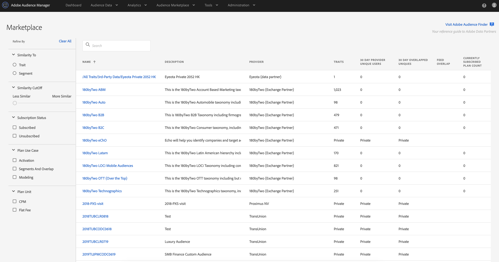

# [!UICONTROL Audience Marketplace] for Data Buyers {#audience-marketplace-for-data-buyers}

Overview and workflow for data buyers who want to purchase third-party data from within [!DNL Audience Manager].

>[!NOTE]
>[Role-based permissions](../../../reporting/reports-dashboard.md) control access to [!UICONTROL Audience Marketplace] features.
>
>* Administrators can create data feeds, manage subscribers, and subscribe to data feeds.
>* Users can search and view feeds only.

## The [!UICONTROL Marketplace]: About {#about-marketplace}

The [!UICONTROL Marketplace] is an [!DNL Audience Manager] feature for data buyers that lists data feeds you can subscribe to. It lists flat rate, [!DNL CPM], and private data feeds. These feeds are provided by third-party vendors that use [!DNL Audience Manager] to sell data.

In the [!UICONTROL Marketplace], reporting tools let you track feed usage and the overlap between your [!UICONTROL traits] and those in a subscribed data feed. Finally, with [!UICONTROL Audience Marketplace], [!DNL Adobe] takes care of invoices and fee payments (though you do have to self-report usage when subscribed to a [!DNL CPM] feed). These features let you find effective data sources without wasting time looking for a data provider.

>[!TIP]
>
>Use the **[Adobe Audience Finder](https://www.adobe-audience-finder.com/)** to find high quality data feeds that you can subscribe to. Then, go back into the [!DNL Audience Manager] user interface or use the [Audience Marketplace Buyer API](https://bank.demdex.com/portal/swagger/index.html#/Audience_Marketplace_Buyer_API) to subscribe to the feeds you found.

The [!UICONTROL Marketplace] list contains information that you can sort and search to find the data feed that&#39;s right for you. Items in the [!UICONTROL Marketplace] buyer&#39;s list include:

* **[!UICONTROL Search]**: Find data feeds by name or text description.
* **[!UICONTROL Similar Traits]**: Shows you the number of similar [!UICONTROL traits] from a data feed. This column is shown after you enter a [!UICONTROL trait] or [!UICONTROL segment] to filter by in the **[!UICONTROL Similarity To]** section.
* **[!UICONTROL Name]**: Name of the data feed.
* **[!UICONTROL Description]**: Information about the contents of a data feed.
* **[!UICONTROL Provider]**: Name des Datenanbieters.
* **[!UICONTROL Traits]**: Die Anzahl der [!UICONTROL traits] in einem Daten-Feed.
* **[!UICONTROL 30 Day Provider Unique Users]**: Die Anzahl der eindeutigen Benutzer, die in den letzten 30 Tagen angezeigt wurden.
* **[!UICONTROL 30 Day Overlapped Uniques]**: Die Anzahl der Benutzerinnen und Benutzer in Ihrem Konto, die sich mit den Benutzerinnen und Benutzern im Konto des Anbieters überschneiden.
* **[!UICONTROL Feed Overlap]**: Der eindeutige Wert mit Überschneidung von 30 Tagen, angezeigt in Prozentsätzen, berechnet als: Dateneinkäufer 30 Tage Überschneidung / Dateneinkäufer 30 Tage (eindeutige) x 100.
* **[!UICONTROL Private Feeds]**: Siehe [Private Daten-Feeds](../../../features/audience-marketplace/marketplace-private-feeds.md).
* **[!UICONTROL Currently Subscribed Plan Count]**: Die Anzahl der Abonnements, die Sie bei einem Datenanbieter haben.

 

Verwenden Sie die folgenden Filter auf der linken Seite der [!UICONTROL Marketplace], um ganz einfach die besten Daten-Feeds für Ihre Anforderungen zu finden:

* **[!UICONTROL Similarity To]**: Filtern Sie Daten-Feeds nach ihrer Ähnlichkeit mit einem [!UICONTROL trait] oder einer [!UICONTROL segment] Ihrer Wahl. Beim Eingeben des zu vergleichenden [!UICONTROL trait] oder Segments können Sie die [!UICONTROL trait]- oder [!UICONTROL segment]-ID oder die entsprechenden Namen verwenden.
* **[!UICONTROL Similarity Cutoff]**: Ziehen Sie den Schieberegler, um die Daten-Feeds danach zu filtern, wie ähnlich ihre [!UICONTROL traits] Ihren ausgewählten [!UICONTROL trait] oder [!UICONTROL segment] sind.
* **[!UICONTROL Subscription Status]**: Filtern Sie die Daten-Feeds nach Ihrem Abonnementstatus.
* **[!UICONTROL Plan Use Case]**: Filtern von Daten-Feeds auf der Grundlage ihrer unterstützten Anwendungsfälle: **[!UICONTROL Activation]**, **[!UICONTROL Segments and Overlap]** und **[!UICONTROL Modelling]**.
* **[!UICONTROL Plan Unit]**: Filtern Sie Daten-Feeds nach ihrem Preistyp.

## Suchen ähnlicher [!UICONTROL Traits] {#finding-similar-traits}

[!UICONTROL Audience Marketplace] bietet Ihnen die Möglichkeit, [!UICONTROL traits] aus verschiedenen Daten-Feeds zu finden, basierend auf ihrer Ähnlichkeit mit Ihren vorhandenen [!UICONTROL traits] oder Segmenten. Gehen Sie wie folgt vor:

1. Navigieren Sie zu **[!UICONTROL Audience Marketplace]** > **[!UICONTROL Marketplace]**.
2. Verwenden Sie den **[!UICONTROL Similarity To]**-Selektor, um zwischen der Filterung nach einem [!UICONTROL trait] oder einer [!UICONTROL segment] zu wählen. Sie können nach [!UICONTROL trait]/[!UICONTROL segment] ID oder Namen filtern. Das Suchfeld zeigt automatisch relevante Vorschläge basierend auf Ihrer Eingabe an.
3. Nachdem Sie das Merkmal oder Segment identifiziert haben, nach dem Sie filtern möchten, klicken Sie in der Liste mit den Vorschlägen darauf.
4. Um die Ergebnisse einzugrenzen, bewegen Sie mit dem Schieberegler **[!UICONTROL Similarity Cutoff]** von weniger ähnlichen [!UICONTROL traits] zu ähnlicheren.

Sobald die Filterung abgeschlossen ist, wird auf der Ergebnisseite eine neue Spalte angezeigt: **[!UICONTROL Similar Traits]**. In dieser Spalte wird die Anzahl der [!UICONTROL traits] angezeigt, die dem von Ihnen gefilterten in jedem Daten-Feed entspricht, der die Filterkriterien erfüllt.

Um die vollständige Liste der ähnlichen Eigenschaften anzuzeigen, klicken Sie auf die Zahl in der Spalte **[!UICONTROL Similar Traits]** .

>[!NOTE]
>
> Audience Marketplace zeigt die 500 wichtigsten ähnlichen [!UICONTROL trait] aus allen Daten-Feeds an.

Sehen Sie sich das folgende Video an, um einen vollständigen Überblick darüber zu erhalten, wie Sie ähnliche [!UICONTROL traits] finden.

>[!VIDEO](https://video.tv.adobe.com/v/29370/)

## private Datenfeeds {#private-data-feeds}

In der [!UICONTROL Marketplace] Liste werden manchmal der Name und die [!UICONTROL trait] des Anbieters als privat markiert. Dies zeigt einen [privaten Daten-Feed](../../../features/audience-marketplace/marketplace-private-feeds.md) an. Mit einem privaten Daten-Feed können Verkäufer den Käuferzugriff auf ihre Daten einschränken. Verkäufer können Feeds privat machen, wenn sie Sonderangebote, Rabatte anbieten oder wenn Datenschutz und Zugriffskontrolle für sie wichtig sind. Als Käufer müssen Sie eine Abonnementanfrage an den Verkäufer senden, wenn Sie Zugriff auf einen privaten Feed wünschen. Weitere [&#x200B; finden Sie unter „Abonnieren &#x200B;](../../../features/audience-marketplace/marketplace-data-buyers/marketplace-manage-subscriptions.md#subscript-private-data-feed) privaten Daten-Feeds“.

>[!MORELIKETHIS]
>
>* [Grundlegendes zur Abo-Detailseite im Audience Marketplace](../../../features/audience-marketplace/marketplace-data-buyers/marketplace-manage-subscriptions.md#marketplace-buyer-details)
>* [Rabatte für Datenkäufer](../../../features/audience-marketplace/marketplace-data-buyers/marketplace-manage-subscriptions.md#buyer-discount)
