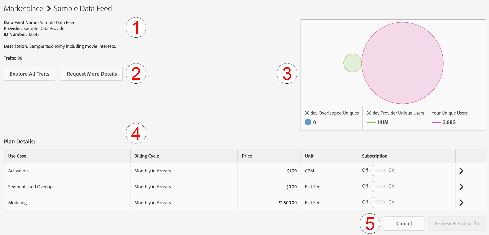

# Verwalten von Daten-Feed-Abonnements {#manage-data-feed-subscriptions}

Im [!UICONTROL Marketplace] werden Datenerwerber recherchieren und öffentliche und private Daten-Feeds abonnieren. Führen Sie die folgenden Schritte aus, um einen öffentlichen Daten-Feed zu abonnieren.

## Abonnieren eines öffentlichen Daten-Feeds {#subscript-public-data-feed}

Im [!UICONTROL Marketplace] werden Datenerwerber recherchieren und öffentliche und private Daten-Feeds abonnieren. Führen Sie die folgenden Schritte aus, um einen öffentlichen Daten-Feed zu abonnieren.

<!-- t_subscribe_feed.xml -->

Abonnieren eines öffentlichen Daten-Feeds:

1. Gehe zu **[!UICONTROL Audience Marketplace > Marketplace]**. Verwenden Sie die Suchfunktion oder durchsuchen Sie die Liste, um einen Daten-Feed zu finden.

   

1. Klicken Sie auf den Namen des Daten-Feeds, den Sie verwenden möchten. Dadurch wird die [Plandetailseite](../../../features/audience-marketplace/marketplace-data-buyers/marketplace-manage-subscriptions.md#marketplace-buyer-details) für den ausgewählten Feed geöffnet.

   

1. Wählen Sie einen Anwendungsfall aus der Tabelle Abonnements aus und:
   * Schieben Sie den **[!UICONTROL Subscription]** auf **[!UICONTROL On]**.
   * Klicken Sie auf **[!UICONTROL Review & Subscribe]**. Dadurch wird das [!UICONTROL Terms and Conditions] Fenster geöffnet.

   

1. Im [!UICONTROL Terms and Conditions]:

   * **Wichtig** Lassen Sie das Kontrollkästchen &quot;**[!UICONTROL ID sync]**&quot; aktiviert. Mit dieser Einstellung können Sie die Übereinstimmungsraten mit Ihrem Datenanbieter verbessern.
   * Markieren Sie das Feld Geschäftsbedingungen und klicken Sie auf **[!UICONTROL Accept]** , um den Abonnementprozess abzuschließen.

   

### Nächste Schritte

Nachdem Sie einen Daten-Feed abonniert haben:

* Überprüfen Sie das Abonnement, indem Sie Ihren [!UICONTROL Traits] Ordner überprüfen. Siehe [Speicher für abonnierte Daten-Feeds](../../../features/audience-marketplace/marketplace-data-buyers/marketplace-manage-subscriptions.md#find-subscribed-data-fee).

* Prüfen Sie die Dokumentation zur Abrechnung und Zahlung. Siehe die entsprechenden Links unten.

### Best Practices {#best-practices}

Im Folgenden finden Sie eine Reihe von Best Practices, die Sie bei der Arbeit mit [!UICONTROL Audience Marketplace] befolgen sollten:

Wenn Sie neue Drittanbieter- und Zweitanbieter-Datensätze über [!UICONTROL Audience Marketplace] untersuchen, empfehlen wir als ersten Schritt, Daten-Feeds für [!UICONTROL Segments & Overlap] zu aktivieren. Auf diese Weise können Benutzer Daten untersuchen, indem sie Segmente erstellen, um die Zielgruppengröße zu bewerten, und Überschneidungsberichte ausführen, um erste Einblicke in die Zielgruppe zu erhalten. Die meisten Datenanbieter bieten diesen Anwendungsfall kostenlos an, sodass Sie diese Analyse ohne zusätzliche Kosten durchführen können.

Befolgen Sie beim Ausführen von Überschneidungsberichten die folgenden Best Practices, um sicherzustellen, dass Sie nützliche Ergebnisse erzielen.

1. Stellen Sie sicher, dass sich überlappende Datensätze hinsichtlich Datentyp und Erfassungsmethoden ähnlich sind, z. B.:
   * Besuchergeographie
   * Cookie- und Mobile-IDs im Vergleich
   * Lookback-Fenster
   * Offline- vs. Online-Aktivität
   * Die Häufigkeit, mit der der Datenanbieter die Daten aktualisiert

1. Überschneidungen können im Laufe der Zeit leicht zunehmen. Stellen Sie daher sicher, dass bis zu 30 Tage vergehen, bevor Sie Überschneidungsberichte ausführen, damit die Daten synchronisiert werden können.
1. Überschneidungen können sich verstärken, wenn Sie Daten von einem Datenanbieter in mehreren Marketing-Kampagnen verwenden.
und Initiativen. Dies bietet Benutzenden aus den beiden Datensätzen mehr Möglichkeiten zur Synchronisierung.
1. Es gibt keine Garantie dafür, dass es zu einer Überschneidung zwischen Ihren Datensätzen kommt. Damit eine Überschneidung gültig ist, muss ein Benutzer aus dem Datensatz des Kunden mit den Daten verknüpft werden
Anbieterdatensatz während des Berichtszeitraums. Wenn die Mediendaten des Kunden den Nutzern im Datensatz des Datenanbieters nicht bereitgestellt wurden, kommt es nie zu einer Überschneidung.
1. Halten Sie niedrige Überschneidungen nicht für etwas Schlechtes. Nutzen Sie eine geringe Überschneidung, um neue Kunden zu gewinnen und anzusprechen.

## Abonnieren eines privaten Daten-Feeds {#subscript-private-data-feed}

Käufer abonnieren in **[!UICONTROL Audience Marketplace > Marketplace]** private Daten-Feeds und Pläne.

<!-- t_private_feed.xml -->

>[!TIP]
>
>Manchmal bieten Datenanbieter Rabatte auf einen privaten Daten-Feed an. Bei der Übermittlung Ihrer Abonnementanfrage sollten Sie sich nach einem möglichen Rabatt erkundigen.

Abonnieren eines privaten Daten-Feeds:

1. Klicken Sie auf den Namen des Daten-Feeds im [!UICONTROL Marketplace].
1. Klicken Sie auf **[!UICONTROL Request Access]**. Dadurch wird das Dialogfeld Anfrage geöffnet.
1. Schreiben Sie im Dialogfeld Anfrage dem Anbieter einen Hinweis, in dem Sie Ihr Interesse an seinem Daten-Feed bekunden, und klicken Sie auf **[!UICONTROL Send]**. Der Verkäufer wird Ihre Nachricht überprüfen und Ihre Anfrage genehmigen oder ablehnen. Während der Wartezeit auf die Genehmigung wird „Angefordert“ in der [!UICONTROL Marketplace] für diesen Daten-Feed angezeigt.

   * **[!UICONTROL Request approved]**: Der Status in der [!UICONTROL Marketplace] ändert sich in „Zugriff erteilt“ und Sie erhalten eine automatisierte Benachrichtigung. An dieser Stelle können Sie den Feed abonnieren. Anweisungen [ Sie unter „Abonnieren eines öffentlichen Daten](../../../features/audience-marketplace/marketplace-data-buyers/marketplace-manage-subscriptions.md#subscript-public-data-feed)Feeds“.
   * **[!UICONTROL Request denied]**: Der „angeforderte“ Text wird aus der [!UICONTROL Marketplace] für den Feed entfernt. Sie können erneut versuchen, einen Feed zu abonnieren oder einen anderen Feed auswählen.

## Rabatte für Käufer von Daten-Feeds {#buyer-discount}

[!UICONTROL Audience Marketplace] können Anbieter Käufern einen Rabatt auf den veröffentlichten Preis eines [!DNL CPM]- oder Flatrate-Daten-Feeds anbieten. Rabattbeträge sind jedoch für Käufer in der [!DNL Marketplace]-Feed-Liste nicht sichtbar. Sie können jedoch auch einen Rabatt verlangen, wenn Sie einen privaten Daten-Feed abonnieren oder weitere Informationen zu einem bestimmten Feed anfordern.

## Rabatt anfordern {#request-discount}

<!-- marketplace-buyer-discounts.xml -->

<table id="table_3C6E58F593BA48EC89ACBD9A26E4E74F"> 
 <thead> 
  <tr> 
   <th colname="col1" class="entry"> Status des Käufers </th> 
   <th colname="col2" class="entry"> Beschreibung </th> 
  </tr> 
 </thead>
 <tbody> 
  <tr> 
   <td colname="col1"> 
 <b>Aktuelle Abonnenten</b> 
 </td> 
   <td colname="col2"> 
Wenn Sie bereits einen privaten Daten-Feed abonniert haben und einen Rabatt anfordern möchten: 
 
    <ol id="ol_A58D419EBB9349E9B1225202535130F6"> 
     <li id="li_D0DDC8AC6E9C4675AA4630D63FE8F071"> <a href="../../../features/audience-marketplace/marketplace-data-buyers/marketplace-manage-subscriptions.md#unsubscribe"> Abmelden</a> vom Daten-Feed. </li> 
     <li id="li_05A5379F2A944FB28AB39C196DDE3A1D">Wenden Sie sich an den Datenanbieter und fordern Sie einen ermäßigten Preis an. </li> 
     <li id="li_B1B5AA6F6CC64512A02D5E8861A5F266">Wenn der Anbieter Ihnen einen Rabatt gewährt, abonnieren Sie den Feed am 1.  des nächsten Monats erneut. </li> 
    </ol> </td> 
  </tr> 
  <tr> 
   <td colname="col1"> 
 <b>Neue private Daten-Feed-Abonnenten</b> 
 </td> 
   <td colname="col2"> 
Fordern Sie in Ihrer Abonnementanfrage einen Rabatt an. Siehe <a href="../../../features/audience-marketplace/marketplace-data-buyers/marketplace-manage-subscriptions.md#subscript-private-data-feed"> Abonnieren eines privaten Daten-Feeds</a>. 
 </td>
  </tr> 
  <tr> 
   <td colname="col1"> 
 <b>Potenzielle Abonnenten</b> 
 </td> 
   <td colname="col2"> 
Ein <a href="../../../features/audience-marketplace/marketplace-private-feeds.md"> potenzieller Abonnent</a> ist ein Datenkäufer, der Zugriff auf einen privaten Daten-Feed beantragt, vom Verkäufer eine Genehmigung erhalten, den Feed jedoch nicht abonniert hat. So fordern Sie einen Rabatt als potenzieller Abonnent an: 
 
    <ol id="ol_9CECDA92E7894B20AC8A777D78962188"> 
     <li id="li_618B64160CF24549AFCA73E006DCA35A">Navigieren Sie <b> Audience Marketplace &gt; Marketplace</b>. </li> 
     <li id="li_FE52A06B30FC4858B48AF81954365FE9">Klicken Sie auf den Namen des Feeds, für den Sie genehmigt wurden. </li> 
     <li id="li_763C050AC9464BE380D00F6085B6E540">Klicken Sie auf <b> Anfrage für weitere Details</b>. Fordern Sie in Ihrer Detailanfrage an den Verkäufer einen Rabatt an. </li> 
    </ol> </td> 
  </tr> 
 </tbody> 
</table>

## Ermäßigte Feeds überprüfen {#review-discounted-feeds}

So überprüfen Sie Ihre ermäßigten Feeds:

1. Gehe zu **[!UICONTROL Audience Marketplace > Marketplace]**.
1. Klicken Sie auf den Namen eines Feeds, den Sie bereits abonniert haben.
1. Sehen Sie sich die [!UICONTROL Price] und [!UICONTROL Your Price] Spalten in der [!UICONTROL Plan Details] an. Wenn der Feed diskontiert wird:

   * Der ursprüngliche Preis ist mit einer roten Linie gekennzeichnet.
   * Die Gebühr in der Spalte [!UICONTROL Your Price] ist niedriger als die Gebühr in der Spalte [!UICONTROL Price].

In diesem Beispiel erhält der Käufer einen Rabatt von 10 % auf den [!UICONTROL Segments and Overlap] im **[!UICONTROL Software Audience Feed]**.

## Abonnierte Feed-Daten suchen {#find-subscribed-data-fee}

Die Daten (Eigenschaften) für Ihre Daten-Feeds werden in ihren eigenen Eigenschaftenspeicherordnern angezeigt. Navigieren Sie zu **[!UICONTROL Audience Data > Traits]** und erweitern Sie den Ordner **[!UICONTROL 3rd-Party Data]** , um die Eigenschaften in Ihren abonnierten Feeds anzuzeigen und mit ihnen zu arbeiten. Suchen Sie nach dem Unterordner mit dem Namen Ihres Datenanbieters. Diese enthalten Ordner, die nach den einzelnen Daten-Feeds benannt sind, und listen die vom Feed bereitgestellten Eigenschaften auf.

<!-- marketplace-feed-storage.xml -->

## Abo von einem Daten-Feed beenden {#unsubscribe}

Datenkäufer melden sich in **[!UICONTROL Audience Marketplace > Marketplace]** von Daten-Feeds und -Plänen ab.

<!-- t_unsubscribe_feed.xml -->

So heben Sie das Abonnement eines Daten-Feeds auf:

1. Klicken Sie auf den Namen des Daten-Feeds im [!UICONTROL Marketplace].
1. Suchen Sie im Abschnitt [!UICONTROL Use Case] den Plan, den Sie verwenden möchten, und verschieben Sie den Schieberegler **[!UICONTROL Subscription]** nach **[!UICONTROL Off]**.

## Deaktivierung von Daten-Feeds: Warum das passiert und wie man darauf reagiert {#data-feed-deactivation-reasons}

[!UICONTROL Audience Marketplace] können Datenanbieter den Zugriff auf Ihre abonnierten Daten-Feeds sperren. Sei nicht beunruhigt, wenn dir das passiert. Wir haben Sie im Griff. In diesem Abschnitt finden Sie Prozesse und Verfahren im Zusammenhang mit der Deaktivierung von Daten-Feeds.

## Häufige Gründe für die Deaktivierung von Daten-Feeds {#reasons-for-deactivation}

<!-- marketplace-subscriber-deactivated.xml -->

Es kann verwirrend oder sogar ärgerlich sein, wenn ein Feed, den Sie abonnieren, abgeschaltet ist. Datenanbieter können jedoch einen Daten-Feed aus verschiedenen Gründen deaktivieren. Einige häufige Gründe sind:

* **Abrechnung:** Datenanbieter deaktivieren einen Feed, wenn Sie regelmäßig zu spät Gebühren zahlen oder Ihre Gebühren nicht bezahlen.
* **Feed-Aktualisierungen:** Datenanbieter müssen Feeds deaktivieren, wenn sie ihre Feed-Taxonomie oder Kostenstrukturen aktualisieren.
* **Inaktive Käufer:** Datenanbieter behalten sich das Recht vor, Feeds zu deaktivieren, wenn Abonnenten über einen längeren Zeitraum keine Ausgaben zeigen.
* **Inaktive Verkäufer:** Datenanbieter, die [!UICONTROL Audience Marketplace] verlassen, deaktivieren und löschen alle ihre Daten-Feeds.

>[!TIP]
>
>Wenden Sie sich direkt an Ihren Datenanbieter, wenn Sie der Meinung sind, dass versehentlich ein Daten-Feed deaktiviert wurde. Ihr [!DNL Adobe] Berater kann Ihnen mit Kontaktinformationen oder zusätzlichem Support helfen.

## E-Mail deaktivieren {#deactivation-email}

Wenn ein Datenanbieter einen Ihrer Daten-Feeds deaktiviert, sendet [!DNL Audience Manager] eine E-Mail an die Benutzer in Ihrem Unternehmen, die über [!UICONTROL Administrator] verfügen. Manchmal klassifizieren E-Mail-Filter diese Nachricht als Spam. Daher könnte Ihnen diese wichtige Benachrichtigung entgehen. Diese E-Mail enthält die folgenden Elemente, um die Deaktivierungsnachricht zu identifizieren:

* **Von:** Die Deaktivierungs-E-Mail stammt aus `aam-noreply@adobe.com`. Pro-Tipp: Antworten Sie nicht auf diese E-Mail.

* **Betreffzeile:** Abonnement für *Name des Daten-Feeds hier* wurde gekündigt.

* **Anlagen:** E-Mail enthält einen Anhang mit dem Titel &quot;`list-of-affected-entities-by-feed-revocation.csv`.“ Das ist eine verschachtelte Art und Weise, zu sagen, dass der Anhang alle Eigenschaften auflistet, die im abgebrochenen Feed enthalten sind. Als Datenkäufer sollten Sie diesen Anhang überprüfen. Dies hilft Ihnen, deaktivierte Eigenschaften in Ihren Segmenten und (algorithmischen [) zu ](../../../features/algorithmic-models/understanding-models.md) und zu entfernen.

## Liste deaktivierter Eigenschaften {#deactivation-trait-list}

Die Liste, die eine Deaktivierungs-E-Mail begleitet, enthält die Felder wie unten dargestellt.

<table id="table_5C3800F9D8AA43EFAB4690959A721F63"> 
 <thead> 
  <tr> 
   <th colname="col1" class="entry"> Feld </th> 
   <th colname="col2" class="entry"> Beschreibung </th> 
  </tr> 
 </thead>
 <tbody> 
  <tr> 
   <td colname="col1"> 
<b> Daten-Feed-ID</b> 
 </td> 
   <td colname="col2"> 
ID des deaktivierten Daten-Feeds. 
 </td> 
  </tr> 
  <tr> 
   <td colname="col1"> 
<b> Name des Daten-Feeds</b> 
 </td> 
   <td colname="col2"> 
Name des deaktivierten Daten-Feeds. 
 </td> 
  </tr> 
  <tr> 
   <td colname="col1"> 
<b>-Eigenschaften-SID</b> 
 </td> 
   <td colname="col2"> 
IDs der deaktivierten Eigenschaft. 
 </td> 
  </tr> 
  <tr> 
   <td colname="col1"> 
<b> Eigenschaftsname</b> 
 </td> 
   <td colname="col2"> 
Eigenschaftsnamen deaktiviert. 
 </td> 
  </tr> 
  <tr> 
   <td colname="col1"> 
<b> Segment-SID</b> 
 </td> 
   <td colname="col2"> 
ID des Segments, das deaktivierte Eigenschaften enthält. 
 </td> 
  </tr> 
  <tr> 
   <td colname="col1"> 
<b> Segmentname</b> 
 </td> 
   <td colname="col2"> 
Name des Segments, das deaktivierte Eigenschaften enthält. 
 </td> 
  </tr> 
  <tr> 
   <td colname="col1"> 
<b> Algo-Modell-ID</b> 
 </td> 
   <td colname="col2"> 
Die ID des algorithmischen Modells, das deaktivierte Eigenschaften enthält. 
 </td> 
  </tr> 
  <tr> 
   <td colname="col1"> 
<b> Algo-Modellname</b> 
 </td> 
   <td colname="col2"> 
Die Namen algorithmischer Modelle, die deaktivierte Eigenschaften enthalten. 
 </td> 
  </tr> 
 </tbody> 
</table>

## Deaktivierte Eigenschaften entfernen {#remove-deactivated-traits}

Als Datenkäufer sind Sie dafür verantwortlich, die Eigenschaften in einem abgebrochenen Feed aus allen aktiven/verwendeten oder inaktiven Segmenten zu entfernen. Zu den Entfernungsoptionen gehören:

* Massenentfernung mit den [REST-APIs](../../../api/rest-api-main/rest-api-main.md) oder den [Tools für die Massenverwaltung](../../../reference/bulk-management-tools/bulk-management-intro.md).

* Suchen Sie manuell nach betroffenen Segmenten und entfernen Sie deaktivierte Eigenschaften mithilfe von [!UICONTROL Segment Builder]. Siehe [Entfernen von Eigenschaften aus einem ](../../../features/segments/segment-builder.md#segment-builder-controls-traits).

>[!NOTE]
>
>Das Entfernen von Eigenschaften aus aktiven algorithmischen Modellen oder Zielen wirkt sich auf die Skalierungs- und Zielgenauigkeit aus. Versuchen Sie, gesperrte Eigenschaften nach Möglichkeit durch neue, aktive Eigenschaften zu ersetzen.

[Melden Sie sich vom deaktivierten Daten-Feed ](../../../features/audience-marketplace/marketplace-data-buyers/marketplace-manage-subscriptions.md#unsubscribe), nachdem Sie alle widerrufenen Eigenschaften aus Ihrem Konto entfernt haben. Wenn es sich um eine vorübergehende Deaktivierung handelt, können Sie sich erneut anmelden, nachdem der Datenanbieter die erforderlichen Änderungen vorgenommen und den Feed reaktiviert hat. Wie bei den meisten Dingen kann eine gute Kommunikation mit Ihren Partnern (dem Datenanbieter und [!DNL Adobe]) Ihnen dabei helfen, diesen Prozess zu bewältigen.

## Grundlegendes zur Seite mit Plandetails in Audience Marketplace {#marketplace-buyer-details}

Wenn Sie im [!UICONTROL Marketplace] auf den Namen eines Datenplans klicken, liefert [!DNL Audience Manager] Informationen, die Ihnen bei fundierten Entscheidungen zum Abonnieren eines Daten-Feeds helfen können.

<!-- marketplace-buyer-details.xml -->

Auf dieser Seite finden Sie die folgenden Informationen:

1. **Grundlegende Plandaten**. Dazu gehören Feed-Informationen wie:
   * Name des Daten-Feeds. Wie oben gezeigt, lautet der Name dieses Feeds beispielsweise „Beispieldaten-Feed“.
   * Name des Datenanbieters;
   * Daten-Feed-ID;
   * Beschreibung;
   * Anzahl der Merkmale im Futter;

1. Schaltflächen für Planinformationen.
   * Klicken Sie auf **[!UICONTROL Explore All Traits]** , um Details zu allen Eigenschaften im ausgewählten Daten-Feed anzuzeigen.
   * Klicken Sie auf **[!UICONTROL Request More Details]** , um dem Datenanbieter Fragen zum ausgewählten Daten-Feed zu stellen oder einen Rabatt anzufordern. Diese Funktion sendet Ihre Kommentare und Fragen direkt an den Datenanbieter.

1. Daten-Feed-Berichtsmetriken. Das Venn-Diagramm (und zugehörige Metriken) zeigt Daten zu Eigenschaftsüberschneidungen der letzten 30 Tage an. Weitere [ finden Sie unter „Der ](marketplace-data-buyers.md#about-marketplace): Über“.
   * **[!UICONTROL 30 Day Overlapped Uniques]**: Die Anzahl der eindeutigen Benutzer in Ihrem Konto, die sich mit den Benutzern im Konto des Anbieters überschneiden. Eine Definition von eindeutigen Benutzern finden Sie unter AAM UUID im [ID-Index in Audience Manager](/help/using/reference/ids-in-aam.md).
   * **[!UICONTROL 30 Day Provider Unique Users]**: Die Anzahl der eindeutigen Benutzer, die vom Konto des Anbieters stammen.
   * **[!UICONTROL Your Unique Users]**: Die Anzahl der eindeutigen Benutzer aus Ihrem Konto.

1. Tabelle **[!UICONTROL Plan Details]**. In dieser Tabelle finden Sie die Anwendungsfälle, für die Sie den Daten-Feed abonnieren können, sowie das Preismodell. Siehe [Grundlagen zu Anwendungsfällen für Daten-Feeds](#use-cases).

1. Planen von Aktionsschaltflächen.
   * Klicken Sie auf **[!UICONTROL Cancel]** , um die Seite zu verlassen, ohne Änderungen vorzunehmen.
   * Klicken Sie auf **[!UICONTROL Review & Subscribe]** , um einen Daten-Feed zu abonnieren. Diese Schaltfläche ist ausgegraut, bis Sie einen [!UICONTROL Subscription] Umschalter auf [!UICONTROL On] umschalten. Siehe auch [Abonnieren eines öffentlichen Daten](#subscript-public-data-feed) und [Abonnieren eines privaten Daten-Feeds](#subscript-private-data-feed).

## Anwendungsfälle für Daten-Feeds {#use-cases}

Als [!UICONTROL Audience Marketplace]-Käufer können Sie Daten für Anwendungsfälle mit Überschneidungen, Modellierungen und Aktivierungen erwerben. Jeder Anwendungsfall wurde für einen bestimmten Zweck entwickelt und beschränkt, was Sie mit den Daten tun können. Diese Beschreibungen von Anwendungsfällen können Ihnen dabei helfen, die richtige Entscheidung über die Art des Datenplans zu treffen.

## Vergleichen von Segmenten und Überschneidungsplänen {#comparisons}

<!-- c_use_cases_for_buyers.xml -->

### Segmente und Überschneidungen

In diesem Anwendungsbeispiel können Sie in einem Bericht zur Überschneidung von Eigenschaft [ Eigenschaft mit Anbietereigenschaften vergleichen.](../../../reporting/dynamic-reports/trait-trait-overlap-report.md#trait-to-trait-overlap-report) können Sie Provider-Eigenschaften für ein Segment erstellen oder hinzufügen und zusätzliche Vergleiche mit den Berichten [Segment-zu-Eigenschaft](../../../reporting/dynamic-reports/segment-trait-overlap-report.md) und [Segment-zu-Segment](../../../reporting/dynamic-reports/segment-segment-overlap-report.md) vornehmen. Überschneidungsvergleiche können Ihnen dabei helfen:

* **Reichweite der Zielgruppe erweitern:** geringe Überschneidung deutet darauf hin, dass Ihre Eigenschaften Benutzer enthalten, die Sie noch nie zuvor gesehen haben. Möglicherweise möchten Sie, dass diese Eigenschaften versuchen, neue Benutzende zu erreichen.
* **Vorhandene Zielgruppen verbessern:** hohe Überschneidung deutet darauf hin, dass Ihre Eigenschaften denen des Datenanbieters ähnlich sind. Diese Eigenschaften sollen dazu beitragen, eine bereits entwickelte Zielgruppe zielgerichtet und inkrementell zu verbessern.

### Algorithmische Modelle

In diesem Anwendungsbeispiel können Sie die Eigenschaften von Lieferanten mit Ihren Eigenschaften [algorithmische Modellierung) ](../../../features/algorithmic-models/understanding-models.md#understanding-models). Beispielsweise verwendet unser algorithmisches Modellierungssystem eine Ihrer Eigenschaften als Grundlage für den Vergleich mit einer Lieferanteneigenschaft. Wenn das Modell ausgeführt wird, kann es zeigen, ob Zielgruppen in Anbieter-Eigenschaften ähnliche Konversionsattribute wie Ihre Eigenschaften haben.

### Aktivierung

In diesem Anwendungsfall können Sie Daten an ein [Ziel“ ](../../../features/destinations/destinations.md). [!DNL Audience Manager] ist ein Ziel jedes Drittanbietersystem (Werbeserver, [!DNL DSP], [!DNL DMP], Exchange usw.), für das Sie Daten freigeben möchten. Bei einem [!UICONTROL Activation] Anwendungsfall können Sie jedoch keine Überschneidungsberichte ausführen oder die Daten in einem algorithmischen Modell testen.

>[!MORELIKETHIS]
>
>* [Abrechnung und Impression-Zuordnung für CPM-Daten-Feeds](../../../features/audience-marketplace/marketplace-data-buyers/marketplace-buyer-billing.md#cost-attribution)
>* [Abrechnungs- und Impressionszuweisung für Flatfee-Daten-Feeds](../../../features/audience-marketplace/marketplace-data-buyers/marketplace-buyer-billing.md)
>* [So melden Sie die Nutzung von CPM](../../../features/audience-marketplace/marketplace-data-buyers/marketplace-buyer-billing.md#report-cpm-usage)
>* [Abonnieren eines öffentlichen Daten-Feeds](../../../features/audience-marketplace/marketplace-data-buyers/marketplace-manage-subscriptions.md#subscript-public-data-feed)
>* [Rabatte für Datenkäufer](../../../features/audience-marketplace/marketplace-data-buyers/marketplace-manage-subscriptions.md#buyer-discount)
>* [Der Marktplatz: Über](../../../features/audience-marketplace/marketplace-data-buyers/marketplace-data-buyers.md#about-marketplace)
