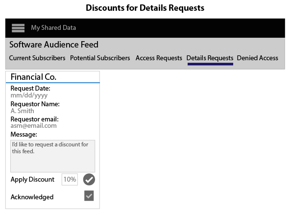

# Erstellen, Bewerten und Verwalten von Daten-Feeds {#create-price-and-manage-data-feeds}

## Erstellen eines öffentlichen oder privaten Datenfeeds {#create-public-private-data-feed}

Ein Datenfeed erfordert einen Namen, eine Beschreibung, eine Datenquelle und einen Planungstyp. Feeds sind deaktiviert, bis Sie den Feed speichern und aktivieren. Richten Sie öffentliche oder private Datenfeeds in **[!UICONTROL Audience Marketplace > My Shared Data]** ein. Nur für Datenverkäufer verfügbar.

<!-- t_data_feed.xml -->

Sie müssen über Administratorrechte verfügen, um einen öffentlichen oder privaten Datenfeed zu erstellen.
So erstellen Sie einen Datenfeed:

1. Klicken **[!UICONTROL New Data Feed]**.
1. Benennen Sie den Datenfeed. Datenkäufer können anhand des Namens nach Ihrem Feed suchen.
1. Geben Sie eine kurze Beschreibung ein (maximal 255 Zeichen).

   Eine gute Beschreibung sollte Ihren Feed genau beschreiben. Sie können beispielsweise Text für Marketing-Kategorien, demografische Daten und geografische Angaben (z. B. [!DNL US] oder Nordamerika) einschließen. Der Beschreibungstext ist durchsuchbar und hilft Käufern, Ihren Feed zu finden oder zu bewerten. Eine gute Beschreibung ist ein wichtiger Teil, um Abonnenten zu Ihrem Datenfeed zu gewinnen.
1. Wählen Sie in den Optionen **[!UICONTROL Data Source]** eine Datenquelle aus. Datenfeeds sind auf eine einzige Datenquelle beschränkt. Sie können demselben Datenfeed nicht mehrere Datenquellen zuweisen.

   >[!IMPORTANT]
   >
   >Alle aktuellen und zukünftigen Eigenschaften, die zu dieser Datenquelle gehören, werden als Teil dieses Feeds an Ihre Datenkäufer weitergegeben.

1. Wählen Sie unter [!UICONTROL Plan Types] die gewünschten Optionen aus und klicken Sie auf **[!UICONTROL Add Plan]**.

   Feeds können mehrere Pläne enthalten. Pläne können mehrere Anwendungsfälle enthalten. Weitere Informationen finden Sie unter [Planungstypen für Data Feeds](../../../features/audience-marketplace/marketplace-data-providers/marketplace-create-manage-feeds.md#plan-types).

1. Klicken Sie auf **[!UICONTROL Save]**, um den Datenfeed *zu speichern, ohne ihn zu aktivieren.*
1. So speichern und aktivieren Sie einen Datenfeed:
   1. Verschieben Sie den Schieberegler **[!UICONTROL Availability]** nach **[!UICONTROL Active]**.
   1. Klicken **[!UICONTROL Save]**.

   >[!NOTE]
   >
   >* Gespeicherte und aktivierte Datenfeeds können nicht gelöscht werden.
   >* Käufer sehen nur aktive Feeds.

### Optional: Erstellen eines privaten Datenfeeds

Verschieben Sie im Abschnitt [!UICONTROL Settings] den Schieberegler zu:

* **[!UICONTROL Private]** und  **[!UICONTROL Branded]**: Die  [!UICONTROL Marketplace] Liste des Käufers zeigt den Namen des Verkäufers in der Spalte &quot;Anbieter&quot;an und alle anderen Daten werden ausgeblendet.

* **[!UICONTROL Private]** und  **[!UICONTROL Unbranded]**: Die  [!UICONTROL Marketplace] Liste des Käufers enthält nur den Datenfeed-Namen und die Beschreibung. Der Name des Datenanbieters wird als [!UICONTROL Private Seller] angezeigt.

Informationen zum Aussehen eines privaten Feeds für Käufer finden Sie im Abschnitt &quot;Käufer&quot;unter [Private Data Feeds](../../../features/audience-marketplace/marketplace-private-feeds.md).

## Deaktivieren des Daten-Feeds eines Abonnenten {#deactivate-data-feed}

Als [!UICONTROL Audience Marketplace]-Datenanbieter können Sie den Käuferzugriff auf einen abonnierten Datenfeed sperren. Sie können einen Käufer aus einem Feed entfernen, z. B. aus Gründen wie Zahlungsverzug/Nichtbezahlung von Gebühren oder wenn er die Eigenschaftsdaten falsch verwendet.

<!-- marketplace-deactiva4te-subscribers.xml -->

So widerrufen Sie einen Abonnenten:

1. Suchen Sie in [!UICONTROL My Shared Data] den Feed, den der Abonnent verwendet.

   >[!NOTE]
   >
   >Datenfeeds mit überfälligen Konten werden mit einem Dreieck-/Ausrufezeichensymbol gekennzeichnet.

1. Klicken Sie in der Spalte [!UICONTROL Subscribers] auf die blaue Zahl, die Abonnenten für diesen Feed zählt. Dadurch wird die Seite mit den Details zum Abonnement geöffnet.
1. Verschieben Sie den Schieberegler **[!UICONTROL Subscription]** nach **[!UICONTROL Off]**. Dadurch wird ein Bestätigungsdialogfeld geöffnet.
1. Klicken Sie im Pop [!UICONTROL Confirmation] auf **[!UICONTROL Yes]**, um ein Abonnement zu deaktivieren, oder **[!UICONTROL Cancel]**, um es zu beenden, ohne Abonnement-Änderungen vorzunehmen.

### Was passiert, nachdem Sie einen Abonnenten deaktiviert haben

Beim Widerrufen des Zugriffs auf einen Datenfeed wird eine Benachrichtigungs-E-Mail an alle Administratorbenutzer im Konto des Datenkäufers gesendet. Die E-Mail enthält einen Anhang, in dem Listen Eigenschaften widerrufen haben. Diese Liste hilft Abonnenten, deaktivierte Eigenschaften aus ihren Segmenten und Modellen zu finden und zu entfernen.

### Deaktivierung der Rechnungsstellung und des Feeds

Nachdem Sie den Zugriff auf einen Datenfeed entfernt haben, sind die Abonnenten für Gebühren für den vorherigen oder aktuellen Monat verantwortlich, je nachdem, wann Sie den Feed deaktiviert haben.

## Planungstypen für Datenfeeds {#plan-types}

[!DNL Plan types] sind wesentliche Komponenten in einem  [!UICONTROL Audience Marketplace] Datenfeed. Als Datenanbieter können Sie damit mehrere Nutzungsszenarien und Preisoptionen für Ihre Feeds erstellen. Darüber hinaus kann es eine gute Strategie sein, für jeden Datenfeed einige Pläne zu erstellen. Auf diese Weise können Käufer verschiedene Optionen auswählen, von denen sie nach Daten suchen, die sie an ein Modell senden oder an ein Ziel senden möchten.

[Erstellen Sie einen ](../../../features/audience-marketplace/marketplace-data-providers/marketplace-create-manage-feeds.md#create-public-private-data-feed) Datenfeed zur Auswahl  [!UICONTROL Plan Types].

## Planungstypen und Verwendungsfalloptionen {#plan-types-use-cases}

<!-- c_feed_options.xml -->

Mit den [!UICONTROL Use Case]-Einstellungen können Verkäufer steuern, wie Käufer Ihre Daten verwenden können.

### Segmente und Überschneidungen

Ein **[!UICONTROL Segments and Overlap]**-Anwendungsfall erstellt einen Plan, mit dem Käufer Eigenschaftendaten in einem [Bericht mit Eigenschaften-zu-Eigenschaften-Überschneidung](../../../reporting/dynamic-reports/trait-trait-overlap-report.md#trait-to-trait-overlap-report) vergleichen können. Darüber hinaus können Käufer Ihre Daten zu Segmenten hinzufügen und Vergleiche mit den Berichten [segment-to-property](../../../reporting/dynamic-reports/segment-trait-overlap-report.md) und [segment-to-segment](../../../reporting/dynamic-reports/segment-segment-overlap-report.md) vornehmen.

Jeder Datenfeed muss mindestens einen [!UICONTROL Segments and Overlap]-Verwendungsfall enthalten. Käufer können keine anderen Pläne in einem Data Feed abonnieren, wenn der Feed keinen [!UICONTROL Segments and Overlap]-Verwendungsfall enthält, weder von sich aus noch in Kombination mit einem anderen Anwendungsfall.

Überschneidungen können Käufern helfen:

* **Reichweite der Audience erweitern:** Geringe Überschneidungen deuten darauf hin, dass Ihre Eigenschaften Benutzer enthalten, die der Käufer noch nicht gesehen hat. Infolgedessen möchten Käufer möglicherweise, dass diese Eigenschaften ihren Audiencen neue Benutzer hinzufügen.
* **Bestehende Audiencen verbessern:** Hohe Überschneidungen deuten darauf hin, dass Ihre Eigenschaften Benutzer enthalten, die denen ähneln, über die ein Käufer bereits Bescheid weiß. Infolgedessen möchten die Käufer möglicherweise, dass diese Eigenschaften dazu beitragen, gezielte, inkrementelle Verbesserungen an entwickelten Audiencen vorzunehmen.

Geben Sie diesen Verwendungsfall wie folgt an:

* Maßeinheit: Pauschalgebühr
* Preis: Kostenlos ($0.00)

### Modellierung

Ein **[!UICONTROL Modeling]**-Anwendungsfall erstellt einen Plan, mit dem Käufer Ihre Eigenschaften mit [algorithmischer Modellierung](../../../features/algorithmic-models/understanding-models.md#understanding-models) vergleichen können. Die Käufer sehen sich die Modellergebnisse an, um neue Audiencen in Ihren Daten zu finden, die ähnliche Konversionsattribute wie ihre eigenen verwenden. Geben Sie diesen Verwendungsfall wie folgt an:

* Maßeinheit: Pauschalgebühr
* Preis: Preisnachlass oder Marktpreis

### Activation

Mit einem **[!UICONTROL Activation]**-Anwendungsfall können Käufer Daten an ein [Ziel](../../../features/destinations/destinations.md) senden. Bei diesem Anwendungsfall können Käufer keine Daten mit einem Überschneidungsbericht oder einem algorithmischen Modell vergleichen. Geben Sie diesen Verwendungsfall wie folgt an:

* Maßeinheit: [!DNL CPM]
* Preis: [!DNL CPM] Marktkurs

## Rechnungsstellungs- und Preisoptionen {#billing}

Die Abrechnungs- und Preisoptionen bestimmen, wie die Käufer Ihre Daten bezahlen.

<table id="table_CCEAAF24295942EA82F20753827D1A23"> 
 <thead> 
  <tr> 
   <th colname="col1" class="entry"> Option </th> 
   <th colname="col2" class="entry"> Beschreibung </th>
  </tr> 
 </thead>
 <tbody> 
  <tr> 
   <td colname="col1"> <b> Abrechnungszyklus</b> </td> 
   <td colname="col2"> <b> Monatlich in </b> Arrest die einzige Option. Der Abrechnungszyklus endet am 10. Tag jedes Monats. </td> 
  </tr> 
  <tr> 
   <td colname="col1"> <b> Maßeinheit</b> </td> 
   <td colname="col2">Gebühren für den Datenkäufer auf CPM- oder Pauschalpreis. 
    <ul id="ul_D5F125E0F7364C568D9F3107E090059D"> 
     <li id="li_A79F47FFC1DC4B9DADC014621A9C12A1"> Bei CPM-Preisen müssen Datenkäufer die Nutzung selbst melden. </li> 
     <li id="li_DFED3194854A492F9DD0E7BA1A655E96">Bei einem pauschalen Gebührenpreis melden Datenkäufer die Nutzung nicht, weil sie einen festen Tarif berechnen. </li> 
    </ul> </td>
  </tr> 
  <tr> 
   <td colname="col1"> <b> Preis</b> </td>
   <td colname="col2"> Der Betrag, den ein Verkäufer dem Käufer als CPM- oder Pauschalpreis in Dollar berechnet. </td>
  </tr> 
 </tbody> 
</table>

## Planungshinweise {#plan-notes}

Nehmen Sie sich im Feld **[!UICONTROL Additional Notes]** einige Zeit in Anspruch, um jeden Datenplan in einem Feed zu beschreiben. Eine gute, kurze Beschreibung hilft Käufern, den Inhalt oder Zweck jedes Plans in einem Datenfeed zu verstehen. Käufer können Datenfeed und Planungsbeschreibungen lesen, während sie nach neuen Datenquellen suchen oder diese bewerten.

## Verwalten von privaten Datenfeed-Anfragen {#manage-private-requests}

Anbieter Workflows für die Verwaltung von privaten Feed-Anfragen von Käufern.

Gehen Sie zu [!UICONTROL My Shared Data], um Käuferanforderungen zu überprüfen, zu genehmigen oder abzulehnen und:

<!-- t_private_feed_workflows.xml -->

1. Klicken Sie auf den Namen des privaten Datenfeeds.
2. Klicken Sie auf **[!UICONTROL Access Requests]**, um alle Käufer zu überprüfen, die Zugriff auf Ihren Datenfeed haben möchten.
3. Klicken Sie im Abschnitt [!UICONTROL Allow Access] jedes Anforderungsfelds auf das Häkchen, um eine Anforderung zu genehmigen, oder auf das X, um den Zugriff zu verweigern.
4. Bestätigen oder brechen Sie die ausgewählte Aktion im Bestätigungs-Popup ab.

## Rabatte für Datenanbieter {#discounts}

Unter [!UICONTROL Audience Marketplace] können Sie mit Rabatten den veröffentlichten Preis eines Datenfeeds für einzelne Abonnenten reduzieren. Sie können Rabatte für Abonnenten, die eine Anfrage zum Abonnement eingereicht haben, oder für Abonnenten, die Informationen zu einem Datenfeed angefordert haben, gewähren. Rabatte gelten für [!DNL CPM]- und pauschale Feeds. Rabatte können hilfreich sein, wenn Sie Abonnement-Anreize für Neukunden schaffen oder Kundenloyalität belohnen möchten.

## Rabatte auf einen Datenfeed {#apply-discounts} anwenden

<!-- marketplace-seller-discounts.xml -->

Um einen Feed zu diskontieren, fügen Sie dem Feld für den Rabatt einen Rabatt in Prozent hinzu und bestätigen Sie Ihre Änderungen. Datenanbieter können Datenfeeds in [!UICONTROL Audience Marketplace] von einem der folgenden Vorteile abziehen:

* **[!UICONTROL My Shared Data > Potential Subscribers]**
* **[!UICONTROL My Shared Data > Details Requests]**

In diesen Beispielen hat der Verkäufer dem Datenfeed [!UICONTROL Software Audience] einen Rabatt von 10 % hinzugefügt.

## Überprüfen Sie die diskontierten Feeds {#review-discounted-feeds}

Datenanbieter können alle ihre Abonnenten und diskontierten Feeds in **[!UICONTROL Audience Marketplace > My Shared Data > Current Subscribers]** anzeigen.

>[!MORELIKETHIS]
>
>* [Private Daten-Feeds](../../../features/audience-marketplace/marketplace-private-feeds.md)

