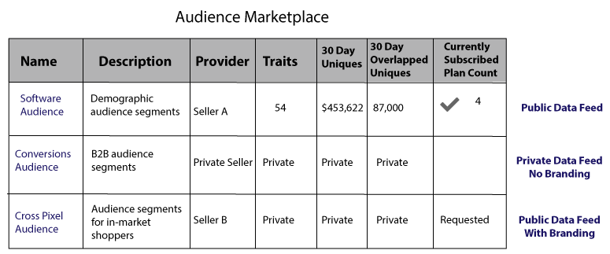

# Audience Marketplace für Datenanbieter {#audience-marketplace-for-data-providers}

Übersicht und Workflow für Datenanbieter, die Daten aus [!DNL Audience Manager] verkaufen möchten.

<!-- c_marketplace_provider.xml -->

>[!NOTE]
>
>[Rollenbasierte Berechtigungen](../../../reporting/reports-dashboard.md) steuern den Zugriff auf [!UICONTROL Audience Marketplace] Funktionen.
>
>* Administratoren können Daten-Feeds erstellen, Abonnenten verwalten und Daten-Feeds abonnieren.
>* Benutzer können nur Feeds suchen und anzeigen.

## Meine freigegebenen Daten: Über {#my-shared-data-about}

[!UICONTROL My Shared Data] ist eine [!UICONTROL Audience Marketplace] Funktion für Datenanbieter (Verkäufer). Als Anbieter können Sie Eigenschaften in Daten-Feeds bündeln und diese gegen eine Pauschalgebühr oder einen [!DNL CPM] an Käufer aus [!DNL Audience Manager] verkaufen. Wenn diese Option aktiviert ist, können Käufer mit wenigen Mausklicks einen Feed abonnieren. Darüber hinaus können mit einfachen Reporting-Tools Umsätze verfolgt und Abonnenten verwaltet werden. Schließlich übernimmt [!UICONTROL Audience Marketplace] mit [!DNL Adobe] die Rechnung, Rechnungsstellung und Gebührenzahlungen für Sie. Mit diesen Funktionen können Sie sich auf den Aufbau der effektiven und profitablen Daten-Feeds konzentrieren, die Käuferinnen und Käufer wünschen.

<!-- c_myshared_data.xml -->

Zu den Funktionen gehören:

* **Suche** Mit Suchfeldern können Sie Daten-Feeds anhand des Namens oder von Textbeschreibungen finden.
* **Name:** Der Name Ihres Daten-Feeds. Sie können dies mit einem privaten, markenlosen Daten-Feed vor Käufern ausblenden.
* **Beschreibung:** Erzählen Sie Käufern von den Inhalten Ihres Daten-Feeds.
* **Eigenschaften:** Die Anzahl der Eigenschaften in jedem Daten-Feed. Sie können dies mit einem privaten Daten-Feed vor Käufern ausblenden.
* **Einzelanwender der der letzten 30 Tage:** Die Anzahl der eindeutigen Benutzenden, die in den letzten 30 Tagen angezeigt wurden. Sie können dies mit einem privaten Daten-Feed vor Käufern ausblenden.
* **Gesamtgebühren des letzten Monats:** Der Betrag, den abonnierte Datenkäufer Ihnen schulden. Der Berichtszeitraum endet am 10. jedes Monats. Überfällige Konten werden mit dem Dreieck-/Ausrufezeichen-Symbol gekennzeichnet. Sie können [Daten-Feed eines Abonnenten deaktivieren](../../../features/audience-marketplace/marketplace-data-providers/marketplace-create-manage-feeds.md#deactivate-data-feed) wenn er Ihre Daten missbraucht oder wenn sein Konto überfällig ist.
* **Status:** Zeigt an, ob ein Feed aktiv, inaktiv, privat oder öffentlich ist.
* **Abonnenten:** Zeigt an, wie viele Käufer einen Daten-Feed verwenden. Klicken Sie auf die Zahl in dieser Spalte, um den Firmennamen, die Abonnements, die Abrechnung und den Abonnementstatus eines Käufers anzuzeigen.
* **Anfragen:** Die Anzahl der Zugriffsanfragen für einen Daten-Feed.

## private Datenfeeds {#private-data-feeds}

In [!UICONTROL My Shared Data] wird ein Feed-Status manchmal als „Privat“ markiert. Dies zeigt einen privaten Daten-Feed an. Mit einem privaten Daten-Feed können Verkäufer den Käuferzugriff auf ihre Daten und sogar den Namen des Daten-Feeds einschränken. Verkäufer können Feeds privat machen, wenn sie Sonderangebote, Rabatte anbieten oder wenn Datenschutz und Zugriffskontrolle wichtig sind. Mit privaten Daten-Feeds überprüfen und genehmigen Anbieter alle Käuferzugriffsanfragen. Weitere Informationen finden Sie unter [Private Daten-Feeds](../../../features/audience-marketplace/marketplace-private-feeds.md). Informationen zum Erstellen eines öffentlichen oder privaten Daten-Feeds finden Sie unter [Erstellen eines öffentlichen oder privaten Daten-Feeds](../../../features/audience-marketplace/marketplace-data-providers/marketplace-create-manage-feeds.md#create-public-private-data-feed).

>[!MORELIKETHIS]
>
>* [Rabatte für Datenanbieter](../../../features/audience-marketplace/marketplace-data-providers/marketplace-create-manage-feeds.md#discounts)
