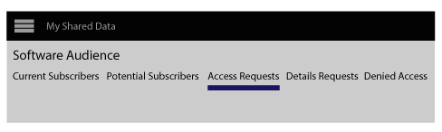

# Private Daten-Feeds {#private-data-feeds}

Ein privater Datenfeed ist eine Option, mit der Anbieter den Zugriff auf ihre Daten einschränken können. Datenanbieter und Käufer sollten diese Informationen lesen, bevor sie private Datenfeeds erstellen und abonnieren.

<!-- c_marketplace_privatefeed.xml -->

## Private Datenfeeds für Anbieter {#private-data-feeds-providers}

Als Anbieter können Ihre Datenfeeds öffentlich oder privat sein. Mit einem privaten Datenfeed können Sie den Zugriff auf die Käufer auf Ihre Daten beschränken, einschließlich des Namens des Datenverkäufers. Möglicherweise möchten Sie einen privaten Datenfeed erstellen, um spezielle Angebote, Preisnachlässe oder wenn Datenschutz und Zugriffssteuerung wichtig sind. Mit einem privaten Datenfeed können Sie Abfragen von Käufern überprüfen und genehmigen. Nachdem Sie eine Anforderung genehmigt haben, sieht der Feed genau wie ein öffentlicher Datenfeed an den Käufer aus. Sie können alle Feeds in **[!UICONTROL Audience Marketplace > My Shared Data]** anzeigen und verwalten. Wie unten gezeigt, wird dieser Feed-Typ in der Statusspalte als &quot;Privat&quot; markiert.

### Verwalten von Feed-Anfragen

Durch Klicken auf den Namen eines privaten Datenfeeds gelangen [!UICONTROL My Shared Data] Sie zu einer Seite, die mehrere Registerkarten enthält. Klicken Sie auf eine Registerkarte, um Ihre privaten Datenfeed-Anforderungen zu verwalten.

In der folgenden Tabelle sind die von den einzelnen Aktionen bereitgestellten Rollen oder Funktionen definiert.

<table id="table_AFB429CA52A34658859448D9A5215F9F"> 
 <thead> 
  <tr> 
   <th colname="col1" class="entry"> Tab </th> 
   <th colname="col2" class="entry"> Beschreibung </th> 
  </tr> 
 </thead>
 <tbody> 
  <tr> 
   <td colname="col1"> 
 <b> Aktuelle Abonnenten</b> 
 </td> 
   <td colname="col2"> 
Listet genehmigte Käufer auf, die einen privaten Datenfeed abonniert haben. 
 </td> 
  </tr> 
  <tr> 
   <td colname="col1"> 
 <b> Potenzielle Abonnenten</b> 
 </td> 
   <td colname="col2"> 
Listet genehmigte Käufer auf, die einen privaten Datenfeed nicht abonniert haben. 
 
Mit einer Genehmigung können Käufer einen Datenfeed als öffentlich anzeigen. Auf diese Weise können Sie Ihre Feeds vor dem Abonnieren überprüfen und bewerten. Sie können auch Rabatte für Datenfeeds an Käufer anbieten, die als potenzielle Abonnenten aufgeführt sind. Sobald der Käufer abonniert hat, wird sein Profil an <b> aktuelle Abonnenten verschoben</b>. 
 </td>
  </tr> 
  <tr> 
   <td colname="col1"> 
 <b> Zugriffsanforderungen</b> 
 </td>
   <td colname="col2"> 
Listet neue Abonnementanfragen für einen privaten Datenfeed auf. Klicken Sie auf diese Registerkarte, um Abfragen von Käufern zu prüfen, zu genehmigen oder abzulehnen. 

    <ul id="ul_BE0A835A90B14C05B3F63226B79D052D"> 
     <li id="li_2C5686CEB6F4430BA18AED5AD75C330A">Zugelassene Käufer wechseln zu <b> potenziellen Abonnenten</b>. </li>
     <li id="li_929591FCF81E43A3881813BDBD3AC278">Abgelehnte Käufer wechseln zum <b> Verweigert-Zugriff</b>. </li>
    </ul> </td>
  </tr>
  <tr> 
   <td colname="col1"> 
 <b> Detailanforderungen</b> 
 </td>
   <td colname="col2"> 
Listet genehmigte Käufer auf, die einen Datenfeed noch nicht abonniert und weitere Informationen zu Ihren Feeds angefordert haben. 
 
Mit einer Genehmigung können Käufer einen Datenfeed als öffentlich anzeigen. Auf diese Weise können Sie Ihre Feeds vor dem Abonnieren überprüfen und bewerten. Sie können auch Rabatte für Datenfeeds an Käufer anbieten, die Zugriff anfordern. Durch Antworten auf eine Detailanforderung wird das Käufer-Profil aus dieser Registerkarte entfernt. If they haven't subscribed, the buyer profile is still in <b> Potential Subscribers</b>. 
 </td>
  </tr>
  <tr> 
   <td colname="col1"> 
 <b> Zugriff verweigert</b> 
 </td> 
   <td colname="col2"> 
Listet abgelehnte Abonnementanfragen für einen privaten Datenfeed auf. 
 
Um abgelehnte Käufer erneut zu genehmigen, ändern Sie den  Ablehnungsstatus in <b> Zulassen</b>. Dadurch wird der Käufer in <b> potenzielle Abonnenten verschoben</b>. 
 </td> 
  </tr> 
 </tbody> 
</table>

### Nächste Schritte

Die folgende Dokumentation hilft Ihnen beim Einstieg in private Datenfeeds.

* [Erstellen eines öffentlichen oder privaten Datenfeeds](../../features/audience-marketplace/marketplace-data-providers/marketplace-create-manage-feeds.md#create-public-private-data-feed)
* [Private Feed-Anforderungen überprüfen, genehmigen oder ablehnen](../../features/audience-marketplace/marketplace-data-providers/marketplace-create-manage-feeds.md#manage-private-requests)
* [Private Datenfeeds für Käufer](../../features/audience-marketplace/marketplace-private-feeds.md#private-data-feeds-for-buyers)

## Private Datenfeeds für Käufer {#private-data-feeds-for-buyers}

Als Käufer werden private Datenfeeds wie jedes andere Angebot im [Marketplace](../../features/audience-marketplace/marketplace-data-buyers/marketplace-data-buyers.md#about-marketplace) angezeigt. In diesem Fall zeigt die Feed-Liste jedoch keine Zusammenfassungsinformationen für Eigenschaften, Unique Users und Benutzer an. Außerdem verfügt der Datenverkäufer über eine Option zum Anzeigen oder Ausblenden ihres Namens in der [!UICONTROL Provider] Liste der [!UICONTROL Marketplace] Liste. Nachdem der Verkäufer Ihre Abonnementanforderung genehmigt hat, stehen Ihnen alle Daten in einem privaten Feed zur Verfügung (funktioniert genau wie ein öffentlicher Feed). Im [!UICONTROL Marketplace] folgenden Beispiel sind die 3 verschiedenen Feed-Typen aufgelistet, die Ihnen als Käufer zur Verfügung stehen.

Zu den Feed-Typen zählen:

Die Tabelle beschreibt, wie diese verschiedenen Feed-Typen Daten anzeigen oder ausblenden.

<table id="table_41D4A798ACF548A3A03ACB427CA4652D"> 
 <thead> 
  <tr> 
   <th colname="col1" class="entry"> Feed-Typ </th> 
   <th colname="col2" class="entry"> Beschreibung </th> 
  </tr> 
 </thead>
 <tbody> 
  <tr> 
   <td colname="col1"> 
<b> Öffentlich</b> 
 </td> 
   <td colname="col2"> 
Der Name, die Eigenschaft und die eindeutigen Daten des Anbieters werden in der Liste angezeigt. 
 </td> 
  </tr> 
  <tr> 
   <td colname="col1"> 
<b> Privat ohne Branding</b> 
 </td> 
   <td colname="col2"> 
Der Name des Anbieters ist auf "Private Verkäufer" festgelegt und es können keine Eigenschaftszählungen, eindeutige Daten und Eigenschaftsüberlappungsdaten angezeigt werden. 
 </td> 
  </tr> 
  <tr> 
   <td colname="col1"> 
<b> Private mit Branding</b> 
 </td> 
   <td colname="col2"> 
Der Name des Anbieters wird in der Liste angezeigt, aber es können keine Eigenschaftszählungen, eindeutige Daten und Eigenschaftsüberlappungsdaten angezeigt werden. 
 </td> 
  </tr> 
 </tbody> 
</table>

### Nächste Schritte

Siehe [Abonnieren Sie einen privaten Datenfeed](../../features/audience-marketplace/marketplace-data-buyers/marketplace-manage-subscriptions.md#subscript-private-data-feed) , um den Zugriff anzufordern.

## So richten Sie die Freigabe-Beziehung zwischen Datenanbietern und Datenkäufern ein {#set-up-sharing-relationship}

### Schritt 1 - Aktivierung - Datenanbieter und Datenkäufer

Für den ersten Schritt im Prozess ist ein Eingreifen von Adobe Consulting oder der Kundenunterstützung erforderlich. Der Datenanbieter und der Datenkäufer sollten sich an Adobe Consulting oder den Kundendienst wenden, um die Aktivierung anzufordern.

### Schritt 2 - Datenanbieter - Neue Datenquelle erstellen

Erstellen Sie in Ihrem Audience Manager-Konto eine neue Cookie-Datenquelle mit Folgendem:

* **Audience Manager-ID** als Inbound Key;
* Die Option **&quot;Freigeben&quot;** wurde aktiviert.

Nachdem Sie auf **Speichern** geklickt haben, wird automatisch ein neuer Unterordner unter **Eigenschaften Speicher Speicher &gt; Drittanbieter-Daten erstellt**.

### Schritt 3 - Datenanbieter - Eigenschaften für die Freigabe identifizieren

In diesem Schritt identifizieren Sie die Eigenschaften, die Sie für Ihren Partner freigeben möchten. Sie können entweder neue Eigenschaften erstellen oder vorhandene Eigenschaften bearbeiten. In jedem Fall benötigen Sie die Eigenschaften:

* Damit Sie mit der Datenquelle verknüpft werden, die Sie als Teil von Schritt 2 erstellt haben.
* Wird im neu erstellten Unterordner unter Daten von Drittanbietern gespeichert.

Erfahren Sie mehr über [das Erstellen von Eigenschaften](/help/using/features/traits/create-onboarded-rule-based-traits.md) und [Bearbeiten von Eigenschaften](/help/using/features/traits/manage-trait-rules.md#edit-trait).

### Schritt 4 - Datenanbieter - Datenfeed erstellen

Erstellen Sie dann einen Datenfeed, um Ihre Eigenschaften für den Datenkäufer freizugeben. Anweisungen [zum Erstellen eines Datenfeeds finden Sie unter Erstellen](/help/using/features/audience-marketplace/marketplace-data-providers/marketplace-create-manage-feeds.md) eines öffentlichen oder privaten Datenfeeds.

>[!IMPORTANT]
>
>Wählen Sie in den Einstellungen die Option Private. Wenn Sie dieses Feld auf &quot;Öffentlich&quot; einstellen, kann jeder Audience Marketplace-Kunde Ihren Feed abonnieren.

### Schritt 5 - Datenkäufer - Zugriff anfordern

Gehen Sie zu **Audience Marketplace &gt; Marketplace**. Suchen Sie den Datenfeed, der vom Datenanbieter im vorherigen Schritt erstellt wurde. Klicken **Sie auf Zugriff anfordern**. Der angegebene Kontakt vom Datenanbieter-Side erhält jetzt eine E-Mail-Benachrichtigung. Siehe [auch Abonnieren eines privaten Datenfeeds](/help/using/features/audience-marketplace/marketplace-data-buyers/marketplace-manage-subscriptions.md#subscript-private-data-feed).

### Schritt 6 - Datenanbieter - Zugriff gewähren

Wechseln Sie zu **Audience Marketplace &gt; Meine Freigegebenen Daten** und suchen Sie nach dem Feed, den Sie in Schritt 4 erstellt haben. Klicken Sie auf die neue Zugriffsanforderung und klicken **Sie auf Zugriff** erlauben, um die Anforderung zu genehmigen. Siehe auch [Review, Genehmigen oder Ablehnen privater Feed-Anforderungen](/help/using/features/audience-marketplace/marketplace-data-providers/marketplace-create-manage-feeds.md#manage-private-requests).

### Schritt 7 - Datenkäufer - Abonnement aktivieren

Nachdem der Datenanbieter Zugriff auf den Datenfeed erteilt hat, können Sie den Feed in Ihrem Konto in **Audience Marketplace &gt; Marketplace anzeigen**. Überprüfen Sie die Details, schalten Sie die Schaltfläche &quot;Abonnement&quot; ein und klicken **Sie auf&quot; Überprüfen und Abonnieren**«. Informationen zu den Eigenschaften der Drittanbietereigenschaften finden Sie unter [Speicher für abonnierte Datenfeeds](/help/using/features/audience-marketplace/marketplace-data-buyers/marketplace-manage-subscriptions.md#find-subscribed-data-fee) .

Beachten Sie, dass diese Eigenschaften nur im Konto des Datenanbieters bearbeitet werden können.

