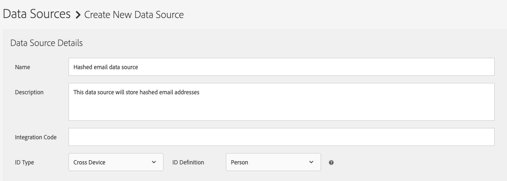

# Datenquelle für Hash-E-Mail-Workflows konfigurieren

Bei Hash-E-Mail-Workflows, wie z. B. People-Based Destinations, müssen Sie eine Datenquelle zum Speichern der Hash-E-Mail-Adressen erstellen.

Gehen Sie wie folgt vor, um eine Datenquelle für Hash-E-Mails zu erstellen und zu konfigurieren.

1. Melden Sie sich bei Ihrem Audience Manager-Konto an und navigieren Sie zu **[!UICONTROL Audience Data]** -> **[!UICONTROL Data Sources]** und klicken Sie auf **[!UICONTROL Add New]**.
1. Geben Sie einen **[!UICONTROL Name]** und **[!UICONTROL Description]** für Ihre neue Datenquelle.
1. Im **[!UICONTROL ID Type]** Dropdown-Menü auswählen **[!UICONTROL Cross Device]**.
   
1. Im **[!UICONTROL Data Source Settings]** wählen Sie beide **[!UICONTROL Inbound]** und **[!UICONTROL Outbound]** und aktivieren Sie die **[!UICONTROL Share associated cross-device IDs in people-based destinations]** -Option.
1. Wählen Sie über das Dropdown-Menü die **[!UICONTROL Emails(SHA256, lowercased)]** Beschriftung für diese Datenquelle.

   >[!IMPORTANT]
   >
   >Diese Option bezeichnet die Datenquelle nur als die mit diesem spezifischen Algorithmus gehashten Daten. In diesem Schritt werden die Daten von Audience Manager nicht gehasht. Stellen Sie sicher, dass die E-Mail-Adressen, die Sie in dieser Datenquelle speichern möchten, bereits mit dem Hash der [!DNL SHA256] -Algorithmus. Andernfalls können Sie sie nicht für Hash-E-Mail-Workflows verwenden.

   

