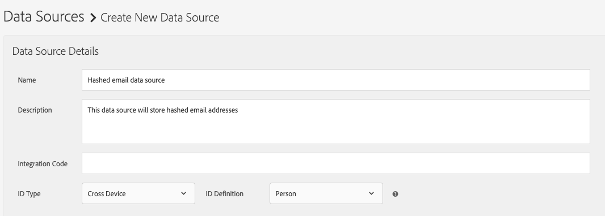

# Konfigurieren einer Datenquelle für Hash-E-Mail-Workflows

Für Hash-E-Mail-Workflows, wie z. B. personenbasierte Ziele, müssen Sie eine Datenquelle erstellen, um die Hash-E-Mail-Adressen zu speichern.

Gehen Sie wie folgt vor, um eine Datenquelle für Hash-E-Mails zu erstellen und zu konfigurieren.

1. Melden Sie sich bei Ihrem Audience Manager-Konto an, gehen Sie zu **[!UICONTROL Audience Data]** > **[!UICONTROL Data Sources]** und klicken Sie auf **[!UICONTROL Add New]**.
1. Geben Sie einen **[!UICONTROL Name]** und einen **[!UICONTROL Description]** für Ihre neue Datenquelle ein.
1. Wählen Sie im Dropdown-Menü **[!UICONTROL ID Type]** die Option **[!UICONTROL Cross Device]** aus.
   
1. Wählen Sie im Abschnitt **[!UICONTROL Data Source Settings]** die Optionen **[!UICONTROL Inbound]** und **[!UICONTROL Outbound]** aus und aktivieren Sie die Option **[!UICONTROL Share associated cross-device IDs in people-based destinations]** .
1. Wählen Sie im Dropdown-Menü die **[!UICONTROL Emails(SHA256, lowercased)]** für diese Datenquelle aus.

   >[!IMPORTANT]
   >
   >Diese Option kennzeichnet die Datenquelle nur als mit Daten, die mit diesem bestimmten Algorithmus gehasht wurden. Audience Manager hasst die Daten in diesem Schritt nicht. Stellen Sie sicher, dass die E-Mail-Adressen, die Sie in dieser Datenquelle speichern möchten, bereits mit dem [!DNL SHA256]-Algorithmus gehasht wurden. Andernfalls können Sie es nicht für Hash-E-Mail-Workflows verwenden.

   
