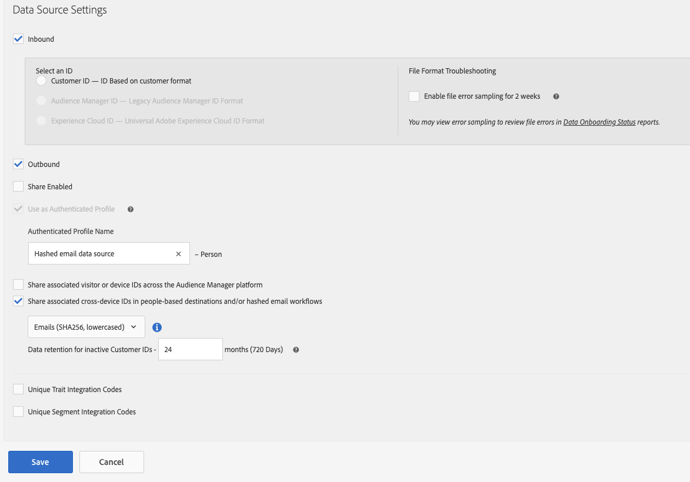

# Datenquelle für Hash-E-Mail-Workflows konfigurieren

Bei Hash-E-Mail-Workflows, wie z. B. People-Based Destinations, müssen Sie eine Datenquelle zum Speichern der Hash-E-Mail-Adressen erstellen.

Gehen Sie wie folgt vor, um eine Datenquelle für Hash-E-Mails zu erstellen und zu konfigurieren.

1. Melden Sie sich bei Ihrem Audience Manager-Konto an, gehen Sie zu &quot;**[!UICONTROL Audience Data]**&quot;> &quot;**[!UICONTROL Data Sources]**&quot;und klicken Sie auf &quot;**[!UICONTROL Add New]**&quot;.
1. Geben Sie für Ihre neue Datenquelle **[!UICONTROL Name]** und **[!UICONTROL Description]** ein.
1. Wählen Sie im Dropdownmenü **[!UICONTROL ID Type]** die Option **[!UICONTROL Cross Device]** aus.
   
1. Wählen Sie im Abschnitt **[!UICONTROL Data Source Settings]** sowohl die Optionen **[!UICONTROL Inbound]** als auch **[!UICONTROL Outbound]** aus und aktivieren Sie die Option **[!UICONTROL Share associated cross-device IDs in people-based destinations]** .
1. Verwenden Sie das Dropdown-Menü, um die Bezeichnung **[!UICONTROL Emails(SHA256, lowercased)]** für diese Datenquelle auszuwählen.

   >[!IMPORTANT]
   >
   >Diese Option bezeichnet die Datenquelle nur als die mit diesem spezifischen Algorithmus gehashten Daten. In diesem Schritt werden die Daten von Audience Manager nicht gehasht. Stellen Sie sicher, dass die E-Mail-Adressen, die Sie in dieser Datenquelle speichern möchten, bereits mit dem Algorithmus [!DNL SHA256] gehasht sind. Andernfalls können Sie sie nicht für Hash-E-Mail-Workflows verwenden.

   
