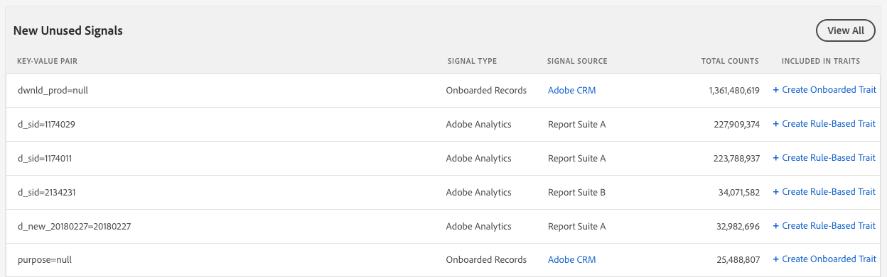

# Signal-Dashboard {#signals-dashboard}

Verschaffen Sie sich einen Überblick über die ungenutzten Signale, die Audience Manager in den letzten 7 Tagen erhalten hat, und identifizieren Sie potenzielle neue Eigenschaften. Nicht verwendete Signale erreichen Audience Manager über Ihre Online-Eigenschaften, werden aber in keiner Ihrer vorhandenen Eigenschaften verwendet. Gehen Sie [!UICONTROL Signals Dashboard]zu [!UICONTROL Audience Data] &gt; [!UICONTROL Signals]. Der [!UICONTROL Signals Dashboard] zeigt Ihnen umsetzbare Einblicke basierend auf Ihren aktivsten nicht verwendeten Signalen.

>[!IMPORTANT]
>
>Die Abschnitte **[!UICONTROL Top Unused Signals]** und **[!UICONTROL New Unused Signals]** zeigen nur Datensätze mit mehr als **100 Vorfällen/Stunde** an. Signale unterhalb dieses Schwellenwerts sind in [!UICONTROL Signals Search]enthalten.

## Obere nicht verwendete Signale {#top-unused-signals}

Dieser Abschnitt zeigt Ihnen die 50 am häufigsten verwendeten (sowohl neuen als auch alten) Signale, die in den letzten 7 Tagen gesendet wurden, basierend auf ihrer Gesamtanzahl. [!DNL Audience Manager] Je nachdem, welche Daten [!DNL Audience Manager] empfangen werden, kann diese Tabelle einige oder alle Einträge in der Tabelle " **Neue nicht verwendete Signale** "enthalten.

## Neue nicht verwendete Signale {#new-unused-signals}

Dieser Abschnitt zeigt Ihnen die 50 wichtigsten nicht verwendeten Signale, die Sie in den letzten 7 Tagen erhalten haben.

## Gespeicherte Suchen {#saved-searches}

[!DNL Audience Manager] zeigt alle [gespeicherten Suchvorgänge](../../features/data-explorer/data-explorer-signals-search/data-explorer-save-search.md) auf der Seite an [!UICONTROL Dashboard] und lädt sie jedes Mal neu, wenn Sie die [!UICONTROL Dashboard].

Gespeicherte Suchen zeigen die 50 besten Ergebnisse für die entsprechenden Kriterien an.

Sehen Sie sich das folgende Video an, um zu erfahren, wie Sie das [!UICONTROL Signals Dashboard]verwenden.
>[!VIDEO](https://video.tv.adobe.com/v/25151/?captions=ger)