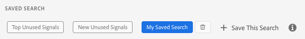

# Suchkriterien speichern {#save-search-criteria}

Optimieren Sie die Signalsuchvorgänge, indem Sie bis zu 10 Sätze von Suchkriterien speichern, die Sie bei Bedarf verwenden können, und sie auf der [!UICONTROL Signals Dashboard] verfolgen. Audience Manager lädt die gespeicherten Suchvorgänge jedes Mal neu, wenn Sie die [!UICONTROL Signals Dashboard] laden.

1. Navigieren Sie zu **[!UICONTROL Audience Data > Signals > Search]** und führen Sie eine **[!UICONTROL Signals Search]** mit den Schlüssel-Wert-Paaren und/oder den Filtern aus, die Sie für zukünftige Suchvorgänge speichern möchten.
1. Klicken Sie auf **[!UICONTROL Save this Search]** , sobald Sie die Suchergebnisse erhalten haben.

   
1. Geben Sie einen suggestiven Namen für die Suche ein, damit Sie sie später identifizieren können.
1. (Optional) Aktivieren Sie die Option &quot;**[!UICONTROL Track this search result in the dashboard]**&quot;, wenn das Signal-Dashboard die Signale aus dem aktuellen Suchsatz enthalten soll.
1. Wählen Sie die **[!UICONTROL Default Sorting]** aus:
   * **[!UICONTROL Total Counts]**
   * **[!UICONTROL Key Name]**
1. Wählen Sie den **[!UICONTROL Default Sorting]**:
   * **[!UICONTROL Descending]**
   * **[!UICONTROL Ascending]**
1. Klicken Sie auf **[!UICONTROL Save]**. Sie können Ihre gespeicherte Suche im Abschnitt [!UICONTROL Saved Search] sehen und jederzeit verwenden.

Sehen Sie sich das folgende Video an, um zu erfahren, wie Sie Signalsuchen speichern können.

>[!VIDEO](https://video.tv.adobe.com/v/30171?captions=ger)
