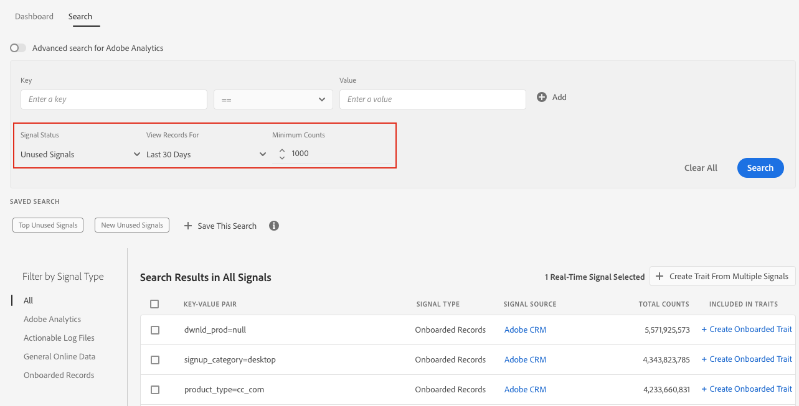

# Suchsignale nach Filtern {#search-signals-by-filters}

Lassen Sie die Schlüssel-Wert-Felder leer, um nach einem breiteren Bereich von Signalen zu suchen, und nutzen Sie die verfügbaren Filter, um die Ergebnisse einzugrenzen.

Verwenden Sie diese Methode, wenn Sie kein bestimmtes Schlüssel-Wert-Paar im Sinn haben, aber die Entwicklung mehrerer Signale über einen bestimmten Zeitraum sehen möchten.

Im folgenden Beispiel sind die Filter so konfiguriert, dass alle nicht verwendeten Signale der letzten 30 Tage mit einer Mindestanzahl von 1.000 angezeigt werden.

