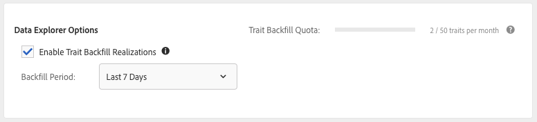

# Aufstockung von Eigenschaftenrealisierungen {#backfill-trait-realizations}

Aufstocken von Eigenschaftenrealisierungen, um historische Zielgruppen zu erfassen und den Verlust relevanter Daten vor dem Erstellungsdatum eines Merkmals zu vermeiden.

>[!IMPORTANT]
>
>[!UICONTROL Data Explorer Trait Backfill] ist eine Premium-Funktion, die das Audience Manager-Erlebnis verbessert, indem sie zusätzliche Anwendungsfälle erschließt. Die Aufstockung erfordert zusätzliche Verarbeitungsleistung und steht allen Audience Manager-Kunden zu inkrementellen Kosten zur Verfügung. Weitere Informationen erhalten Sie von Ihrem Adobe-Vertriebsmitarbeiter.

Wenn Sie Eigenschaften aus nicht verwendeten Signalen erstellen, können Sie die Realisierungen der Eigenschaften über einen bestimmten Zeitraum aufstocken. [!DNL Audience Manager] erfasst die historischen Daten über Zielgruppen, die für die neue Eigenschaft qualifiziert sind, und speichert sie im entsprechenden Profil. Die **[!UICONTROL Backfill Options]** finden Sie im [!UICONTROL Trait Expression] Abschnitt von **[Trait Builder](../../features/traits/about-trait-builder.md)**.

>[!NOTE]
>
>Sie können die Realisierung von Eigenschaften für regelbasierte und integrierte Eigenschaften aufstocken.

Gehen Sie wie folgt vor, um das Erzielen von Eigenschaften aufzustocken:

1. Wechseln Sie zu [!UICONTROL Audience Data > Signals > Search] und führen Sie eine Signalsuche aus oder verwenden Sie das [Signale-Dashboard](../../features/data-explorer/data-explorer-signals-dashboard.md), um die Signale zu identifizieren, die in der neuen Eigenschaft verwendet werden sollen.
1. Erstellen Sie eine neue Eigenschaft basierend auf den gewünschten Signalen.
1. Verwenden Sie die **[!UICONTROL Backfill Options]** im Abschnitt **[!UICONTROL Trait Expression]** , um das Zeitintervall auszuwählen, für das Sie Realisierungen von Eigenschaften aufstocken möchten. Vordefinierte Aufstockungsintervalle umfassen 1, 7, 14 und 30 Tage. Sie können auch einen benutzerdefinierten Datumsbereich von bis zu 30 Tagen auswählen.

   

1. (Optional) Klicken Sie im Abschnitt **[!UICONTROL Estimate Realizations]** auf **[!UICONTROL Estimated Trait Realizations]** , um die geschätzten [!UICONTROL Unique Trait Realizations]- und [!UICONTROL Total Trait Population] für die aufgestockte Eigenschaft in den letzten 7 Tagen anzuzeigen.

   

   >[!IMPORTANT]
   >
   >Eigenschaftsaufstockung und Schätzung sind nicht für Eigenschaften mit Ausdrücken verfügbar, die die folgenden Operatoren verwenden:
   >    * `!=`
   >    * `matchesregex`
   >    * `matcheswords`
1. Erstellen Sie das Merkmal.

Sobald Sie die Erstellung des Traits abgeschlossen haben, werden die aufgestockten Realisierungen in den Realisierungsstatistiken angezeigt.

Sehen Sie sich das folgende Video an, um eine Videoeinführung zum Aufstocken von Eigenschaften zu erhalten.

>[!VIDEO](https://video.tv.adobe.com/v/327527?captions=ger)

## Eigenschaft für Aufstockungslatenz {#trait-backfilling-latency}

Zwei bis drei Stunden nach der Erstellung beginnen die neu erstellten Eigenschaften, Zielgruppen zu erfassen. Aufgrund der großen Datenmenge, die [!DNL Audience Manager] täglich durchführt, spiegelt sich die aufgestockte Population jedoch nicht sofort in den [!UICONTROL Unique Trait Realizations]- und [!UICONTROL Total Trait Population] wider.

Audience Manager aktualisiert die [!UICONTROL Trait Graph] mit der aufgestockten Population innerhalb von 48 Stunden nach der Erstellung der Eigenschaft.

## Eigenschaft-Aufstockungsgrenze {#trait-backfilling-limit}

[!UICONTROL Data Explorer] können Sie bis zu 50 Eigenschaften pro Monat aufstocken, wobei der Aufstockungszähler am 1 Tag jedes Monats zurückgesetzt wird.

>[!NOTE]
>
>Das Kontingent für die Eigenschaftsaufstockung wird nicht aus den vorherigen Monaten übernommen. Wenn Sie beispielsweise in diesem Monat 30 Eigenschaften aufstocken, wird das Aufstockungskontingent für die Eigenschaft für den nächsten Monat auf 50 und nicht auf 70 zurückgesetzt.

## Auswirkungen auf das Reporting {#reporting-impact}

Aufstockte Eigenschaftsrealisierungen spiegeln sich in den [!UICONTROL Unique Trait Realizations]- und [!UICONTROL Total Trait Population] wider, da [!DNL Audience Manager] historische Signale in Eigenschaftsrealisierungen umwandelt.

Die [!UICONTROL Trait Graph], [!UICONTROL General Reports] und [!UICONTROL Trend Reports] werden jedoch nicht rückwirkend mit historischen Metriken aktualisiert, die vor dem Erstellungsdatum der Eigenschaft aufgestockt wurden.
