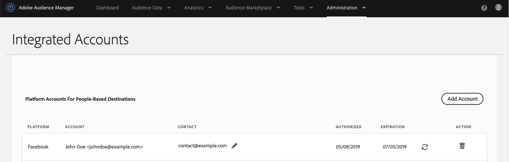
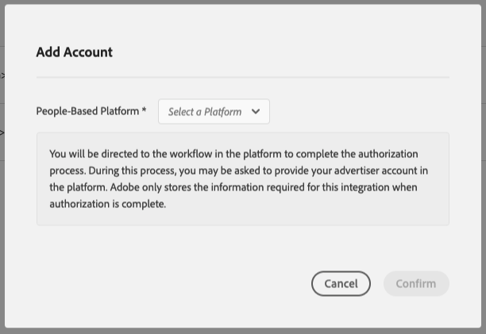
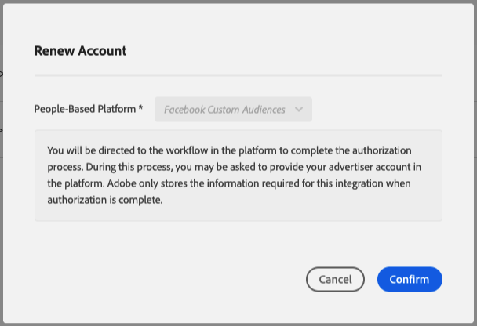

# Authentifizierung mit personenbasierten Plattformen {#authentication-with-people-based-platforms}

>[!IMPORTANT]
>Dieser Artikel enthält eine Produktdokumentation, die Sie durch die Einrichtung und Verwendung dieser Funktion führen soll. Nichts in diesem Dokument ist eine Rechtsberatung. Wenden Sie sich an Ihren Rechtsbeistand, um Rechtsberatung zu erhalten.

Diese Seite enthält Anleitungen zum Konfigurieren und Verwalten der Integration
zwischen Audience Manager und personenbasierten Plattformen.

>[!NOTE]
>Dies ist ein obligatorischer Schritt für personenbasierte Ziele, unabhängig von Ihrem Implementierungsszenario.

## Konfigurieren der personenbasierten Platform-Authentifizierung {#configure-authentication}

1. Melden Sie sich bei Ihrem Audience Manager-Konto an und gehen Sie zu **[!UICONTROL Administration]** > **[!UICONTROL Integrated Accounts]**. Wenn Sie über eine zuvor konfigurierte Integration mit einer sozialen Plattform verfügen, sollte diese auf dieser Seite aufgeführt sein. Andernfalls ist die Seite leer.
   
2. Klicken Sie auf **[!UICONTROL Add Account]**.
3. Wählen Sie im Dropdown-Menü **[!UICONTROL People-Based Platform]** die Plattform aus, mit der Sie die Integration konfigurieren möchten.
   
4. Klicken Sie auf **[!UICONTROL Confirm]** , um zur Authentifizierungsseite der ausgewählten Plattform weitergeleitet zu werden.
5. Nachdem Sie sich bei Ihrem Social-Media-Plattformkonto authentifiziert haben, werden Sie zu Audience Manager weitergeleitet, wo Sie Ihre zugehörigen Advertiser-Konten sehen sollten. Wählen Sie das zu verwendende Advertiser-Konto aus und klicken Sie auf **[!UICONTROL Confirm]**.
6. Audience Manager zeigt oben auf der Seite eine Benachrichtigung an, die Sie darüber informiert, ob das Konto erfolgreich hinzugefügt wurde. Mit der Benachrichtigung können Sie auch eine Kontakt-E-Mail-Adresse hinzufügen, um Benachrichtigungen von Adobe zu erhalten, wenn die Authentifizierung der Social-Media-Plattform bald abläuft.

## Ablauf von Authentifizierungs-Token und Verwaltung von Benachrichtigungen {#token-expiration-notification}

Audience Manager verwaltet die Integration in Social-Media-Plattformen mithilfe von Authentifizierungs-Token, die nach einer bestimmten Zeit ablaufen. Die Gültigkeitsdauer des Tokens unterliegt den Integrationsregeln jeder sozialen Plattform. Nach Ablauf des Authentifizierungs-Tokens kann Audience Manager Ihre Zielgruppensegmente nicht mehr an Ihr Ziel senden. Um dieses Szenario zu vermeiden, empfehlen wir, mindestens eine Kontakt-E-Mail-Adresse zu Ihrer Integration hinzuzufügen, damit Sie benachrichtigt werden, sobald das Authentifizierungs-Token abläuft. In diesem Fall können Sie sich erneut authentifizieren, um sicherzustellen, dass das Ziel weiterhin Ihre Zielgruppensegmente erhält.

So fügen Sie E-Mail-Adressen zu vorhandenen Integrationen hinzu:

1. Melden Sie sich bei Ihrem Audience Manager-Konto an und gehen Sie zu **[!UICONTROL Administration]** > **[!UICONTROL Integrated Accounts]**.
1. Identifizieren Sie die Integration, für die Sie Token-Ablaufbenachrichtigungen erhalten möchten, und klicken Sie auf das Symbol **[!UICONTROL Edit]** .
1. Geben Sie die E-Mail-Adressen ein, die Token-Ablaufbenachrichtigungen erhalten sollen, getrennt durch Kommas.
1. Klicken Sie auf **[!UICONTROL Save]**.

## Erneuerung des Authentifizierungs-Tokens {#token-renewal}

Wenn ein Authentifizierungs-Token abläuft, wird die Integration zwischen Audience Manager und der entsprechenden Social-Media-Plattform unterbrochen, sodass Audience Manager keine Zielgruppensegmente mehr an das Ziel senden kann. Auf der Seite [!UICONTROL Integrated Accounts] wird in der Spalte [!UICONTROL Expiration] der Ablaufstatus jeder Integration angezeigt und Sie können die Authentifizierung jederzeit erneuern.

So erneuern Sie eine abgelaufene oder demnächst ablaufende Authentifizierung:

1. Melden Sie sich bei Ihrem Audience Manager-Konto an und gehen Sie zu **[!UICONTROL Administration]** > **[!UICONTROL Integrated Accounts]**.
1. Identifizieren Sie die Integration, für die Sie die Authentifizierung erneuern müssen. Abgelaufene Authentifizierungen werden als [!UICONTROL Expired] gekennzeichnet, während Authentifizierungen, die bald ablaufen, die verbleibende Anzahl authentifizierter Tage anzeigen.
1. Klicken Sie auf das entsprechende **[!UICONTROL Renew]** in der Spalte [!UICONTROL Expiration] . Dadurch wird der **[!UICONTROL Renew Account]** Workflow Trigger, der Sie zurück durch die Authentifizierungsseite der Social-Media-Plattform führt. Nach der Authentifizierung wird das Token mit dem neuen Ablaufdatum verlängert.

   
