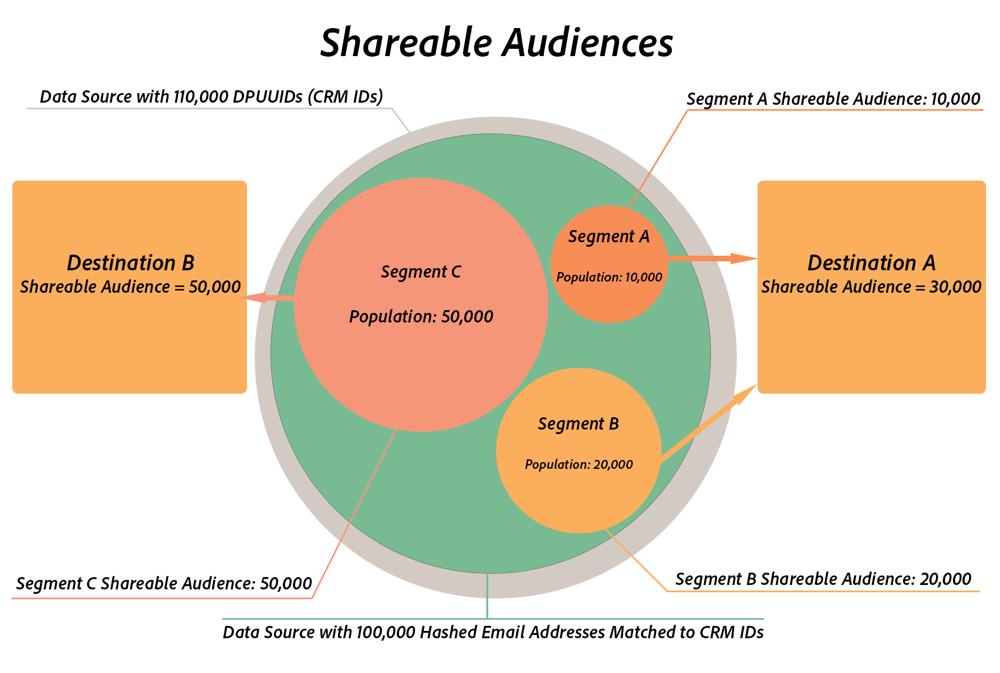

# Teilbare Zielgruppen {#shareable-audiences}

>[!IMPORTANT]
>Dieser Artikel enthält die Produktdokumentation, die Sie durch die Einrichtung und Nutzung dieser Funktion führen soll. Nichts in diesem Dokument ist Rechtsberatung. Wenden Sie sich an Ihren Rechtsbeistand, um rechtliche Hinweise zu erhalten.

[!DNL People-Based Destinations] den Begriff des  [!DNL Shareable Audiences] Audience Managers zu bringen. Anhand dieser Metrik können Sie erkennen, wie viele der Hash-E-Mail-Adressen Audience Manager für die Zielplattform freigeben können.

[!DNL Shareable Audiences] ist eine Metrik, mit der Sie Zielgruppendaten im Kontext von  [!DNL People-Based Destinations]interpretieren können. Sie können diese Metrik auf der Seite [!UICONTROL Destinations] und auf der Seite [!UICONTROL Segment] sehen.

## Teilbare Segmentzielgruppen {#segment-shareable-audiences}

Die Metrik [!DNL Segment Shareable Audience] auf der Segmentseite gibt die Anzahl der gehashten E-Mail-Adressen aus der Datenquelle an, die mit [DPUUIDs](../../reference/ids-in-aam.md) übereinstimmen. Diese sind auch für das definierte Segment im angegebenen Rückblickzeitraum qualifiziert, da die Profilzusammenführungsregel darauf angewendet wird und dieser Audience Manager mit der Zielplattform teilen kann.

Diese Metrik hat einen Rückblickzeitraum von 1 Tag. Auf diese Weise können Sie die Reichweite der Zielgruppe für das Segment in einem bestimmten Ziel nachvollziehen.

## Zielteilbare Zielgruppe {#destination-shareable-audience}

Die Metrik [!DNL Destination Shareable Audience] auf einer personenbasierten Zielseite gibt die Gesamtanzahl der gehashten E-Mail-Adressen aus der Datenquelle an, die mit [DPUUIDs](../../reference/ids-in-aam.md) übereinstimmen. Dieser Audience Manager kann diese mit der Zielplattform teilen, und zwar aus allen Segmenten, die diesem Ziel zugeordnet sind.

Diese Metrik verfügt über einen Rückblickzeitraum für die Lebensdauer. Auf diese Weise können Sie die Größe der Zielgruppe verstehen, die Sie aus der Datenquelle der Hash-E-Mail-Adressen erreichen können.

## Beispiel

Ein Audience Manager-Kunde verfügt über eine Datenquelle mit 110.000 [DPUUIDs](../../reference/ids-in-aam.md) (CRM-IDs). Sie erfassen 100.000 Hash-E-Mail-Adressen in Audience Manager, verwenden sie mit mehreren personenbasierten Zielen und führen eine ID-Synchronisierung für die 100.000 Hash-E-Mail-Adressen mit den CRM-IDs durch. Der Kunde kann die Zusammenführungsregel [!DNL All Cross-Device Profiles] verwenden, um drei Zielgruppensegmente zu erstellen:

* Segment A mit einer Populationszahl von 10.000, das Destination A zugeordnet ist;
* Segment B mit einer Populationszahl von 20.000, das Destination A zugeordnet ist;
* Segment C mit einer Populationsanzahl von 50.000, das Ziel B zugeordnet ist.

In diesem Szenario:

* Segment A Teilbare Zielgruppe = 10.000;
* Segment B Teilbare Zielgruppe = 20.000;
* Segment C Teilbare Zielgruppe = 50.000;
* Ziel einer teilbaren Zielgruppe = Segment A Teilbare Zielgruppe + Segment B Teilbare Zielgruppe = 30.000;
* Ziel B Teilbare Zielgruppe = Segment C Teilbare Zielgruppe = 50.000.

>[!NOTE]
>
>Im obigen Beispiel bedeutet dies nicht, dass alle 80.000 Hash-E-Mail-Adressen aus den drei Segmenten mit vorhandenen Konten in den Zielplattformen übereinstimmen. Dies bedeutet nur, dass Audience Manager die Hash-IDs von den drei Segmenten an ihre jeweiligen Ziele sendet. Beim Senden von Zielgruppensegmenten an personenbasierte Ziele erfolgt der Zielgruppenabgleich auf der Partnerseite. Ziel A kann bis zu 30.000 übereinstimmende Benutzerkonten haben, während Ziel B bis zu 50.000 passende Benutzerkonten haben kann, aber es gibt keine Garantie für Übereinstimmungsraten. Adobe hat keinen Zugriff auf Partner-spezifische Metriken. Unter [Übereinstimmungsraten](../../faq/faq-people-based-destinations.md#match-rates) finden Sie häufig gestellte Fragen zur Sichtbarkeit von personenbasierten Zielen in Übereinstimmungsraten.
