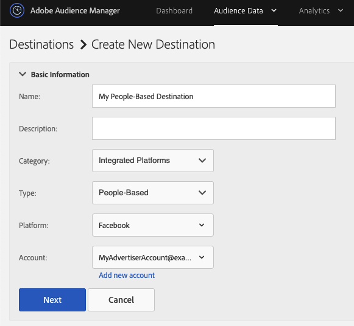

# Workflow C - Personalization basierend auf authentifizierter Aktivität kombiniert mit Offline-Daten {#workflow-c}

>[!IMPORTANT]
>Dieser Artikel enthält eine Produktdokumentation, die Sie durch die Einrichtung und Verwendung dieser Funktion führen soll. Nichts in diesem Dokument ist eine Rechtsberatung. Wenden Sie sich an Ihren Rechtsbeistand, um Rechtsberatung zu erhalten.

Auf dieser Seite finden Sie eine schrittweise Anleitung dazu, wie Sie Offline-[!DNL CRM] mit Echtzeit-Verhaltensdaten für authentifizierte Benutzer kombinieren, um Zielgruppensegmente zu erstellen, und diese Zielgruppensegmente dann an [!DNL People-Based Destinations] senden.

## Schritt 1: Konfigurieren der Einstellungen für Data Source {#configure-data-source-settings}

Je nachdem, ob Ihre [DPUUIDs](../../reference/ids-in-aam.md) E-Mail-Adressen in Kleinbuchstaben mit Hash vorliegen, müssen Sie möglicherweise die Datenquelle konfigurieren, in der die Hash-E-Mail-Adressen gespeichert werden.

 

**Szenario 1: Ihre [DPUUIDs](../../reference/ids-in-aam.md) werden bereits in Kleinbuchstaben geschrieben und enthalten Hash-E-Mail-Adressen.**

In diesem Fall fahren Sie mit [Schritt 5 - Konfigurieren der personenbasierten Platform-Authentifizierung](#configure-authentication) fort.

 

**Szenario 2: Ihre [DPUUIDs](../../reference/ids-in-aam.md) sind keine gehashten E-Mail-Adressen in Kleinbuchstaben.**

In diesem Fall müssen Sie eine neue geräteübergreifende Datenquelle erstellen, in der Ihre gehashten E-Mail-Adressen gespeichert werden. Gehen Sie wie folgt vor:

1. Melden Sie sich bei Ihrem Audience Manager-Konto an, gehen Sie zu **[!UICONTROL Audience Data]** > **[!UICONTROL Data Sources]** und klicken Sie auf **[!UICONTROL Add New]**.
1. Geben Sie einen **[!UICONTROL Name]** und einen **[!UICONTROL Description]** für Ihre neue Datenquelle ein.
1. Wählen Sie im Dropdown-Menü **[!UICONTROL ID Type]** die Option **[!UICONTROL Cross Device]** aus.
1. Wählen Sie im Abschnitt **[!UICONTROL Data Source Settings]** die Optionen **[!UICONTROL Inbound]** und **[!UICONTROL Outbound]** aus und aktivieren Sie die Option **[!UICONTROL Share associated cross-device IDs in people-based destinations]** .
1. Wählen Sie im Dropdown-Menü die **[!UICONTROL Emails(SHA256, lowercased)]** für diese Datenquelle aus.

   >[!IMPORTANT]
   >
   >Diese Option kennzeichnet die Datenquelle nur als mit Daten, die mit diesem bestimmten Algorithmus gehasht wurden. Audience Manager hasst die Daten in diesem Schritt nicht. Stellen Sie sicher, dass die E-Mail-Adressen, die Sie in dieser Datenquelle speichern möchten, bereits mit dem [!DNL SHA256]-Algorithmus gehasht wurden. Andernfalls können Sie es nicht für [!DNL People-Based Destinations] verwenden.

   

   >[!NOTE]
   >
   > Unter [Daten-Onboarding](people-based-destinations-prerequisites.md#data-onboarding) finden Sie häufig gestellte Fragen dazu, wie Sie Ihre Offline-Daten in Audience Manager für personenbasierte Ziele importieren sollten.

Sehen Sie sich das folgende Video an, um ein Video-Tutorial zum Erstellen einer Datenquelle für [!UICONTROL People-Based Destinations] zu erhalten.

>[!VIDEO](https://video.tv.adobe.com/v/32165?captions=ger)

## Schritt 2: Verwenden deklarierter IDs, um DPUUIDs über Echtzeit-HTTP-Aufrufe mit Hash-E-Mail-Adressen abzugleichen {#match-email-addresses}

Um authentifizierte Benutzer für regelbasierte Eigenschaften zu qualifizieren, müssen Sie die Eigenschaftsqualifizierung über [deklarierte IDs](../declared-ids.md) senden.

### Beispiel

Angenommen, Sie haben die beiden folgenden Datenquellen erstellt.

| Datenquellen-ID | Datenquelleninhalte |
| -------------- | -------------------------- |
| 999999 | Vorhandene DPUUIDs (CRM-IDs) |
| 987654 | Hash-E-Mail-Adressen |

 

Anschließend möchten Sie die folgenden CRM-IDs für das Merkmal in der Tabelle qualifizieren.

| DPUUID (CRM-ID) | E-Mail-Adresse | Hash-E-Mail-Adresse | Trait- |
| -------------------------------------- | --------------------- | ---------------------------------------------------------------- | ------------- |
| 68079982765673198504052656074456196039 | `johndoe@example.com` | 55E79200C1635B37AD31A378C39FEB12F120F116625093A19BC32FFF15041149 | location = US |

 

Ihre deklarierte ID sollte dieser Syntax entsprechen:

`https://yourDomain.demdex.net/event?d_cid_ic=HashedEmailDataSourceIntegrationCode%01myHashedEmail&d_cid_ic=CRMDataSourceIntegrationCode%01myCRMID&key=value`

 

Im obigen Beispiel sollte der deklarierte ID-Aufruf wie folgt aussehen:

`https://yourDomain.demdex.net/event?d_cid_ic=MyHashedEmailDataSource%0155e79200c1635b37ad31a378c39feb12f120f116625093a19bc32fff15041149&d_cid_ic=MyCRMDataSource%0168079982765673198504052656074456196039&location=US`

## Schritt 3: Erstellen einer Profilzusammenführungsregel für die Segmentierung {#create-profile-merge-rule-segmentation}

Der nächste Schritt besteht darin, eine neue Zusammenführungsregel zu erstellen, die Ihnen bei der Erstellung der Zielgruppensegmente hilft, die an Ihre [!DNL People-Based Destinations] gesendet werden sollen.

>[!IMPORTANT]
>
>Wenn Sie bereits eine Regel mit den Optionen **[!UICONTROL Current Authenticated Profiles]** oder **[!UICONTROL Last Authenticated Profiles]** definiert haben, können Sie zu [Schritt 4: Erstellen von Zielgruppensegmenten](#create-audience-segments) wechseln.

1. Melden Sie sich bei Ihrem Audience Manager-Konto an und gehen Sie zu **[!UICONTROL Audience Data]** -> **[!UICONTROL Profile Merge Rules]**.
2. Klicken Sie auf **[!UICONTROL Add New Rule]**.
3. Geben Sie einen **[!UICONTROL Name]** und einen **[!UICONTROL Description]** für die Profilzusammenführungsregel ein.
4. Wählen Sie im Abschnitt **[!UICONTROL Profile Merge Rule Setup]** die Regel **[!UICONTROL Current Authenticated Profiles]** oder **[!UICONTROL Last Authenticated Profiles]** aus der Liste **[!UICONTROL Cross-Device Options]** aus.
5. Wählen Sie in der Liste **[!UICONTROL Cross-Device Profile Options]** die Datenquellen aus, für die Sie die Segmentierung ausführen möchten. Dies sollten die Datenquellen sein, die Ihre vorhandenen DPUUIDs enthalten.
   

## Schritt 4: Erstellen von Zielgruppensegmenten {#create-audience-segments}

Verwenden Sie zum Erstellen neuer Segmente den [Segment Builder](../segments/segment-builder.md). Wenn Sie über vorhandene Zielgruppensegmente verfügen, die Sie an [!DNL People-Based Destinations] senden möchten, fahren Sie mit [Schritt 5: Konfigurieren der personenbasierten Platform-Authentifizierung](#configure-authentication) fort.

## Schritt 5: Konfigurieren der personenbasierten Platform-Authentifizierung {#configure-authentication}

1. Melden Sie sich bei Ihrem Audience Manager-Konto an und gehen Sie zu **[!UICONTROL Administration]** > **[!UICONTROL Integrated Accounts]**. Wenn Sie über eine zuvor konfigurierte Integration mit einer sozialen Plattform verfügen, sollte diese auf dieser Seite aufgeführt sein. Andernfalls ist die Seite leer.
   
2. Klicken Sie auf **[!UICONTROL Add Account]**.
3. Wählen Sie im Dropdown-Menü **[!UICONTROL People-Based Platform]** die Plattform aus, mit der Sie die Integration konfigurieren möchten.
   
4. Klicken Sie auf **[!UICONTROL Confirm]** , um zur Authentifizierungsseite der ausgewählten Plattform weitergeleitet zu werden.
5. Nachdem Sie sich bei Ihrem Social-Media-Plattformkonto authentifiziert haben, werden Sie zu Audience Manager weitergeleitet, wo Sie Ihre zugehörigen Advertiser-Konten sehen sollten. Wählen Sie das zu verwendende Advertiser-Konto aus und klicken Sie auf **[!UICONTROL Confirm]**.
6. Audience Manager zeigt oben auf der Seite eine Benachrichtigung an, die Sie darüber informiert, ob das Konto erfolgreich hinzugefügt wurde. Mit der Benachrichtigung können Sie auch eine Kontakt-E-Mail-Adresse hinzufügen, um Benachrichtigungen zu erhalten, wenn die Authentifizierung der Social-Media-Plattform bald abläuft.

>[!IMPORTANT]
>
>Audience Manager übernimmt die Integration mit Social-Media-Plattformen mithilfe von Authentifizierungstoken, die nach einer bestimmten Zeit ablaufen. Weitere Informationen zum Verlängern der abgelaufenen Token finden Sie unter Erneuerung des Authentifizierungs-Tokens .

## Schritt 6: Erstellen eines personenbasierten Ziels {#create-destination}

1. Melden Sie sich bei Ihrem Audience Manager-Konto an, gehen Sie zu **[!UICONTROL Audience Data]** > **[!UICONTROL Destinations]** und klicken Sie auf **[!UICONTROL Create Destination]**.
1. Geben Sie im Abschnitt **[!UICONTROL Basic Information]** einen **[!UICONTROL Name]** und einen **[!UICONTROL Description]** für Ihre neue Datenquelle ein und verwenden Sie die folgenden Einstellungen:
   * **[!UICONTROL Category]**: integrierte Plattformen;
   * **[!UICONTROL Type]**: personenbezogen;
   * **[!UICONTROL Platform]**: Wählen Sie die personenbasierte Plattform aus, an die Sie Zielgruppensegmente senden möchten.
   * **[!UICONTROL Account]**: Wählen Sie das gewünschte Advertiser-Konto aus, das mit der ausgewählten Plattform verknüpft ist.
     
1. Klicken Sie auf **[!UICONTROL Next]**.
1. Wählen Sie die **[!UICONTROL Data Export Labels]** aus, die Sie für dieses Ziel festlegen möchten.
1. Wählen Sie im Abschnitt **[!UICONTROL Configuration]** die Datenquelle aus, die Ihre gehashten Datenquellen enthält.
1. Wählen Sie im Abschnitt **[!UICONTROL Segment Mappings]** die Segmente aus, die Sie an dieses Ziel senden möchten. Hierbei handelt es sich um die Segmente, die Sie unter [Schritt 4: Erstellen von Zielgruppensegmenten) &#x200B;](#create-audience-segments).
1. Speichern Sie das Ziel.
