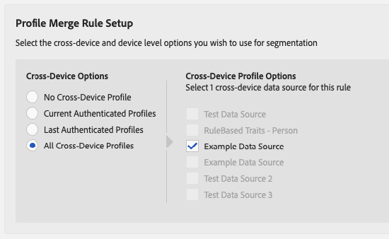

# Arbeitsablauf B - Personalisierung basierend auf Offline-Daten {#workflow-b}

Diese Seite enthält Schritt-für-Schritt-Anleitungen zum Erstellen von Zielgruppensegmenten aus Kundendaten nur für Offline-Benutzer und Senden an benutzerbasierte Ziele.

## Schritt 1: Offline-Offlineeigenschaften {#step-1-onboard-traits}

Der erste Schritt, mit dem Zielgruppensegmente in diesem Szenario erstellt werden, besteht darin, Ihre Offline-Kundendaten in Audience Manager zu übernehmen.

>[!IMPORTANT]
>
> Bevor Sie fortfahren, stellen Sie sicher, dass die Kundenaktivität, die Sie auf der Seite aufrufen, bereits in Audience Manager mit entsprechenden [onboarded-Eigenschaften definiert](../traits/trait-qualification-reference.md)ist.

Unabhängig davon, ob Ihre vorhandenen Audience Manager-Kunden-IDs ([dpuuids](../../reference/ids-in-aam.md)) Hash-E-Emails sind oder nicht, müssen Sie die Eigenschaft onboarding für die Datenquelle ausführen, die Ihre [dpuuids enthält](../../reference/ids-in-aam.md).

### Beispiel 

Sie möchten die Kunden-IDs aus der unten stehenden Tabelle für die entsprechenden benannten Eigenschafts-IDs qualifizieren. Nehmen wir an, dass Ihre [dpuuids](../../reference/ids-in-aam.md) in einer Datenquelle mit der ID 999999 gespeichert werden und Ihre Audience Manager-Partner-ID 123 ist.

| Kunden-ID (DPUUID) | Onboarded Trait-ID |
| -------------------------------------- | ------------------- |
| 68079982765673198504052656074456196039 | 12345, 23456 |
| 67412682083411995725538770443620307584 | 45678 |
| 89159024796760343733111707646026765593 | 11223, 93342, 27341 |

<br />Um die Kunden-IDs im obigen Beispiel für die entsprechenden onboarded-Eigenschaften zu qualifizieren, müssen Sie eine [eingehende Datendatei] (../../integration/sending-audience-data/batch-data-transfer-explained/inbound-file-contents. md) mit den folgenden Inhalten hochladen:

```
68079982765673198504052656074456196039<TAB>d_sid=12345,d_sid=23456
67412682083411995725538770443620307584<TAB>d_sid=45678
89159024796760343733111707646026765593<TAB>d_sid=11223,d_sid=93342,d_sid=27341
```

Der Dateiname würde wie folgt aussehen: `ftp_dpm_999999_123_TIMESTAMP.sync.gz`.
Detaillierte Informationen zur Dateinamenstruktur finden Sie unter [Amazon S 3-Name und Dateigrößenanforderungen für eingehende Datendateien](../../integration/sending-audience-data/batch-data-transfer-explained/inbound-s3-filenames.md) .

## Schritt 2: Konfigurieren der Datenquelleneinstellungen {#configure-data-source-settings}

Je nachdem, ob Ihre [dpuuids](../../reference/ids-in-aam.md) klein sind, können Hash-E-Email-Adressen die Datenquelle konfigurieren, die die Hash-E-Email-Adressen speichert.

 

**Szenario 1: Ihre[dpuuids](../../reference/ids-in-aam.md)sind bereits Kleinbuchstaben, Hash-E-Email-Adressen.**

In diesem Fall müssen Sie die entsprechende Datenquelle als solche bezeichnen:

1. Wechseln Sie zu **[!UICONTROL Audience Data]** -&gt; **[!UICONTROL Data Sources]**.
1. Suchen Sie die Datenquelle, die Ihre [dpuuids enthält](../../reference/ids-in-aam.md), und klicken Sie darauf.
1. Vergewissern Sie sich, dass die Option **[!UICONTROL Cannot be tied to personally identifiable information]** deaktiviert ist.
1. Speichern Sie die Datenquelleneinstellungen.

 

**Szenario 2: Ihre[dpuuids](../../reference/ids-in-aam.md)sind nicht Kleinbuchstaben, Hash-E-Email-Adressen.**

In diesem Fall müssen Sie eine neue geräteübergreifende Datenquelle erstellen, die Ihre Hash-E-Mail-Adressen speichert. Gehen Sie wie folgt vor:

1. Melden Sie sich bei Ihrem Audience Manager-Konto an und wechseln **[!UICONTROL Audience Data]** Sie zu -&gt; **[!UICONTROL Data Sources]** und klicken **[!UICONTROL Add New]** Sie auf.
1. Geben Sie einen **[!UICONTROL Name]** und **[!UICONTROL Description]** für Ihre neue Datenquelle ein.
1. Wählen Sie im **[!UICONTROL ID Type]** Dropdown-Menü **[!UICONTROL Cross Device]** die Option.
1. Wählen Sie im **[!UICONTROL Data Source Settings]** Abschnitt die **[!UICONTROL Inbound]** Optionen und **[!UICONTROL Outbound]** Optionen aus und aktivieren Sie die **[!UICONTROL Share associated cross-device IDs in people-based destinations]** Option.
1. Verwenden Sie das Dropdownmenü, um die **[!UICONTROL Emails(SHA256, lowercased)]** Bezeichnung für diese Datenquelle auszuwählen.
   >[!IMPORTANT]
   >
   >Diese Option kennzeichnet nur die Datenquelle, die Daten enthält, die Daten mit diesem spezifischen Algorithmus enthalten. Audience Manager verhasst die Daten in diesem Schritt nicht. Stellen Sie sicher, dass die E-Mail-Adressen, die Sie in dieser Datenquelle speichern möchten, bereits mit dem [!DNL SHA256] Algorithmus hashing. Andernfalls können Sie es [!DNL People-Based Destinations]nicht verwenden.

   

   >[!NOTE]
   >
   > Häufig gestellte Fragen dazu, wie Sie Ihre Offline-Daten für benutzerbasierte Ziele in Audience Manager übernehmen, finden Sie unter [Datenonboarding](people-based-destinations-prerequisites.md#data-onboarding) .

## Schritt 3: Übereinstimmung mit dpuuids in Hash E-Mail-Adressen über dateibasierte ID-Synchronisierung {#match-ids-emails}

>[!IMPORTANT]
>
> Dieser Schritt gilt nur für [Szenario 2](people-based-destinations-workflow-offline.md#configure-data-source-settings) . Wenn Ihre vorhandenen [dpuuids](../../reference/ids-in-aam.md) bereits Hash-E-Email-Adressen sind, fahren Sie mit [Schritt 4 fort - Erstellen Sie eine Regel zum Profilzusammenführen für die Segmentierung](#create-profile-merge-rule).

Nehmen wir an, Sie möchten Ihren vorhandenen [dpuuids](../../reference/ids-in-aam.md) aus dem Beispiel in Schritt 1 den Hash-E-Email-Adressen aus der Tabelle unten (rechts) zuordnen und die Hash-E-Email-Adressen in der neuen Datenquelle speichern, die Sie in [Schritt 2 erstellt haben - Datenquelleneinstellungen konfigurieren](#configure-data-source-settings).

Als Erinnerung würden Sie jetzt zwei Datenquellen verwenden:

| Datenquellen-ID | Inhalt der Datenquelle |
| -------------- | -------------------------- |
| 999999 | Vorhandene dpuuids (CRM-IDs) |
| 987654 | Hash-E-Email-Adressen |

| Dpuuids (CRM-IDs) | E-Mail-Adresse | Hash-E-Email-Adresse |
| -------------------------------------- | --------------------- | ---------------------------------------------------------------- |
| 68079982765673198504052656074456196039 | `johndoe@example.com` | 55e79200c1635b37ad31a378c39feb12f120f116625093a19bc32fff15041149 |
| 67412682083411995725538770443620307584 | `janedoe@email.com` | 16d72e3edbeb089b299e0d12fc09522fdc5ece2d11dcb1304ecdd6fab4f7193a |
| 89159024796760343733111707646026765593 | `name@mydomain.com` | feec5debcea411f54462a345a0d90c9975415d2d4862745ff8af00c49b6b4ae6 |

 

Ihre [ID-Synchronisierungsdatei](../../integration/sending-audience-data/batch-data-transfer-explained/id-sync-file-based.md) hat folgende Inhalte:

```
68079982765673198504052656074456196039<TAB>55e79200c1635b37ad31a378c39feb12f120f116625093a19bc32fff15041149
67412682083411995725538770443620307584<TAB>16d72e3edbeb089b299e0d12fc09522fdc5ece2d11dcb1304ecdd6fab4f7193a
89159024796760343733111707646026765593<TAB>feec5debcea411f54462a345a0d90c9975415d2d4862745ff8af00c49b6b4ae6
```

 

Die [ID-Synchronisierungsdatei](../../integration/sending-audience-data/batch-data-transfer-explained/id-sync-file-based.md) muss diese Benennungsstruktur befolgen:

`c2c_id_<DPUUID_DATA_SOURCE_ID>_<HASHED_EMAIL_DATA_SOURCE_ID>_TIMESTAMP.sync`

 

Im obigen Beispiel würde der Dateiname wie folgt aussehen:`c2c_id_999999_987654_1560431657.sync`


[Download-Beispieldatei hier](https://marketing.adobe.com/resources/help/en_US/aam/downloads/c2c_id_999999_987654_1560431657.sync)herunterladen.

## Schritt 4: Erstellen einer Regel zur Profilzusammenführung für die Segmentierung {#create-profile-merge-rule}

Im nächsten Schritt wird eine neue Zusammenführungsregel erstellt, die Ihnen dabei hilft, die Zielgruppensegmente zu erstellen, [!DNL People-Based Destinations]die an Sie gesendet werden sollen.

1. Melden Sie sich bei Ihrem Audience Manager-Konto an und gehen Sie zu **[!UICONTROL Audience Data]** -&gt; **[!UICONTROL Profile Merge Rules]**.
2. Klicken [!UICONTROL Add New Rule].
3. Geben Sie eine Regel für die Profilzusammenführung **[!UICONTROL Name]** ein und **[!UICONTROL Description]**.
4. Wählen Sie im **[!UICONTROL Profile Merge Rule Setup]** Abschnitt die **[!UICONTROL All Cross-Device Profiles]** Regel aus der **[!UICONTROL Cross-Device Options]** Liste aus.
5. Wählen Sie in der **[!UICONTROL Cross-Device Profile Options]** Liste die Datenquelle aus, mit der Ihre Eigenschaften versehen werden.
   

## Schritt 5: Erstellen von Zielgruppensegmenten {#create-audience-segments}

Um neue Segmente aus Nur Offline-Daten zu erstellen, verwenden Sie den [Segmentaufbau](../segments/segment-builder.md) und stellen Sie sicher, dass Sie die neue Regel zur Profilzusammenführung verwenden, die Sie im vorherigen Schritt erstellt haben.

## Schritt 6: Authentifizierung auf der Benutzerbasierten Plattform konfigurieren {#configure-authentication}

1. Melden Sie sich bei Ihrem Audience Manager-Konto an und wechseln Sie zu **[!UICONTROL Administration]** &gt; **[!UICONTROL Integrated Accounts]**. Wenn Sie eine zuvor konfigurierte Integration mit einer sozialen Plattform haben, sollten Sie diese auf dieser Seite auflisten. Andernfalls ist die Seite leer.
   
1. Klicken Sie auf **[!UICONTROL Add Account]**.
1. Verwenden Sie das **[!UICONTROL People-Based Platform]** Dropdownmenü, um die Plattform auszuwählen, mit der Sie die Integration konfigurieren möchten.
   
1. Klicken **[!UICONTROL Confirm]** Sie auf, um zur Authentifizierungsseite der ausgewählten Plattform umgeleitet zu werden.
1. Sobald Sie sich für Ihr Social-Plattform-Konto authentifiziert haben, werden Sie zu Audience Manager weitergeleitet, wo Sie Ihre zugeordneten Advertiserkonten sehen sollten. Wählen Sie das gewünschte Advertiserkonto aus und klicken **[!UICONTROL Confirm]** Sie auf.
1. Audience Manager zeigt oben auf der Seite eine Benachrichtigung an, um Ihnen mitzuteilen, ob das Konto erfolgreich hinzugefügt wurde. Die Benachrichtigung ermöglicht Ihnen außerdem, eine E-Mail-Adresse zu erhalten, um Benachrichtigungen zu erhalten, wenn die Authentifizierung der sozialen Plattform läuft.

>[!IMPORTANT]
>
>Ein Udience Manager nutzt die Integration mit sozialen Plattformen über Authentifizierungstoken, die nach einer bestimmten Zeit ablaufen. Weitere Informationen zum Verlängern abgelaufener Token finden Sie unter Erneuerung der Authentifizierungstoken.

## Schritt 7: Erstellen eines benutzerbasierten Ziels {#create-destination}

1. Melden Sie sich bei Ihrem Audience Manager-Konto an, wechseln Sie zu **[!UICONTROL Audience Data]** &gt; **[!UICONTROL Destinations]** und klicken **[!UICONTROL Create Destination]** Sie auf.
1. Geben Sie im **[!UICONTROL Basic Information]** Abschnitt einen **[!UICONTROL Name]** und **[!UICONTROL Description]** für Ihre neue Datenquelle ein und verwenden Sie die folgenden Einstellungen:
   * **[!UICONTROL Category]**: Integrierte Plattformen;
   * **[!UICONTROL Type]**: Personenbasiert;
   * **[!UICONTROL Platform]**: Wählen Sie die benutzerbasierte Plattform, an die Sie Zielgruppensegmente senden möchten.
   * **[!UICONTROL Account]**: Wählen Sie das gewünschte Advertiserkonto aus, das der ausgewählten Plattform zugeordnet ist.
      
1. Klicken Sie auf **[!UICONTROL Next]**.
1. Wählen **[!UICONTROL Data Export Labels]** Sie die gewünschte Einstellung für dieses Ziel aus.
1. Wählen Sie im **[!UICONTROL Configuration]** Abschnitt die Datenquelle aus, die Ihre Hash-Datenquellen enthält.
1. Wählen Sie im **[!UICONTROL Segment Mappings]** Abschnitt die Segmente aus, die Sie an dieses Ziel senden möchten. Dies wären die Segmente, die Sie in [Schritt 5 erstellt haben - Erstellen von Zielgruppensegmenten](people-based-destinations-workflow-offline.md#create-audience-segments).
1. Speichern Sie das Ziel.
