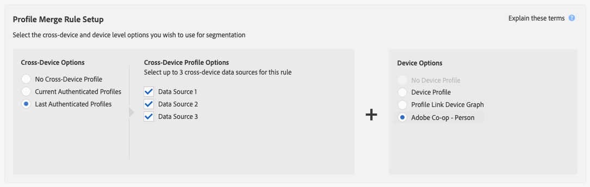

# Anwendungsfälle für externe Gerätediagramme {#external-device-graph-use-cases}

Recommendations und Anwendungsfälle für Prospektion, Retargeting und Personalisierung für Unbekannte Nutzer mit einem externen Gerätediagramm. Ein externes Gerätediagramm wird als Gerätediagramm definiert, das vom Audience Manager getrennt ist. Dazu gehören die [!DNL Adobe Experience Cloud Device Co-op]- und andere Integrationsmodule, die die Adobe mit deterministischen oder probabilistischen Gerätediagrammen von Drittanbietern hat.

## Recommendations {#recommendations}

Betrachten Sie die Diagrammoptionen für Geräte und Drittanbieter für Kampagnen, die:[!DNL Experience Cloud Device Co-op]

* Sie haben eine niedrige Authentifizierungsebene über ihre digitalen Eigenschaften. Verwenden Sie das [!UICONTROL Profile Link Device Graph option], wenn Sie eine große Anzahl authentifizierter Benutzer haben.
* Zielgruppe große Audiencen. Die Geräte-Diagramme von [!DNL Experience Cloud Device Co-op] und Drittanbietern enthalten authentifizierte und nicht authentifizierte Daten.
* Segmentieren authentifizierter und/oder nicht authentifizierter Besucher auf der Ebene des Einzelnen und des Haushalts.

<!-- 
## Prospecting/Branding Use Case {#prospecting-branding-use-cases}

A branding campaign is designed to reach as many people as possible. It places few limits on segment qualification. But, these campaigns can waste budget and impressions by constantly targeting people who see your content multiple times and don't convert. A [!UICONTROL Profile Merge] rule that uses the [!DNL Device Co-op] or third-party option can help you create an efficient branding campaign. For example, you can add these unknown users to a "not in-market" segment after seeing them across multiple devices for your set frequency cap.

<table id="table_00F6EED172574E80A38CADA8A92A23B1"> 
 <thead> 
  <tr> 
   <th colname="col1" class="entry"> Use Case </th> 
   <th colname="col2" class="entry"> Description </th> 
  </tr> 
 </thead>
 <tbody> 
  <tr> 
   <td colname="col1"> 
 <b>Conditions</b> 
 </td> 
   <td colname="col2">This use case assumes these conditions: 
 
     <ul id="ul_F5CA7EE525774F7EBA5FBB5F94E4EDC8"> 
      <li id="li_81AE304924724146A24FAB5B6533AD8E">You want to deliver a maximum of 10 impressions to an anonymous user for a specific ad campaign. </li> 
      <li id="li_E371F989735245B0B82433DE240D56D0">A user has 4 devices and may or may not have authenticated on your site. </li> 
      <li id="li_9231ABE15CA249E6B79D8BF0E511FD33">An anonymous user sees the ad a total of 10 times while browsing in an unauthenticated state on their current device and 3 devices linked to the current device by an external device graph. </li> 
      <li id="li_8C276C07019C49EFA3A0D0D54CF73C31">You have defined an  Audience Manager segment to qualify anonymous users after they have seen 10 impressions. </li> 
     </ul> 
 </td> 
  </tr> 
  <tr> 
   <td colname="col1"> 
 <b>Results</b> 
 </td> 
   <td colname="col2"> 
Given these conditions,  Audience Manager: 
 
 
     <ul id="ul_8E988B1005324526BC6DC6637BBACCFB"> 
      <li id="li_C9DD546754914BACB8F4C92C7D4ED70E">Merges the anonymous, unauthenticated activity collected from the current device and the 3 devices linked by the external device graph (the ad impressions from each device). </li> 
      <li id="li_FB55CB9116074525BA30FF062D1136AE">Evaluates the unauthenticated user for segment qualification based on a combination of anonymous activity across all 3 devices linked by the external device graph and the current device. </li> 
      <li id="li_B28EB32F718145A7ABBDAC0AF75E2AFC">Sends the segment to any real-time destination for use as a suppression segment on the current device and all 3 devices linked by the external device graph. </li> 
     </ul> 
 </td> 
  </tr> 
 </tbody> 
</table>

## Retargeting or Site Personalization Use Case {#retargeting-use-case}

These strategies are designed to bring an unauthenticated or unknown user back to your site or personalize their browsing experience while they're on-site.

<table id="table_0EE2052AA3E744B3B76036FC06B5A453"> 
 <thead> 
  <tr> 
   <th colname="col1" class="entry"> Use Case </th> 
   <th colname="col2" class="entry"> Description </th> 
  </tr> 
 </thead>
 <tbody> 
  <tr> 
   <td colname="col1"> 
 <b>Conditions</b> 
 </td> 
   <td colname="col2">This use case assumes these conditions: 
 
     <ul id="ul_FD0B869B4AF3453FAEC9BA3A45ABF039"> 
      <li id="li_8E30BAED42E94AB3B81FCB1C7464E5FC">You want to deliver a personalized on-site and/or off-site experience to an anonymous user based on their activity on your site while in an unauthenticated state. </li> 
      <li id="li_3DBE53BA94324F1BA1C52A37AD4E426C">A user has multiple devices and may or may not have authenticated to your site. </li> 
      <li id="li_F867AFBDC1A54CD6A68AB0EC196E27C9">A user views multiple pages on your site while browsing in an unauthenticated state on their current device and 3 other devices linked by an external device graph. </li> 
      <li id="li_7E35D77949CE4E69BD51655AA4C40BEE">You have defined an  Audience Manager segment to qualify users after they have viewed multiple pages on your site while browsing in an unauthenticated state.</li>
     </ul> 
 </td> 
  </tr> 
  <tr> 
   <td colname="col1"> 
 <b>Results</b> 
 </td> 
   <td colname="col2"> 
Given these conditions,  Audience Manager: 
 
 
     <ul id="ul_301339426B0643B295DC5B17E1939CFB"> 
      <li id="li_7E8BC3B179804F4A929497DE81E76911">Merges the anonymous, unauthenticated activity collected from the current devices and the 3 devices linked by the external device graph (the multiple page views from each device). </li> 
      <li id="li_803EFD58AA124A5BBC8279C4DC695544">Evaluates the unauthenticated user for segment qualification based on a combination of anonymous activity across all 3 devices linked by the external device graph and the current device. </li> 
      <li id="li_98D749268CC5456CBC9CF3BF5EB91BA8">Sends the segment to any real-time destination to deliver a personalized on-site and/or off-site experience across the current device and all 3 devices linked by the external device graph. </li>
     </ul> 
 </td>
  </tr>
 </tbody>
</table> -->

## Erweitertes Geräte-Targeting {#audience-expansion}

Dieser Verwendungsfall zeigt, wie Sie die Größe Ihrer adressierbaren Audience mit genauer geräteübergreifender Personalisierung durch [!DNL Adobe Co-Op Device Graph] oder andere [!DNL External Device Graphs] erweitern können.

Nehmen wir an, Jane besitzt drei Geräte, mit denen sie regelmäßig nach Pauschalangeboten sucht: Ihr Laptop ([!DNL Device 1]), ihr Smartphone ([!DNL Device 2]) und ihr Tablet ([!DNL Device 3]). Jane suchte auf dem Laptop nach Flügen, Hotels und Führungen. Während sie Smartphone und Tablet benutzte, besuchte sie nur die Homepage des Reisebüros.

Mit der [!UICONTROL No Cross-Device Profile]- + [!UICONTROL Adobe Co-op Device Graph]-Regel kann das Reisebüro alle drei Geräte-Profil zusammenführen, da sie über das [!UICONTROL Adobe Co-op Device Graph] mit demselben Inhaber verknüpft sind.

In unserem Beispiel wurden die Eigenschaften, die für die Qualifizierung für das Segment erforderlich sind, alle auf [!DNL Device 1] erfasst. Da Audience Manager jedes Profil, das an der Segmentzusammenführung teilgenommen hat, für ein Segment qualifiziert, werden alle drei Jane-Geräte-Profil nun segmentiert.

Durch diese Regel wurde die Anzahl der Gerätesegmente, die für das Profil infrage kommen, von 1 auf 3 erhöht und das Reisebüro hat es ermöglicht, allen drei  im Besitz von Jane eine einheitliche Nachricht zu senden.

## Erweitertes geräteübergreifendes Targeting {#advanced-graph-expansion}

Dieser Verwendungsfall zeigt, wie Sie das Audience-Targeting für authentifizierte Besucher mit Geräten aus einem externen Gerätediagramm oder aus dem [!DNL Adobe Co-Op Device Graph] erweitern können, indem Sie die **[!UICONTROL Last Authenticated Profiles]** + **[!UICONTROL Adobe Co-Op Device Graph]**-Regel verwenden.

Im folgenden Beispiel möchte die Acme Inc.-Firma alle Haushalte mit einem Einkommen von über 100.000 USD pro Jahr, die [!DNL Acme Inc.]-Abonnenten unter [!DNL Data Plan A] haben, mit einem [!DNL iPhone 7]-Gerät Zielgruppe.

John verwendet sein iPhone 7 auf Data Plan A, um sich auf der Acme Inc.-Website zu authentifizieren. Gleichzeitig enthält der John-Cluster zwei weitere Geräte, die er regelmäßig verwendet: sein Laptop ([!DNL Device 1]) und sein sekundäres Smartphone [!DNL Device 2] (a [!DNL Samsung S7] auf [!DNL Data Plan B]).[!DNL Co-Op Device Graph]

Durch die Verwendung von **[!UICONTROL Last Authenticated Profiles]** + **[!UICONTROL Adobe Co-Op Device Graph]** ist [!DNL Acme Inc.] in der Lage, personalisierte Nachrichten an alle drei Geräte aus John&#39;s Device Graph-Cluster zu senden, auch wenn zunächst nur eines von ihnen für das Segment qualifiziert ist.

>[!MORELIKETHIS]
>
>* [Anwendungsfälle für das Profil-Link-Gerätediagramm](profile-link-use-case.md)
>* [Allgemeine Anwendungsfälle für Profilzusammenführungsrichtlinien](merge-rule-targeting-options.md)
>* [Häufig gestellte Fragen zu Profil-Zusammenführungsregeln](../../faq/faq-profile-merge.md)

