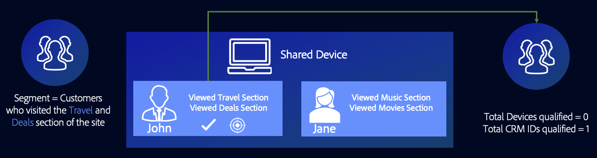

# Allgemeine Anwendungsfälle für Profilzusammenführungsrichtlinien {#general-use-cases-for-profile-merge-rules}

Mit den [!UICONTROL Profile Merge Rules] -Optionen können Sie den Fokus der Zielgruppe auf bestimmte Zielgruppen entsprechend den geschäftlichen Anforderungen oder Zielen erweitern oder einschränken. In diesen allgemeinen Anwendungsfällen wird untersucht, wie Sie verfügbare Optionen verwenden und Zusammenführungsregeln für individuelles, häusliches und geräteübergreifendes Targeting erstellen können. [!UICONTROL Profile Merge Rules] arbeitet mit Echtzeit- und Batch-Zielen.

>[!TIP]
>
>Definitionen und Beschreibungen dieser [!UICONTROL Merge Rule]-Einstellungen finden Sie unter [Optionen für Profilzusammenführungsregeln definiert](merge-rule-definitions.md).

## Geräte-Targeting {#device-personalization}

Dieses Szenario gilt für Marketingexperten, die ein einzelnes Geräteprofil für ein in Audience Manager definiertes Zielgruppensegment auswerten möchten, um dem Gerät ein konsistentes Erlebnis mit Zielplattformen zu bieten, die Geräte-IDs unterstützen (DSP, On-site-Personalisierungsplattformen und andere gerätebasierte Targeting-Plattformen), wobei die Benutzerauthentifizierung nicht berücksichtigt wird.

Um eine Regel zu erstellen, die nur für Geräteprofile bestimmt ist, wählen Sie **[!UICONTROL No Cross-Device Profile]** + **[!UICONTROL Device Profile]** aus.

Angenommen, John besitzt drei Smartphones. Zwei davon sind iPhone 7s auf Datenplan A und einer von ihnen ist Samsung auf Datenplan B. John&#39;s Mobilnetzbetreiber berücksichtigt seinen Authentifizierungsstatus auf keinem der drei Geräte und möchte ihm ein Upgrade seines Datenplans anbieten, jedoch nur für iPhone 7-Geräte, die auf Datenplan A laufen.

Durch die Verwendung der Regel **[!UICONTROL No Cross-Device Profile]** + **[!UICONTROL Device Profile]** qualifizieren sich [!DNL Device 1] und [!DNL Device 3] für das Segment, während Gerät 2 ignoriert wird.

## Freigegebenes Geräte-Targeting {#target-shared-devices}

Nehmen wir an, John und seine Frau Jane, verwenden denselben Laptop, um einen Onlineshop zu besuchen und verschiedene Artikel zu bestellen.

John nutzt sein eigenes Konto, um Reisetickets und Sonderangebote zu buchen, während Jane ihr eigenes Konto für Musik und Filme nutzt.

Das Marketing-Team des Stores kann die Regel **[!UICONTROL Current Authenticated Profiles]** + **[!UICONTROL No Device Profile]** verwenden, um John und Jane auf der Grundlage ihrer authentifizierten Aktivität mit bestimmten Angeboten anzusprechen.

Durch die Verwendung dieser Regel ignoriert Audience Manager das Geräteprofil vollständig, qualifiziert die CRM-ID von John für das Segment und qualifiziert nicht die CRM-ID von Jane.

## Online-/Offline-Targeting {#device-household-targeting}

Dieser Anwendungsfall umfasst das Identitätsmanagement von Haushalten. Ein Unternehmen kann ein einzelnes Geräteprofil mithilfe der Regel **[!UICONTROL Last Authenticated Profiles]** + **[!UICONTROL Device Profile]** mit dem letzten Profil zusammenführen, das auf diesem Gerät authentifiziert wurde.

Betrachten wir ein Segment, das aus Haushalten mit einem Einkommen von über 100.000 US-Dollar pro Jahr besteht und mindestens ein Gerät enthält, das bei [!DNL Data Plan B] eine 0 aufweist. [!DNL iPhone 7] Wir haben zwei Haushaltsprofile (geräteübergreifende Profile), die jeweils mit zwei verschiedenen Geräteprofilen verbunden sind. Die Eigenschaften, die für die Qualifizierung für das Segment erforderlich sind, werden über die Geräte- und geräteübergreifenden Profile verteilt.

Audience Manager führt jedes Geräte- und geräteübergreifende Profilpaar zusammen, um zu sehen, ob der zusammengeführte Satz von Eigenschaften für das Segment qualifiziert ist. Da Audience Manager jedes Profil auswertet, das in der Zusammenführung enthalten war, können sowohl ein Geräteprofil als auch ein Haushaltsprofil segmentiert werden.

Die Verknüpfung zwischen Gerät und Haushaltsprofil ermöglicht es dem Audience Manager, [!DNL Household 2] für das Segment zu qualifizieren, nicht jedoch [!DNL Household 1]. Von [!DNL Household 2] qualifiziert sich nur [!DNL Device 3] für das Segment. Mit diesem [!UICONTROL Profile Merge Rule] -Wert kann der Marketing-Experte eine konsistente Marketing-Botschaft an ein einzelnes Gerät ([!DNL Device 3]) und den weiteren Haushalt ([!DNL Household 2]) senden.

## Targeting für personenbasierte Ziele {#all-cross-device}

>[!IMPORTANT]
>
>Dieser Artikel enthält die Produktdokumentation, die Sie durch die Einrichtung und Nutzung dieser Funktion führen soll. Nichts in diesem Dokument ist Rechtsberatung. Wenden Sie sich an Ihren Rechtsbeistand, um rechtliche Hinweise zu erhalten.

Dieses Targeting-Szenario ist nur für Kunden verfügbar, die das Add-on [!DNL People-Based Destinations] erworben haben. Diese Regel ermöglicht es Marketingexperten, Kunden basierend auf ihren eigenen, authentifizierten Daten zu erreichen.

Nehmen wir an, ein Online-Einzelhändler möchte bestehende Kunden über soziale Plattformen erreichen und ihnen personalisierte Angebote basierend auf ihren bisherigen Bestellungen zeigen. Mit [!UICONTROL People-Based Destinations] können sie Hash-E-Mail-Adressen von ihrem eigenen [!DNL CRM] in den Audience Manager aufnehmen, Segmente aus den Offline-Daten erstellen und diese Segmente an die Social-Plattformen senden, für die sie werben möchten, indem sie diese Hash-Kennung verwenden und ihre Werbeausgaben optimieren.

Weitere Informationen zu dieser Option finden Sie unter [People-Based Destinations](../destinations/people-based-destinations-overview.md).

## Gerätediagrammoptionen {#device-graph-options}

Die Auswahl einer [!UICONTROL device graph] -Option für eine [!UICONTROL Profile Merge] -Regel hängt von Bedingungen ab, die für Ihre digitalen Eigenschaften und Geschäftsziele eindeutig sind. Diese allgemeinen Richtlinien helfen Ihnen dabei zu verstehen, wann ein Diagrammtyp im Vergleich zu einem anderen verwendet werden soll. Beachten Sie, dass Sie über eine vertragliche Beziehung zu einem externen Gerätediagramm verfügen müssen, um diese Optionen verwenden zu können. In der folgenden Tabelle finden Sie allgemeine Hinweise dazu, wann eine Gerätediagrammoption ausgewählt werden soll. Spezifische Anwendungsfälle finden Sie unter [Anwendungsfälle für Profillinkgerät-Diagramme](profile-link-use-case.md) und [Anwendungsfälle für externe Gerätediagramme](external-graph-use-cases.md).

<table id="table_66D9152D4FF040A186003272D456625D"> 
 <thead> 
  <tr> 
   <th colname="col1" class="entry"> Gerätediagramm-Typ </th> 
   <th colname="col2" class="entry"> Beschreibung </th> 
  </tr>
 </thead>
 <tbody> 
  <tr> 
   <td colname="col1"> 
 Profil-Link-Gerätediagramm 
 </td> 
   <td colname="col2"> 
 Mit der Option  Profillink erstellte Regeln zur Profilzusammenführung eignen sich ideal für: 
 
 
     <ul id="ul_FF44FA894BB2448887C8EDA9C8407EF9"> 
      <li id="li_E22505210C664FE6A9AA7C61244B36DA">Digitale Eigenschaften mit einer allgemeinen Kundenauthentifizierung. </li> 
      <li id="li_BE7112EE611E4DEB95B5C0A2852BFA97">Gezielte Kampagnen mit geringer Reichweite. Das Gerätediagramm für den  Profillink basiert nur auf deterministischen Daten. Dieser Pool von Geräteprofilen ist immer kleiner im Verhältnis zum Pool nicht authentifizierter Benutzer und Geräte. </li> 
      <li id="li_5FD9E936A72A4EFE80E694FA2E08E385">Anwendungsfälle, in denen Kunden sich in einem authentifizierten Status befinden müssen, um für die Segmentierung qualifiziert zu sein. </li> 
     </ul> 
 </td> 
  </tr> 
  <tr> 
   <td colname="col1"> 
Grafikoptionen für externe Geräte 
 </td> 
   <td colname="col2"> 
 Regeln zur Profilzusammenführung, die mit einem externen Gerätediagramm erstellt wurden, das in  Audience Manager integriert ist, eignen sich ideal für: 
 
 
     <ul id="ul_D76D773988604A619FA4A3BF37F910F0"> 
      <li id="li_969A0755A9E34CBEB2F7331C137B9A26">Digitale Eigenschaften mit geringer Kundenauthentifizierung. </li> 
      <li id="li_AC78C8B4AD5340FFAC44FE851096C6A6">Umfassende, umfassende Markenkampagnen. </li> 
      <li id="li_14AEC54CE34440889A3A36324EC6F497">Anwendungsfälle, in denen Kunden nicht authentifiziert sein müssen, um für die Segmentierung qualifiziert zu sein. </li> 
     </ul> 
 </td> 
  </tr> 
 </tbody> 
</table>

Sehen Sie sich das Video unten an, um einen Überblick über mögliche Anwendungsfälle für [!UICONTROL Profile Merge Rules] zu erhalten.

>[!VIDEO](https://video.tv.adobe.com/v/28975/)

>[!MORELIKETHIS]
>
>* [Anwendungsfälle für das Profil-Link-Gerätediagramm](profile-link-use-case.md)
>* [Anwendungsfälle für externe Gerätediagramme](external-graph-use-cases.md)
>* [Häufig gestellte Fragen zu Profilzusammenführungsregeln](../../faq/faq-profile-merge.md)
