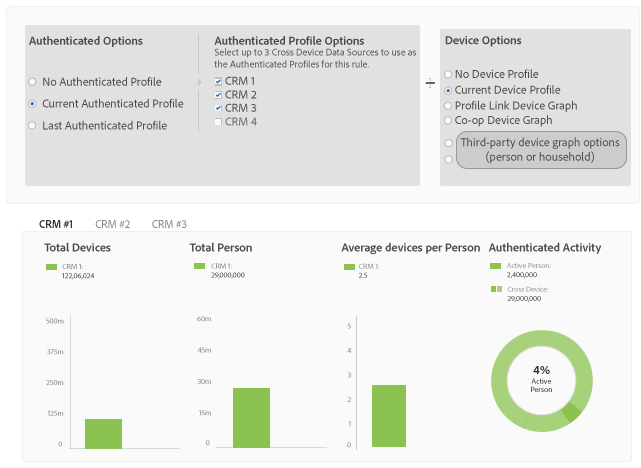
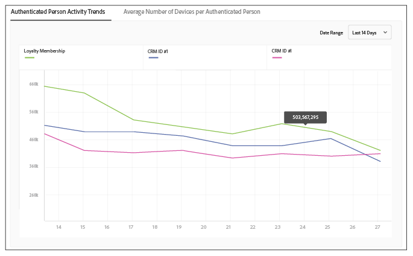

# Report Metrics for Profile Merge Rules {#report-metrics-for-profile-merge-rules}

[!UICONTROL Profile Link] Metriken liefern Daten zu Personen und Geräten, die sich auf Ihrer Site authentifizieren. The data and graphs in [!UICONTROL Profile Link] update dynamically as you create a merge rules or when you click an existing rule from the [!UICONTROL Profile Merge Rules] dashboard. These metrics can include device graph from the [!DNL Adobe Experience Cloud Device Co-op] or other third-party device graph sources.

## Merge Rule Metrics {#merge-rule-metrics}

Reports return data in side-by-side bar graphs when your merge rules use data from the [Adobe Experience Cloud Device Co-op](https://marketing.adobe.com/resources/help/en_US/mcdc/) or other, third-party device graphs you may have access to in [!DNL Audience Manager]. This lets you compare your authenticated, first-party data with cross-device data provided by the [!UICONTROL Experience Cloud Device Co-op] or another, third-party device graph. For information about data returned by the [!UICONTROL Device Co-op], see [The Device Graph: Internal Processes and Output](https://marketing.adobe.com/resources/help/en_US/mcdc/mcdc-processes.html). Diese Daten werden täglich aktualisiert.

<table id="table_A7FB2F9804F84AC8A6DD05C0E6EE7555"> 
 <thead> 
  <tr> 
   <th colname="col1" class="entry"> Metrik </th> 
   <th colname="col2" class="entry"> Beschreibung </th> 
  </tr> 
 </thead>
 <tbody> 
  <tr> 
   <td colname="col1"> 
 <b> Authentifizierte Aktivität</b> 
 </td> 
   <td colname="col2"> 
Zeigt Folgendes: 
 
    <ul id="ul_7F7373919A4A49028EF4BF7B28D9F8E9"> 
     <li id="li_FE2F93C496D64ED8928B3E522C9585EA">  Aktive Personen: Die Anzahl der Personen, die in den letzten 60 Tagen für Ihre Site authentifiziert haben. </li> 
     <li id="li_60CFD26EE68B442683C0ED5FED1A79C8">  Geräteübergreifend: Die Gesamtanzahl  der in der Datenquelle<a href="../../features/manage-datasources.md#create-data-source"> des ausgewählten </a> Authentifizierungsprofils gespeicherten Geräte-IDs<a href="../../features/profile-merge-rules/merge-rule-definitions.md"> für die Lebensdauer, die die Datenquelle bereits vorhanden ist.</a> </li> 
     <li id="li_F2F07B6A326C4A18B79A0CF2C47D9677">  % Aktive Personen: Zeigt  aktive Personen als % an. </li> 
    </ul> 
  Mit authentifizierten Aktivitäten können Sie Datenquellen nach Aktivität, Volumen und Prozent vergleichen. Sie kann Ihnen dabei helfen, eine Datenquelle zu finden, die viele Personen und einen hohen Prozentsatz aktiver Benutzer aufweist. Sie können auch Werte beim Vergleich von Datenquellen mit hohem Anteil aktiver Benutzer im Vergleich zur Gesamtgröße der Zielgruppe finden. Manchmal ist eine Datenquelle mit niedriger Gesamtanzahl der Lebensdauer und einer hohen Aktivität wertvoller als die mit hohen Lebensdauerergebnissen und niedrigen Aktivitätszahlen. 
 
 
Note: The  Authenticated Activity metrics contain  Profile Link data only. This report does not include  Device Graph data. 
 
 </td> 
  </tr> 
  <tr> 
   <td colname="col1"> 
 <b> Durchschnittliche Geräte pro Person</b> 
 </td> 
   <td colname="col2"> 
 Zeigt die durchschnittliche Anzahl von Geräten an, die von Besuchern verwendet werden, die sich für die ausgewählte Datenquelle auf Ihrer Site authentifiziert haben. 
 </td> 
  </tr> 
  <tr> 
   <td colname="col1"> 
 <b> Geräte insgesamt</b> 
 </td> 
   <td colname="col2"> 
Zeigt die Gesamtzahl der Geräte an, die Personen für die Authentifizierung Ihrer Site für die ausgewählte Datenquelle verwendet haben. 
 </td> 
  </tr> 
  <tr> 
   <td colname="col1"> 
 <b> Personen insgesamt</b> 
 </td> 
   <td colname="col2"> 
Zeigt die Gesamtanzahl der Personen an, die für die ausgewählte Datenquelle als spezifisch identifiziert wurden. 
 </td> 
  </tr> 
 </tbody> 
</table>

## Device Graph Metrics {#device-graph-metrics}

The [!UICONTROL Merge Rules] reports also show data on the total number of people and devices who have visited your site for the selected data source and device graph. Diese Metriken geben Daten basierend auf voreingestellten Zeitintervallen (der Rückblickzeitraum) zurück, die je nach Gerät, das Sie beim Erstellen einer Regel auswählen, variieren. In der folgenden Tabelle sind die Berichtsintervalle für die einzelnen Gerätediagrammoptionen aufgeführt.

<table id="table_038983EBC71F4A55BBCA99212AC5DEE6"> 
 <thead> 
  <tr> 
   <th colname="col1" class="entry"> Gerätediagrammoption </th> 
   <th colname="col2" class="entry"> Berichtssuchintervall </th> 
  </tr>
 </thead>
 <tbody> 
  <tr> 
   <td colname="col1"> 
 Profillink 
 </td> 
   <td colname="col2"> 
 
     <ul id="ul_B2FF2341573840549FFB96579F537082"> 
      <li id="li_B37323C2F2434F41B407500AC5C15447">Personen insgesamt: 60 Tage </li> 
      <li id="li_08D911224A60418BBB3CFB4E70CE73D4">Geräte insgesamt: 120 Tage </li> 
     </ul> 
 </td> 
  </tr> 
  <tr> 
   <td colname="col1"> 
 Co-op Device Graph 
 </td> 
   <td colname="col2"> 
 
     <ul id="ul_64AD1DD89DF64703B70B973A463BA020"> 
      <li id="li_D7D3A3871F434CBFA71BE8929EB41648">Personen insgesamt: 180 Tage </li> 
      <li id="li_125D387986B2463EB310203CE5857EDA">Geräte insgesamt: 180 Tage </li> 
     </ul> 
 </td> 
  </tr> 
  <tr> 
   <td colname="col1"> 
 Liveramp 
 </td> 
   <td colname="col2"> 
 
     <ul id="ul_2772F3AD7E1440789B635794ECDE8DFB"> 
      <li id="li_1432363829D64615B1D349A3722D6268">Personen insgesamt: 180 Tage </li> 
      <li id="li_D5C0E3CE92524B54BBD36C73A326292B">Geräte insgesamt: 180 Tage </li> 
     </ul> 
 </td> 
  </tr> 
  <tr> 
   <td colname="col1"> 
 Tapad 
 </td> 
   <td colname="col2"> 
 
     <ul id="ul_274529DB58E6442E95C6AD89BECB1362"> 
      <li id="li_67102211A72A4E47AACFE5E369793C17">Personen insgesamt: 60 Tage </li> 
      <li id="li_3E8F3DA6A7B5487895A626674DA363A5">Geräte insgesamt 60 Tage </li> 
     </ul> 
 </td> 
  </tr> 
 </tbody> 
</table>

## Sample Reports {#sample-reports}

### Standard-Profillink-Bericht

A standard [!UICONTROL Profile Link] report looks like the following example. Zusammenführungsregeln, die mehrere Datenquellen (bis zu 3, maximal) verwenden, zeigen Diagramme in separaten Registern für jede Datenquelle an. This merge rule does not include [!UICONTROL Device Co-op] data.

### Profillink-Bericht mit Gerätediagrammdaten

A [!UICONTROL Profile Link] report that includes device graph data from the [!UICONTROL Adobe Experience Cloud Device Co-op] or a third-party device graph shows [!UICONTROL Profile Link] and device graph data with side-by-side bar graphs. Placing these graphs adjacent to each other lets you evaluate the benefits of using the [!UICONTROL Experience Cloud Device Co-op] compared to [!UICONTROL Profile Link] by itself. Zusammenführungsregeln, die mehrere Datenquellen (bis zu 3, maximal) verwenden, zeigen Diagramme in separaten Registern für jede Datenquelle an. As a reminder, the [!UICONTROL Authenticated Activity] graph and metrics do not return data from the [!DNL Adobe] device graph or other, third-party device graphs you may have access to in [!DNL Audience Manager].

## Profile Link Trend Graphs {#profile-link-trend}

In addition to the other data visualizations, [!UICONTROL Profile Link] reports include a line graph. Mit dem Liniendiagramm zeigen Sie Trends im Laufe der Zeit für Ihre Profilregeln an. Trend graphs (and the other reports) are available when you click a rule from the [!UICONTROL Profile Merge Rules] landing page ( **[!UICONTROL Audience Data > Profile Merge Rules]**). These graphs include device graph data if you're a member of the [!UICONTROL Device Co-op] or other, third-party device graphs you may have access to in [!DNL Audience Manager]. Klicken Sie auf eine Trendlinie, um die zugrunde liegenden Daten zu sehen.

>[!MORE_ LIKE_ THIS]
>
>* [Häufig gestellte Fragen zur Profilzusammenführung](../../faq/faq-profile-merge.md)

