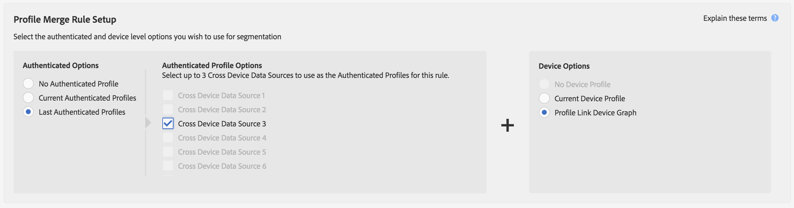

# Anwendungsbeispiele für Gerätediagramm-Diagramm {#profile-link-device-graph-use-cases}

Empfehlungen und Anwendungsfälle für Segmentretargeting und personalisierte Segmentqualifizierung mit [!UICONTROL Profile Link] dem Gerätediagramm.

## Recommendations {#recommendations}

Betrachten Sie das [!UICONTROL Profile Link] Gerätediagramm für Kampagnen, die:

* Sie haben eine hohe Authentifizierung über ihre digitalen Eigenschaften. Verwenden Sie eine [externe](../../features/profile-merge-rules/merge-rule-definitions.md#device-options) Gerätediagramm, wenn Sie eine kleine Menge authentifizierter Benutzer haben.
* Erfordert präzise Targeting bekannter Zielgruppen. Die Variable [!UICONTROL Profile Link device graph] wird mit authentifizierten, authentifizierten Daten erstellt.
* Target bekannter Zielgruppen in Echtzeit und nicht authentifizierte Status.

## Retargeting von Anwendungsfall und Regelkonfiguration für Profilzusammenführung {#retargeting-use-cases}

Target-Zielgruppen, die zuvor auf mehreren Geräten für die Site und/oder In-App authentifiziert wurden. Segmente können aus folgenden Profilen bestehen:

* Zuletzt bekanntes authentifiziertes Geräteprofil.
* Anonyme Aktivität über jedes Geräteprofil hinweg.

>[!NOTE]
>
>Eigenschaftsinformationen aus einem Profiltyp können zum Erstellen des Segments verwendet werden.

### Retargeting-Beispiel

Sehen wir uns an, wie dies mit einem Beispielkreditkartenunternehmen funktioniert. Dieses Beispiel verwendet Eigenschaftsinformationen, die aus der anonymen Aktivität erfasst wurden, die nur über 3 Geräteprofile hinweg erfasst wurde.

<table id="table_8C5ABA47A0634EBA9B1AA1B5C2AABF07"> 
 <thead> 
  <tr> 
   <th colname="col1" class="entry"> Nutzungsszenario </th> 
   <th colname="col2" class="entry"> Beschreibung </th> 
  </tr> 
 </thead>
 <tbody> 
  <tr> 
   <td colname="col1"> 
 <b>Bedingungen</b> 
 </td> 
   <td colname="col2"> 
In diesem Fall werden folgende Bedingungen angenommen: 
 
 
     <ul id="ul_72373D0F304044AE84E4CC055E3E8154"> 
      <li id="li_375DA786ED4D4F18A74C8FE42ABF8448">Ein Benutzer hat drei Geräte und ist die letzte Authentifizierung auf der Kreditkartenfirmenwebsite/App auf allen 3 Geräten. </li> 
      <li id="li_77FDBFAED21B4DE19AB2B6C112E0C64B">Auf dem ersten Gerät sieht ein Benutzer in einem nicht authentifizierten Zustand ein Angebot für eine Premium-Kreditkarte. </li> 
      <li id="li_D3BE1B30BCCA49EA931AA9D97DD5F86D">Auf dem zweiten Gerät sieht ein Benutzer in einem nicht authentifizierten Zustand die Seite der Kreditkartenzahlungen. </li> 
      <li id="li_39D894624FC44806B6DB2C77F459B39E">Auf dem dritten Gerät sieht ein Benutzer in einem nicht authentifizierten Zustand die Seite mit den Kreditkartengebühren und -raten. </li> 
     </ul> 
 </td> 
  </tr> 
  <tr> 
   <td colname="col1"> 
 <b>Ergebnisse</b> 
 </td> 
   <td colname="col2"> 
Unter diesen Bedingungen,  Audience Manager: 
 
 
     <ul id="ul_1B6174F5C3AF4C32831D4217C5113789"> 
      <li id="li_98FE54696B604C3C8D93CC1C1FBB48D9">Führt die anonyme, nicht authentifizierte Aktivität zusammen, die von allen 3 Geräten mit dem zuletzt authentifizierten Profil auf dem aktuellen Gerät erfasst wurde. </li> 
      <li id="li_A73C7DCE36BA42B6BAD26D8A075416C1">Wertet den anonymen Benutzer für Segmentqualifizierung basierend auf: 
       <ul id="ul_EF66EAFD12CA44F5ACCB66319606D937"> 
        <li id="li_541762056ECF4BC1ABF1F5116B5FED6C">Eine Kombination aus anonymen Aktivitäten für alle 3 Geräte. </li> 
        <li id="li_C386CB62E5234E10AFEDE900ADC0E261">Das letzte authentifizierte Profil auf dem aktuellen Gerät. </li> 
       </ul> </li> 
      <li id="li_5C9BDC8FF886494589F005C9658A923C">Sendet das Segment an ein beliebiges Echtzeit-Ziel für das Retargeting auf allen 3 Geräten. </li>
     </ul> 
 </td> 
  </tr> 
 </tbody> 
</table>

### Retargeting-Regelbeispiel für Profilzusammenführung

Um Retargeting mit [!UICONTROL Profile Link]Ihnen einzurichten, sollte Ihre [!UICONTROL Authenticated Options] und [!UICONTROL Device Options] sollte wie die unten stehende Regelkonfiguration aussehen. Die [!UICONTROL Authenticated Profile] Optionen unterscheiden sich von diesem Beispiel, da diese Einstellungen die Namen Ihrer geräteübergreifenden Datenquellen verwenden.

## Verwendungsfall für die Personalisierung und die Regelkonfiguration für Profilzusammenführung {#personalization-use-case}

Personalisieren Sie das Erlebnis für authentifizierte Zielgruppen auf der Site und/oder in-App basierend auf der Aktivität auf mehreren Geräten. Segmente können aus folgenden Profilen bestehen:

* Derzeit authentifizierte Geräteprofile.
* Anonyme Geräteprofile.

>[!NOTE]
>
>Ein Benutzer muss sich in einem authentifizierten Status befinden, um sich für ein Segment qualifizieren zu können.

### Personalisierungsbeispiel

Sehen wir uns an, wie dies mit einem Beispielkreditkartenunternehmen funktioniert.

<table id="table_D2F4D5D27EB54224BB2CC1D843DDEDA3"> 
 <thead> 
  <tr> 
   <th colname="col1" class="entry"> Nutzungsszenario </th> 
   <th colname="col2" class="entry"> Beschreibung </th> 
  </tr> 
 </thead>
 <tbody> 
  <tr> 
   <td colname="col1"> 
 <b>Bedingungen</b> 
 </td> 
   <td colname="col2"> 
In unserem Verwendungsfall werden folgende Bedingungen angenommen: 
 
 
     <ul id="ul_C4D2108E7B1C4D3C89411A9CCCDA6DAC"> 
      <li id="li_2F10EB17466B4B91A94DF707C3CB6BE5">Ein Benutzer hat drei Geräte und ist die letzte Authentifizierung auf der Kreditkartenfirmenwebsite/App auf allen 3 Geräten. </li> 
      <li id="li_1559C4DA51254BCF95291133F32A4057">Auf dem ersten Gerät sieht ein Benutzer in einem nicht authentifizierten Zustand ein Angebot für eine Premium-Kreditkarte. </li> 
      <li id="li_734465E5619C474291C42921160CEC6B">Auf dem zweiten Gerät sieht ein Benutzer in einem nicht authentifizierten Zustand die Seite der Kreditkartenzahlungen. </li> 
      <li id="li_B96ABC0205384B59A1901708505B8BF8">Auf dem dritten Gerät sieht ein Benutzer in einem nicht authentifizierten Zustand die Seite mit den Kreditkartengebühren und -raten. </li> 
      <li id="li_1A7BDBD546BD4B8EACF4292D885127F2">Auf einem dieser Geräte authentifiziert sich der Kunde (durch Anmeldung), um seinen Saldo zu prüfen. </li> 
     </ul> 
 </td> 
  </tr> 
  <tr> 
   <td colname="col1"> 
 <b>Ergebnisse</b> 
 </td> 
   <td colname="col2"> 
Unter diesen Bedingungen,  Audience Manager: 
 
 
     <ul id="ul_37DBF5FEABC5463D85C74AD9150EA177"> 
      <li id="li_B60FFA5CF3F64FB69997AA05595900D7">Führt die anonyme, nicht authentifizierte Aktivität zusammen, die von allen 3 Geräten mithilfe des aktuellen authentifizierten Profils erfasst wurde. Das authentifizierte Profil stellt für jedes Gerät eine allgemeine Kennung bereit. </li> 
      <li id="li_AB9FD87DD804474BA33805C364B7B92D">Wertet den authentifizierten Benutzer für Segmentqualifizierung basierend auf: 
       <ul id="ul_EAF99E72159D4E329052B71344D9C69B"> 
        <li id="li_0B5E52BA6D8B493980291EA7B0AE235A">Eine Kombination aus anonymen Aktivitäten für alle 3 Geräte. </li> 
        <li id="li_07588DEFBEF64F97850CB12CD62D0213">Ihr aktuelles authentifiziertes Profil. </li> 
       </ul> </li> 
      <li id="li_E7CFCEAD7610496189F4486000D7860A">Sendet das Segment an ein beliebiges Echtzeit-Ziel, um ein personalisiertes Browsing-Erlebnis für den Benutzer zu erstellen, während es auf seinem aktuellen Gerät authentifiziert wird. 
Hinweis: Dies qualifiziert alle 3 Geräte für das Segment unabhängig vom Authentifizierungsstatus. Dieses Ergebnis kann zu Datenschutzbedenken führen, wenn es sich um freigegebene Geräte handelt. 
 </li>
     </ul> 
 </td>
  </tr>
 </tbody> 
</table>

### Beispiel für eine Regel zur Personalisierung der Personalisierung

Um Personalisierung mit [!UICONTROL Profile Link]Ihnen einzurichten, sollte Ihre [!UICONTROL Authenticated Options] und [!UICONTROL Device Options] sollte wie die unten stehende Regelkonfiguration aussehen. Die [!UICONTROL Authenticated Profile] Optionen unterscheiden sich von diesem Beispiel, da diese Einstellungen die Namen Ihrer geräteübergreifenden Datenquellen verwenden.

Um weitere Informationen darüber zu erhalten, wie diese Gerätediagrammprozesse funktionieren, laden Sie unsere PDF-, [Audience Manager- und External Device Graph herunter](https://marketing.adobe.com/resources/help/en_US/aam/downloads/AAM_Device_Graphs.pdf).

>[!MORE_ LIKE_ THIS]
>
>* [Anwendungsbeispiele für Diagramme externer Geräte](../../features/profile-merge-rules/external-graph-use-cases.md)
>* [Allgemeine Anwendungsfälle für Regeln zur Profilzusammenführung](../../features/profile-merge-rules/merge-rule-targeting-options.md)
>* [Häufig gestellte Fragen zur Profilzusammenführung](../../faq/faq-profile-merge.md)

