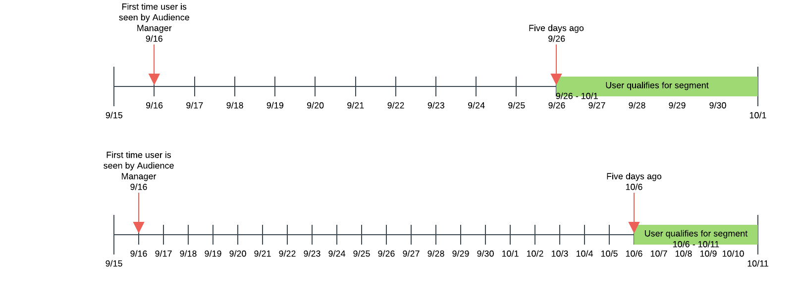

# Neuigkeit und Häufigkeit {#recency-and-frequency}

In [!UICONTROL Segment Builder] können Sie mit Neuigkeit und Häufigkeit Besucher basierend auf Aktionen segmentieren, die in einem bestimmten täglichen Intervall auftreten oder sich wiederholen.

Audience Manager definiert [!DNL recency] und [!DNL frequency] wie folgt:

* **[!UICONTROL Recency]:** Wie kürzlich ein Benutzer für eine (oder mehrere) [!UICONTROL traits] angezeigt oder qualifiziert hat.
* **[!UICONTROL Frequency]:** Die Rate, mit der ein Benutzer eine (oder mehrere) [!UICONTROL traits] angesehen oder sich qualifiziert hat.

Mit den Einstellungen [!UICONTROL Recency] und [!UICONTROL Frequency] können Sie Besucher anhand ihres tatsächlichen (oder wahrgenommenen) Interesses an einer Site, einem Abschnitt oder bestimmten kreativen Elementen segmentieren. Beispielsweise können Benutzer, die sich für ein Segment mit hohen Anforderungen an Neuigkeit/Häufigkeit qualifizieren, mehr an einer Site oder einem Produkt interessiert sein als Benutzer, die weniger oder weniger häufig besuchen.

## Position der [!UICONTROL Recency and Frequency]-Einstellungen {#location}

In [!UICONTROL Segment Builder] befinden sich die Einstellungen [!UICONTROL Recency] und [!UICONTROL Frequency] im Abschnitt [!UICONTROL Basic View] des Bereichs [!UICONTROL Traits]. Klicken Sie auf das Uhrensymbol, um diese Steuerelemente anzuzeigen.

## Einschränkungen und Regeln {#limitations-rules}

Lesen und verstehen Sie diese Einschränkungen und Regeln, wenn Sie Neuigkeit und Häufigkeit auf Eigenschaften in Ihren Segmenten anwenden möchten.

### [!UICONTROL Recency] {#recency}

<table id="table_026064124C694D75B7A960457D50170B"> 
 <thead> 
  <tr> 
   <th colname="col1" class="entry"> Beschränkung oder Regel </th> 
   <th colname="col2" class="entry"> Beschreibung </th> 
  </tr> 
 </thead>
 <tbody> 
  <tr> 
   <td colname="col1"> 
 <b>Mindestwert</b> 
 </td> 
   <td colname="col2"> 
Neuigkeit muss größer als 0 sein. 
 </td> 
  </tr>
  <tr> 
   <td colname="col1"> 
 <b>Eigenschaftstypen</b> 
 </td> 
   <td colname="col2"> 
Sie können Neuigkeitssteuerungen nur auf regelbasierte und Ordnereigenschaften anwenden. 
 </td> 
  </tr> 
  <tr> 
   <td colname="col1"> 
 <b>Eigenschaften von Drittanbietern</b> 
 </td> 
   <td colname="col2"> 
Sie können keine Neuigkeitsregeln für einzelne Eigenschaften von Drittanbietern oder Eigenschaftsgruppen festlegen, die Eigenschaften von Drittanbietern enthalten. Neuigkeit und Häufigkeit gelten nur für Ihre eigenen Eigenschaften. 
 </td> 
  </tr> 
 </tbody> 
</table>

### [!UICONTROL Frequency] {#frequency}

<table id="table_EBD621D26C8B4D03933E8C0753C892A7"> 
 <thead> 
  <tr> 
   <th colname="col1" class="entry"> Beschränkung oder Regel </th> 
   <th colname="col2" class="entry"> Beschreibung </th> 
  </tr> 
 </thead>
 <tbody> 
  <tr> 
   <td colname="col1"> 
 <b>Eigenschaften von Drittanbietern</b> 
 </td> 
   <td colname="col2"> 
Sie können keine Häufigkeitsregeln für einzelne Eigenschaften von Drittanbietern oder Eigenschaftsgruppen festlegen, die Eigenschaften von Drittanbietern enthalten. Neuigkeit und Häufigkeit gelten nur für Ihre eigenen Eigenschaften. 
 </td> 
  </tr> 
  <tr> 
   <td colname="col1"> 
 <b>Eigenschaftstypen</b> 
 </td> 
   <td colname="col2"> 
Sie können Frequenzsteuerungen nur auf regelbasierte und Ordnereigenschaften anwenden. 
 </td> 
  </tr> 
  <tr> 
   <td colname="col1"> 
 <b>Neuigkeitsanforderungen</b> 
 </td> 
   <td colname="col2"> 
Sie können die Frequenzanforderungen <i> konfigurieren, ohne dass</i> die Neuigkeitserfordernisse konfiguriert. Legen Sie einfach einen Frequenzwert fest und lassen Sie das Neuigkeitsfeld leer. 
 </td> 
  </tr> 
  <tr> 
   <td colname="col1"> 
<b>Profilzusammenführungsrichtlinien</b> 
 </td> 
   <td colname="col2"> 
Siehe <a href="../../faq/faq-profile-merge.md#trait-freq-device-rules"> Häufigkeit von Eigenschaften, externe Gerätediagramme und Profilzusammenführungsrichtlinien</a>. 
 </td> 
  </tr> 
 </tbody> 
</table>

## Neuigkeitsbeispiele {#recency-examples}

Im Folgenden finden Sie zwei Beispiele, wie Neuigkeit je nach Auswahl in der Benutzeroberfläche funktioniert:

### Operator kleiner oder gleich (&lt;=)

In diesem Beispiel wählen Sie den Operator &lt;= aus, wie im Screenshot gezeigt. Dies qualifiziert Ihren Benutzer für die [!UICONTROL segment], wenn er innerhalb der letzten fünf Tage mindestens dreimal für eine der drei [!UICONTROL traits] qualifiziert ist. In der folgenden Zeitleiste sehen Sie die [!UICONTROL segment]-Qualifizierung zum Zeitpunkt der Erstellung des [!UICONTROL segment], am 1. Oktober und zehn Tage später.

### Operator größer oder gleich (=>) verwenden

In diesem Beispiel wählen Sie den Operator => aus, wie im Screenshot gezeigt. Dies qualifiziert den Benutzer für die [!UICONTROL segment], wenn er sich zwischen seiner ersten Qualifikation auf der Audience Manager-Plattform und der Abschaltzeit vor fünf Tagen mindestens dreimal für eine der drei [!UICONTROL traits] qualifiziert hat. In der folgenden Zeitleiste sehen Sie die [!UICONTROL segment]-Qualifizierung zum Zeitpunkt der Erstellung des [!UICONTROL segment], am 1. Oktober und zehn Tage später.

## Beispiele für Frequenzlimitierung {#frequency-capping}

Ausdrücke mit Frequenzlimitierung umfassen alle Benutzer, deren Anzahl von [!UICONTROL trait] Realisierungen unter dem gewünschten Wert liegt. Im Folgenden finden Sie einige Beispiele für &quot;Richtig&quot;und &quot;Falsch&quot;:

* Falsch - Der Ausdruck `frequency([1000T]) <= 5` umfasst alle Benutzer, die den [!UICONTROL trait] mit der ID &quot;1000&quot;bis zu fünfmal realisiert haben, aber auch Benutzer, die den [!UICONTROL trait] nicht realisiert haben. Daher validiert Audience Manager diesen Ausdruck aus Leistungsgründen nicht, da er zu viele Benutzer für den [!UICONTROL segment] qualifizieren würde.

* Rechts - Wenn Sie alle Benutzer einbeziehen möchten, die den [!UICONTROL trait] mit der ID &quot;1000&quot;bis zu fünfmal erfüllt haben, fügen Sie dem Ausdruck eine weitere Bedingung hinzu, um sicherzustellen, dass sich die Benutzer mindestens einmal für den [!UICONTROL trait] qualifiziert haben: `frequency([1000T]) >= 1  AND  frequency([1000T]) <= 5`

* Rechts: Wenn die Neuigkeits-/Frequenzanforderungen kleiner als eine bestimmte Anzahl von Malen oder Tagen sein müssen, fügen Sie diese [!UICONTROL trait] mit einem `AND` -Operator zu einem anderen hinzu. Anhand des Beispiels im ersten Aufzählungspunkt wird dieser Ausdruck gültig, wenn er mit einem anderen [!UICONTROL trait] verbunden wird, wie hier gezeigt: `frequency([1000T]) <= 5 AND isSiteVisitorTrait`.

* Rechts - In Anwendungsfällen mit Frequenzlimitierung für Werbung können Sie eine [!UICONTROL segment] -Regel ähnlich der folgenden erstellen: `(frequency([1000T] <= 2D) >= 5)`. Dieser Ausdruck umfasst alle Benutzer, die in den letzten 2 Tagen mindestens fünfmal die Kennung &quot;[!UICONTROL trait]&quot;mit der ID &quot;1000&quot;implementiert haben. Legen Sie die Frequenzlimitierung fest, indem Sie diese [!UICONTROL segment] an den Anzeigen-Server senden, für den auf dem [!UICONTROL segment] -Anzeigenserver ein `NOT` eingestellt ist. Mit diesem Ansatz wird eine höhere Leistung in [!DNL Audience Manager] erzielt, wobei für die Frequenzlimitierung immer noch der gleiche Zweck gilt.

>[!MORELIKETHIS]
>
>* [Steuerelemente in Segment Builder: Abschnitt &quot;Eigenschaften&quot;](../../features/segments/segment-builder.md#segment-builder-controls-traits)
>* [Im Ausdruckseditor für Segmente verwendete Code-Syntax](../../features/segments/segment-code-syntax.md)
