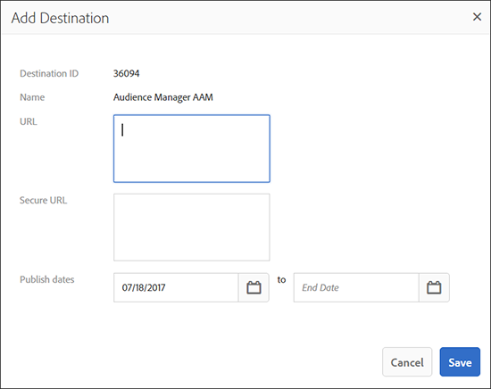

# [!UICONTROL Segment Builder] {#segment-builder}

Beschreibt die erforderlichen und optionalen Schritte zum Erstellen eines Segments in [!UICONTROL Segment Builder].

## Videodemonstration

Sehen Sie sich zunächst das Video [Erstellen von Segmenten im Audience Manager](https://images-tv.adobe.com/avp/vr/b7f88801-efe0-4786-9d58-554db16b34eb/81b6f004-cec0-452c-9b35-dabdc69ae3b4/9dc8a1d4-350d-46c3-90a6-5197dfb76f40_20180130023449.854x480at800_h264.mp4) an. Das Video führt Sie durch den Prozess der Segmenterstellung. Weitere Informationen finden Sie in den folgenden Abschnitten.

## Erstellen einer [!UICONTROL Segment] {#create-segment}

### Segment Builder-Abschnitt

<!-- t_create_segment.xml -->

[!UICONTROL Segment Builder] besteht aus 3 separaten Abschnitten: [!UICONTROL Basic Information], [!UICONTROL Traits] und [!UICONTROL Destinations Mapping]. Um einen [!UICONTROL segment] zu erstellen, füllen Sie die erforderlichen Felder in den Abschnitten [!UICONTROL Basic Information] und [!UICONTROL Traits] aus. [!UICONTROL Destinations Mapping] -Einstellungen sind optional. Weitere Hilfe finden Sie in den unten stehenden Anweisungen.

1. Im Abschnitt [Grundlegende Informationen](../../features/segments/segment-builder.md#segment-builder-controls-basics) :

   

   * Nennen Sie die &quot;[!UICONTROL segment]&quot;. Die maximale Länge eines [!UICONTROL segment] -Namens beträgt 255 Zeichen.
   * Den Status &quot;[!UICONTROL segment]&quot;(standardmäßig aktiv) festlegen.
   * Wählen Sie eine [!UICONTROL data source]. Verwenden Sie das erste Dropdownmenü, um zwischen Audience Manager [!UICONTROL data sources], Adobe Analytics-Report Suites oder beidem zu filtern. Verwenden Sie dann das zweite Dropdown-Menü, um Ihren [!UICONTROL data source] auszuwählen. Wenn Sie keine Adobe Analytics Report Suites verwenden, ist die Auswahl vom Typ [!UICONTROL data source] deaktiviert und standardmäßig nur auf Audience Manager-Datenquellen festgelegt.
   * Wählen Sie eine [!UICONTROL profile merge rule] für die [!UICONTROL segment] -Qualifizierung aus.
   * Weisen Sie die [!UICONTROL segment] einem Speicherordner zu.

1. Im Abschnitt [Eigenschaften](../../features/segments/segment-builder.md#segment-builder-controls-traits) :
   
   * Suchen Sie nach dem [!UICONTROL trait] , den Sie einem Segment hinzufügen möchten, und klicken Sie auf **[!UICONTROL Add Trait]**. Fügen Sie weitere [!UICONTROL trait] hinzu, um eine [!UICONTROL trait] -Gruppe zu erstellen.
   * Vergrößern Sie das Modal [!UICONTROL Advanced Search] durch Klicken auf **[!UICONTROL Browse All Traits]**. Suchen Sie nach [!UICONTROL traits] nach Name, ID, Beschreibung oder [!UICONTROL data source]. Klicken Sie auf einen Ordner, während Sie suchen, um die Ergebnisse auf diesen Ordner und dessen Unterordner zu beschränken. Sie können auch [!UICONTROL traits] nach [!UICONTROL trait type] ([!UICONTROL Folder Trait], [!UICONTROL Rule-based], [!UICONTROL Onboarded] und [!UICONTROL Algorithmic]) oder Populationstyp ([Geräte-ID](../../reference/ids-in-aam.md) und [Geräteübergreifende ID](../../reference/ids-in-aam.md)) filtern.
     
   * Holen Sie sich live [Eigenschaftsempfehlungen](trait-recommendations.md) beim Erstellen Ihrer [!UICONTROL segment].
   * Klicken Sie auf und ziehen Sie [!UICONTROL traits] , um separate Gruppen zu erstellen.
   * Bewegen Sie den Mauszeiger zwischen Gruppen, um Beziehungen mit booleschen [!UICONTROL AND]-, [!UICONTROL OR]- und [!UICONTROL AND NOT]-Werten festzulegen.
   * Bewegen Sie den Mauszeiger über das Uhrensymbol, um [Neuigkeit und Häufigkeit](../../features/segments/recency-and-frequency.md) Regeln zu den [!UICONTROL trait] hinzuzufügen.
   * Anzeigen von Segmentpopulationsdaten beim Hinzufügen oder Entfernen von [!UICONTROL traits] Klicken Sie auf **[!UICONTROL Calculate Estimates]** , um die geschätzten Populationszahlen anzuzeigen (oder zu aktualisieren). Weitere Informationen zu [Segmentpopulationsdaten](../../features/segments/segment-builder-data.md#segment-populations) finden Sie im Abschnitt [!UICONTROL Segment Builder].
   * Klicken Sie abschließend auf **[!UICONTROL Save]** .

1. *(Optional)* Ordnen Sie einen [!UICONTROL segment] im Abschnitt [Zielzuordnung](../../features/segments/segment-builder.md#segment-builder-controls-destinations) einem [!UICONTROL destination] zu:
   * Suchen Sie nach dem [!UICONTROL destination] und klicken Sie auf **[!UICONTROL Add Destination]**. Beachten Sie, dass die [!UICONTROL destination] bereits vorhanden sein muss, bevor Sie sie zu einer [!UICONTROL segment] hinzufügen können.
   * Klicken Sie abschließend auf **[!UICONTROL Save]** .

Sehen Sie sich das Video unten an, um sich ausführlich anzusehen, wie geräteübergreifende Metriken funktionieren.

>[!VIDEO](https://video.tv.adobe.com/v/33445)

## [!UICONTROL Segment Builder] Steuerelemente: [!UICONTROL Basic Information] Abschnitt {#segment-builder-controls-basics}

In den Einstellungen [!UICONTROL Segment Builder] und [!UICONTROL the Basic Information] können Sie neue Eigenschaften erstellen oder vorhandene Eigenschaften bearbeiten. Um ein neues [!UICONTROL segment] zu erstellen, geben Sie einen Namen, ein [!UICONTROL data source] an und wählen Sie einen Speicherordner aus. Alle anderen Felder sind optional. Wechseln Sie nach Abschluss zum Abschnitt &quot;[!UICONTROL Traits]&quot;.

<!-- r_segment_basic_info_section.xml -->

<!--

<table id="table_39DA4BC9470448B48F6654F2774EE0D5"> 
 <thead> 
  <tr> 
   <th colname="col1" class="entry"> Field </th> 
   <th colname="col2" class="entry"> Description </th> 
  </tr> 
 </thead>
 <tbody> 
  <tr> 
   <td colname="col1"> <b>Name</b> </td> 
   <td colname="col2"> 
Give the segment a short, logical name that describes its function or purpose. Avoid abbreviations and special characters. The maximum length of a segment name is 255 characters. 
 </td> 
  </tr> 
  <tr> 
   <td colname="col1"> <b>Description</b> </td> 
   <td colname="col2"> 
A field for additional descriptive information about the segment. 
 </td> 
  </tr> 
  <tr> 
   <td colname="col1"> <b>Integration Code</b> </td> 
   <td colname="col2"> 
A field for a user-defined ID or other company-specific information. 
 </td> 
  </tr> 
  <tr> 
   <td colname="col1"> <b>Data Source</b> </td> 
   <td colname="col2"> 
Associates the segment with a specific data provider. 
Use the first drop-down menu to filter between Audience Manager data sources, Adobe Analytics report suites, or both. Then, use the second drop-down menu to choose your data source.

 If you are not using Adobe Analytics report suites, the data source type selector is disabled and defaulted to Audience Manager data sources only.

 </td> 
  </tr> 
  <tr> 
   <td colname="col1"><b>Profile Merge Rule</b> </td> 
   <td colname="col2"> 
Selects the Profile Merge Rule to use for segment qualification. 
 </td> 
  </tr> 
  <tr> 
   <td colname="col1"> <b>Status</b> </td> 
   <td colname="col2"> 
Activates or deactivates the segment (active by default). 
 </td> 
  </tr> 
  <tr> 
   <td colname="col1"> <b>Folder Storage</b> </td> 
   <td colname="col2"> 
Determines which storage folder the segment belongs to. 
 </td> 
  </tr> 
 </tbody> 
</table>

-->

| Feld | Beschreibung |
---------|----------
| **[!UICONTROL Name]** | Geben Sie dem Segment einen kurzen logischen Namen, der seine Funktion oder seinen Zweck beschreibt. Vermeiden Sie Abkürzungen und Sonderzeichen. Die maximale Länge eines Segmentnamens beträgt 255 Zeichen. |
| **[!UICONTROL Description]** | Ein Feld für zusätzliche beschreibende Informationen zum Segment. |
| **[!UICONTROL Integration Code]** | Ein Feld für eine benutzerdefinierte ID oder andere unternehmensspezifische Informationen. |
| **[!UICONTROL Data Source]** | Verbindet das Segment mit einem bestimmten Datenanbieter.   Verwenden Sie das erste Dropdownmenü, um zwischen Audience Manager-Datenquellen, Adobe Analytics-Report Suites oder beidem zu filtern. Wählen Sie dann im zweiten Dropdown-Menü Ihre Datenquelle aus.   Wenn Sie keine Adobe Analytics Report Suites verwenden, ist die Datenquellenauswahl deaktiviert und standardmäßig nur auf Audience Manager-Datenquellen festgelegt. |
| **[!UICONTROL Profile Merge Rule]** | Wählt die Profilzusammenführungsrichtlinie aus, die für die Segmentqualifizierung verwendet werden soll. |
| **[!UICONTROL Status]** | Aktiviert oder deaktiviert das Segment (standardmäßig aktiv). |
| **Ordnerspeicher** | Bestimmt, zu welchem Speicherordner das Segment gehört. |

## [!UICONTROL Segment Builder] Steuerelemente: [!UICONTROL Traits] Abschnitt {#segment-builder-controls-traits}

In [!UICONTROL Segment Builder] können Sie mit dem Abschnitt [!UICONTROL Traits] [!UICONTROL traits] in einem [!UICONTROL segment] verwalten, [!UICONTROL trait] Gruppen erstellen und Qualifizierungskriterien festlegen. Um einer [!UICONTROL segment] den Wert [!UICONTROL trait] hinzuzufügen, geben Sie den Namen [!UICONTROL trait] in das Suchfeld ein und klicken Sie auf [!UICONTROL Add Trait]. Speichern Sie die [!UICONTROL trait] (falls fertig) oder fahren Sie mit [!UICONTROL Destinations Mapping] fort.

<!-- r_segment_traits_section.xml-->

**Voraussetzungen:** Füllen Sie die erforderlichen Felder im Abschnitt [!UICONTROL Basic Information] aus.

| Feld | Beschreibung |
|--- |--- |
| **[!UICONTROL Basic View]** | Dieser Abschnitt enthält visuelle Steuerelemente, mit denen Sie: <ul><li>Erstellen Sie neue und verwalten Sie vorhandene [!UICONTROL segments].</li><li>Entfernen Sie [!UICONTROL traits] aus einer [!UICONTROL segment].</li><li>Erhöhe eine [!UICONTROL segment] um bis zu 50 (maximal) [!UICONTROL traits].</li><li>Ziehen Sie [!UICONTROL traits] in den Arbeitsbereich, um neue Gruppen zu erstellen.</li><li>Anzeigen von [!UICONTROL traits] - und [!UICONTROL trait] -Gruppen in einer [!UICONTROL segment].</li><li>Legen Sie Qualifizierungskriterien mit booleschen Ausdrücken, Vergleichsoperatoren und Einstellungen für Neuigkeit/Häufigkeit fest.</li></ul> |
| **[!UICONTROL Code View]** | Öffnet eine Entwicklungsumgebung, in der Sie anstelle der visuellen Benutzeroberfläche [!UICONTROL traits], Gruppen und Qualifizierungsanforderungen mit Code erstellen und verwalten können. Die Codeansicht ist nützlich, wenn Ihr [!UICONTROL segments]: <ul><li>enthält mehr als 50 [!UICONTROL traits] in einem einzelnen [!UICONTROL segment]. Hinweis: [!UICONTROL Segments] ist auf 5000 [!UICONTROL traits] (maximal) begrenzt.</li><li>Enthält viele [!UICONTROL trait] Gruppen.</li><li>komplexe Qualifizierungsanforderungen erfüllen.</li></ul> |
| Durchsuchen | Hilft Ihnen, [!UICONTROL traits] zu einer [!UICONTROL segment] hinzuzufügen. |
| Empfehlungen | Erhalten Sie Live-Empfehlungen für ähnliche [!UICONTROL traits] von Ihren Erstanbieter-Datenfeeds [!UICONTROL traits] und [!UICONTROL Audience Marketplace], die Sie abonniert haben. Fügen Sie diese Empfehlungen zur [!UICONTROL segment] -Regel hinzu, um Ihre Zielgruppe zu erweitern. Weitere Informationen finden Sie in [Trait Recommendations](trait-recommendations.md). |
| **[!UICONTROL Marketplace Recommendations]** | Rufen Sie Live-Empfehlungen für ähnliche [!UICONTROL traits] von [!UICONTROL Audience Marketplace] -Daten-Feeds ab, die Sie nicht abonniert haben. Weitere Informationen finden Sie in [Trait Recommendations](trait-recommendations.md). |
| Reale und geschätzte [!UICONTROL Segment] Größendaten | Siehe [Eigenschafts- und Segmentpopulationsdaten in Segment Builder](segment-builder-data.md). |

## Entfernen Sie [!UICONTROL Traits] aus einer [!UICONTROL Segment] {#remove-traits}

Die [!UICONTROL traits] in Ihrem [!UICONTROL segments] zu verwalten, ist ein wichtiger Teil der Funktionsfähigkeit von [!UICONTROL segments]. Führen Sie diese Schritte aus, wenn Sie [!UICONTROL traits] aus einem [!UICONTROL segment] entfernen müssen.

So entfernen Sie [!UICONTROL traits] aus einer [!UICONTROL segment]:

1. Wechseln Sie zu &quot;**[!UICONTROL Audience Data > Segments]**&quot;. Scrollen Sie durch die Liste oder verwenden Sie die Suchfunktion, um die [!UICONTROL segment] zu finden, mit der Sie arbeiten möchten.
2. Klicken Sie auf den Namen [!UICONTROL segment] , um den Detailbildschirm [!UICONTROL segment] zu öffnen.
3. Klicken Sie auf **Bearbeiten** , um [!UICONTROL Segment Builder] zu öffnen, und klicken Sie dann auf **Eigenschaften** , um den Bereich [!UICONTROL traits] zu öffnen.
4. Bewegen Sie den Mauszeiger über die [!UICONTROL trait], die Sie löschen möchten, und klicken Sie dann auf das X. Diese Aktion entfernt sofort die [!UICONTROL trait] aus Ihrem [!UICONTROL segment].

## [!UICONTROL Segment Builder] Steuerelemente: [!UICONTROL Destinations Mappings] Abschnitt {#segment-builder-controls-destinations}

In [!UICONTROL Segment Builder] können Sie mit dem optionalen Abschnitt [!UICONTROL Destinations Mapping] [!UICONTROL segment] Daten an einen Drittanbieter [!DNL cookie], [!DNL URL] oder [!UICONTROL server-to-server destination] senden. Um einen [!UICONTROL destination] hinzuzufügen, suchen (oder durchsuchen) Sie nach einem [!UICONTROL destination], geben Sie [!UICONTROL destination] spezifische Informationen ein und klicken Sie auf **[!UICONTROL Add Destination]**.

<!-- r_segment_destinations_map.xml -->

### Voraussetzungen

Füllen Sie die erforderlichen Felder in den Abschnitten [!UICONTROL Basic Information] und [!UICONTROL Traits] aus. Außerdem muss das Ziel bereits vorhanden sein.

### [!UICONTROL Destination Mappings] Suchwerkzeuge

Der Bereich **[!UICONTROL Destination Mappings]** enthält Suchwerkzeuge, wie in der folgenden Tabelle beschrieben.

| Suchtyp | Beschreibung |
|---|---|
| **[!UICONTROL Search by Destination Name]** | Ermöglicht Ihnen die Suche nach einem bestimmten [!UICONTROL destination] nach Namen. Beginnen Sie mit der Eingabe, um zu suchen. Das Feld wird basierend auf Ihren Suchbegriffen automatisch ausgefüllt. Klicken Sie abschließend auf **[!UICONTROL Add Destination]** . |
| **[!UICONTROL Browse All Destinations]** | Durchsuchen Sie eine Liste von *all* [!UICONTROL destinations], die Ihnen zur Verfügung steht. Wählen Sie [!UICONTROL destinations] aus und fügen Sie Ihren [!UICONTROL segment] aus der Popup-Liste hinzu. |

## Felder im Popup-Fenster &quot;[!UICONTROL Destination Mappings]&quot; {#fields-in-dest-mappings}

In [!UICONTROL Segment Builder] wird das Dialogfeld [!UICONTROL Add Destination] angezeigt, nachdem Sie einen [!UICONTROL destination] ausgewählt haben. In diesem Fenster werden statische Informationen zu den Feldern [!UICONTROL destination] und angezeigt, die je nach Typ [!UICONTROL destination] variieren. Geben Sie die erforderlichen Informationen in die leeren Felder ein, um einen [!UICONTROL destination mapping] einzurichten.

>[!NOTE]
>
>Veröffentlichungsdaten sind optional. Wenn das Feld leer ist, wird das Ziel aktiv und läuft nie ab.

<!-- r_add_mappings_pop.xml -->

### [!UICONTROL Cookie Destination] Felder

Geben Sie in den Feldern [!UICONTROL Destination Mapping] die Schlüssel-Wert-Paare an, die zum Senden von Daten an den [!UICONTROL destination] verwendet werden. Geben Sie den Schlüssel in das erste Feld und die Werte in das zweite ein. Ihr [!UICONTROL cookie destination]-Pop könnte in etwa wie folgt aussehen:

### [!UICONTROL URL Destination] Felder

Geben Sie in den Feldern [!UICONTROL URL] und [!UICONTROL Secure URL] die vollständige standardmäßige oder sichere Adresse an, die zum Senden von Daten an die [!UICONTROL destination] verwendet wird.

### [!UICONTROL Server-to-Server Destination] Felder

Geben Sie im Feld [!UICONTROL Destination Value] den Wert (Teil eines Schlüssel-Wert-Paares) an, der zum Senden von Daten an die [!UICONTROL destination] verwendet wird.

>[!MORELIKETHIS]
>
>* [Erstellen eines Cookie-Ziels](../../features/destinations/create-cookie-destination.md)
>* [URL-Ziel erstellen](../../features/destinations/create-url-destination.md)
