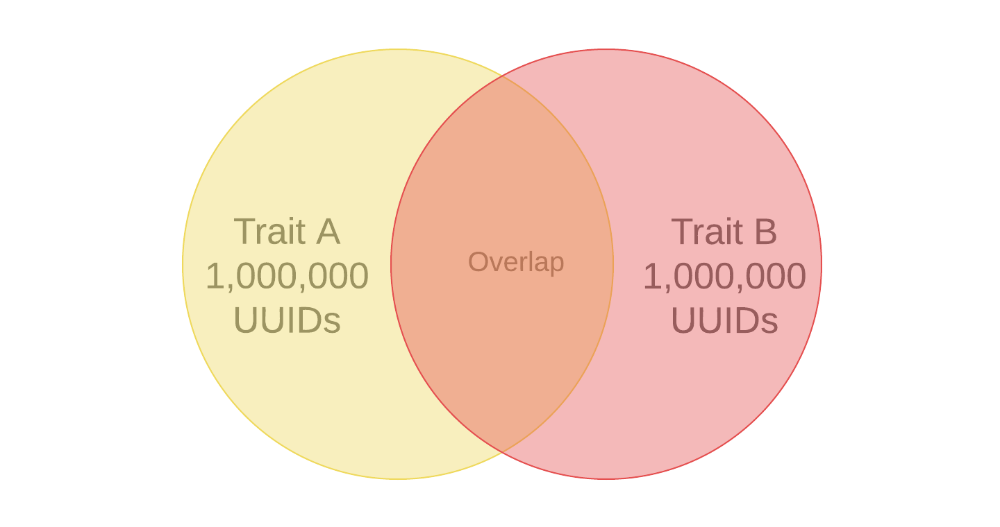

# Eigenschaftsempfehlungen

Erhalten Sie Live-Empfehlungen zu Eigenschaften, während Sie Ihre Segmente erstellen, aus Ihren eigenen First-Party-Eigenschaften und [!UICONTROL Audience Marketplace] Daten-Feeds.

## Videodemonstration

Sehen Sie sich zunächst das [!UICONTROL Trait Recommendations] Video unten an und lesen Sie dann weiter, um weitere Informationen zu erhalten. In diesem Video erfahren Sie, wie Sie mit Empfehlungen aus Ihren eigenen Erstanbieter-Eigenschaften sowie mit Eigenschaftsempfehlungen aus [!UICONTROL Audience Marketplace] Daten-Feeds arbeiten, die *bereits abonniert haben*.

>[!VIDEO](https://video.tv.adobe.com/v/26228/)

Im nächsten Video wird der Workflow für [!UICONTROL Marketplace Recommendations] beschrieben und gezeigt, wie Sie Ihren Segmenten auf der Grundlage von Empfehlungen aus Daten-Feeds in [!UICONTROL Audience Marketplace] Eigenschaften hinzufügen können. Diese Empfehlungen basieren auf Daten-Feeds *die Sie nicht abonniert*.

>[!VIDEO](https://video.tv.adobe.com/v/29363/)

## Überblick

[!UICONTROL Trait Recommendations], unterstützt durch [!DNL Adobe Sensei], bringt Datenwissenschaft in Ihre täglichen Audience Manager-Workflows.
Wenn Sie mit [!UICONTROL Trait Recommendations] ein Segment in [Segment Builder](segment-builder.md) erstellen oder bearbeiten, erhalten Sie Empfehlungen zu zusätzlichen Eigenschaften, die Sie einbeziehen können und die den Eigenschaften in der Segmentregel ähnlich sind.

Audience Manager zeigt Ihnen Eigenschaftsempfehlungen sowohl aus den Erstanbieter-Eigenschaften im **[!UICONTROL Recommendations]** Abschnitt als auch aus **[!UICONTROL Audience Marketplace]** im **[!UICONTROL Recommendations from Marketplace]** Abschnitt.

Fügen Sie die empfohlenen Merkmale zu Ihrem Segment hinzu, um Ihre Zielgruppe zu erweitern.

**Kurz gesagt:**

* Audience Manager zeigt im [!UICONTROL Recommendations] Abschnitt Erstanbieter-Eigenschaften an. Marketplace-Empfehlungen von öffentlichen und privaten Feeds, die Sie nicht abonniert haben, sind im Abschnitt [!UICONTROL Recommendations from Marketplace] sichtbar. Klicken Sie auf den Feed-Namen, um zu [!UICONTROL Audience Marketplace] und zu abonnieren.
* Audience Manager zeigt maximal fünfzig Eigenschaften, die denen in der Segmentregel ähnlich sind.
* Sie können die Datenquellen herausfiltern, aus denen Sie keine Empfehlungen anzeigen möchten.
* Bei der Berechnung der Ähnlichkeiten berücksichtigt Audience Manager [UUIDs](../../reference/ids-in-aam.md), die sich in den letzten 30 Tagen für das Merkmal qualifiziert haben.
* Wenn die Fehlermeldung „Keine ähnlichen Eigenschaften gefunden. Eigenschaft(en) könnte(n) zu neu sein.“ Dies bedeutet, dass entweder in den letzten 30 Tagen keine Aktivität für dieses Merkmal vorhanden war oder Audience Manager die Empfehlungen für dieses Merkmal noch nicht aktualisiert hat. Bitte in 24 Stunden erneut versuchen.

## Nutzungsszenarios

Mit [!UICONTROL Trait Recommendations] können Sie Ihre Workflows verbessern, je nachdem, wie Sie Audience Manager verwenden:

* Als Marketing-Experte können Sie mithilfe ähnlicher Eigenschaften schnell Zielgruppen finden, die sich für komplementäre Produkte interessieren, sodass Sie Ihre Reichweite erhöhen können.
* Wenn Sie Audience Manager als Publisher mit [!UICONTROL Trait Recommendations] verwenden, können Sie das Verhalten der Zielgruppe verstehen und bessere Segmente für den Verkauf von Anzeigen oder die Benutzerakquise erstellen.
* Als [!UICONTROL Audience Marketplace] Datenkäufer möchte ich relevante Drittanbieterdaten ermitteln, ohne eine große Anzahl von Feeds durchsuchen zu müssen.
* Als [!UICONTROL Audience Marketplace] Datenanbieter möchte ich Käufern relevante Daten empfehlen, damit ich von optimalen und relevanten Abonnements profitieren kann.

## Unterschiede zwischen Eigenschaftsempfehlungen und algorithmischen Modellen

### Algorithmische Modelle

[!UICONTROL Algorithmic Models] findet nicht nur die einflussreichsten Eigenschaften, sondern bewertet Benutzende auch anhand dieser Eigenschaften und weist jedem Benutzer einen individuellen Wert zu. Anschließend erstellen Sie algorithmische Eigenschaften, um Ihre Benutzer anzusprechen. Mit den Eingabefeldern Genauigkeit und Reichweite in der [!UICONTROL Trait Builder] können Sie festlegen, welche Benutzer zu denen gehören, die die einflussreichen Eigenschaften aufweisen, die Sie ansprechen möchten.

[!UICONTROL Algorithmic Models] können Sie Benutzende mit unterschiedlichen Genauigkeitsstufen auswählen und testen, [!UICONTROL Audience Lab] welche Benutzergruppe eine bessere Konvertierung erzielt. Weitere Informationen finden Sie im detaillierten Anwendungsfall unter [Vergleichen von Modellen in Audience Lab](../../features/audience-lab/audience-lab-use-cases.md#compare-models).

In [!UICONTROL Algorithmic Models] wird das Modell alle 8 Tage ausgeführt und aktualisiert die für algorithmische Eigenschaften qualifizierten Benutzer.

### Eigenschaftsempfehlungen

[!UICONTROL Trait Recommendations] erhalten Sie schnell Einblicke in andere Eigenschaften, die den in einem Segment verwendeten ähnlich sind.

Sie sollten [!UICONTROL Trait Recommendations] verwenden, wenn:

* Sie benötigen schnelle Einblicke beim Erstellen eines Segments.
* Sie verwenden die Segmente für kurze Kampagnen oder wenn Sie schnell konvertierende Zielgruppen unterdrücken möchten.
* Sie versuchen, die Reichweite zu maximieren.

## Workflow

Beim Erstellen oder Bearbeiten eines Segments in [Segment Builder](segment-builder.md) können Sie Eigenschaften erkunden, die den Eigenschaften in der Segmentregel ähnlich sind. Der [Segment Builder](segment-builder.md)-Workflow ist für neue und vorhandene Segmente sehr ähnlich:

### Neue Segmente

1. Gehen Sie zu **Zielgruppendaten > Segmente** und klicken Sie auf **Neu hinzufügen**.
1. Fügen **der Segmentregel im Dropdown** Feld „Eigenschaften“ mindestens eine Eigenschaft hinzu.
1. Im Abschnitt [!UICONTROL Audience Marketplace] werden von Erstanbietern empfohlene Eigenschaften und **[!UICONTROL Recommendations]** von Feeds, die Sie abonniert haben, angezeigt. Im **[!UICONTROL Recommendations from Marketplace]** Abschnitt werden Eigenschaftsempfehlungen von Feeds angezeigt, die Sie nicht abonniert haben. Alle diese Empfehlungen ähneln den Eigenschaften, die Sie zur Segmentregel hinzugefügt haben. Scrollen Sie nach unten, um alle empfohlenen Eigenschaften anzuzeigen.
1. (Optional) Um empfohlene First-Party-Eigenschaften aus bestimmten Datenquellen auszuschließen, klicken Sie auf das **X**-Symbol für die Datenquellen, die Sie ausschließen möchten.

   >[!NOTE]
   >
   >Die ausgeschlossenen Datenquellen werden direkt über der Liste der empfohlenen Eigenschaften angezeigt. Klicken Sie **X** in das graue Feld, um die Ausschlüsse zu entfernen und die Ergebnisse aus den entsprechenden Datenquellen erneut anzuzeigen.
1. Um der Segmentregel empfohlene Eigenschaften hinzuzufügen, klicken Sie auf das Symbol **+**.

>[!IMPORTANT]
>
>Wenn Sie [!UICONTROL Marketplace] Eigenschaften zu einem Segment hinzufügen, werden diese nur zur Segmentschätzung verwendet, bis Sie den entsprechenden Daten-Feed abonnieren. Eigenschaften, die von Daten-Feeds stammen, die Sie nicht abonniert haben, werden in der Liste der Eigenschaften mit einem Warenkorb-Symbol gekennzeichnet. Klicken Sie auf den Namen der Eigenschaft, um zur Daten-Feed-Seite zu gelangen und sie zu abonnieren.
>
>
>
>Sie können ein Segment mit Drittanbieter-Eigenschaften erst speichern, nachdem Sie die entsprechenden Daten-Feeds abonniert haben.

### Vorhandene Segmente

1. Gehen Sie zu **[!UICONTROL Audience Data]>[!UICONTROL Segments]**, wählen Sie das Segment aus, das Sie bearbeiten möchten, und klicken Sie auf .
1. Scrollen Sie nach unten zum Dropdown-Feld [!UICONTROL Traits] .
1. Sie können empfohlene Eigenschaften sehen, die den bereits in der Segmentregel enthaltenen Eigenschaften ähnlich sind. Scrollen Sie nach unten, um alle empfohlenen Eigenschaften anzuzeigen.
1. (Optional) Um empfohlene Eigenschaften aus bestimmten Datenquellen auszuschließen, klicken Sie auf das **X**-Symbol für die Datenquellen, die Sie ausschließen möchten.

   >[!NOTE]
   >
   >Die ausgeschlossenen Datenquellen werden direkt über der Liste der empfohlenen Eigenschaften angezeigt. Klicken Sie **X** in das graue Feld, um die Ausschlüsse zu entfernen und die Ergebnisse aus den entsprechenden Datenquellen erneut anzuzeigen.
1. Um der Segmentregel empfohlene Eigenschaften hinzuzufügen, klicken Sie auf das Symbol **+**.

Wenn Sie ein Segment erstellen oder bearbeiten und der Segmentregel eine Eigenschaft hinzufügen, werden maximal fünfzig empfohlene Eigenschaften angezeigt, ähnlich der von Ihnen hinzugefügten. Wenn die Segmentregel mehr als eine Eigenschaft enthält, verwendet Audience Manager eine Round-Robin-Methode, um für jede Eigenschaft die beste Übereinstimmung anzuzeigen, dann die zweitbeste Übereinstimmung für jede Eigenschaft usw. für die größten fünfzig Eigenschaften nach Population in der Segmentregel.

Wenn die Segmentregel beispielsweise drei Eigenschaften enthält, wie unten gezeigt, werden folgende Eigenschaften empfohlen:

1. Beste Übereinstimmung für Eigenschaft 3 (das Merkmal mit der größten Population);
1. Beste Übereinstimmung für Eigenschaft 1;
1. Beste Übereinstimmung für Eigenschaft 2;
1. Zweitbeste Übereinstimmung für Eigenschaft 3;
1. Zweitbeste Übereinstimmung für Eigenschaft 1 usw., bis Sie fünfzig Eigenschaften erreicht haben.

Um Empfehlungen für eine bestimmte Eigenschaft zu erhalten, können Sie auf die Eigenschaften in der Segmentregel (1) oder in der Ansicht Empfohlene Eigenschaften (2) klicken.

Wenn Sie auf eine First-Party-Eigenschaft klicken, wird ein Popup-Fenster geöffnet, wie in der Abbildung unten dargestellt. Wenn die empfohlenen Eigenschaften nicht Teil des Segments sind, können Sie sie dem Segment hinzufügen, indem Sie **+** drücken.

>[!TIP]
>
>Die von der Hauptseite ausgeschlossenen Datenquellen werden beim Generieren von Empfehlungen im Popup-Fenster mit Eigenschafteninformationen berücksichtigt. Und wenn Sie Datenquellen in dieser Ansicht ausschließen, gelten die Ausschlüsse für die Hauptseite.

>[!NOTE]
>
>Empfohlene Eigenschaften können Erstanbieter-Eigenschaften oder Drittanbieter-Eigenschaften aus Daten-Feeds sein, die Sie in [!UICONTROL Audience Marketplace] abonniert haben.

## Funktionsweise

Um Trait-Recommendations zu erstellen, berechnet Audience Manager die [Jaccard-Ähnlichkeit](https://en.wikipedia.org/wiki/Jaccard_index) zwischen der Zieleigenschaft und jeder anderen Eigenschaft, auf die Ihr Konto Zugriff hat, einschließlich Drittanbieterdaten. Audience Manager zeigt dann bis zu fünfzig Eigenschaften an, die die größte Ähnlichkeit aufweisen.

## Bewertung der Eigenschaftsähnlichkeit {#trait-similarity-score}

Audience Manager berechnet den [!UICONTROL Trait Similarity Score] zwischen zwei Eigenschaften, indem es die Schnittmenge und die Vereinigung als Anzahl der [!UICONTROL UUID] berechnet und dann die beiden teilt. Für zwei Eigenschaften A und B sieht die Berechnung wie folgt aus:

Siehe auch die beiden folgenden Beispiele.

### Beispiel 1: Niedriger Ähnlichkeitswert für Eigenschaften

Nehmen wir an, bei zwei Eigenschaften A und B hat jedes dieser Merkmale eine Population von 1.000.000 [!UICONTROL UUID], von denen 25.000 [!UICONTROL UUID] für beide Eigenschaften qualifiziert sind.
Unter Verwendung der obigen Formel ergibt dies: 25.000 / 1.975.000 = 0,012. Dies ist eine niedrige [!UICONTROL Trait Similarity Score], die beiden Eigenschaften sind sehr unterschiedlich.

### Beispiel 2: Bewertung der Eigenschaftsähnlichkeit

Wenn dieselben Merkmale A und B 400.000 [!UICONTROL UUID] hatten, die für beide Merkmale qualifiziert sind, ist die [!UICONTROL Trait Similarity Score] viel höher:
400 000 / 1 600 000 = 0,25

### Interpretation des Merkmal-Ähnlichkeits-Scores

Verwenden Sie die nachstehende Tabelle als grobe Anleitung zur Charakterisierung der Ähnlichkeit. Dieses Handbuch basiert auf den Ähnlichkeitswerten, die in den meisten Eigenschaften beobachtet wurden.

| [!UICONTROL Trait Similarity Score] | Bedeutung |
|---------|----------|
| 0.1 und höher | Hohe Ähnlichkeit zwischen Eigenschaften |
| 0,03 - 0,1 | Medium - Ähnlichkeit zwischen Eigenschaften |
| 0,01 - 0,03 | Geringe Ähnlichkeit zwischen Eigenschaften |
| 0 - 0,01 | Sehr geringe Ähnlichkeit zwischen Eigenschaften |

## Rollenbasierte Zugriffssteuerung (RBAC)

Für Unternehmen, die [!UICONTROL Role-Based Access Controls] ([!UICONTROL RBAC]) verwenden, benötigen Sie die Berechtigung zum Erstellen und Bearbeiten von Segmenten, um empfohlene Eigenschaften anzeigen zu können. Die angezeigten Eigenschaftsempfehlungen sind nur die Empfehlungen aus Datenquellen, auf die Sie über [!UICONTROL RBAC] Zugriff haben.

>[!IMPORTANT]
>
>Um [!UICONTROL Marketplace Recommendations] zu einem Segment hinzuzufügen, müssen Benutzer zunächst die entsprechenden Daten-Feeds abonnieren. Nur Benutzer mit Administratorrechten können [!UICONTROL Audience Marketplace] Daten-Feeds abonnieren.

Weitere Informationen über [!UICONTROL RBAC] finden Sie [hier](../administration/administration-overview.md).

## Einschränkungen

* Derzeit zeigt Audience Manager keine Ordnereigenschaften als empfohlene Eigenschaften an. Weitere Informationen zu Ordnereigenschaften finden Sie [hier](../traits/manage-folder-traits.md).
* Beim Anzeigen von Eigenschaftsempfehlungen berücksichtigt Audience Manager [!DNL Boolean] Operatoren ([!DNL AND], [!DNL OR], [!DNL NOT]) in Segmentregeln nicht.
