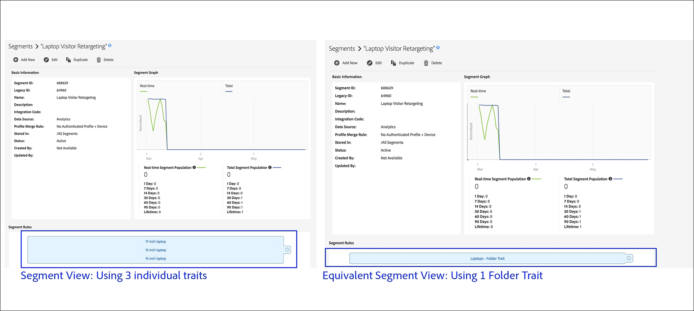

# Ordnereigenschaften: Info {#folder-traits-about}

[!UICONTROL Folder traits] können Sie Eigenschaften, die sich im selben Ordner und in allen untergeordneten Ordnern befinden, automatisch in ein Zielgruppensegment aggregieren.

## Vorteile der Verwendung von Ordnereigenschaften {#benefits}

Ein [!UICONTROL folder trait] enthält alle Eigenschaften in einem übergeordneten Ordner und die zugehörigen untergeordneten Ordner. Auf diese Weise können Sie Ihre Benutzer automatisch segmentieren und auf unterschiedlichen Ordnerebenen ansprechen. Angenommen, Sie haben eine Ordnerstruktur wie die folgende:

`*` Elektronik (übergeordnet)

    `*` Laptops (untergeordnet)

        `*` Marken (Enkel)

[!UICONTROL Folder traits] Qualifizieren Sie alle Benutzer in diesen Ordnern in einem automatisch erstellten Ordner ( [!DNL Electronics] [!UICONTROL Folder Trait] basierend auf dem Namen des übergeordneten Ordners). Und dieser Prozess wiederholt sich, während Sie die Dateistruktur nach unten verschieben. In diesem Fall erfassen Ordnereigenschaften alle Benutzer in den Ordnern Laptops und Marken in einem automatisch erstellten Laptop [!UICONTROL Folder Trait].

[!UICONTROL Folder traits] sind in Segmentausdrücken auswählbar. Die Auswahl von [!UICONTROL folder trait] entspricht der Auswahl aller Eigenschaften in diesem Ordner und dessen Unterordnern mit einer [!UICONTROL OR] -Gruppierung.

## Realisierung von Ordnereigenschaften - Neuigkeit und Häufigkeit {#folder-traits-realization}

Die Häufigkeitsanzahl einer Ordnereigenschaft ist die Summe der Realisierungen der Eigenschaften in ihrem Ordner und den untergeordneten Ordnern. Die folgende Abbildung zeigt die Eigenschaften A, B und C, die sich im Ordner &quot;Automobile&quot;befinden. Beachten Sie, dass jede Eigenschaft die folgenden Realisierungen aufweist:

* Eigenschaft A: 5
* Eigenschaft B: 1
* Eigenschaft C: 1

In diesem Fall hat [!DNL Automobile Folder Trait] 7 Realisierungen.

## Berichte zu Ordnereigenschaften {#folder-traits-reporting}

[!UICONTROL Folder traits] Erfassen Sie alle Benutzer aus den Eigenschaften in der Ordnerstruktur darunter. Wenn Sie eine Eigenschaft aus einem Ordner in einen anderen Ordner verschieben, wird die Änderung wie bei einer Änderung der Eigenschaftsregel auf unsere [Datenerfassungsserver](../../reference/system-components/components-data-collection.md) übertragen. Die im nächsten Berichtablauf aktualisierten Berichte spiegeln diese Änderung in den Datumsbereichen der Berichterstellung wider (1, 7, 14, 30, 60, 90). Die alten Berichtszahlen aus den vorherigen Tagen bleiben unverändert.

## Berechtigungen für rollenbasierte Zugriffskontrolle (RBAC) {#role-based-access-controls}

Bei Unternehmen, die [!UICONTROL Role-Based Access Controls] ([!UICONTROL RBAC]) verwenden, können Ihre Benutzer mit den entsprechenden [!UICONTROL RBAC]-Berechtigungen die Datenquelle ändern, die mit [!UICONTROL folder trait] verknüpft ist. Ein Benutzer muss zu einer Gruppe mit einer der folgenden Eigenschaften gehören:

* `READ` und  `WRITE` Gruppenberechtigungen für eine Eigenschaftsdatenquelle fest.
* `VIEW_ALL_TRAITS` und  `EDIT_ALL_TRAITS` Platzhalterberechtigungen für Eigenschaftsdatenquellen.

Erfahren Sie, wie Sie in unserer [Verwaltungsdokumentation](../../features/administration/administration-overview.md#create-group) [!UICONTROL RBAC] Berechtigungen zuweisen.

## Beschränkungen und sonstige Aspekte {#limits}

| Element | Beschreibung |
|---|---|
| Eigenschaftstyp | [!UICONTROL Onboarded traits] und  [!UICONTROL algorithmic traits] tragen höchstens 1 zur  [!UICONTROL folder trait]Häufigkeit einer Realisierung bei. |
| Verschieben von Eigenschaften zwischen Ordnern | Wenn Sie eine Eigenschaft aus einem Ordner in einen anderen verschieben, wird diese Eigenschaft aus der ersten Ordnereigenschaft ausgeschlossen und für die zweite [!UICONTROL folder trait] qualifiziert. Das bedeutet, dass beim Löschen oder Verschieben einer Eigenschaft aus dem Ordner die Benutzer in der Population der Eigenschaft nicht aus den Segmenten segmentiert werden, die die Ordnereigenschaft als Segmentausdruck verwenden.   Beim Zuordnen von Adobe Analytics-Segmenten oder Report Suites zu Ihrer Experience Cloud-Organisation erstellt Audience Manager automatisch neue, übereinstimmende, schreibgeschützte Segmente und Eigenschaften. Sie können den Speicherort dieser Eigenschaften nicht über Audience Manager bearbeiten oder ändern. Änderungen, die Sie jedoch an Ihren zugeordneten Adobe Analytics-Segmenten oder Report Suites vornehmen, werden in Audience Manager übernommen. |
| Systemvariablen | [!UICONTROL Folder traits] kann nicht in Ereignisaufrufen mit dem - `d_sid` Parameter realisiert werden. |
| Berichterstellung | [!UICONTROL Folder traits] sind automatisch berechnete Eigenschaften und werden nicht in  **[!UICONTROL Overlap Reports]** angezeigt. |
