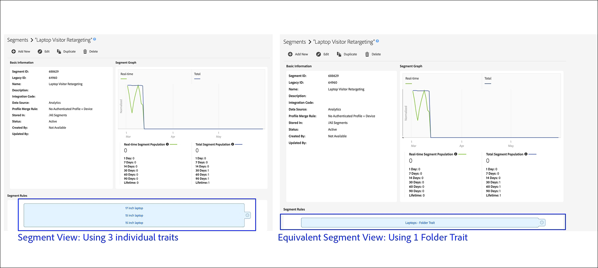
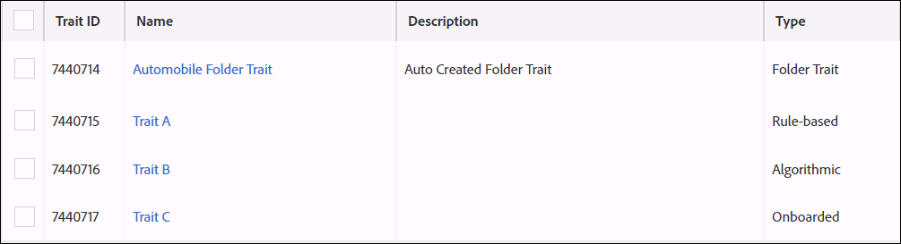

# Ordnereigenschaften: Info {#folder-traits-about}

[!UICONTROL Folder traits] können Sie automatisch Eigenschaften, die sich im selben Ordner und allen untergeordneten Ordnern befinden, in einem Zielgruppensegment aggregieren.

## Vorteile der Verwendung von Ordnereigenschaften {#benefits}

Ein [!UICONTROL folder trait] enthält alle Eigenschaften in einem übergeordneten Ordner und den zugehörigen untergeordneten Ordnern. Auf diese Weise können Sie Ihre Benutzer automatisch auf verschiedenen Ordnerebenen segmentieren und ansprechen. Nehmen wir beispielsweise an, Sie haben eine Ordnerstruktur wie diese:

`*` Electronics (Mutterunternehmen)

    `*` Notebooks (untergeordnet)

        `*` Marken (Enkelkind)

[!UICONTROL Folder traits] qualifizieren alle Benutzer in diesen Ordnern in einem automatisch erstellten [!DNL Electronics]-[!UICONTROL Folder Trait] (basierend auf dem Namen des übergeordneten Ordners). Dieser Vorgang wiederholt sich, wenn Sie die Dateistruktur nach unten verschieben. In diesem Fall erfassen Ordnereigenschaften alle Benutzer in den Ordnern „Laptops und Marken“ in einem automatisch erstellten [!UICONTROL Folder Trait] „Laptops“.

[!UICONTROL Folder traits] können in Segmentausdrücken ausgewählt werden. Die Auswahl eines [!UICONTROL folder trait] entspricht der Auswahl aller Eigenschaften innerhalb dieses Ordners und seiner Unterordner mit einer [!UICONTROL OR] Gruppierung.

## Realisierung von Ordnereigenschaften - Neuigkeit und Häufigkeit {#folder-traits-realization}

Die Häufigkeitsanzahl einer Ordnereigenschaft ist die Summe der Realisierungen der Eigenschaften in ihrem Ordner und ihren untergeordneten Ordnern. Die folgende Abbildung zeigt die Eigenschaften A, B und C, die im Ordner „Automobile“ vorhanden sind. Beachten Sie, dass jedes Merkmal die folgenden Realisierungen aufweist:

* Merkmal A: 5
* Eigenschaft B: 1
* Eigenschaft C: 1

In diesem Fall hat die [!DNL Automobile Folder Trait] 7 Realisierungen.

## Ordner-Eigenschaftsberichte {#folder-traits-reporting}

[!UICONTROL Folder traits] alle Benutzer aus den Eigenschaften in der Ordnerstruktur unter ihnen zu erfassen. Wenn Sie eine Eigenschaft von einem Ordner in einen anderen Ordner verschieben, wird die Änderung auf unsere [Datenerfassungs-Server](../../reference/system-components/components-data-collection.md) übertragen, genau wie eine Eigenschaftsregeländerung. Die Berichterstellung wird im nächsten Berichtslauf aktualisiert, um diese Änderung über die Berichtsdatumsbereiche (1, 7, 14, 30, 60, 90) hinweg widerzuspiegeln. Die alten Berichtszahlen aus den Vortagen ändern sich nicht.

## Berechtigungen für rollenbasierte Zugriffssteuerung (RBAC) {#role-based-access-controls}

Für Unternehmen, die [!UICONTROL Role-Based Access Controls] ([!UICONTROL RBAC]) verwenden, können Ihre Benutzerinnen und Benutzer mit den entsprechenden [!UICONTROL RBAC] Berechtigungen die mit der [!UICONTROL folder trait] verknüpfte Datenquelle ändern. Ein Benutzer muss zu einer Gruppe gehören, die eine der folgenden Eigenschaften aufweist:

* `READ` und `WRITE` von Gruppenberechtigungen für eine Datenquelle für Eigenschaften.
* `VIEW_ALL_TRAITS` und `EDIT_ALL_TRAITS` von Platzhalterberechtigungen für Datenquellen von Eigenschaften.

Erfahren Sie in unserer [!UICONTROL RBAC]Administrationsdokumentation), wie Sie [&#x200B; Berechtigungen &#x200B;](../../features/administration/administration-overview.md#create-group).

## Beschränkungen und andere Überlegungen {#limits}

| Element | Beschreibung |
|---|---|
| Eigenschaftstyp | [!UICONTROL Onboarded traits] und [!UICONTROL algorithmic traits] tragen höchstens 1 Realisierung zur Häufigkeit eines [!UICONTROL folder trait] bei. |
| Verschieben von Eigenschaften zwischen Ordnern | Wenn Sie eine Eigenschaft von einem Ordner in einen anderen verschieben, wird diese Eigenschaft aus dem ersten Ordner-Merkmal ausgeschlossen und für das zweite [!UICONTROL folder trait] qualifiziert. Wenn Sie also eine Eigenschaft aus dem Ordner löschen oder verschieben, wird die Segmentierung der Benutzenden in der Population der Eigenschaft aus den Segmenten mithilfe der Ordnereigenschaft als Segmentausdruck aufgehoben.   Beim Zuordnen von Adobe Analytics-Segmenten oder Report Suites zu Ihrer Experience Cloud-Organisation erstellt Audience Manager automatisch neue, entsprechende schreibgeschützte Segmente und Eigenschaften. Sie können den Speicherort dieser Eigenschaften in Audience Manager nicht bearbeiten oder ändern. Alle Änderungen, die Sie an Ihren zugeordneten Adobe Analytics-Segmenten oder Report Suites vornehmen, werden jedoch in Audience Manager übernommen. |
| Systemvariablen | [!UICONTROL Folder traits] können nicht in Ereignisaufrufen realisiert werden, die den `d_sid`-Parameter verwenden. |
| Berichterstellung   | [!UICONTROL Folder traits] sind automatisch berechnete Eigenschaften und werden nicht in **[!UICONTROL Overlap Reports]** angezeigt. |
