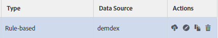

# Managing Trait Rules {#managing-trait-rules}

In [!UICONTROL Trait Builder], the [!UICONTROL Expression Builder] lets you create and test rules that establish audience qualification requirements. Rules consist of key-value pairs such as `color == blue` or `price > 100`. Vergleichsoperatoren stellen die Beziehung zwischen Schlüssel und Werten her. [!DNL Boolean] Ausdrücke bestimmen die Beziehung zwischen Regelgruppen.

<!-- c_tb_rules.xml -->

## Hauptsignal-Regelfunktionen beschrieben

1. The **[!UICONTROL Expression Builder]** or **[!UICONTROL Code View]** tabs provide an overview of the rules in your trait. The **[!UICONTROL Expression Builder]** tab lets you create rules with fields and drop-down menus. The **[!UICONTROL Code View]** lets you create rules by manually writing those expressions as code. The illustration above shows a simple trait composed of a signal that evaluates data for a qualifying condition where a product key equals a specific value, in this case `color == "blue"`.

1. Mit den Feldern und Steuerelementen in diesem Abschnitt können Sie Signale aus Schlüssel-Wert-Paaren erstellen und die Beziehung zwischen den Schlüsselwertpaaren festlegen. Ein Schlüssel, ein Operator und ein Wert sind erforderlich.
1. The [!UICONTROL Data Explorer Options] allow you to backfill trait realizations for your signals.
   >[!NOTE]
   >
   >This option is only available for [!UICONTROL Data Explorer] customers. Weitere Informationen erhalten Sie von Ihrem Adobe-Berater.
1. This section shows you an estimation of trait realizations for the past 7 days, for the signals defined in the [!UICONTROL Expression Builder], for backfilled and non-backfilled traits.
   >[!NOTE]
   >
   >This option is only available for [!UICONTROL Data Explorer] customers. Weitere Informationen erhalten Sie von Ihrem Adobe-Berater.
1. The test fields let you validate combinations of signal rules or the [!DNL URL]s that you want to use when sending data to Audience Manager.

## Create a Trait Rule {#create-trait-rule}

Regeln (oder Ausdrücke) bestehen aus einzelnen oder Gruppen von Schlüsselwertpaaren. Vergleichsoperatoren stellen die Beziehung zwischen Schlüssel-Wert-Paaren fest. To create a rule,provide a key, a value, select an operator, and click **[!UICONTROL Add Rule]**.

<!-- t_tb_create_rules.xml -->

Complete the required fields in the **[!UICONTROL Basic Information]** section *before* creating trait rules.

1. Expand the **[!UICONTROL Trait Expression]** section and enter a key and value name. This creates a *`signal`*.
   >[!NOTE]
   >
   >Include the `c_` prefix (or any other naming convention) for key variable if your event calls send data to [!DNL Audience Manager] using that syntax.
1. Select a [comparison operator](../../features/traits/trait-comparison-operators.md) from the **[!UICONTROL Operator]** dropdown. Der Vergleichsoperator wertet die Beziehung zwischen den Elementen in einem Signal aus.
   >[!NOTE]
   >
   >The [!DNL Boolean] [!UICONTROL OR] operator establishes the relationship between multiple signals *within* a group and cannot be changed.
1. Klicken Sie auf **[!UICONTROL Add Rule]**. Die gespeicherte Regel wird in den Eigenschaften oberhalb der Dateneingabefelder angezeigt.

### Beispiel {#example-trait-rule}

Im unten stehenden Beispiel hat ein Benutzer basierend auf der Produkt-ID eine neue Regel für Eigenschaften erstellt. To build this rule, the user provided the key `productkey` linked with an equals operator ( `==`) to the value `2093`.

Clicking **[!UICONTROL Add Rule]** saves and moves the trait into the [!UICONTROL Expression Builder] workspace.

>[!MORE_ LIKE_ THIS]
>
>* [Neue Regelgruppe erstellen](../../features/traits/manage-trait-rules.md#create-rule-group)
>* [Regeln zwischen Gruppen verschieben](../../features/traits/manage-trait-rules.md#move-rules-between-groups)
>* [Eine Trait-Regel löschen](../../features/traits/manage-trait-rules.md#delete-trait)

## Create a New Rule Group {#create-rule-group}

Dieser Vorgang beschreibt, wie Sie eine neue Regelgruppe erstellen.

<!-- t_tb_new_rule_group.xml -->

Die Eigenschaft muss mindestens zwei Regeln enthalten, bevor Sie eine neue Regelgruppe erstellen können.

1. Bewegen Sie den Cursor über die Regel, die Sie verschieben möchten, um ihn hervorzuheben.
1. Bewegen Sie den Mauszeiger über den hervorgehobenen Regelrand.
Dadurch wird die Regel automatisch von der aktuellen Gruppe getrennt und in eine neue Gruppe verschoben.
   >[!NOTE]
   >
   >Ziehen Sie eine Regel zurück in die ursprüngliche Gruppe, wenn Sie sie unbeabsichtigt verschieben.
1. Select a [!DNL Boolean] operator ( [!UICONTROL AND], [!UICONTROL OR], [!UICONTROL AND NOT]) from the drop-down menu to set the relationship between the rule groups.

>[!MORE_ LIKE_ THIS]
>
>* [Erstellen einer Eigenschaftenregel](../../features/traits/manage-trait-rules.md#create-trait-rule)
>* [Regeln zwischen Gruppen verschieben](../../features/traits/manage-trait-rules.md#move-rules-between-groups)
>* [Eine Trait-Regel löschen](../../features/traits/manage-trait-rules.md#delete-trait)

## Move Rules Between Groups {#move-rules-between-groups}

Um eine Regel zu verschieben, klicken Sie auf eine andere Gruppe und ziehen Sie sie.

>[!MORE_ LIKE_ THIS]
>
>* [Erstellen einer Eigenschaftenregel](../../features/traits/manage-trait-rules.md#create-trait-rule)
>* [Neue Regelgruppe erstellen](../../features/traits/manage-trait-rules.md#create-rule-group)
>* [Eine Trait-Regel löschen](../../features/traits/manage-trait-rules.md#delete-trait)

## Edit a Trait {#edit-trait}

Dieser Vorgang beschreibt, wie Sie eine Eigenschaft bearbeiten.

<!-- t_tb_edit.xml -->

1. In the [!UICONTROL Traits] dashboard, hover over the **[!UICONTROL Actions]** column for the trait you want to edit. Dadurch werden die Symbole für das Trait-Management angezeigt.
1. Klicken Sie auf den Stiftsymbol, um die Eigenschaft zu bearbeiten.

   

## Delete a Trait Rule {#delete-trait}

Dieser Vorgang beschreibt, wie Sie eine Eigenschaftenregel löschen.

<!-- t_tb_delete_rule.xml -->

1. In the [!UICONTROL Traits] dashboard, hover over the [!UICONTROL Actions] columns for the trait you want to edit and click the pencil icon. Dadurch werden die Symbole für das Trait-Management angezeigt.
1. Expand the [!UICONTROL Trait Expression] section.
1. Bewegen Sie den Mauszeiger über die Regel, die Sie löschen möchten, und klicken Sie auf das X-Symbol. Die Regel wird sofort gelöscht.