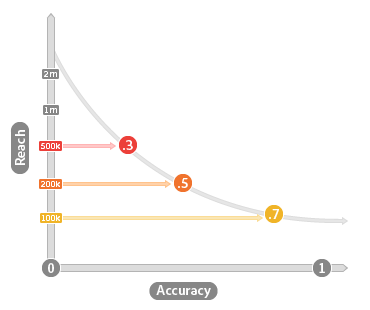

# Genauigkeit und Reichweite {#accuracy-and-reach}

Beschreibt die Beziehung zwischen Genauigkeit und Reichweite in algorithmischen Eigenschaften.

<!-- c_accuracy_reach.xml -->

## Genauigkeit vs. Reichweite: Über

Bei der Arbeit mit algorithmischen Eigenschaften ist es wichtig, die Beziehung zwischen Genauigkeit und Reichweite zu verstehen. Die Genauigkeit wird durch einen bewerteten Wert dargestellt, der widerspiegelt, wie ähnlich die Benutzerinnen und Benutzer Ihrer Grundlinie sind. Die Genauigkeitsskala reicht von 0 (am wenigsten genau) bis 1 (am genauesten). Reichweite ist einfach ein Wert, der die Anzahl der eindeutigen Benutzer angibt, die Sie in eine Eigenschaft aufnehmen möchten. Reichweite und Genauigkeit stehen in umgekehrter Beziehung zueinander. Präzise Eigenschaften erreichen weniger Benutzer und Eigenschaften mit größerer Reichweite sind weniger genau. Die folgende Abbildung veranschaulicht dieses Konzept.

## Genauigkeit und Reichweite beeinflussen die Zielgruppengröße

Ihre Geschäftsziele sollten Ihnen dabei helfen, bei der Arbeit mit algorithmischen Eigenschaften die richtigen Entscheidungen über Genauigkeit und Reichweite zu treffen. Wenn Genauigkeit Ihr Ziel ist, beachten Sie, dass die Population eines Merkmals über Modellausführungen hinweg zunehmen oder abnehmen kann. Populationsänderungen sind das Ergebnis des Algorithmus, der während jedes Auswertungszeitraums Entscheidungen trifft. Manchmal findet der Algorithmus während eines Verarbeitungszyklus mehr qualifizierte Benutzende, und in anderen Fällen weniger. Die Ergebnisse werden anhand der zum Erstellen des Modells verwendeten Basisdaten sowie der neuen Besucher und Eigenschaftsqualifikationen bestimmt, die seit der vorherigen Modellausführung verfügbar waren. Bei der Arbeit mit REACH dagegen bleibt die Anzahl der Benutzenden konstant. Wenn Sie beispielsweise 10.000 Benutzer erreichen möchten, stellt der Algorithmus sicher, dass er bei jeder Modellausführung immer diese Zahl erreicht.

## Allgemeine Anwendungsfälle für Genauigkeit vs. Reichweite

Der Fokus auf Genauigkeit oder Reichweite hängt davon ab, was Sie mit einem bestimmten Segment erreichen möchten. Die folgende Tabelle kann Ihnen dabei helfen, die Genauigkeit im Vergleich zur Reichweite beim Erstellen einer Eigenschaft zu bewerten.

| Merkmal-Entscheidung begünstigt | Hilft bei der Suche |
|---|---|
| **Genauigkeit** | Benutzende, die den Basiskunden in Ihrem Modell ähnlich sind. Nützlich für zielgerichtete Kampagnen, wenn Sie eine bestimmte Zielgruppe erreichen möchten. |
| **REACH** | Eine bestimmte Anzahl von Benutzern für jede Datenausführung. Nützlich für Markenkampagnen, wenn Sie eine Zielgruppe einer bestimmten Größe erreichen möchten. |
