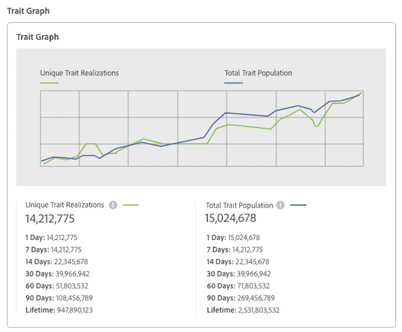

# Trait Details Page {#trait-details-page}

Die Detailseite für eine einzelne Eigenschaft bietet einen Überblick über Informationen wie den Eigenschaftsnamen, die ID, die Leistungsmetriken, Ausdrücke, die die Eigenschaft definieren, Segmente, zu denen sie gehören, und das Auditprotokoll des Eigenschaftenprotokolls. To vew these details, go to [!UICONTROL Audience Data > Traits] and click the name of the trait you want to work with.

## Basisinformationen {#basics}

The [!UICONTROL Basic Information] section shows details about required and optional fields you completed when building the trait. Dazu gehören beispielsweise Eigenschaften, Eigenschaften-ID, Beschreibung, Datenquelle und andere Metadaten. Diese Details variieren je nach Eigenschaftstyp (Ordner, Onboarded oder regelbasiert).

## Trait Graph {#trait-graph}

The [!UICONTROL Trait Graph] provides at-a-glance performance metrics for your selected trait. Halten Sie den Mauszeiger über eine Trendlinie, um weitere Daten für die ausgewählte Eigenschaft anzuzeigen.

[!UICONTROL Unique Trait Realizations] eine Anzahl Unique Users darstellen, die diese Eigenschaft ihrem Profil über den angegebenen Zeitraum hinzugefügt hat. The [!UICONTROL Total Trait Population] indicates the number of unique users currently qualified for this trait.

* Bei regelbasierten Eigenschaften erfolgt die Eigenschaftsqualifizierung in Echtzeit, da sich Benutzer für eine Eigenschaft in ihrem Browser qualifizieren.
* For onboarded traits, trait qualification happens after an inbound file is processed, i.e. the inbound file is [fed into Audience Manager](../../faq/faq-inbound-data-ingestion.md) and that is when the trait qualification happens.
* **Eindeutige Eigenschaftsrealizationen**: Eine Anzahl Unique Users, die diese Eigenschaft im angegebenen Zeitraum ihrem Profil hinzugefügt hat.
* **Eigenschaftenpopulation insgesamt**: Die Anzahl der Unique Users, die derzeit für diese Eigenschaft qualifiziert sind.

## Trait Expression {#trait-expression}

The [!UICONTROL Trait Expression] section shows you the criteria users must meet to qualify for the trait. These rules are set when you [create or edit a trait](../../features/traits/about-trait-builder.md).

## Trait Segments {#trait-segments}

The [!UICONTROL Segments with this Trait] section lists all the segments the selected trait belongs to. Sie können auf einen Segmentnamen klicken, um Details zu diesem Segment anzuzeigen.

## Trait Audit/History Log {#trait-audit-history}

For rule-based and onboarded traits, the [!UICONTROL Trait Expression Change History] shows you the last 10 changes made to trait expression rules and who made them. If your trait has more than 10 changes, click **[!UICONTROL Export to CSV]** to download the entire audit log. Das Auditprotokoll ist nicht für Ordner oder algorithmische Eigenschaften verfügbar.

>[!NOTE]
>
>[!UICONTROL Not Available] in der [!UICONTROL By User] Spalte bedeutet, dass das Konto für diesen Benutzer gelöscht wurde.

