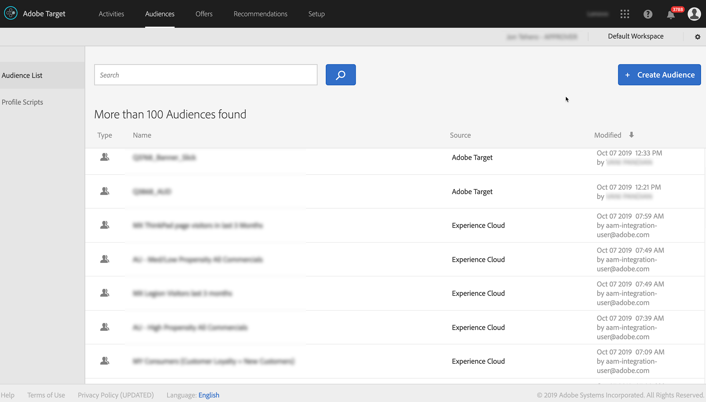

# Integrieren von Audience Manager mit [!DNL Target] {#integrate-audience-manager-with-target}

Mit dieser Integration können Sie Audience Manager-Segmente an Adobe [!DNL Target] senden.

Eine Audience Manager - [!DNL Target]-Integration erfordert:

* Der [Experience Cloud-](https://experienceleague.adobe.com/docs/id-service/using/home.html?lang=de). Wenn Sie diesen Service nicht verwenden, lesen Sie die [Implementierungshandbücher](https://experienceleague.adobe.com/docs/id-service/using/implementation/implementation-guides.html?lang=de) um loszulegen.
* [!DNL Profiles and Audiences]. Wenn Sie nicht für [!DNL Profiles and Audiences] bereitgestellt wurden, wenden Sie sich an die Kundenunterstützung, um zu beginnen.

Alle Ihre Audience Manager-Segmente werden kurz nach Abschluss dieser Schritte im Implementierungsprozess in [!DNL Target] angezeigt. Sehen Sie sich **[!UICONTROL Audiences > Audience List]** an, um Ihre Audience Manager-Segmente in [!DNL Target] anzuzeigen. Identifizieren Sie Audience Manager-Segmente anhand von Experience Cloud in der Spalte **[!UICONTROL Source]** und anhand von `aam-integration-user@adobe.com` in der Spalte **[!UICONTROL Modified]** .

