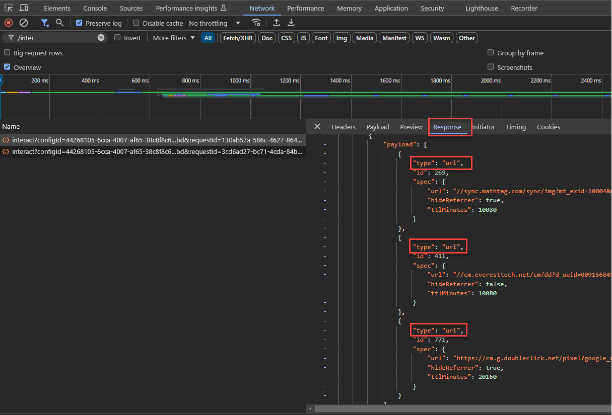
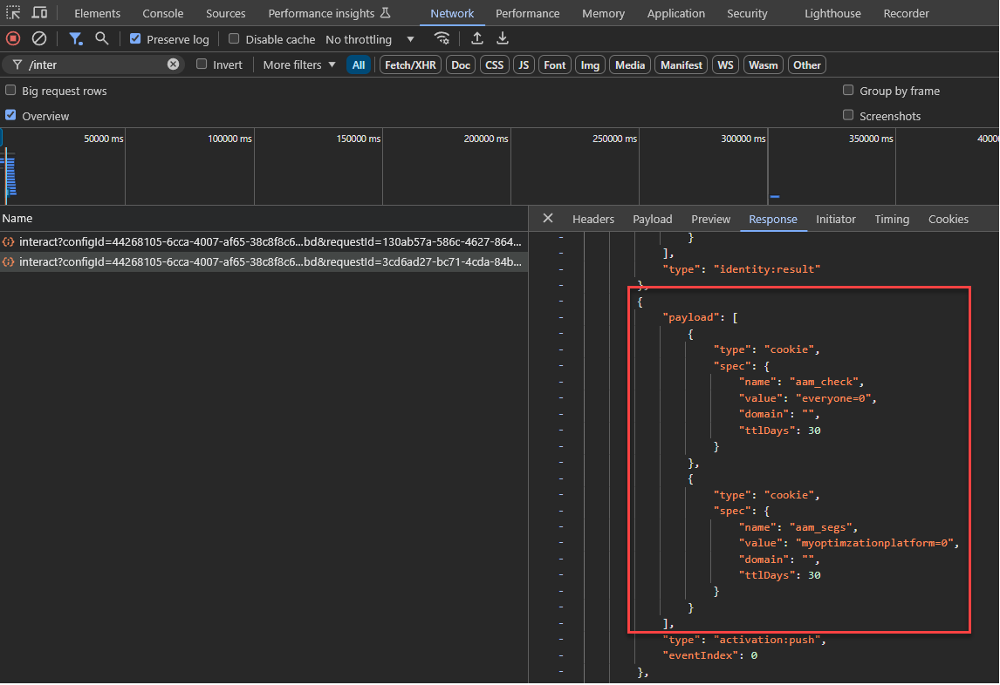

# Aktualisieren der Datenerfassungsbibliothek für Audience Manager von AppMeasurement zu Web SDK

## Vorgesehene Zielgruppe {#intended-audience}

Diese Seite richtet sich an Kundinnen und Kunden von Audience Manager und Adobe Analytics, die die [!DNL AppMeasurement] JavaScript-Bibliothek verwenden, um Web-Daten an Audience Manager zu senden.

In der folgenden Tabelle finden Sie Anleitungen zu den Migrationsschritten zu Web SDK, abhängig von Ihrer aktuellen Datenerfassungsmethode.

| Ihre vorhandene Datenerfassungsmethode | Web SDK-Migrationsanweisungen |
|---------|----------|
| [!DNL AppMeasurement] der JavaScript-Bibliothek mit dem AudienceManagement-Modul | Befolgen Sie die Anweisungen in diesem Handbuch. |
| [!DNL Audience Manager] [Tag-Erweiterung](https://experienceleague.adobe.com/en/docs/experience-platform/tags/extensions/client/audience-manager/overview) | Befolgen Sie die Anweisungen unter [Aktualisieren Ihrer Datenerfassungsbibliothek von der Audience Manager-Tag-Erweiterung auf die Web SDK-Tag-Erweiterung](dil-extension-to-web-sdk.md). |
| [!DNL AppMeasurement] JavaScript-Bibliothek + eigenständige [!DNL Audience Manager] [DIL-Bibliothek](../dil/dil-overview.md) | Befolgen Sie die Anweisungen unter [Aktualisieren Ihrer Datenerfassungsbibliothek von der Audience Manager-Tag-Erweiterung auf die Web SDK-Tag-Erweiterung](dil-extension-to-web-sdk.md). |

## Migrationsübersicht {#overview}

Die Migration von [!DNL AppMeasurement] zu [Web SDK](https://experienceleague.adobe.com/en/docs/experience-platform/web-sdk/home) ist in erster Linie eine Migration zu Adobe Analytics. Für Audience Manager-Kunden umfasst diese Migration auch Audience Manager. Beide müssen gemeinsam migriert werden. Wenn Sie hauptsächlich mit Audience Manager arbeiten, stellen Sie sicher, dass Sie das Analytics-Team in diese Migration einbeziehen.

Wenn Sie [!DNL AppMeasurement] für die Audience Manager-Datenerfassung verwenden, verwenden Sie derzeit den [!DNL Server-side Forwarding (SSF)] Ansatz, um Analytics-Daten an Audience Manager zu senden. Bei dieser Einrichtung wird die Analytics-Datenerfassungsanfrage an Audience Manager weitergeleitet, das auch die Audience Manager-Antwort auf die Seite verarbeitet.

Dies ist seit vielen Jahren der Standardansatz und wahrscheinlich Ihr aktuelles Setup. Wenn Ihre [!DNL AppMeasurement] das `AudienceManagement` enthält und Ihre Datenerfassungsaufrufe den `/10/` Pfad in der Anfrage (`/b/ss/examplereportsuite/10/`) enthalten, ist dieses Handbuch für Sie.

## Server-seitige Weiterleitung (SSF) im Vergleich zu Web SDK-Datenflüssen {#data-flows}

Für die folgenden Anweisungen ist es wichtig, die Datenflussunterschiede zwischen Analytics und Audience Manager beim Wechsel zu Web SDK (und Edge Network) zu verstehen.

Bei der serverseitigen Weiterleitung erfasst der regionale Datenerfassungsknoten von Analytics die Daten, wandelt sie in ein von Audience Manager akzeptiertes Signal um, sendet sie an Audience Manager und gibt die Audience Manager-Antwort an die Seite zurück. Das [!DNL AudienceManagement] in der [!DNL AppMeasurement]-Bibliothek verarbeitet dann die Antwort (z. B. das Löschen von Cookies, das Senden von URL-Zielen). Dieser Prozess wird als Server-seitige Weiterleitung bezeichnet, da Analytics die Daten mithilfe von Adobe-Servern an Audience Manager weiterleitet.

Bei Web SDK sendet der Edge Network Daten in separaten Aktionen an Analytics und Audience Manager. Web SDK ist eine zentrale Bibliothek, die Daten an alle Lösungen sendet. Edge Network transformiert lösungsunabhängige Datenpunkte in lösungsspezifische Formate.

In diesem neuen Datenfluss werden alle Daten an einen Edge Network-Datenstrom gesendet[ den ](https://experienceleague.adobe.com/en/docs/experience-platform/datastreams/overview) bei Bedarf [konfigurieren](https://experienceleague.adobe.com/en/docs/experience-platform/datastreams/configure) um Daten an Adobe-Lösungen zu senden. Bei Audience Manager werden durch die Aktivierung des Audience Manager-Services auf dem Datenstrom [!DNL XDM]- und Analytics-Daten in Signale umgewandelt, die von Audience Manager akzeptiert werden. Die Edge Network gibt auch die Audience Manager-Antwort auf die Seite zurück, auf der die Web-SDK die Antwort verarbeitet, ähnlich wie [!DNL AppMeasurement] und das [!DNL AudienceManagement].

## Migration von Tags im Vergleich zu Nicht-Tags {#tags-vs-non-tags}

Unabhängig davon, ob Sie Tags mit der [!DNL AppMeasurement]-Erweiterung, die [!DNL AppMeasurement]-Bibliothek in einem anderen Tag-Management-System oder [!DNL AppMeasurement] direkt auf der Seite verwenden, sind die Schritte für die Migration von Audience Manager zur Web-SDK identisch. Da die Audience Manager-Migration von der Analytics-Migration abhängt, werden die Schritte für die Migration von [!DNL AppMeasurement] zu Web SDK während der Analytics-Migration festgelegt.

Diese Informationen werden in der Analytics-Dokumentation für [Tags](https://experienceleague.adobe.com/en/docs/analytics/implementation/aep-edge/web-sdk/analytics-extension-to-web-sdk) oder [JavaScript](https://experienceleague.adobe.com/en/docs/analytics/implementation/aep-edge/web-sdk/appmeasurement-to-web-sdk)-basierte Implementierungen behandelt.

## XDM und die `data.__adobe.` Knoten {#xdm-data-nodes}

Eine der Hauptfunktionen von [Web SDK](https://experienceleague.adobe.com/en/docs/experience-platform/web-sdk/home) ist das Senden von Daten an [Real-Time Customer Data Platform (RTCDP)](https://experienceleague.adobe.com/en/docs/experience-platform/rtcdp/home). Um dies zu erreichen und weiterhin Daten für andere Experience Cloud-Lösungen ohne vollständige erneute Implementierung zu erfassen, werden lösungsspezifische Daten im Datenerfassungs-Server-Aufruf aufgeteilt. Dieser Aufruf verwendet ein standardisiertes JSON-Schema namens [Experience-Datenmodell (XDM)](https://experienceleague.adobe.com/en/docs/experience-platform/xdm/home)

Lösungsunabhängige Elemente, wie z. B. Informationen zum Browser und zum Gerät, werden in einer vordefinierten XDM-Struktur an den Edge Network gesendet. Edge Network wandelt diese Daten in lösungsspezifische Formate um. Daten, die für Target, Analytics und Audience Manager spezifisch sind, werden jedoch in einem dedizierten `data.__adobe` in der XDM-Payload gespeichert.

Beispiel:

* Die Analytics-Variable `s.eVar1` wird in der XDM-Payload als `data.__adobe.analytics.evar1` dargestellt.
* Ein Target-Parameter im Zusammenhang mit dem Kundenloyalitätsstatus wird als `data.__adobe.target.loyaltyStatus` gespeichert.

Daten im `__adobe` werden an die entsprechenden Lösungen (wie Analytics und Audience Manager) gesendet, ohne an Experience Platform gesendet zu werden, auch wenn der Experience Platform-Service für den Datenstrom aktiviert ist. Dies bedeutet, dass Sie Ihre aktuellen Konfigurationen für Analytics und Audience Manager beibehalten können und gleichzeitig flexibel sind, mithilfe von „Datenvorbereitung für die Datenerfassung“ alle erforderlichen Datenelemente XDM-Schemaelementen für [ Anwendungsfälle in Experience Platform ](https://experienceleague.adobe.com/en/docs/experience-platform/datastreams/data-prep).

Beispielsweise kann die Analytics-`s.products`-Zeichenfolge, mit der während des Checkouts Warenkorbinhalte gemeldet werden, weiterhin im Originalformat an Analytics und Audience Manager gesendet werden. Gleichzeitig können Sie die Elemente dieser Zeichenfolge verwenden, um intuitivere XDM-Warenkorbschemata für Experience Platform-Anwendungsfälle zu erstellen.

Da die meisten Audience Manager-Implementierungen auf Analytics-Daten angewiesen sind, die an Audience Manager weitergeleitet werden, basieren viele Ihrer Audience Manager-Eigenschaftsausdrücke wahrscheinlich auf Analytics-Variablen (`c_evar#`, `c_prop#` und `c_events`). Um zu vermeiden, dass Eigenschaftsausdrücke mithilfe von XDM-Formaten während der Migration neu erstellt werden, ist Edge Network standardmäßig so konfiguriert, dass alle im `data.__adobe.analytics`-Knoten gefundenen Analytics-Variablen in Audience Manager-Signale umgewandelt werden. Ein ähnlicher Transformationsprozess findet im Server-seitigen Weiterleitungs-Workflow statt.

Der Edge Network kann diese Umwandlung durchführen, da ein einziger Datenerfassungsaufruf von der Seite an einen einzigen Datenstrom gesendet wird, der mehrere Adobe-Lösungen speist. Daher verwenden die meisten Migrationen von [!DNL AppMeasurement] zu Web SDK sowohl für Analytics als auch für Audience Manager in erster Linie den `data.__adobe.analytics`.

Der Edge Network transformiert Geräte- und Browser-Daten aus den XDM-Payload- und -Paket-Headern in Audience Manager-Signale. Auf diese Weise können Sie weiterhin `h_`- und `d_` in Audience Manager-Eigenschaftsausdrücken verwenden.

## Der `data.__adobe.audiencemanager` Knoten {#data-note}

Der Knoten `data.__adobe.audiencemanager` wird für Audience Manager-Implementierungen verwendet, die nicht auf Analytics angewiesen sind. Es werden benutzerdefinierte Schlüssel/Wert-Paare aus Audience Manager gespeichert, die zuvor über die [DIL Library](../dil/dil-overview.md)-Bibliothek gesendet wurden, wie im [Migrationshandbuch für Tag-Erweiterungen](dil-extension-to-web-sdk.md) beschrieben.

Während der `data.__adobe.audiencemanager` Knoten für die in diesem Handbuch beschriebene Migration nicht benötigt wird, ermöglicht der neue Datenfluss, wie hier erläutert, das Senden von Daten an Audience Manager, ohne in Analytics aufgezeichnet zu werden.

Wenn Sie ein benutzerdefiniertes Schlüssel/Wert-Paar an Audience Manager senden müssen, ohne es in Analytics einzuschließen, können Sie den `data.__adobe.audiencemanager` verwenden. Jeder Datensatz in diesem Knoten wird an die Audience Manager-umgewandelten Analytics-Daten im Datenerfassungs-Server-Aufruf angehängt.

## Vor- und Nachteile dieses Implementierungspfads

Die Verwendung dieses Migrationsansatzes hat sowohl Vor- als auch Nachteile. Wägen Sie jede Option sorgfältig ab, um zu entscheiden, welcher Ansatz für Ihr Unternehmen am besten geeignet ist.

| Vorteile | Nachteile |
| --- | --- |
| <ul><li>**Verwendet Ihre vorhandene Implementierung**: Dieser Ansatz erfordert zwar einige Implementierungsänderungen, erfordert jedoch keine komplett neue Implementierung von Grund auf. Sie können Ihre vorhandene Datenschicht und Ihren Code mit minimalen Änderungen an der Implementierungslogik verwenden.</li><li>**Erfordert kein Schema**: Für diesen Schritt der Migration zur Web-SDK benötigen Sie kein XDM-Schema. Stattdessen können Sie das `data`-Objekt füllen, das Daten direkt an Audience Manager sendet. Sobald die Migration auf die Web-SDK abgeschlossen ist, können Sie ein Schema für Ihr Unternehmen erstellen und die Datenstromzuordnung verwenden, um die entsprechenden XDM-Felder auszufüllen. Wenn in dieser Phase des Migrationsprozesses ein Schema erforderlich wäre, würde Ihr Unternehmen gezwungen sein, ein Audience Manager-XDM-Schema zu verwenden. Die Verwendung dieses Schemas erschwert es Ihrem Unternehmen, in Zukunft Ihr eigenes Schema zu verwenden.</li></ul> | <ul><li>**Technischer Aufwand bei der Implementierung**: Da dieser Ansatz eine geänderte Form Ihrer vorhandenen Implementierung verwendet, kann es schwieriger sein, die Implementierungslogik zu verfolgen und bei Bedarf Änderungen in der Zukunft durchzuführen.</li><li>**Zuordnung erforderlich, um Daten an Platform zu senden**: Wenn Ihr Unternehmen für die Verwendung von Real-Time CDP bereit ist, müssen Sie Daten an einen Datensatz in Adobe Experience Platform senden. Für diese Aktion muss jedes Feld im `data`-Objekt ein Eintrag im Datenstrom-Zuordnungs-Tool sein, der es einem XDM-Schemafeld zuweist. Die Zuordnung muss für diesen Workflow nur einmal durchgeführt werden und erfordert keine Änderungen an der Implementierung. Es ist jedoch ein zusätzlicher Schritt, der beim Senden von Daten in einem XDM-Objekt nicht erforderlich ist.</li></ul> |

Adobe empfiehlt, diesen Implementierungspfad in den folgenden Szenarien zu befolgen:

* Sie verfügen über eine vorhandene Implementierung mit der Adobe Analytics AppMeasurement JavaScript-Bibliothek. Wenn Sie über eine Implementierung mit der Audience Manager-Tag-Erweiterung verfügen, folgen Sie stattdessen [Migrieren von der Audience Manager-Tag-Erweiterung zur Web SDK-Tag-Erweiterung](dil-extension-to-web-sdk.md) .
* Sie beabsichtigen, Real-Time CDP in Zukunft zu verwenden, möchten jedoch Ihre Audience Manager-Implementierung nicht von Grund auf durch eine Web-SDK-Implementierung ersetzen. Die Alternative, Ihre Implementierung von Grund auf durch Web SDK zu ersetzen, erfordert den größten Aufwand, da Sie alle Audience Manager-Eigenschaften neu erstellen müssen, um nach XDM-formatierten Daten zu suchen. Es ist jedoch auch die praktikabelste langfristige Implementierungsarchitektur. Wenn Ihr Unternehmen bereit ist, eine saubere Web-SDK-Implementierung durchzuführen, finden Sie weitere Details in der [Web-SDK](https://experienceleague.adobe.com/en/docs/experience-platform/web-sdk/home)Dokumentation statt in diesem Handbuch.

## Zur Migration auf die Web-SDK erforderliche Schritte

Gehen Sie wie folgt vor, um Ihre Datenerfassungsintegration auf Web SDK zu migrieren.

+++**1. Planen Sie Ihre Analytics-Migration**.

Arbeiten Sie mit Ihrem Analytics-Team zusammen, um die Schritte für die Analytics-Migration entweder in [Tags](https://experienceleague.adobe.com/en/docs/analytics/implementation/aep-edge/web-sdk/analytics-extension-to-web-sdk) oder in [JavaScript](https://experienceleague.adobe.com/en/docs/analytics/implementation/aep-edge/web-sdk/appmeasurement-to-web-sdk)-basierten Implementierungen durchzuführen. Kehren Sie nach der geplanten Analytics-Migration zu diesem Handbuch zurück und fahren Sie mit den Audience Manager-Schritten fort, um zu bestimmen, was Sie für Audience Manager tun müssen, damit Sie die Analytics- und Audience Manager-Migration gemeinsam bereitstellen können.

+++

+++**2. Fügen Sie den Audience Manager-Service zum Datenstrom hinzu**

Fügen Sie den Audience Manager-Service zu dem Datenstrom hinzu, den Sie bei der in Schritt 1 genannten Analytics-Migration verwenden.

1. Navigieren Sie zu [experience.adobe.com](https://experience.adobe.com) und melden Sie sich mit Ihren Anmeldedaten an.
1. Navigieren Sie mithilfe der Startseite oder des Produktselektors oben rechts zu **[!UICONTROL Data Collection]**.
1. Wählen Sie in der linken Navigation **[!UICONTROL Datastreams]** aus.
1. Wählen Sie den Datenstrom aus, den Sie im Rahmen der Analytics-Migration in Schritt 1 erstellt haben.
1. Wählen Sie **[!UICONTROL Add Service]** aus.
1. Wählen Sie im Dropdown-Menü Service die Option **[!UICONTROL Audience Manager]** aus.
1. Aktivieren Sie die **[!UICONTROL Cookie Destinations Enabled]** und **[!UICONTROL URL Destinations Enabled]**. Diese Optionen ermöglichen es dem Edge Network, diese Audience Manager-Zieltypen an die Seite zurückzugeben.
1. Stellen Sie sicher, dass die **[!UICONTROL Enable XDM Flattened Fields]** deaktiviert ist. Diese Option deaktiviert die automatische Umwandlung von Analytics-Variablen in Audience Manager-Signale. Diese Option wurde entwickelt, um die Abwärtskompatibilität für Benutzende zu gewährleisten, die zu Web SDK migriert haben, bevor Edge Network die Analytics-Daten automatisch in Audience Manager-Signale umgewandelt hat.

   >[!NOTE]
   >
   >Für die Migration zu Web SDK mit aktivierter Option &quot;**[!UICONTROL Enabled XDM Flattened Fields]**&quot; müssen alle in Audience Manager als XDM formatierten Daten und alle Audience Manager-Eigenschaften, die Props, eVars oder Ereignisse verwenden, aktualisiert werden, um stattdessen nach XDM-formatierten Daten zu suchen. Adobe empfiehlt, diese Option deaktiviert zu lassen.

    {style="border:1px solid lightslategray"}

1. Wählen Sie **[!UICONTROL Save]** aus, um die Datenstromkonfiguration zu speichern.

Ihr Datenstrom ist jetzt bereit, Daten zu empfangen und an Audience Manager weiterzugeben. Beachten Sie die Datenstrom-ID, da diese ID beim Konfigurieren der Web-SDK im Code erforderlich ist.

+++

+++**3. Aktivieren Sie die Synchronisierung von Third-Party-IDs und legen Sie die Audience Manager-Container-ID fest**

1. Navigieren Sie zu [experience.adobe.com](https://experience.adobe.com) und melden Sie sich mit Ihren Anmeldedaten an.
1. Navigieren Sie mithilfe der Startseite oder des Produktselektors oben rechts zu **[!UICONTROL Data Collection]**.
1. Wählen Sie in der linken Navigation **[!UICONTROL Datastreams]** aus.
1. Wählen Sie den Datenstrom aus, den Sie im Rahmen der Analytics-Migration in Schritt 1 erstellt haben.
1. Wählen Sie **[!UICONTROL Edit]** in der rechten oberen Ecke der Seite Datenstromkonfiguration aus.
1. Erweitern Sie das Dropdown-Menü **[!UICONTROL Advanced Options]** und aktivieren Sie die **[!UICONTROL Third Party ID Sync]**, falls diese noch nicht aktiviert ist. Diese Option weist die Edge Network an, Partner-ID-Synchronisationen für Audience Manager- und Experience Platform-Datenpartner zurückzugeben.

    {style="border:1px solid lightslategray"}

1. In den meisten Fällen können Sie das Feld **[!UICONTROL Third Party ID Sync Container ID]** leer lassen. Er wird standardmäßig auf `0` gesetzt. Wenn Sie jedoch sicherstellen möchten, dass die richtige Container-ID verwendet wird, führen Sie die folgenden Schritte aus:
   * Öffnen Sie ein Browser-Fenster im Inkognito- oder privaten Modus und navigieren Sie zu einer Seite, die Teil der Migration ist.
   * Verwenden Sie die Entwickler-Tools des Browsers, um nach dem Netzwerkaufruf an `dpm.demdex.net/id` zu filtern. Dieser Aufruf wird nur auf der ersten Seite eines ersten Besuchs ausgelöst, weshalb ein Inkognito- oder privater Browser erforderlich ist.
   * Anzeigen der Payload der Anfrage. Wenn der `d_nsid` nicht gleich null ist, kopieren Sie ihn in das Feld **[!UICONTROL Third Party ID Sync Container ID]** .

1. Wählen Sie **[!UICONTROL Save]** aus.

Ihr Datenstrom kann jetzt sowohl Daten an Audience Manager senden als auch die Audience Manager-Antworten an die Web-SDK übergeben.

+++

+++**4. Hinzufügen von Kunden-IDs zur Identitätszuordnung**

Die meisten Audience Manager-Implementierungen verwenden [Profilzusammenführungsregeln](../features/profile-merge-rules/merge-rules-overview.md) in geräteübergreifenden Personalisierungsszenarien und um zu steuern, welche Segmente Besuchende je nach Authentifizierungsstatus (angemeldet oder abgemeldet) qualifizieren können. Profilzusammenführungsregeln erfordern, dass bei jedem Datenerfassungsaufruf nach der Authentifizierung eine kundeneigene Kennung (CRM-ID, Kontonummer usw.) an Audience Manager gesendet wird. Zuvor wurde die `setCustomerIDs`-Funktion des Besucher-ID-Service ([!DNL visitor.js]) verwendet, um Kunden-IDs an jeden Analytics-Datenerfassungsaufruf anzuhängen, der dann an Audience Manager weitergeleitet wurde.

Mit der Web-SDK müssen diese Identitäten jetzt mithilfe eines speziellen XDM-Konstrukts namens „IdentityMap[ an die Edge Network gesendet ](https://experienceleague.adobe.com/en/docs/experience-platform/xdm/field-groups/profile/identitymap).

Das korrekte Übergeben von Identitäten in einer Identitätszuordnung erfordert das Verständnis [Identitäts-Namespaces](https://experienceleague.adobe.com/de/docs/experience-platform/identity/features/namespaces) und das sorgfältige Abwägen der zu übergebenden Identitäten, insbesondere beim Senden von Daten an eine Experience Platform-Sandbox. [In diesem Artikel ](https://experienceleague.adobe.com/en/docs/experience-cloud-kcs/kbarticles/ka-21305) Sie diese Überlegungen und Anweisungen.

Nachdem Sie bestimmt haben, welche Identitäten wann übergeben werden sollen, befolgen Sie die Anweisungen zur Verwendung des [!UICONTROL Identity map] **[!UICONTROL Identity map]** [Datenelements](https://experienceleague.adobe.com/en/docs/experience-platform/tags/extensions/client/web-sdk/data-element-types#identity-map) innerhalb von Tags oder legen Sie es manuell wie in [Übersicht über Identitätsdaten](https://experienceleague.adobe.com/en/docs/experience-platform/web-sdk/identity/overview) beschrieben fest, um es an Ihre Web SDK-Bereitstellungsstrategie anzupassen.

+++

+++**5. (Optional) Legen Sie das Erstanbieter-`aam_uuid`-Cookie fest**

Eine gängige Praxis für viele Jahre bestand darin, die Audience Manager-UUID (den Wert im demdex-Cookie eines Drittanbieters) in einem Erstanbieter-Cookie zu platzieren, das normalerweise `aam_uuid` heißt.

Um das Cookie zu setzen, müssen Sie bei der Konfiguration des `audienceManagementModule` einen Cookie-Namen in das Feld **[!UICONTROL Name]** im Abschnitt **[!UICONTROL Unique User ID Cookie]** der Analytics-Tag-Erweiterung oder das Feld `uuidCookie` eingeben. Obwohl dies normalerweise im Code konfiguriert ist, wurde das Cookie nur selten verwendet, da der Audience Manager-UUID-Wert eine gerätespezifische, Domain-übergreifende Kennung ist, die von Werbeplattformen verwendet wird und wenig Wert als Erstanbieter-Kennung bietet.

Wenn Sie feststellen, dass Ihre Implementierung erfordert, dass dieses `aam_uuid`-Cookie nach der Migration auf Web SDK weiterhin gesetzt wird, können Sie die Audience Manager-UUID auf zwei Arten abrufen.

1. Jede Antwort vom [Edge Network Interact-Endpunkt](https://developer.adobe.com/data-collection-apis/docs/endpoints/interact/) enthält eine Payload mit `id`. Der `id` Knoten der `CORE` Namespace-Payload enthält die Audience Manager-UUID.

2. Verwenden Sie den [getIdentity](https://experienceleague.adobe.com/en/docs/experience-platform/web-sdk/commands/getidentity) des Web-SDK, um ihn abzurufen. Verwenden Sie den `CORE` Namespace, wie in der Dokumentation beschrieben, und rufen Sie den Wert aus dem Feld `identity.CORE` in der Antwort ab.

Unabhängig von der Methode zum Abrufen der Audience Manager-UUID muss Ihr Entwicklungs-Team die Antwort analysieren, die UUID abrufen und das Cookie setzen. Es gibt keine automatische Möglichkeit, dieses Cookie über die Web-SDK zu setzen.

+++

## Konfigurieren der Server-seitigen Weiterleitung und Audience Analytics in der Benutzeroberfläche von Analytics Report Suite Manager {#configure-ssf-analytics}

Wenn Sie mit der Analytics-Funktion [Server-seitige Weiterleitung](https://experienceleague.adobe.com/en/docs/analytics/admin/admin-tools/manage-report-suites/edit-report-suite/report-suite-general/server-side-forwarding/ssf) vertraut sind, fragen Sie sich vielleicht: &quot;*Sollte ich die Einstellung für die Server-seitige Weiterleitung in der Benutzeroberfläche von Analytics Report Suite Manager deaktivieren, um zu verhindern, dass Analytics-Daten zweimal an Audience Manager gesendet werden?*&quot;.

Die Antwort lautet nein. Sie sollten diese Einstellung aus den folgenden Gründen nicht deaktivieren:

1. Wenn der Audience Manager-Service für einen Datenstrom aktiviert ist, hängt Edge Network die `cm.ssf` an alle Datenerfassungsanfragen an, die an Analytics gesendet werden. Dadurch wird verhindert, dass die Analytics-Daten auch an Audience Manager gesendet werden. Alle Assurance-Protokolle, die zur Validierung der Analytics-Migration verwendet werden, zeigen die `cm.ssf=1` an, wenn der Audience Manager-Service im Datenstrom aktiviert ist. Weitere Informationen finden [ auf der Seite „Analytics- und DSGVO-Compliance](https://experienceleague.adobe.com/en/docs/analytics/admin/admin-tools/manage-report-suites/edit-report-suite/report-suite-general/server-side-forwarding/ssf-gdpr) mit dem Schwerpunkt Server-seitige Weiterleitung .

1. Diese Einstellung aktiviert auch den Datenfluss für die [!DNL Audience Analytics]. Wie in der [Übersicht über Audience Analytics](https://experienceleague.adobe.com/en/docs/analytics/integration/audience-analytics/mc-audiences-aam) beschrieben, ist für diese Integration eine Server-seitige Weiterleitung erforderlich, da die Audience Manager-Antwort an den Analytics-Datenerfassungsserver vor der Verarbeitung zum Analytics-Treffer hinzugefügt wird. Ein ähnlicher Prozess findet innerhalb der Edge Network statt. Wenn die Server-seitige Weiterleitung aktiviert ist, fügt Edge Network die erforderlichen Segmente aus der Audience Manager-Antwort zu den an Analytics gesendeten Daten hinzu.

Zusammenfassend ist es wichtig, dass diese Einstellung aktiviert bleibt, damit Audience Analytics weiterhin mit einer Web SDK-Implementierung funktioniert und keine Daten in Audience Manager doppelt gezählt werden.

## Validieren der Migration {#validation}

Da alle Adobe-Lösungen jetzt von einem einzigen Web-SDK-Aufruf bedient werden, können sich die Validierungsschritte je nach den von Web SDK bereitgestellten Lösungen ändern.

Wenn Adobe Target oder Adobe Journey Optimizer (einschließlich [!DNL Decisioning]) Teil des Lösungspakets sind, das von Ihrer Implementierung betreut wird, verfügen Sie auf der Seite über mehrere Netzwerkaufrufe an die Edge Network. Einige davon sind für das Abrufen von Personalisierungen und Angeboten gedacht, während andere für die Datenerfassung und Berichterstellung vorgesehen sind.

Unabhängig von Ihrer Implementierung gelten die folgenden allgemeinen Grundsätze, um zu überprüfen, ob Daten korrekt über Web SDK zu und von Audience Manager übertragen werden.

1. Der erste Netzwerkaufruf für einen Erstbesucher wird an die `adobedc.demdex.net` Domain und den `/interact`-Endpunkt gesendet. Sie können die von Web SDK ausgeführten Netzwerkaufrufe anzeigen, indem Sie die Registerkarte Entwickler in Ihrem Webbrowser öffnen, auf die Registerkarte Netzwerk klicken und dann nach `/interact` filtern.
Es gibt andere Typen von Web-SDK-Aufrufen, aber nur `interact`-Aufrufe senden Daten an und erhalten eine Antwort-Payload von der Edge Network.

   

1. Die Antwort auf den ersten Netzwerkaufruf enthält mehrere Payloads. Einer dieser Payload-Knoten enthält mehrere Unterknoten des Typs `url`. Bei diesen `url` handelt es sich um die Drittanbieter-ID-Synchronisierungen, die zuvor vom [!DNL Visitor ID]-Service ausgelöst wurden. Für jede Synchronisierung der Drittanbieter-ID, die in Ihrem Container konfiguriert ist, sollte ein `url` vorhanden sein (siehe Schritt 3 oben).

   

   Darüber hinaus können Sie nach `demdex` filtern und feststellen, dass jede der in der Payload referenzierten URLs ihre eigene Netzwerkanfrage für die ID-Synchronisierung ausgelöst hat, genau wie der [!DNL Visitor ID]-Service. Diese ID-Synchronisierungen sollten nur auf der ersten Seite eines erstmaligen Besuchers und danach nur einmal alle 14 Tage ausgelöst werden.

1. Alle nachfolgenden `/interact`, die für die Datenerfassung in Analytics und Audience Manager verwendet werden, sollten die `data.__adobe.analytics` Knoten in der Payload enthalten.

   

   Audience Manager-Eigenschaften, die auf diesen Analytics-Variablen basieren, sowie Eigenschaften, die die `h_` oder `d_` Plattformschlüssel verwenden, sollten weiterhin ausgefüllt werden.

   >[!TIP]
   >
   >Sie können eine Testeigenschaft mit einem Regelausdruck erstellen, der nur ausgedrückt werden kann, wenn die Web SDK-Daten erfasst werden. Da es keine Audience Manager-Entwicklungsumgebung gibt und mehrere Sites Daten an dieselbe Audience Manager-Instanz senden könnten, liefert eine bloße Betrachtung der Gesamtpopulation möglicherweise nicht die erforderliche Validierung.

1. In demselben `/interact`-Aufruf, bei dem Analytics-Variablen übergeben werden, finden Sie alle Cookie- oder URL-Ziele in den Payload-Knoten der Antwort. URL-Ziele befinden sich in Payloads vom Typ `url` (genau wie bei ID-Synchronisationen von Drittanbietern) und Cookie-Ziele in Payloads vom Typ `cookie`.

   

   Sie sollten auch sicherstellen, dass die Cookies im Cookie-Speicher des Browsers abgelegt wurden.

   >[!TIP]
   >
   >Ähnlich wie beim vorherigen Validierungsschritt stellt die Qualifizierung für ein Segment, das ein Cookie-Ziel zurückgeben sollte, eine bestimmte Methode dar, um sicherzustellen, dass Daten an und von Audience Manager fließen.

1. Wenn Sie zusätzliche Kunden-IDs über Identity Map übergeben müssen, authentifizieren Sie sich bei der Site und stellen Sie sicher, dass Identitäten und ihre zugehörigen Parameter im Identity Map-Knoten der Anfrage-Payload übergeben werden.

   

   >[!TIP]
   >
   >Wenn Adobe Target eine der empfangenden Lösungen ist und es Target-Aktivitäten gibt, die auf Audience Manager-Segmenten basieren, für die die richtige Identität übergeben werden muss, stellen Sie sicher, dass die Identity Map in den `/interact`-Aufrufen übergeben wird, die zum Abrufen von Personalisierungen verwendet werden, und nicht nur in Datenerfassungsaufrufen. Adobe Target verwendet diese Identitäten beim Server-seitigen Aufruf von Audience Manager beim Abrufen von Segmentinformationen.

