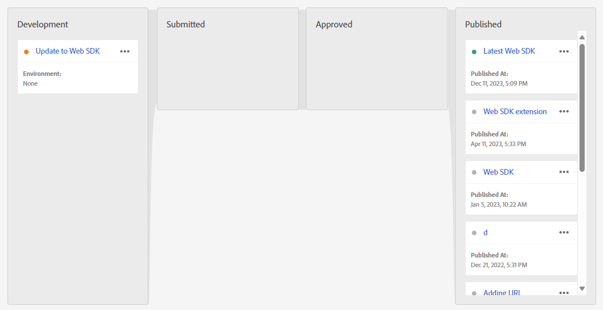

# Aktualisieren Sie Ihre Datenerfassungsbibliothek für den Audience Manager von der Audience Manager-Tag-Erweiterung auf die Web SDK-Tag-Erweiterung

## Vorgesehene Zielgruppe

Diese Seite ist für Audience Manager gedacht, die die [Audience Manager-Tag-Erweiterung](https://experienceleague.adobe.com/en/docs/experience-platform/tags/extensions/client/audience-manager/overview) , um die Webkollektionsdaten in den Audience Manager zu bringen. Für Kunden, die die AppMeasurement-JavaScript-Bibliothek verwenden, lesen Sie bitte das Handbuch, wie Sie Ihre Datenerfassungsbibliothek für Audience Manager aktualisieren [von der AppMeasurement-JavaScript-Bibliothek zur Web SDK-JavaScript-Bibliothek](appmeasurement-to-web-sdk.md).

## Vorteile und Nachteile dieses Implementierungspfads

Die Verwendung dieses Migrationsansatzes hat sowohl Vor- als auch Nachteile. Legen Sie bei jeder Option sorgfältig ab, welcher Ansatz für Ihr Unternehmen am besten geeignet ist.

| Vorteile | Nachteile |
| --- | --- |
| <ul><li>**Keine Codeänderungen auf Ihrer Site**: Da Ihre Implementierung bereits Tags installiert hat, können alle Migrationsaktualisierungen in der Tag-Oberfläche vorgenommen werden.</li><li>**Verwendet Ihre vorhandene Implementierung**: Für diesen Ansatz ist keine neue Implementierung erforderlich. Sie benötigen zwar neue Regelaktionen, können aber Ihre vorhandenen Datenelemente und Regelbedingungen mit minimalen Änderungen wiederverwenden.</li><li>**Erfordert kein Schema**: Für diese Phase der Migration zum Web SDK benötigen Sie kein XDM-Schema. Stattdessen können Sie die `data` -Objekt, das Daten direkt an Adobe Audience Manager sendet. Nachdem die Migration zum Web SDK abgeschlossen ist, können Sie ein Schema für Ihre Organisation erstellen und die Datastraam-Zuordnung verwenden, um die entsprechenden XDM-Felder auszufüllen. Wenn in dieser Phase des Migrationsprozesses ein Schema erforderlich ist, muss Ihr Unternehmen ein Adobe Audience Manager-XDM-Schema verwenden. Die Verwendung dieses Schemas erschwert es Ihrem Unternehmen, in Zukunft Ihr eigenes Schema zu verwenden.</li></ul> | <ul><li>**Technische Schulden der Implementierung**: Da dieser Ansatz eine modifizierte Form Ihrer vorhandenen Implementierung verwendet, kann es schwieriger sein, die Implementierungslogik zu verfolgen und bei Bedarf Änderungen vorzunehmen. Das Debuggen von benutzerspezifischem Code kann besonders schwierig sein.</li><li>**Erfordert Zuordnung zum Senden von Daten an Platform**: Wenn Ihr Unternehmen für die Verwendung von Real-Time CDP bereit ist, müssen Sie Daten an einen Datensatz in Adobe Experience Platform senden. Diese Aktion erfordert, dass jedes Feld in `data` -Objekt ein Eintrag im Tool zur Datenasterzuordnung sein, der es einem XDM-Schemafeld zuordnet. Die Zuordnung muss nur einmal für diesen Workflow durchgeführt werden. Es müssen keine Implementierungsänderungen vorgenommen werden. Es handelt sich jedoch um einen zusätzlichen Schritt, der beim Senden von Daten in ein XDM-Objekt nicht erforderlich ist.</li></ul> |

Adobe empfiehlt, diesem Implementierungspfad zu folgen, wenn Sie über eine vorhandene Implementierung mit der Adobe Audience Manager-Tag-Erweiterung verfügen.

## Schritte für die Migration zum Web SDK

Die folgenden Schritte enthalten konkrete Ziele, auf die wir hinarbeiten müssen. Wählen Sie jeden Schritt aus, um detaillierte Anweisungen dazu zu erhalten.

+++**1. Erstellen und Konfigurieren eines Datenspeichers**

Befolgen Sie die unten stehenden Anweisungen, um einen Datastream in der Adobe Experience Platform-Datenerfassung zu erstellen. Wenn Sie Daten an diesen Datastream senden, leitet er Daten an Audience Manager weiter. Künftig leitet derselbe Datenspeicher Daten an Real-Time CDP weiter.

1. Navigieren Sie zu [experience.adobe.com](https://experience.adobe.com) und melden Sie sich mit Ihren Anmeldedaten an.
1. Verwenden Sie die Startseite oder die Produktselektor oben rechts, um zu **[!UICONTROL Data Collection]**.
1. Wählen Sie im linken Navigationsbereich die Option **[!UICONTROL Datastreams]**.
1. Auswählen **[!UICONTROL New Datastream]**.
1. Geben Sie den gewünschten Namen ein und wählen Sie **[!UICONTROL Save]**.
1. Nachdem der Datastream erstellt wurde, wählen Sie **[!UICONTROL Add Service]**.
1. Wählen Sie im Dropdown-Menü Dienst die Option **[!UICONTROL Adobe Audience Manager]**.
1. Stellen Sie sicher, dass **[!UICONTROL Enable XDM Flattened Fields]** deaktiviert ist.

    {style="border:1px solid lightslategray"}

Ihr Datastream kann jetzt Daten empfangen und an Audience Manager weitergeben.

+++

+++**2. Hinzufügen der Web SDK-Erweiterung zu Ihrer Tag-Eigenschaft**

In diesem Abschnitt wird Ihr -Tag für den Großteil der Migrationsschritte vorbereitet, die im nächsten Schritt unternommen werden.

1. Wählen Sie links oben in der Adobe Experience Platform-Benutzeroberfläche das Hamburger-Symbol und dann **[!UICONTROL Tags]**.
1. Wählen Sie die gewünschte Tag-Eigenschaft aus.
1. Wählen Sie im linken Navigationsbereich der Tag-Eigenschaft die Option **[!UICONTROL Extensions]**.
1. Auswählen **[!UICONTROL Catalog]** oben, um eine Liste aller verfügbaren Erweiterungen anzuzeigen.
1. Suchen Sie nach und wählen Sie **[!UICONTROL Adobe Experience Platform Web SDK]** Erweiterung und wählen Sie **[!UICONTROL Install]** auf der rechten Seite.

    {style="border:1px solid lightslategray"}

1. Die Erweiterungskonfigurationseinstellungen werden angezeigt. Suchen Sie die **[!UICONTROL Datastreams]** und wählen Sie die Sandbox, die Sie verwenden, sowie den im vorherigen Schritt erstellten Datastream aus.

    {style="border:1px solid lightslategray"}

1. Auswählen **[!UICONTROL Save]**.

Für Ihre Tag-Eigenschaft ist jetzt das Web SDK installiert.

+++

+++**3. Datenobjektdatenelement erstellen**

Das Datenobjekt-Datenelement bietet ein intuitives Framework zum Konfigurieren einer Payload, die das Web SDK zum Senden an einen Datastream verwendet. Die meisten Regeln, die Sie im folgenden Schritt aktualisieren, interagieren mit diesem Datenelement.

1. Wählen Sie in der linken Navigation der Tags-Benutzeroberfläche die Option **[!UICONTROL Data Elements]**.
1. Auswählen **[!UICONTROL Add Data Element]**
1. Legen Sie für das Datenelement die folgenden Einstellungen fest:
   * **[!UICONTROL Name]**: Alles, was Sie möchten, z. B. &quot;Datenschicht&quot;oder &quot;Datenobjekt&quot;
   * **[!UICONTROL Extension]**: [!UICONTROL Adobe Experience Platform Web SDK]
   * **[!UICONTROL Data Element Type]**: [!UICONTROL Variable]
   * Kontrollkästchen können unverändert bleiben.
1. Wählen Sie rechts die folgenden Einstellungen aus:
   * Optionsfeld &quot;Eigenschaft&quot;: **[!UICONTROL Data]**
   * **[!UICONTROL Solution]**: [!UICONTROL Adobe Audience Manager]
1. Auswählen **[!UICONTROL Save]**.

    {style="border:1px solid lightslategray"}

Ihre Tag-Eigenschaft verfügt jetzt über alles, was zum Aktualisieren der einzelnen Regeln erforderlich ist.

+++

+++**4. Aktualisieren von Regeln zur Verwendung der Web SDK-Erweiterung anstelle der Audience Manager-Erweiterung**

Dieser Schritt enthält den Großteil des für die Migration zum Web SDK erforderlichen Aufwands und erfordert Kenntnisse darüber, wie Ihre Implementierung funktioniert. Unten finden Sie ein Beispiel zum Bearbeiten einer typischen Tag-Regel. Aktualisieren Sie alle Tag-Regeln in Ihrer Implementierung, um alle Verweise auf die Audience Manager-Erweiterung durch die Web SDK-Erweiterung zu ersetzen.

1. Wählen Sie in der linken Navigation der Tags-Benutzeroberfläche die Option **[!UICONTROL Rules]**.
1. Wählen Sie eine zu bearbeitende Regel aus.
1. Aktion auswählen **[!UICONTROL Audience Manager - Set Variables]**
1. Beachten Sie alle in dieser Regel festgelegten Audience Manager-Variablen. Schließen Sie beide in den Dropdown-Menüs festgelegten Variablen und die in benutzerdefiniertem Code festgelegten Variablen ein.
1. Ändern Sie die [!UICONTROL Action Configuration] zu den folgenden Einstellungen hinzufügen:
   * **[!UICONTROL Extension]**: [!UICONTROL Adobe Experience Platform Web SDK]
   * **[!UICONTROL Action type]**: Variable aktualisieren
1. Stellen Sie sicher, dass das in Schritt 3 erstellte Datenobjekt in der Dropdown-Liste rechts im **[!UICONTROL Data element]** -Feld.
1. Setzen Sie die Schlüssel-Wert-Paare des Audience Managers auf die gleichen Werte wie in der Audience Manager-Erweiterung konfiguriert.
1. Nachdem alle Regellogik mit der Web SDK-Erweiterung repliziert wurde, wählen Sie **[!UICONTROL Keep Changes]**.
1. Wiederholen Sie diese Schritte für jede Aktionskonfiguration, in der die Audience Manager-Tag-Erweiterung zum Festlegen von Werten verwendet wird.

Die obigen Schritte gelten nur für Regeln, die Werte festlegen. Die folgenden Schritte ersetzen alle Aktionen, die die [!UICONTROL Action Configuration] [!UICONTROL Send Event].

1. Wählen Sie eine Regel aus, die ein Web SDK-Ereignis sendet.
1. Aktionstyp auswählen **[!UICONTROL Send Event]**.
1. Ändern Sie die [!UICONTROL Action Configuration] zu den folgenden Einstellungen hinzufügen:
   * **[!UICONTROL Extension]**: [!UICONTROL Adobe Experience Platform Web SDK]
   * **[!UICONTROL Action type]**: [!UICONTROL Send event]
1. Ändern Sie rechts die Aktionseinstellungen in Folgendes:
   * **[!UICONTROL Type]**: Verwenden Sie **[!UICONTROL Web Webpagedetails Page Views]**.
   * **[!UICONTROL Data]**: Wählen Sie das Datenobjekt aus, das Sie in Schritt 3 erstellt haben.
1. Auswählen **[!UICONTROL Keep Changes]**.
1. Wiederholen Sie diese Schritte für jede Aktionskonfiguration, die Audience Manager zum Senden eines Ereignisses verwendet.

+++

+++**5. Aktualisierte Regeln veröffentlichen**

Das Veröffentlichen aktualisierter Regeln folgt demselben Workflow wie jede andere Änderung an der Tag-Konfiguration.

1. Wählen Sie in der linken Navigation der Tags-Benutzeroberfläche die Option **[!UICONTROL Publishing Flow]**.
1. Auswählen **[!UICONTROL Add Library]**.
1. Geben Sie diesem Tag einen Namen, z. B. &quot;Aktualisierung auf Web SDK&quot;.
1. Auswählen **[!UICONTROL Add All Changed Resources]**.
1. Auswählen **[!UICONTROL Save]**.
1. Der Veröffentlichungs-Workflow zeigt einen orangefarbenen Punkt an, der angibt, dass er erstellt wird. Sobald der Punkt grün wird, sind Ihre Änderungen in Ihrer Entwicklungsumgebung verfügbar.
1. Testen Sie Ihre Änderungen in Ihrer Entwicklungsumgebung, um sicherzustellen, dass alle Regeln ordnungsgemäß ausgelöst werden und dass das Datenobjekt mit den erwarteten Werten gefüllt wird.
1. Wenn die Bibliothek fertig ist, senden Sie sie zur Genehmigung, erstellen Sie sie zum Staging, genehmigen Sie sie schließlich und veröffentlichen Sie sie in der Produktion.

    {style="border:1px solid lightslategray"}

+++

+++**6. Audience Manager-Erweiterung deaktivieren**

Sobald Ihre Tag-Implementierung vollständig in das Web SDK migriert ist, können Sie die Audience Manager-Erweiterung deaktivieren.

1. Wählen Sie in der linken Navigation der Tags-Benutzeroberfläche die Option **[!UICONTROL Extensions]**.
1. Suchen und wählen Sie die [!UICONTROL Audience Manager] -Erweiterung. Wählen Sie rechts **[!UICONTROL Disable]**.
1. Führen Sie denselben obigen Veröffentlichungsarbeitsablauf aus, um die Entfernung des [!UICONTROL Audience Manager] -Erweiterung.
1. Nachdem die Erweiterung in der Produktion deaktiviert wurde, können Sie sie vollständig deinstallieren. Wählen Sie die Erweiterung aus, wählen Sie das Menü mit den drei Punkten auf der rechten Seite aus und klicken Sie auf **[!UICONTROL Uninstall]**.
1. Führen Sie denselben obigen Veröffentlichungsarbeitsablauf aus, um diese Änderungen in der Produktion zu veröffentlichen.

+++

An dieser Stelle ist Ihre Audience Manager-Implementierung vollständig auf das Web SDK migriert und bereit, in Zukunft zu Real-Time CDP zu wechseln.

