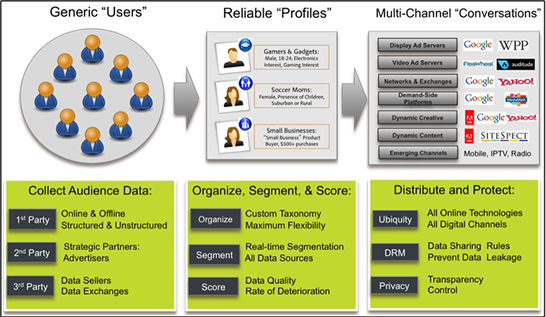

# Audience Manager – Überblick {#audience-manager-overview}

Mit Audience Manager können Sie Ihre Zielgruppendaten-Assets zusammenführen, um so die Erfassung geschäftlich relevanter Zahlen zu Site-Besuchern zu vereinfachen, marktfähige Segmente zu erstellen und der richtigen Zielgruppe zielgruppengerechte Werbung und Inhalte bereitzustellen. Darüber hinaus erleichtert Audience Manager die Tag-Implementierung und -Verwaltung mit einer robusten Datenerfassung, Datensteuerung und einem robusten Datenschutz.

Mit Audience Manager sind Sie nicht an einen Datenanbieter, eine Datenaustauschplattform oder eine Demand Side Platform gebunden. Darüber hinaus ist Audience Manager mit allen Daten-Assets unserer Partner kompatibel. Dank des Zugriffs auf verschiedene Datenquellen bietet Audience Manager digitalen Publishern die Möglichkeit, neben unserer privaten Datenkooperation verschiedenste Drittanbieterdaten zu verwenden. Sprechen Sie mit unserem Partner Solutions-Team, um intelligente und präzise Entscheidungen hinsichtlich Ihrer Zielgruppe zu treffen.

## Die Drei Funktionen einer Data Management Platform (DMP) {#dmp-three-functions}

Die Funktionen einer Data Management Platform (DMP) lassen sich wie unten dargestellt in drei Kategorien zusammenfassen.

**Dateneingabe**

Audience Manager erfasst Erstanbieterdaten von Kanälen und Geräten (Webanalyse, CRM, Gerätedaten, E-Commerce usw.).

 

**Zielgruppenerstellung**

Vereinheitlicht Daten in Zielgruppenprofilen, sodass Sie geräte- und kanalübergreifend eine vollständige Ansicht Ihrer Kunden erhalten. Erstellen Sie Look-alike-Modelle, Zielgruppensegmente und Profilgruppen und ergänzen Sie diese mit Datenquellen von Zweit- und Drittanbietern.

  

**Datenausgabe**

Aktiviert Zielgruppensegmente, indem sie auf Demand Side Platforms (DSPs), Kampagnen-Management- und andere Marketing-Plattformen übertragen werden.

## Weitere Informationen {#more-information}

Weitere Informationen finden Sie in den folgenden Ressourcen:
* [Audience Manager – Überblick](https://www.adobe.com/de/analytics/audience-manager.html)
* [Vorteile von Audience Manager](https://www.adobe.com/de/analytics/audience-manager/benefits.html)
* [Funktionen von Audience Manager](https://www.adobe.com/de/analytics/audience-manager/features.html)

<!--

## History and Background {#history-and-background}

Audience Manager started as Demdex in 2008. It was acquired by Adobe Systems in 2011 and subsequently rebranded as Audience Manager.

## History {#history}

Since 2008, Audience Manager (formerly, [!UICONTROL Demdex]) has been a pioneer in the on-line audience management market. Audience Manager services power dynamic, multi-channel online data strategies. Our platform and services are used by an array of diverse industries from automobiles (AutoTrader), to airlines (American Airlines), and financial services companies (American Express). Audience Manager uses enterprise-level technology to provide the scale, reliability, analytics, and performance to help your business succeed online. Audience Manager integrates with the Adobe Experience Cloud to help you centralize, manage, and take action on your data assets across a growing number of digitally addressable channels.

## Audience Manager and its Data Management Platform (DMP) {#aam-dmp}

Audience Manager helps you manage your data pipeline. Our service is a catalyst that transforms generic users and raw data signals into actual audience segments used for multi-channel marketing efforts. Additionally, Audience Manager provides tools for tag management and audience analytics while simultaneously meeting the privacy and data security needs of clients and consumers.

-->