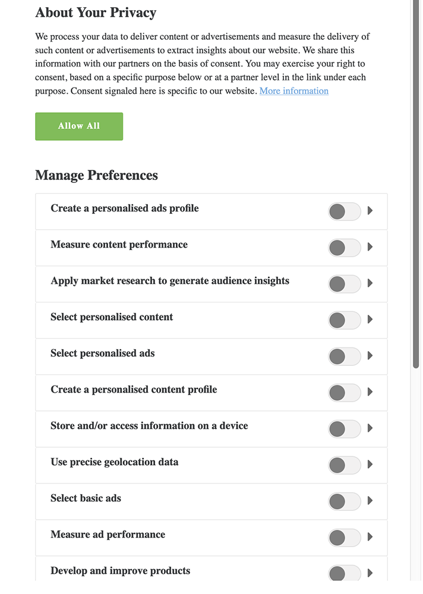

# [!DNL Audience Manager Plug-in for IAB TCF] {#aam-iab-plugin}

## Überblick

Ein wichtiger Aspekt der Datenschutzverpflichtungen, die Sie gegenüber Ihren Benutzern haben, ist der Erwerb und die Übermittlung von Benutzerentscheidungen darüber, wie ihre personenbezogenen Daten verwendet werden dürfen (d. h. &quot;Zwecke&quot;) und von wem (d. h. &quot;Unternehmen&quot;).

Adobe bietet Ihnen die Möglichkeit, die Datenschutzoptionen Ihrer Benutzer über die [Opt-in-Funktion](https://experienceleague.adobe.com/docs/id-service/using/implementation/opt-in-service/optin-overview.html) und die Unterstützung des [IAB Transparency and Consent Framework (TCF)](https://iabtechlab.com/standards/gdpr-transparency-and-consent-framework/) zu verwalten und zu übermitteln.

Dieser Artikel beschreibt die Audience Manager-Anwendungsfälle, die das IAB TCF unterstützen, und wie Sie die IAB TCF-Unterstützung in Audience Manager implementieren.

>[!IMPORTANT]
>
>Audience Manager wird im [IAB TCF](https://iabeurope.eu/tcf-for-vendors/) mit der Anbieter-ID 565 registriert.

Das Audience Manager-Plug-in für IAB TCF verwendet die [Opt-in-Funktion](https://experienceleague.adobe.com/docs/id-service/using/implementation/opt-in-service/iab.html), die wiederum Teil der Bibliothek [Adobe Experience Platform Identity Service (ECID)](https://experienceleague.adobe.com/docs/id-service/using/home.html) ist.

## Umfang und Einschränkungen {#scope-and-limitations}

Als Publisher oder Advertiser, der mit Audience Manager arbeitet, können Sie gemäß IAB TCF Benutzerentscheidungen an Audience Manager weiterleiten.

>[!IMPORTANT]
>
>Die IAB-TCF-Vorschriften gelten nur für Besucher im Europäischen Wirtschaftsraum.

Audience Manager unterstützt Sie dabei, die Datenschutzoptionen Ihrer Benutzer zu respektieren, und bietet Ihnen außerdem eine einfache Möglichkeit, diese Optionen allen Partnern, mit denen Sie arbeiten, mitzuteilen.

Derzeit bietet Audience Manager für Folgendes keine Unterstützung:

* Workflows für Mobilgeräte;
* Anhängen der Zustimmung an Segmentexporte.

## Upgrade auf [!DNL IAB TCF v2.2] {#upgrading}

Kunden, die ihre [!DNL Audience Manager Plug-in for IAB TCF] -Implementierung von [!DNL IAB TCF] v1.1 auf [!DNL IAB TCF] v2.2 aktualisieren oder [!DNL IAB TCF] v2.2 zum ersten Mal aktivieren, sollten dieselben Richtlinien für Voraussetzungen und Implementierung befolgen wie unten beschrieben.

## Voraussetzungen {#prerequisites}

>[!IMPORTANT]
>
>Audience Manager unterstützt IAB TCF v2.2.
>
>Die Unterstützung für IAB TCF v1.1 endet am 15. August 2020.
>
> Kunden, die das Audience Manager-Plug-in für IAB TCF zur Zustimmungsverwaltung weiterhin verwenden möchten, sollten zur kontinuierlichen Unterstützung auf die neueste Version von [ECID](https://github.com/Adobe-Marketing-Cloud/id-service/releases) aktualisieren.
>
> Nach dem Upgrade auf die neueste Version [ECID](https://github.com/Adobe-Marketing-Cloud/id-service/releases) werden die IAB TCF v1.1-Zustimmungszeichenfolgen nicht mehr unterstützt. Aktualisieren Sie daher Ihre CMP, bevor Sie auf die neueste ECID-Version aktualisieren.

Sie müssen die folgenden Voraussetzungen erfüllen, um das Audience Manager-Plug-in für IAB TCF mit Audience Manager zu verwenden:

1. Sie müssen Adobe Experience Platform Identity Service (ECID) Version 5 (oder neuer) verwenden. [Laden](https://github.com/Adobe-Marketing-Cloud/id-service/releases) Sie unsere neueste ECID-Version herunter.
2. Sie müssen Audience Manager [!DNL Data Integration Library] (DIL) Version 9.0 oder höher verwenden, die von [hier](https://github.com/Adobe-Marketing-Cloud/dil/releases) heruntergeladen werden kann. Lesen Sie mehr über [DIL in der Audience Manager-Dokumentation](../../dil/dil-overview.md). Es wird empfohlen, die [Adobe Audience Manager Tag-Erweiterung](https://experienceleague.adobe.com/docs/experience-platform/tags/extensions/adobe/audience-manager/overview.html) für die einfachste DIL-Implementierung von Audience Manager zu verwenden.
3. Wenn Sie zum Importieren von Daten in Audience Manager [!DNL Server-Side Forwarding] (SSF) verwenden, müssen Sie alternativ auf die neueste Version von AppMeasurement aktualisieren. Laden Sie AppMeasurement mit dem [Analytics-Code-Manager](https://experienceleague.adobe.com/docs/analytics/admin/admin-tools/code-manager-admin.html) herunter.
4. Sie müssen eine kommerzielle oder eigene Consent Management Platform (CMP) verwenden, die mit IAB TCF v2.2 integriert ist und beim IAB TCF registriert ist. Siehe dazu die Liste der [beim IAB-Framework registrieren CMPs](https://iabeurope.eu/cmp-list/).

>[!WARNING]
>
>Wenn Sie eine Consent Management Platform (CMP) verwenden, die das IAB TCF v2.2 nicht unterstützt, sendet Audience Manager automatisch den Parameter `gdpr=0` in ID-Synchronisierungen, selbst wenn sich Ihre Besucher in der Europäischen Union befinden. Um festzustellen, ob Ihre DSGVO-Validierung aktiv ist, empfehlen wir Ihnen, mit Ihrer Consent Management Platform (CMP) zu bestätigen, dass sie das IAB TCF v2.2 unterstützen.

## Recommendations und Implementierung {#recommendations}

Um die IAB TCF-Unterstützung in Audience Manager zu aktivieren, lesen Sie unsere Dokumentation [zum Einrichten von IAB mit Opt-in-Funktion](https://experienceleague.adobe.com/docs/id-service/using/implementation/opt-in-service/iab.html).

Am einfachsten können Sie dies erreichen, indem Sie [Adobe Experience Platform-Tags](https://experienceleague.adobe.com/docs/experience-platform/tags/home.html?lang=en) verwenden, um Ihren Eigenschaften [!DNL ECID Opt-in] hinzuzufügen. Lesen Sie die Dokumentation zur Erweiterung [ECID Opt-in](https://experienceleague.adobe.com/docs/experience-platform/tags/extensions/adobe/id-service/overview.html) , um zu erfahren, wie Sie die Tag-Erweiterung einrichten.

## Workflow für Benutzerentscheidungen bei Verwendung des IAB-Frameworks {#user-choice-workflow}

Beim Besuch einer Webeigenschaft können Ihre Benutzer festlegen, wie ihre Daten vom Publisher und von den Drittanbietern, mit denen der Herausgeber arbeitet, verwendet werden sollen.

Benutzer geben ihre Auswahl in Form von *Zustimmung* für IAB-Zwecke an *Drittanbieter* weiter, die in der globalen Anbieterliste registriert sind.

Das folgende Bild zeigt ein Beispiel für ein CMP-Dialogfeld, das einem erstmaligen Besucher einer Website angezeigt wird. Beachten Sie, dass dieser Dialog je nach Kundenimplementierung sehr unterschiedlich aussehen kann.



Details zu den verschiedenen Zwecken und Berechtigungen, die in IAB TCF v2.2 enthalten sind, finden Sie in den Richtlinien des IAB Europe Transparency &amp; Consent Framework](https://iabeurope.eu/iab-europe-transparency-consent-framework-policies/#A_Purposes).[

Benutzer können ihre Zustimmung für eine Kombination von Zwecken und Anbietern erteilen. Beispielsweise können Benutzer ihre Zustimmung zum Speichern von Informationen auf einem Gerät, zur Entwicklung und Verbesserung von Produkten und zur Erteilung ihrer Zustimmung an alle vom CMP angezeigten Drittanbieter erteilen.

Oder in einem anderen Beispiel könnten sie ihre Zustimmung für alle Zwecke erteilen, jedoch nur einigen der vom CMP angezeigten Anbieter ihre Zustimmung erteilen.

Sobald der Benutzer seine Datenschutzoptionen ausgewählt hat, werden die ausgewählten Benutzer in der IAB TC-Zeichenfolge aufgezeichnet. Die IAB TC-Zeichenfolge speichert die Kombination aus genehmigten Zwecken und Anbietern zusammen mit anderen Metadateninformationen (weitere Informationen finden Sie auf der [IAB-Seite](https://github.com/InteractiveAdvertisingBureau/GDPR-Transparency-and-Consent-Framework/blob/master/TCFv2/IAB%20Tech%20Lab%20-%20Consent%20string%20and%20vendor%20list%20formats%20v2.md#about-the-transparency--consent-string-tc-string) ).

Jeder im IAB TCF registrierte Anbieter bewertet die IAB TC-Zeichenfolge und trifft Entscheidungen anhand der Datenschutzoptionen der Benutzer. Beachten Sie, dass die Datenschutzoptionen der Benutzer für alle bei IAB TCF registrierten Anbieter gültig sind.

## Für Audience Manager erforderliche Zwecke {#aam-standard-purposes}

Audience Manager wertet die in der IAB TC-Zeichenfolge gespeicherten Benutzerentscheidungen für die folgenden Zwecke aus, die in den Richtlinien des IAB Europe Transparency &amp; Consent Framework ](https://iabeurope.eu/iab-europe-transparency-consent-framework-policies/#Appendix_A_Purposes_and_Features_Definitions) definiert sind.[

* **Zweck 1**: Informationen auf einem Gerät speichern und/oder darauf zugreifen;
* **Zweck 10**: Entwicklung und Verbesserung von Produkten;
* **Sonderzweck 1**: Sichern Sie sich Sicherheit, verhindern Sie Betrug und Debugging.

>[!IMPORTANT]
>
>Audience Manager benötigt eine Zustimmung für Zweck 1 und Zweck 10 sowie die Zustimmung des Anbieters, um Cookies bereitzustellen und ID-Synchronisationen zu starten bzw. zu berücksichtigen.
>
>Gemäß den [IAB-Vorschriften](https://iabeurope.eu/iab-europe-transparency-consent-framework-policies/#Special_Purpose_1__Ensure_security_prevent_fraud_and_debug_) wird dem Sonderzweck 1 (Sicherheit gewährleisten, Betrug verhindern und Debugging) immer zugestimmt und Benutzer können keine Einwände dagegen erheben.

## Das Verhalten des Audience Managers hängt davon ab, ob der Benutzer seine Zustimmung erteilt {#aam-behavior-consent}

Audience Manager funktioniert unterschiedlich, je nachdem, ob die IAB TC-Zeichenfolge die Benutzerzustimmung für die beiden Zwecke enthält (Speichern und/oder Zugreifen auf Informationen auf einem Gerät und Entwickeln und Verbessern von Produkten) oder nicht.

Wir prüfen auch für alle Ziele, mit denen Sie in Audience Manager arbeiten, die Benutzerzustimmung, solange diese Ziele beim IAB TCF registriert sind.

| Wenn Ihr Benutzer seine *Zustimmung erteilt*, wird Audience Manager: | Wenn Ihr Benutzer seine *Zustimmung nicht erteilt*, wird Audience Manager: |
|---|---|
| <ul><li>alle von Ihnen angeforderten Audience Manager-Anwendungsfälle ausführen.</li><li>Übermittelt die Zustimmung an Dritte in ID-Synchronisierungen (durch Übergabe von `gdpr = 1` und der Zustimmungszeichenfolge als `gdpr_consent` in ID-Synchronisierungsaufrufen).</li><li>die von Adserver-Pixeln übergebene Zustimmung auswerten und berücksichtigen.</li><li>von Partnern initiierte ID-Synchronisierungen berücksichtigen.</li></ul> | <ul><li>keine neuen Benutzerdaten in Ihrer Instanz speichern. Dazu gehören Partner-IDs, Signale, Eigenschaften oder Pixeldaten.</li><li>keine Synchronisierung der Drittanbieter-IDs initiieren.</li><li>von Partnern initiierte ID-Synchronisierungen nicht berücksichtigen.</li><li>Der Benutzer wird von der weiteren Datenerfassung ausgeschlossen.</li></ul> |

## Anwendungsfall: Publisher {#publisher-use-case}

Durch Implementierung des Audience Manager-Plug-ins für IAB TCF müssen Sie keinen benutzerdefinierten Code für die Zustimmungsverwaltung in Ihren Web-Eigenschaften über einen anderen Mechanismus mit Adobe oder anderen Drittanbietern verwalten. Der Anwendungsfall wird im Bild und in den unten stehenden Schritten beschrieben. Beginnen Sie links im Bild:

1. Ein Benutzer besucht eine Ihrer Web-Eigenschaften. Solange Sie die neuesten Versionen der ECID- und DIL-Bibliotheken verwenden (siehe [Voraussetzungen](/help/using/overview/data-security-and-privacy/aam-iab-plugin.md#prerequisites)), wird der Opt-in-Fluss ausgelöst.
2. Audience Manager überprüft, ob der IAB-Fluss zutrifft (`isIabContext=true`). Siehe [Empfehlungen und Implementierung](aam-iab-plugin.md#recommendations).
3. Audience Manager prüft, ob die DSGVO zutrifft (`gdpr = 1`) und ob in Ihrer Webeigenschaft eine bei IAB TCF registrierte CMP vorhanden ist. Dies würde beispielsweise für Benutzer gelten, die aus der Europäischen Union kommen. Beachten Sie, dass es in Ihrer Verantwortung als Herausgeber liegt, das DSGVO-Flag festzulegen.
4. Wenn die DSGVO zutrifft, prüft der Audience Manager die im Parameter `gdpr_consent` übergebene IAB TC-Zeichenfolge auf die erforderliche Zustimmung. Audience Manager benötigen eine Zustimmung zum Speichern und/oder Aufrufen von Informationen auf einem Gerät ([IAB TCF-Zweck 1](https://iabeurope.eu/iab-europe-transparency-consent-framework-policies/#A_Purposes)), Entwickeln und Verbessern von Produkten ([IAB TCF-Zweck 10](https://iabeurope.eu/iab-europe-transparency-consent-framework-policies/#A_Purposes)) sowie die Zustimmung des Audience Manager-Anbieters zum Speichern, Verarbeiten oder Aktivieren von Daten.
5. Wenn die IAB TC-Zeichenfolge vorhanden ist und die erforderliche Zustimmung enthält, übergibt Audience Manager die IAB TC-Zeichenfolge an unsere [Datenerfassungsserver](../../reference/system-components/components-data-collection.md) (DCS).
6. Audience Manager antwortet, indem er im Browser ein [demdex-Cookie](https://experienceleague.adobe.com/docs/core-services/interface/ec-cookies/cookies-am.html) setzt, und initiiert und berücksichtigt ID-Synchronisationen von Drittanbietern.
7. Wenn die in Schritt 4 übergebene IAB TC-Zeichenfolge nicht alle erforderlichen Berechtigungen enthält, erfasst, verarbeitet oder aktiviert der Audience Manager keine Benutzerdaten und berücksichtigt oder initiiert keine ID-Synchronisationen. Außerdem werden Benutzer von den Zielen ausgeschlossen, mit denen Sie arbeiten.

>[!IMPORTANT]
>
>Wenn Sie mit Audience Manager-Zielpartnern arbeiten, die IAB TCF-Parameter benötigen, aber keine CMP haben, die IAB TCF auf Ihrer Website unterstützt, sendet Audience Manager `gdpr=0` in ID-Synchronisationen. Dies bedeutet, dass die DSGVO nicht für diese Benutzer gilt.
>
> Wenn dies nicht gewünscht wird, sollten Sie die IAB TCF-Funktion in Audience Manager aktivieren, um die entsprechenden IAB-TC-Zeichenfolgen an die Zielpartner zu senden.


## Anwendungsfall: Advertiser {#advertiser-use-case}

Audience Manager bewertet und berücksichtigt die in [Pixelaufrufen](../../integration/sending-audience-data/real-time-data-integration/pixel-based-data-transfer.md) übergebene Zustimmung gemäß des IAB TCF.

Pixel können von Audience Manager auf ihren Partnerseiten platziert werden oder sie werden in Anzeigen-Servern platziert, um sie in die Anzeigenantwort aufzunehmen. Im ersten Fall muss Ihr Partner den Zustimmungsparameter programmgesteuert abrufen und dem Pixel vor dem Auslösen hinzufügen. Im zweiten Fall, der häufiger vorkommt und im Folgenden ausführlich beschrieben wird, hängen Adserver die Zustimmungsparameter, die sie von der SSP (Supply-Side Platform) oder von Adservern des Publishers erhalten, an alle Pixel an.

Audience Manager verwendet zwei Parameter, um die Benutzerzustimmung in Pixelaufrufen weiterzugeben:

* `gdpr` kann 0 (DSGVO trifft nicht zu) oder 1 (DSGVO trifft zu) betragen;
* `gdpr_consent` ist die URL-sichere base64-kodierte DSGVO-Zustimmungszeichenfolge (siehe [Spezifikation](https://github.com/InteractiveAdvertisingBureau/GDPR-Transparency-and-Consent-Framework/blob/master/TCFv2/IAB%20Tech%20Lab%20-%20Consent%20string%20and%20vendor%20list%20formats%20v2.md#about-the-transparency--consent-string-tc-string)). Ein Beispielaufruf für ein Impressionspixel mit den beiden Parametern könnte wie folgt aussehen:

```
https://yourcompany.demdex.net/event?d_event=imp&gdpr=1&gdpr_consent=consentstring&d_src=datasource_id&d_site=siteID&d_creative=creative_id&d_adgroup=adgroup_id&d_placement=placement_id
```

Der Anwendungsfall wird im Bild und in den unten stehenden Schritten beschrieben. Beginnen Sie links im Bild:

1. Ihr Benutzer erhält eine Impression über einen Adserver. Dies bedeutet einen [Pixelaufruf](../../integration/media-data-integration/impression-data-pixels.md) an unsere Datenerfassungsserver (DCS).
2. Audience Manager überprüft, ob die DSGVO-Markierung gesetzt ist. Andernfalls speichert Audience Manager die in den Variablen `gdpr` und `gdpr_consent` übergebenen Daten in Pixelaufrufen.
3. Wenn die IAB TC-Zeichenfolge vorhanden ist und die erforderlichen Berechtigungen enthält, speichert Audience Manager die in den Variablen `gdpr` und `gdpr_consent` übergebenen Daten in Pixelaufrufen.
4. Wenn die IAB TC-Zeichenfolge fehlt oder die erforderlichen Berechtigungen nicht besitzt, legt der Audience Manager die in den Variablen `gdpr` und `gdpr_consent` übergebenen Daten in Pixelaufrufen ab.


## Aktivierungspartner, die das IAB TCF unterstützen {#aam-activation-partners}

Mit dem Audience Manager-Plug-in für IAB TCF können Sie die IAB TC-Zeichenfolge an Aktivierungspartner weiterleiten und dabei die Datenschutzoptionen der Benutzer berücksichtigen. Informationen darüber, welche Aktivierungspartner das IAB TCF unterstützen, finden Sie in unserer [Liste gerätebasierter Ziele](/help/using/features/destinations/device-based-destinations-list.md).

## Anhängen der Zustimmung an URLs, die an URL-Ziele gesendet werden

Die Audience Manager-Integration mit IAB TCF v2.2 unterstützt das Anhängen der Zustimmung an Informationen, die an [URL-Ziele](../../features/destinations/create-url-destination.md) gesendet werden, die in IAB TCF v2.2 integriert sind. Dieser Vorgang wird jedoch nicht automatisch von Audience Manager ausgeführt, um zu verhindern, dass bestimmte URL-Formate beschädigt werden.

Kunden, die ihre Zustimmung zu den an [!DNL URL destinations] gesendeten Daten anhängen möchten, müssen die Makros `${GDPR}` und `${GDPR_CONSENT_XXXX}` manuell in ihr URL-Format aufnehmen und dabei `XXXX` durch die Ziel-Partner-ID ersetzen.

Beispiel: `https://yourdomain.com?gdpr=${GDPR}&gdpr_consent=${GDPR_CONSENT_1234}`.

Weitere Informationen zu den unterstützten Zielmakros finden Sie unter [Definierte Zielmakros](../../features/destinations/destination-macros.md) .

## Geräteübergreifende Einverständnisverwaltung

Das Audience Manager-Plug-in für IAB TCF lehnt die in einer Anfrage vorhandenen IDs automatisch ab, wenn Ihre Site-Besucher nicht über die entsprechenden Berechtigungen verfügen. Wenn die Anforderung eine [geräteübergreifende ID (CRM-ID)](../../reference/ids-in-aam.md) enthält, lehnt der Audience Manager die ID sowie das letzte mit dieser [geräteübergreifenden ID (CRM-ID)](../../reference/ids-in-aam.md) verknüpfte Gerät ab.

## Testen der IAB-Implementierung {#test-iab-implementation}

Um zu testen, ob Sie das Audience Manager-Plug-in für IAB TCF korrekt implementiert haben, lesen Sie [Nutzungsszenario 4 unter Validieren des Opt-in-Dienstes](https://experienceleague.adobe.com/docs/id-service/using/implementation/opt-in-service/testing-optin-and-iab-plugin.html#section-64331998954d4892960dcecd744a6d88).

## IAB und Opt-out in Audience Manager. Rangfolge. {#iab-and-optout}

Eine weitere Datenschutzoption, die Ihren Benutzern zur Verfügung steht, ist die Möglichkeit, sich gegen jegliche Datenerfassung zu entscheiden. Adobe stellt Benutzern auf der Seite [Ihre Datenschutzoptionen](https://www.adobe.com/de/privacy/opt-out.html#customeruse) die entsprechenden Mittel zur Verfügung.

Audience Manager behandelt Opt-out-Anfragen in einem [separaten Artikel in unserer Dokumentation](data-privacy-requests.md#opt-out-requests).

>[!IMPORTANT]
>
>Benutzer, die sich von der Datenerfassung abgemeldet haben, nachdem sie die Einwilligung abgelehnt haben, können nicht wieder angemeldet werden.

>[!NOTE]
>
>**Prioritätsfolge** – Wenn Ihr Benutzer die Datenerfassung mit Hilfe eines globalen Opt-out-Tools, wie im obigen Link beschrieben, ablehnt, hat dies Vorrang vor den Opt-in- und IAB-Überprüfungen.

## Zusätzliche Ressourcen {#additional-resources}

* [Adobe Experience Platform Identity Service-Opt-in](https://experienceleague.adobe.com/docs/id-service/using/implementation/opt-in-service/optin-overview.html)
* [IAB Europe DSGVO Transparency and Consent Framework](https://iabtechlab.com/standards/gdpr-transparency-and-consent-framework/)
* [IAB Europe DSGVO Transparency and Consent Framework, Technische Spezifikationen](https://github.com/InteractiveAdvertisingBureau/GDPR-Transparency-and-Consent-Framework/blob/master/Consent%20string%20and%20vendor%20list%20formats%20v1.1%20Final.md)
* [IAB TCF-Plugin – Videodemonstration](https://helpx.adobe.com/audience-manager/kt/using/iab-tcf-support-audience-manager-technical-video-implement.html)
