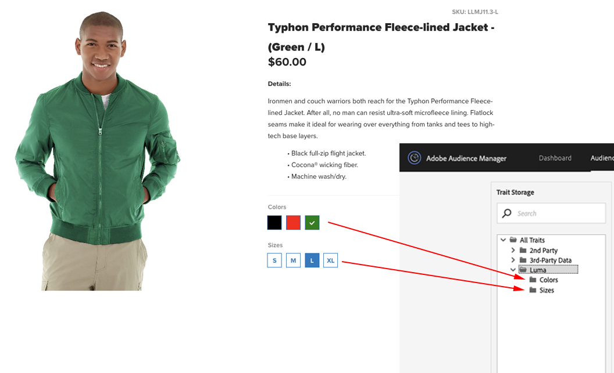

# Erfasste Datentypen {#types-of-data-collected}

[!DNL Audience Manager]Mit können Sie Erstanbieter-, Zweitanbieter- und Drittanbieterdaten erfassen und verwalten.

Die Nutzung von in mehreren Silos gespeicherten Kundendatenelementen ist eine der größten Datenherausforderungen, mit denen Unternehmen heute konfrontiert sind. Von [!DNL CRM]-Datenbanken über Registrierungssysteme bis hin zu Werbeservern usw. benötigen Unternehmen Tools, mit denen wertvolle Daten zentralisiert und Kunden-/Zielgruppeninformationen als ein einziges strategisches Datenelement verwaltet werden können. [!DNL Audience Manager]Mit können Sie isolierte Kundeninformationen nutzen und die Datenerfassung aus mehreren Quellen verwalten. Die erfassten Daten können basierend auf den Werten für die Time-to-Live des Datenelements ([!DNL TTL]) verwaltet werden, wodurch der Publisher die Gültigkeit von Daten über alle Quellen hinweg steuern kann. [!DNL Audience Manager] unterstützt Sie bei der Verwaltung der folgenden Datentypen:

| Datentyp | Datenquelle |
|---|---|
| **Erstanbieter** | Kunden. Daten werden online (aus Interaktionen der Verbraucher auf Ihren Websites) oder offline erfasst. |
| **Zweitanbieter** | Strategische Partner und Advertiser. |
| **Drittanbieter** | Datenanbieter und/oder Datenaustausch. Zu den Daten können Informationen wie Absichten, Demographie, Sozial-/Lebensstil, Psychographie und mehr gehören. |

## Erstanbieterdatenerfassung {#first-party-data}

Die Erstanbieter-Datenerfassung ist eine Hauptfunktion von [!DNL Audience Manager]. Diese Kernkompetenz richtet sich an die Bedürfnisse unserer Kunden (Publisher und Advertiser), die proprietäre Daten als Eckpfeiler ihrer Marketing-Programme oder für Targeting und Modellierung mit anderen Datenquellen verwenden möchten.

[!DNL Audience Manager] arbeitet mit Kunden zusammen, um deren Datenstrategie zu verstehen und diese Strategie dann einem benutzerdefinierten Datenerfassungsplan zuzuordnen. Unser Partner Solutions-Team arbeitet mit Ihnen zusammen, um Sites, Rohdatensignale und andere Benutzerinteraktionen auf Ihren Websites auszuwerten. Mit diesen Informationen helfen wir Ihnen bei der Erstellung einer maßgeschneiderten Datenerfassungsstrategie, die Datensignale auf Benutzerebene von verschiedenen Seiten in Ihrem Bestand erfasst. Erfasste Daten werden gespeichert und einer vordefinierten Taxonomie zugeordnet, die jederzeit aktualisiert werden kann, wenn sich die Anforderungen Ihres Unternehmen ändern.

Das folgende Beispiel zeigt, wie potenzielle Datenelemente von einer Beispieleinkaufsseite erfasst werden können.

| Element | Beschreibung |
|---|---|
| 1 | **Geschlecht**. Der Vorname eines Käufers gibt normalerweise das Geschlecht an. In unserem Beispiel ist der Vorname des Käufers Mary, also wissen wir, dass der Käufer eine Frau ist. Namen werden nie von Audience Manager gespeichert. |
| 2 | **Interessen**. Die Artikel im Warenkorb können auf verschiedene Interessen hinweisen. In unserem Beispiel gibt Mary viel für Fitnessgeräte aus. |
| 3 | **Wohnungstyp**. Je nach Lieferadresse und/oder Rechnungsadresse können Sie entscheiden, ob Mary Fitnessgeräte für sich selbst oder für eine Firma kauft. |
| 4 | **Standort**. [!DNL ZIP] -Codes sind zuverlässiger als  [!DNL IP] Adressen, wenn es darum geht, einen Standort zu bestimmen. |
| 5 | **Promotionsaffinität**. Wenn ein Käufer Werbe-Codes oder Geschenkkarten verwendet, ist er wahrscheinlich ein Schnäppchenjäger, der nach den besten Angeboten sucht. |
| 6 | **Kaufkraft**. Preisdaten, die mit [!DNL ZIP+4]-Codes korreliert werden, zeigen die Kaufkraft eines bestimmten Standorts an. |

Nachdem die Rohdaten erfasst wurden, werden sie in der [!DNL Audience Manager]-Plattform benutzerdefinierten Eigenschaften zugeordnet. Sowohl die Taxonomie als auch die Datenzuordnung können jederzeit angepasst werden, ohne dass Änderungen am Datenerfassungs-Code vorgenommen werden.

## Zweitanbieterdatenerfassung {#second-party-data}

Zweitanbieterdaten stammen von einem strategischen Unternehmenspartner (es handelt sich nicht um Publisher-Daten). Diese Informationen werden wie Erstanbieterdaten erfasst und verwaltet.

In einem Zweitanbieterdatenszenario senden Advertiser ihre eigenen Daten-Assets an Publisher, damit diese die Informationen mit den Daten des Publishers kombinieren und dann ein gezielteres Werbeprogramm ausführen können. Darüber hinaus können Publisher ihre Zielgruppen-Pools durch eine Partnerschaft mit ihren Advertisern erweitern. In den meisten Fällen handelt es sich bei diesen Vereinbarungen um vertragliche Beziehungen, die darauf beschränkt sind, das [!DNL Audience Manager]-Container-Tag auf die Partner-Site zu setzen, um die Datenerfassung und -freigabe zu erleichtern.

Ein Beispiel für die Erfassung und das Remarketing von Zweitanbieterdaten könnte darin bestehen, dass ein Bekleidungshändler Daten zu seinen Produkten erfasst und diese Informationen dann an wichtige Partner weitergibt. In diesem Fall könnte der Einzelhändler verschiedene Anzeigen auf einer [!DNL Audience Manager] Partnerseite für Verbraucher bereitstellen, die verschiedene Jackenfarben und -größen auswählen.

## Drittanbieterdatenerfassung {#third-party-data}

Drittanbieterdaten sind Informationen, die von Anbietern außerhalb von [!DNL Audience Manager] erfasst und freigegeben werden.

Daten von Drittanbietern können verwendet werden, um vorhandene Daten [!UICONTROL segments] zu qualifizieren (z. B. Alter, Haushaltseinkommen usw.), Daten bereitzustellen, die gefragt, aber nicht anderweitig verfügbar sind, oder um eine Look-alike-Modellierung anhand einer bekannten Benutzerbasis aus Erstanbieter- und Zweitanbieterdaten durchzuführen. [!DNL Audience Manager] arbeitet mit vielen Drittdatenanbietern zusammen und hilft Ihnen, die Art der von diesen Datenanbietern erfassten Daten zu verstehen, sodass Sie die richtigen strategischen Vereinbarungen mit jedem Anbieter abschließen können.

>[!NOTE]
>
>Eine vollständige Liste der von [!DNL Audience Manager] unterstützten Drittdatenanbietern finden Sie im [Adobe Audience Finder](https://www.adobe-audience-finder.com/).

[!DNL Audience Manager] wird basierend auf den verfügbaren Datensätzen  [!DNL APIs] und Datensätzen mit anderen Datenanbietern integriert. Die Datenerfassung erfolgt in Echtzeit, wenn ein Benutzer Ihre Site durchsucht, oder über Out-of-Band-Methoden, bei denen IDs zwischen Partnern synchronisiert werden und Daten zwischen Servern übertragen werden, nachdem ein Benutzer Ihre Site verlassen hat. In beiden Fällen profitieren Clients von der Synchronisation von Drittanbieterdaten auf unserer Plattform, d. h. jeder Client oder jede Domäne muss keine eigene Synchronisation durchführen. [!DNL Audience Manager] Damit wird die Reichweite erhöht und Server-Aufrufe von der Seite verringert.

## Abgleichspartner {#match-partners}

Viele Kunden entscheiden sich für die Zusammenarbeit mit externen Datenabgleichspartnern. Diese Entitäten haben Beziehungen zu Websites mit Registrierungsanforderungen und können Kundendatendateien verarbeiten, indem sie diese (in Echtzeit) basierend auf ihrem Registrierungsnetzwerk abgleichen.

