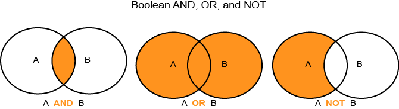

# Boolesche Ausdruck in Trait und Segment Builder{#boolean-expressions-in-trait-and-segment-builder}

In diesem Artikel wird erläutert, wie die Audience Manager- und Segmentwerkzeuge die booleschen Ausdruck AND, OR und NOT verwenden.

<!-- 

c_tb_boolean.xml

 -->

**Boolesche Ausdruck**

Die Boolesche Logik ist ein Zweig der Algebra, der anhand einiger einfacher Ausdruck (oder Operatoren) ermittelt, ob eine Anweisung wahr oder falsch ist. Die häufigsten Operatoren sind [!UICONTROL AND], [!UICONTROL OR] und [!UICONTROL NOT]. Die Kombination dieser Ausdruck hilft Ihnen, fokussierte Eigenschaften- oder Segmentqualifizierungsregeln für Ihre Datenanforderungen eindeutig zu gestalten. Die folgende Abbildung zeigt, wie einfache boolesche Ausdrücke funktionieren.

 

>[!NOTE]
>
>Der Operator [!UICONTROL NOT] verwendet eine implizite &quot;and&quot;-Bedingung und wird manchmal als [!UICONTROL AND NOT] geschrieben.

**Verwenden von booleschen Ausdrücken in Eigenschaften- und Segmentaufbau**

Sie erstellen Eigenschaften- und Segmentqualifizierungsregeln mit booleschen Ausdrücken. In der folgenden Tabelle werden die allgemeinen Best Practices für das Erstellen von Qualifizierungskriterien mit [!UICONTROL AND], [!UICONTROL OR] und [!UICONTROL NOT] beschrieben.

<table id="table_C762872C98F54C4A86A2F1C840A86657"> 
 <thead> 
  <tr> 
   <th colname="col1" class="entry"> Ausdruck  </th> 
   <th colname="col2" class="entry"> Verwenden Sie ihn zum Erstellen </th> 
   <th colname="col3" class="entry"> Voraussetzungen </th> 
  </tr>
 </thead>
 <tbody> 
  <tr> 
   <td colname="col1"> 
<b> UND</b> 
 </td> 
   <td colname="col2"> 
Engere, zielgerichtete Qualifikationsanforderungen für Audiencen. 
 </td> 
   <td colname="col3"> 
Die Benutzer <i>müssen zu allen angegebenen Eigenschaften oder Segmenten gehören.</i> 
 </td> 
  </tr> 
  <tr> 
   <td colname="col1"> 
<b> ODER</b> 
 </td> 
   <td colname="col2"> 
Grundlegende, weniger zielgerichtete Qualifikationsanforderungen für Audiencen. 
 </td> 
   <td colname="col3"> 
Die Benutzer <i>können zu allen angegebenen Eigenschaften oder Segmenten gehören.</i> 
 </td> 
  </tr> 
  <tr> 
   <td colname="col1"> 
<b> NICHT</b> 
 </td> 
   <td colname="col2"> 
Engere, zielgerichtete Qualifikationsanforderungen für Audiencen. 
 
Nützlich, wenn es mehrere Bedingungen gibt, die die Festlegung von Qualifizierungsanforderungen für Audiencen erschweren oder ineffizient machen. Gelegentlich ist es einfacher, Anforderungen zu validieren, die ausschließen anstatt einschließen. 
 </td> 
   <td colname="col3"> 
Benutzer <i>dürfen nicht</i> zu einer ausgeschlossenen Eigenschaft oder einem ausgeschlossenen Segment gehören. 
 </td> 
  </tr> 
 </tbody> 
</table>

**[!UICONTROL AND]Verwendungsfallbeispiel**

Der Operator [!UICONTROL AND] ist nützlich, wenn Sie leicht aufzählbare Anforderungen an die Mitgliedschaft in Eigenschaften haben. Angenommen, Sie müssen eine Audience von &quot;teuren Kamerakäufern&quot;erstellen. Bei einem Pixelmodell müssten Sie Pixel für Kameras und einen numerischen Preiswert auf Ihrer Seite erstellen und platzieren. Mit Eigenschaften können Sie dagegen boolesche Operatoren anwenden, um beide Bedingungen zu handhaben (Kameras [!UICONTROL AND] Preis). Das Ergebnis ist eine effiziente Datenerfassung mit weniger HTTP-Aufrufen, was wiederum dazu beiträgt, das Benutzererlebnis auf Ihrer Site zu erhalten.

**[!UICONTROL OR]Verwendungsfallbeispiel**

Der [!UICONTROL OR]-Operator ist nützlich, wenn Sie Signale mit Grundqualifikationsanforderungen für eine breite Audience erstellen möchten. Wenn Sie mehrere Anforderungen an die Eigenschaften- oder Segmentqualifizierung haben, wird der [!UICONTROL OR]-Operator als &quot;true&quot;ausgewertet, wenn Ihre Site-Besucher *beliebige* dieser Eigenschaften aufweisen. [!UICONTROL OR] kann besonders hilfreich sein, wenn Sie schnell eine breite Audience qualifizierter Site-Besucher erstellen möchten.

**[!UICONTROL AND NOT]Verwendungsfallbeispiel**

Der Operator [!UICONTROL AND NOT] ist hilfreich, wenn eine Audience leichter von *exclude* anstatt von *include* definiert werden kann. Nehmen wir beispielsweise an, Sie haben einen Kauf abgeschlossen und möchten Besucher in Kunden segmentieren, die nur Artikel zum vollen Preis betrachten. Statt eine Liste von Signalen für alle qualifizierenden Voll- oder Verkaufspreisartikel zu erstellen, ist es möglicherweise einfacher, Besucher zu qualifizieren, wenn sie *nicht* einen Verkaufspreisartikel gesehen haben. Dies ist administrativ effizient, da Sie in der Regel weniger Verkaufspreisartikel haben als die, die zum vollen Preis angeboten werden. Bei einem booleschen [!UICONTROL NOT] dürfen Besucher *kein* das Verkaufssignal ausgeben, um sich für eine Vollpreismitgliedschaft in der Audience zu qualifizieren. Im Gegensatz dazu ist [!UICONTROL AND NOT] das Gegenteil des [!UICONTROL AND]-Anwendungsfalls, der gezeigt hat, wie die Mitgliedschaft in der Audience durch Einbindung bestimmt wird (d.h. der Besucher qualifiziert sich auf der Grundlage von 2 explizit angegebenen Signalen).

>[!MORELIKETHIS]
>
>* [Arbeiten mit Vergleichsoperatoren in TraitBuilder](../features/traits/trait-comparison-operators.md)
>* [Reihenfolge der Vorgänge in TraitBuilder-Ausdrücken](../features/traits/trait-operator-precedence.md)

