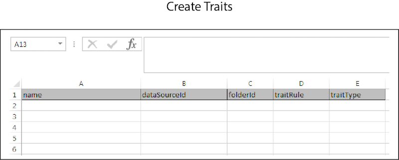

# Massen-Erstellung{#bulk-create}

Mit der Massenerstellung können Sie mehrere Datenquellen, abgeleitete Signale, Segmente, Eigenschaften und andere Elemente mit einem einzigen Vorgang erstellen. Befolgen Sie diese Anweisungen, um eine Massenerstellungsanfrage zu stellen.

>[!IMPORTANT]
>
>Die Tools für die Massenverwaltung sind kein offiziell unterstütztes Adobe-Angebot. Die Fehlerbehebung und der Support über die Kundenunterstützung werden von Fall zu Fall durchgeführt.

<!-- 

t_bulk_create.xml

 -->

>[!NOTE]
>
>[RBAC-Gruppenberechtigungen](../../features/administration/administration-overview.md), die in der [!DNL Audience Manager]-Benutzeroberfläche zugewiesen sind, werden in der [!UICONTROL Bulk Management Tools] berücksichtigt.

>[!CAUTION]
>
>Mischen Sie in einer Massenerstellungsanfrage keine Objekttypen. Die Kopfzeilen für jedes Objekt sind eindeutig und können nicht kombiniert werden. Löschen Sie das Arbeitsblatt und stellen Sie eine separate Anfrage für verschiedene Elemente.

Um Objekte stapelweise zu erstellen, öffnen Sie das [!UICONTROL Bulk Management Tools] Arbeitsblatt und:

1. Klicken Sie auf die Registerkarte **[!UICONTROL Headers]** und kopieren Sie die Kopfzeilen für das Element, das Sie hinzufügen möchten.
2. Klicken Sie auf die Registerkarte **[!UICONTROL Create]** .
3. Fügen Sie die Create-Kopfzeilen in die erste Zeile des Aktualisierungsarbeitsblatts ein.
4. Fügen Sie die Daten, die Sie ändern möchten, ein, oder geben Sie sie anhand der Kopfzeilenbeschriftung in eine entsprechende Spalte ein.
5. Klicken Sie in der Symbolleiste des Arbeitsblatts auf die Schaltfläche Erstellen , die dem zu aktualisierenden Element entspricht.
Diese Aktion öffnet das Dialogfeld [!UICONTROL Account Information].
6. Geben Sie die erforderlichen [Anmeldeinformationen“ ein &#x200B;](../../reference/bulk-management-tools/bulk-management-intro.md#auth-reqs) klicken Sie auf **[!UICONTROL Submit]**.

Das Arbeitsblatt erstellt eine [!UICONTROL Results]. Die Spalte [!UICONTROL Results] gibt die JSON-Antwort für einen erfolgreichen Vorgang zurück. Beispiele finden Sie in [REST](../../api/rest-api-main/rest-api-main.md)APIs). Bevor Sie Daten eingeben, sollte Ihr Arbeitsblatt für die Massenerstellung dem folgenden Beispiel ähneln. Beachten Sie, dass alle verschiedenen Erstellungsoptionen hier nicht angezeigt werden. Dies ist enthalten, damit Sie besser verstehen, wie ein ausgefülltes Arbeitsblatt aussehen könnte.

Wenn Ihre Massenaktualisierung einen Fehler zurückgibt oder fehlschlägt, finden Sie weitere Informationen unter [Fehlerbehebung für Tools für die Massenverwaltung](../../reference/bulk-management-tools/bulk-troubleshooting.md).
