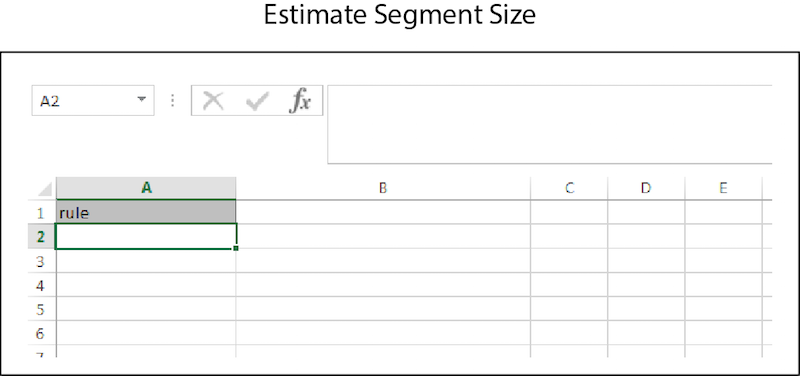

# Massenschätzungen{#bulk-estimates}

Eine Massenschätzung gibt Segmentgrößendaten zurück, die auf Segmentregeln basieren. Befolgen Sie diese Anweisungen, um eine Massenanfrage für Schätzungen durchzuführen.

>[!IMPORTANT]
>
>Die Tools für die Massenverwaltung sind kein offiziell unterstütztes Adobe-Angebot. Die Fehlerbehebung und der Support über die Kundenunterstützung werden von Fall zu Fall durchgeführt.

<!-- 

t_bulk_estimates.xml

 -->

>[!NOTE]
>
>[RBAC-Gruppenberechtigungen](../../features/administration/administration-overview.md), die in der [!DNL Audience Manager]-Benutzeroberfläche zugewiesen sind, werden in der [!UICONTROL Bulk Management Tools] berücksichtigt.

Um Massenaktualisierungen vorzunehmen, öffnen Sie das [!UICONTROL Bulk Management Tools] Arbeitsblatt und:

1. Klicken Sie auf die Registerkarte **[!UICONTROL Headers]** und kopieren Sie die [!UICONTROL Estimate Segment Size].
2. Klicken Sie auf die Registerkarte **[!UICONTROL Estimate]** .
3. Fügen Sie die Kopfzeile der Schätzung in die erste Zeile des Arbeitsblatts Schätzung ein.
4. Fügen Sie die Daten, die Sie ändern möchten, ein, oder geben Sie sie anhand der Kopfzeilenbeschriftung in eine entsprechende Spalte ein.
5. Klicken Sie in der Symbolleiste des Arbeitsblatts auf die Schaltfläche Erstellen , die dem zu aktualisierenden Element entspricht.
Diese Aktion öffnet das Dialogfeld [!UICONTROL Account Information].
6. Geben Sie die erforderlichen [Anmeldeinformationen“ ein ](../../reference/bulk-management-tools/bulk-management-intro.md#auth-reqs) klicken Sie auf **[!UICONTROL Submit]**.

Durch diese Aktion wird eine [!UICONTROL Response] Spalte im Arbeitsblatt erstellt, die Daten zur geschätzten Segmentgröße enthält. Vor der Eingabe von Daten sollte Ihr Arbeitsblatt für die Massenschätzung in etwa wie folgt aussehen:

Wenn Ihre Massenaktualisierung einen Fehler zurückgibt oder fehlschlägt, finden Sie weitere Informationen unter [Fehlerbehebung für Tools für die Massenverwaltung](../../reference/bulk-management-tools/bulk-troubleshooting.md).
