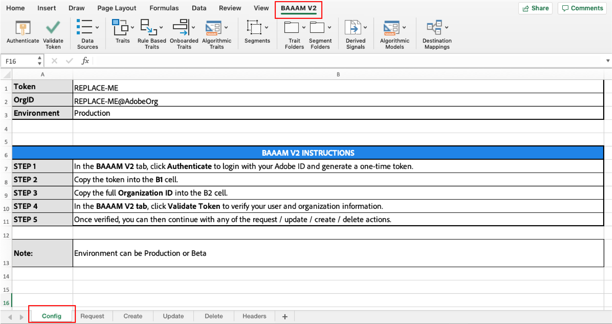
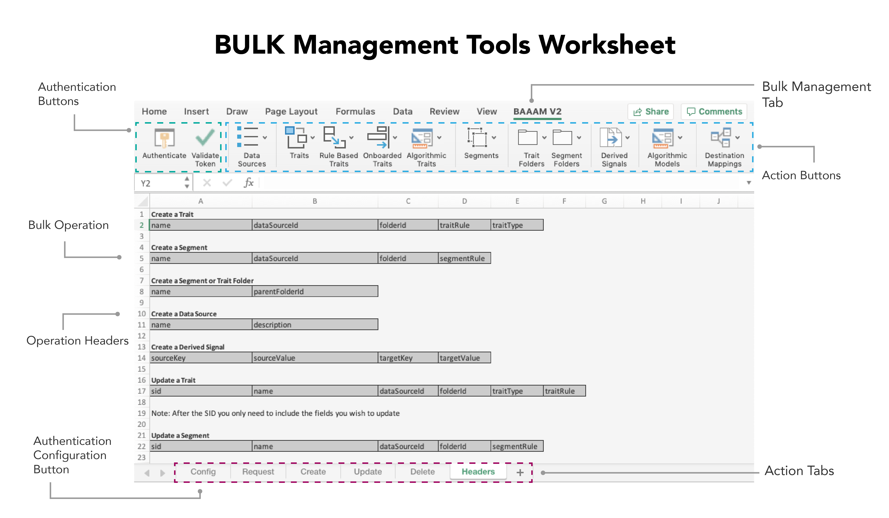

# Erste Schritte mit der Massenverwaltung{#getting-started-with-bulk-management}

Mit dem [!DNL Bulk Management Tools] können Sie mehrere Objekte gleichzeitig mit einem einzigen Vorgang erstellen und verwalten. Sie können [!DNL Bulk Management Tools] verwenden, um mit [!UICONTROL data sources], [!UICONTROL derived signals], [!UICONTROL destinations], [!UICONTROL folders], [!UICONTROL models], [!UICONTROL segments] und [!UICONTROL traits] zu arbeiten.

>[!IMPORTANT]
>
>Die Tools für die Massenverwaltung sind kein offiziell unterstütztes Adobe-Angebot. Die Fehlerbehebung und der Support über die Kundenunterstützung werden von Fall zu Fall durchgeführt.

<!-- 

c_bulk_start.xml

 -->

>[!NOTE]
>
>[RBAC-Gruppenberechtigungen](../../features/administration/administration-overview.md), die in der [!DNL Audience Manager] Benutzeroberfläche zugewiesen sind, werden in der [!UICONTROL Bulk Management Tools] berücksichtigt.

## Überblick {#overview}

Diese Funktion verwendet eine [!DNL Microsoft Excel] Tabelle mit Makros, die sichere, authentifizierte Aufrufe an die [!DNL Audience Manager]-APIs durchführen. Die -API stellt die Methoden und Dienste bereit, mit denen Sie Änderungen stapelweise vornehmen können. Sie müssen nicht wissen, wie Sie mit unseren APIs codieren oder arbeiten, um sie zu verwenden. Das Arbeitsblatt enthält Spaltenüberschriften und Registerkarten, die bestimmte Massenänderungsfunktionen ausführen. Um Massenänderungen vorzunehmen, fügen Sie nur die vordefinierten Kopfzeilen zu bestimmten Arbeitsblättern hinzu, geben Sie die Informationen an, die Sie stapelweise ändern möchten, und klicken Sie auf eine Aktionsschaltfläche. Das Arbeitsblatt und die APIs erledigen den Rest der Arbeit für Sie.

## Herunterladen {#download}

Laden Sie das neueste Arbeitsblatt **[hier](assets/BAAAM_V2_20210609.xlsm)** herunter (zuletzt aktualisiert im Juni 2021).

## Voraussetzungen {#prereqs}

Um die [!DNL Bulk Management Tools] zu verwenden, benötigen Sie Folgendes:

* Ihre [!DNL Experience Cloud] Anmeldung. Als -Kunde sollten Sie bereits über diese Anmeldeinformationen verfügen.
* Das [!DNL Bulk Management Tools] Arbeitsblatt. [Laden Sie das Arbeitsblatt herunter](assets/BAAAM_V2_20210609.xlsm) um die neueste Version zu erhalten.
* [!DNL Microsoft Excel] mit 64-Bit-[!DNL Microsoft Windows]. Es wird empfohlen, die neueste Version von [!DNL Microsoft Excel] zu verwenden. Die Tools für die Massenverwaltung werden in [!DNL macOS] nicht unterstützt.
* Beim Öffnen des Arbeitsblatts müssen Sie **Makros aktivieren** damit die [!DNL Bulk Management Tools] funktioniert.

## Authentifizierungsanforderungen und -optionen {#auth-reqs}

Massenänderungen erfordern Authentifizierung. Bevor Sie eine Aktion durchführen, müssen Sie sich anmelden. Da das Arbeitsblatt API-Aufrufe ausführt, müssen Sie es so konfigurieren, dass es sich bei Ihrem Benutzerkonto authentifiziert.

**API-Authentifizierungsanforderungen**

Die zweite Version des [!DNL Bulk Management Tools], die im Oktober 2019 veröffentlicht wurde, vereinfacht den Authentifizierungsprozess. Die Authentifizierungsschritte in dieser Version sind unten beschrieben:

1. Öffnen Sie die Tabelle und navigieren Sie zur **[!UICONTROL Config]**.
2. Befolgen Sie die im Blatt beschriebenen Schritte.
   
3. Nach Abschluss der Schritte sind Sie berechtigt, Massenänderungen vorzunehmen.

Wenn Sie Massenänderungen vornehmen, müssen Sie weiterhin bestätigen, dass Sie berechtigt sind, die Änderungen vorzunehmen, aber die API-Authentifizierung erfolgt automatisch.

**Optionen für die Domain-Authentifizierung**

Die Domain-Authentifizierung bietet Ihnen die Möglichkeit, Massenanfragen zu testen oder sie direkt auf Ihr Produktionskonto anzuwenden. Massenänderungen an der Beta-Umgebung wirken sich nicht auf Ihr Produktionskonto aus. Produktionsänderungen treten sofort in Kraft. Das Bulk Management Sheet ermöglicht es Ihnen, in den folgenden Umgebungen zu arbeiten:

* Beta
* Produktion

## Aktionen und Vorgänge {#actions-ops}

Das [!UICONTROL Bulk Management Tools] Arbeitsblatt besteht aus Authentifizierungsschaltflächen, Aktionsregisterkarten, Aktionsschaltflächen und einer **[!UICONTROL Headers]** Registerkarte. Die Registerkarte **[!UICONTROL Headers]** enthält die vorformatierten Spaltenüberschriften, die von den Aktionsregisterkarten verwendet werden. Die Aktionsregisterkarten enthalten Makros, die den ausgewählten Massenvorgang ausführen. Um einen Massenvorgang durchzuführen, kopieren Sie einen Satz von Headern in die entsprechende Aktionsregisterkarte, geben Sie Header-Daten ein und klicken Sie auf eine Aktionsschaltfläche.

Klicken [ nach der ](#auth-reqs) auf eine Aktionsschaltfläche, um zu beginnen.

In der folgenden Tabelle sind die Vorgänge aufgeführt, die Sie ausführen können, sowie die Elemente, die Sie mit den [!UICONTROL Bulk Management Tools] Arbeitsblättern bearbeiten können.

<table id="table_B9B3E09B692E42BAA52FB32C18B00709"> 
 <thead> 
  <tr> 
   <th colname="col1" class="entry"> Aktionen </th> 
   <th colname="col2" class="entry"> Objekte </th> 
  </tr> 
 </thead>
 <tbody> 
  <tr> 
   <td colname="col1"> 
Massenaktionen werden in Registerkarten am unteren Rand des Arbeitsblatts angezeigt und umfassen: 
 
 
     <ul id="ul_49F46B9E00C045D29E40258EB7BDCFBB"> 
      <li id="li_193C41EA19EF4D738FBA037D2BF9B05C">Anforderungen </li> 
      <li id="li_5BE2E13D839F4958AAA5C01B7EFC5096">Aktualisieren </li> 
      <li id="li_4CCCC739795945DF8C89787F9A67EB88">Erstellung     </li> 
      <li id="li_C7D36D2BDF0448CEAF3A5EABE41038E8">Kalkulation </li> 
      <li id="li_07A3E94326124A3092362D9896EB7732">Löschen </li> 
     </ul> 
 </td> 
   <td colname="col2"> 
Die Objekte, die Sie stapelweise ändern können, befinden sich auf der Registerkarte <b>Kopfzeilen</b> und umfassen: 
 
 
     <ul id="ul_A7A96F2B1B63430B9A1E1184AC5FA8F2"> 
      <li id="li_E3D9E2E190B04BE685337AC6140C371C"> <a href="../../features/datasources-list-and-settings.md#data-sources-list-and-settings"> Datenquellen</a> </li> 
      <li id="li_B645385E40684FA28770913EAF18CB2C"> <a href="../../features/derived-signals.md"> abgeleitete Signale</a> </li> 
      <li id="li_9059F8C4A41A410899BDEFC76D3F5949"> <a href="../../features/destinations/destinations.md"> Ziele</a> </li> 
      <li> <a href="../../features/algorithmic-models/understanding-models.md"> Modelle</a> </li> 
      <li id="li_BB5A445150754E53AA38C78461326932"> <a href="../../features/traits/trait-storage.md#trait-storage"> von </a> und Segmentordnern </li> 
      <li id="li_7A27DBF64E0945CF8AE8C96E8C6EDA09"> <a href="../../features/segments/segments-purpose.md"> Segmente</a> </li> 
      <li id="li_A4640A34930040DEA8555EAF0AE2A702"> <a href="../../features/traits/trait-details-page.md"> Eigenschaften</a> </li> 
     </ul> 
 </td> 
  </tr> 
 </tbody> 
</table>

**Beispiel für einen Massenvorgang**

Als Beispiel sehen wir uns an, wie mehrere Eigenschaften gleichzeitig erstellt werden können. So erstellen Sie mehrere Eigenschaften in einem Massenvorgang:

1. Klicken Sie auf die Registerkarte **[!UICONTROL Headers]** und kopieren Sie alle Beschriftungen unter der Option [!UICONTROL Create a Trait] .
2. Klicken Sie auf die Registerkarte **[!UICONTROL Create]** und fügen Sie die Beschriftungen ab Zeile 1 Spalte A ein.
3. Geben Sie Informationen zu den einzelnen Spaltenüberschriften an und klicken Sie auf **[!UICONTROL Create Traits]**. Diese Aktion fordert Sie zur Bestätigung Ihrer Authentifizierung auf. Ihr Massenvorgang wird ausgeführt, nachdem Sie Ihre Authentifizierung bestätigt haben. Prüfen Sie die linke untere Ecke des Arbeitsblatts auf eine Auftragsstatus-Benachrichtigung.

>[!NOTE]
>
>Bei der Arbeit mit großen Anfragen reagiert das Arbeitsblatt möglicherweise nicht mehr und scheint inaktiv zu sein. Lassen Sie es in diesen Fällen einfach in Ruhe. Das Arbeitsblatt reagiert, wenn die Massenanfrage abgeschlossen ist. Wenn das Arbeitsblatt längere Zeit nicht reagiert, lesen Sie den Abschnitt [Fehlerbehebung](../../reference/bulk-management-tools/bulk-troubleshooting.md).
