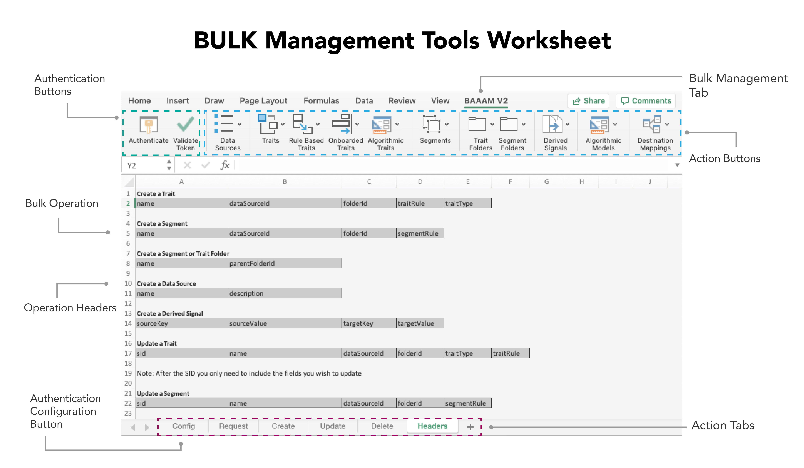

# Erste Schritte mit der Massenverwaltung{#getting-started-with-bulk-management}

Die [!DNL Bulk Management Tools] Sie können mehrere Objekte gleichzeitig mit einem Vorgang erstellen und verwalten. Sie können [!DNL Bulk Management Tools] , um [!UICONTROL data sources], [!UICONTROL derived signals], [!UICONTROL destinations], [!UICONTROL folders], [!UICONTROL models], [!UICONTROL segments], und [!UICONTROL traits].

>[!IMPORTANT]
>
>Die Tools für die Massenverwaltung sind kein offiziell unterstütztes Adobe-Angebot. Die Fehlerbehebung und der Support durch die Kundenunterstützung werden von Fall zu Fall durchgeführt.

<!-- 

c_bulk_start.xml

 -->

>[!NOTE]
>
>[RBAC-Gruppenberechtigungen](../../features/administration/administration-overview.md) in der [!DNL Audience Manager] Die Benutzeroberfläche wird im Abschnitt [!UICONTROL Bulk Management Tools].

## Überblick {#overview}

Diese Funktion verwendet eine [!DNL Microsoft Excel] Tabelle mit Makros, die sichere, authentifizierte Aufrufe an die [!DNL Audience Manager] APIs. Die API stellt die Methoden und Dienste bereit, mit denen Sie Änderungen in großen Mengen vornehmen können. Sie müssen nicht wissen, wie Sie Code schreiben oder mit unseren APIs arbeiten können, um sie zu verwenden. Das Arbeitsblatt enthält Spaltenüberschriften und Registerkarten, die bestimmte Massenänderungsfunktionen ausführen. Um Massenänderungen vorzunehmen, fügen Sie nur die vordefinierten Kopfzeilen zu bestimmten Arbeitsblättern hinzu, geben Sie die Informationen an, die Sie stapelweise ändern möchten, und klicken Sie auf eine Aktionsschaltfläche. Das Arbeitsblatt und die APIs erledigen den Rest der Arbeit für Sie.

## Download {#download}

Laden Sie das neueste Arbeitsblatt herunter **[here](assets/BAAAM_V2_20210609.xlsm)** (zuletzt aktualisiert im Juni 2021).

## Voraussetzungen {#prereqs}

So verwenden Sie die [!DNL Bulk Management Tools]benötigen Sie Folgendes:

* Ihre [!DNL Experience Cloud] anmelden. Als Kunde sollten Sie bereits über diese Anmeldedaten verfügen.
* Die [!DNL Bulk Management Tools] Arbeitsblatt. [Arbeitsblatt herunterladen](assets/BAAAM_V2_20200502.xlsm) um die neueste Version zu erhalten.
* [!DNL Microsoft Excel] läuft [!DNL macOS] oder 64 Bit [!DNL Microsoft Windows]. Es wird empfohlen, die neueste Version von [!DNL Microsoft Excel].
* Beim Öffnen des Arbeitsblatts müssen Sie **Makros aktivieren** für die [!DNL Bulk Management Tools] zu arbeiten.

## Authentifizierungsanforderungen und -optionen {#auth-reqs}

Massenänderungen erfordern eine Authentifizierung. Bevor Sie eine Aktion durchführen, müssen Sie sich anmelden. Da das Arbeitsblatt API-Aufrufe ausführt, müssen Sie es so konfigurieren, dass es sich bei Ihrem Benutzerkonto authentifiziert.

**API-Authentifizierungsanforderungen**

Die zweite Version der [!DNL Bulk Management Tools], die im Oktober 2019 veröffentlicht wurde, vereinfacht den Authentifizierungsprozess. Die Authentifizierungsschritte in dieser Version sind unten beschrieben:

1. Öffnen Sie das Arbeitsblatt und navigieren Sie zum **[!UICONTROL Config]** Blatt.
2. Befolgen Sie die im Tab beschriebenen Schritte.
   
3. Nach Abschluss der Schritte sind Sie berechtigt, Massenänderungen vorzunehmen.

Wenn Sie Massenänderungen vornehmen, müssen Sie weiterhin bestätigen, dass Sie berechtigt sind, die Änderungen vorzunehmen. Die API-Authentifizierung ist jedoch automatisch.

**Authentifizierungsoptionen für Domänen**

Die Domänenauthentifizierung bietet Ihnen die Möglichkeit, Massenanfragen zu testen oder direkt auf Ihr Produktionskonto anzuwenden. Massenänderungen an der Beta-Umgebung wirken sich nicht auf Ihr Produktionskonto aus. Produktionsänderungen sind sofort wirksam. Das Bulk-Management-Blatt ermöglicht Ihnen die Arbeit in den folgenden Umgebungen:

* Beta
* Produktion

## Aktionen und Vorgänge {#actions-ops}

Die [!UICONTROL Bulk Management Tools] Arbeitsblatt besteht aus Authentifizierungsschaltflächen, Aktionsregisterkarten, Aktionsschaltflächen und einem **[!UICONTROL Headers]** Registerkarte. Die **[!UICONTROL Headers]** -Tab enthält die vorformatierten Spaltenüberschriften, die von den Aktionsregisterkarten verwendet werden. Die Aktionsregisterkarten enthalten Makros, die den ausgewählten Massenvorgang durchführen. Um einen Massenvorgang durchzuführen, kopieren Sie eine Reihe von Kopfzeilen in die entsprechende Registerkarte &quot;Aktion&quot;, geben Sie Kopfzeilendaten ein und klicken Sie auf eine Aktionsschaltfläche.

Nachher [authentifizieren](#auth-reqs)klicken Sie auf eine Aktionsschaltfläche , um zu beginnen.

In der folgenden Tabelle sind die Vorgänge aufgeführt, die Sie ausführen können, sowie die Elemente, die Sie mit der [!UICONTROL Bulk Management Tools] Arbeitsblätter.

<table id="table_B9B3E09B692E42BAA52FB32C18B00709"> 
 <thead> 
  <tr> 
   <th colname="col1" class="entry"> Aktionen </th> 
   <th colname="col2" class="entry"> Objekte </th> 
  </tr> 
 </thead>
 <tbody> 
  <tr> 
   <td colname="col1"> 
Massenaktionen werden in Registerkarten am unteren Rand des Arbeitsblatts angezeigt und umfassen: 
 
 
     <ul id="ul_49F46B9E00C045D29E40258EB7BDCFBB"> 
      <li id="li_193C41EA19EF4D738FBA037D2BF9B05C">Anforderungen </li> 
      <li id="li_5BE2E13D839F4958AAA5C01B7EFC5096">Aktualisieren </li> 
      <li id="li_4CCCC739795945DF8C89787F9A67EB88">Erstellung     </li> 
      <li id="li_C7D36D2BDF0448CEAF3A5EABE41038E8">Schätzen </li> 
      <li id="li_07A3E94326124A3092362D9896EB7732">Löschen </li> 
     </ul> 
 </td> 
   <td colname="col2"> 
Die Objekte, die Sie stapelweise ändern können, befinden sich unter der <b> Kopfzeilen</b> und einschließen: 
 
 
     <ul id="ul_A7A96F2B1B63430B9A1E1184AC5FA8F2"> 
      <li id="li_E3D9E2E190B04BE685337AC6140C371C"> <a href="../../features/datasources-list-and-settings.md#data-sources-list-and-settings"> Datenquellen</a> </li> 
      <li id="li_B645385E40684FA28770913EAF18CB2C"> <a href="../../features/derived-signals.md"> Abgeleitete Signale</a> </li> 
      <li id="li_9059F8C4A41A410899BDEFC76D3F5949"> <a href="../../features/destinations/destinations.md">Ziele </a> </li> 
      <li> <a href="../../features/algorithmic-models/understanding-models.md"> Modelle</a> </li> 
      <li id="li_BB5A445150754E53AA38C78461326932"> <a href="../../features/traits/trait-storage.md#trait-storage"> Eigenschaftsordner</a> und Segmentordner </li> 
      <li id="li_7A27DBF64E0945CF8AE8C96E8C6EDA09"> <a href="../../features/segments/segments-purpose.md">Segmente </a> </li> 
      <li id="li_A4640A34930040DEA8555EAF0AE2A702"> <a href="../../features/traits/trait-details-page.md">Eigenschaften </a> </li> 
     </ul> 
 </td> 
  </tr> 
 </tbody> 
</table>

**Beispiel für einen Massenvorgang**

Sehen wir uns als Beispiel an, wie mehrere Eigenschaften gleichzeitig erstellt werden. Um mehrere Eigenschaften in einem Massenvorgang zu erstellen, gehen Sie folgendermaßen vor:

1. Klicken Sie auf **[!UICONTROL Headers]** und kopieren Sie alle Beschriftungen unter [!UICONTROL Create a Trait] -Option.
2. Klicken Sie auf **[!UICONTROL Create]** und fügen Sie die Beschriftungen beginnend mit Zeile 1 Spalte A ein.
3. Informationen zu den einzelnen Spaltenüberschriften angeben und auf **[!UICONTROL Create Traits]**. Durch diese Aktion werden Sie aufgefordert, Ihre Authentifizierung zu bestätigen. Ihr Massenauftrag wird ausgeführt, nachdem Sie Ihre Authentifizierung bestätigt haben. Überprüfen Sie in der linken unteren Ecke des Arbeitsblatts die Benachrichtigung zum Auftragsstatus.

>[!NOTE]
>
>Beim Arbeiten mit großen Anforderungen reagiert das Arbeitsblatt möglicherweise nicht mehr und scheint inaktiv zu sein. Lassen Sie es in diesen Fällen einfach in Ruhe. Das Arbeitsblatt reagiert nach Abschluss der Massenanforderung. Wenn das Arbeitsblatt über einen langen Zeitraum nicht reagiert, lesen Sie den Abschnitt [Fehlerbehebung](../../reference/bulk-management-tools/bulk-troubleshooting.md).
