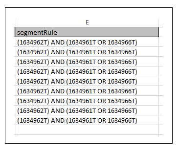

# Erstellen oder Aktualisieren von Eigenschaftsregeln und Segmentregeln{#create-or-update-trait-rules-and-segment-rules}

Die Arbeitsblätter zum Erstellen und Aktualisieren akzeptieren eine TraitRule-Kopfzeile, mit der Sie mehrere Regeln in einem Vorgang anwenden können. Befolgen Sie diese Anweisungen, um Massenregelanforderungen durchzuführen.

>[!IMPORTANT]
>
>Die Tools für die Massenverwaltung sind kein offiziell unterstütztes Adobe-Angebot. Die Fehlerbehebung und der Support über die Kundenunterstützung werden von Fall zu Fall durchgeführt.

<!-- 

c_bulk_rules.xml 

 -->

>[!NOTE]
>
>[RBAC-Gruppenberechtigungen](../../features/administration/administration-overview.md), die in der [!DNL Audience Manager]-Benutzeroberfläche zugewiesen sind, werden in der [!UICONTROL Bulk Management Tools] berücksichtigt.

## Arbeiten mit Eigenschaftsregeln {#trait-rules}

In Ihrem Arbeitsblatt gibt die Spalte für die Eigenschaftsregel Regeln zurück, die aus booleschen Ausdrücken, Vergleichsoperatoren und regulären Ausdrücken bestehen, und akzeptiert diese. Sie können Regeln mit Trait oder Segment Builder in [!DNL Audience Manager] erstellen und sie in Ihr Arbeitsblatt kopieren. Wenn Sie mit der Regelsyntax vertraut sind, können Sie Ausdrücke direkt in die Arbeitsblätter schreiben.

## Beispiel für einen Regel-Builder {#rule-builder-example}

Sehen wir uns ein Beispiel an, das zeigt, wie [!UICONTROL Segment Builder] verwendet werden, um eine Regel zu erstellen, die Sie dem Massenarbeitsblatt hinzufügen können. Dies ist jedoch keine Reihe von schrittweisen Anweisungen für diese Tools. Stattdessen beginnen wir mit einer einfachen Regel, die bereits erstellt wurde. Anweisungen zur Verwendung der Regel-Builder finden Sie unter [Segment Builder](../../features/segments/segment-builder.md) und [Trait Builder](../../features/traits/about-trait-builder.md).

Mit dem visuellen Regel-Builder haben wir eine Segmentregel mit drei Eigenschaften und einem booleschen [!UICONTROL AND] erstellt.

Klicken Sie auf **[!UICONTROL Code View]** , um die Textversion dieser Regel abzurufen.

>[!TIP]
>
>Klicken Sie auf **[!UICONTROL Validate Expression]** , um Ihre Regellogik zu überprüfen. Dadurch wird verhindert, dass eine ungültige Regel hochgeladen wird.

Fügen Sie die Regel in das [!UICONTROL Bulk Management Tools] Arbeitsblatt ein und übertragen Sie die Änderungen, um die Segmentregeln stapelweise zu aktualisieren.

## Erstellen eigener Regeln {#create-rules}

Sie können Ihre eigenen Regeln außerhalb von [!UICONTROL Rule Builder] schreiben. Bevor Sie beginnen, lesen Sie die Dokumentation, die Dinge wie Operatoren, Ausdrücke und erforderliche Variablen behandelt. Wir empfehlen Ihnen, Folgendes zu überprüfen:

* [Arbeiten mit Vergleichsoperatoren in Trait Builder](../../features/traits/trait-comparison-operators.md)
* [Reihenfolge der Vorgänge](../../features/traits/trait-operator-precedence.md)
* [Anforderungen an Präfixe für Schlüsselvariablen](../../features/traits/trait-variable-prefixes.md)
* [Beispielausdrücke mit booleschen und Vergleichsoperatoren](../../features/traits/trait-expression-samples.md)
